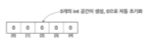
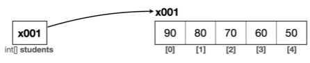
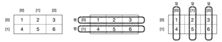

# VII. 배열
## A. 용도
 같은 유형의 여러 데이터를 다룰때 유용.
```java
    int student1 = 90;
    int student2 = 100;
    int student3 = 70;
//이처럼 같은 유형의 자료를 사용하는 방법
```
## B. 배열 변수 선언, 초기화, 값 보관
- 자료형[] 배열변수명 = new 자료형[배열의크기]
```java
    int[] students; //배열변수 선언
    students = new int[5];//배열 생성
```
- 정해진 타입을 지정하고 배열을 선언
- 배열에는 정해진 타입만을 요소로 담을 수 있다. 
- 배열 변수에는 해당 타입의 요소로 이뤄진 배열만 담을 수 있다. 
```java
    int num = 5;//정수형 변수
    int[] nums = new int[3];//정수형배열 변수
```

- 확보된 배열 변수의 메모리 공간에 확보된 배열의 메모리 위치 저장
- 해당 위치의 메모리에 값보관
```java
    students[0] = 90;
    students[1] = 80;
    students[2] = 70;
    students[3] = 60;
    students[4] = 50;
```
- 선언과 초기화를 한번에 지정하는 방법
- 자료형[] 배열변수명 = new 자료형[]{입력할 자료};
```java
    int[] intiArr =new int[]{1,2,3,4};
```
- 뒤의 new와 자료형[]를 지우고 {}로만 사용 가능
```java
    int[] intiArr ={1,2,3,4};
```
## C. 배열 사용 - 인덱스
- 배열의 위치를 나타내는 숫자. index
- 배열의 index는 0부터 시작해 n-1까지 

```java
    int[] fiveArr = new int[5];
//    fiveArr[5]를 사용하면 예외가 발생
```
- 해당 인덱스에 값을 대입해 사용할 수 있고 마찬가지로 꺼내 쓸 수 있다. 
```java
// 넣기
    fiveArr[0] = 1;
// 꺼내기
    System.out.println(fiveArr[0]);
```
- 배열은 동적으로 사이즈를 변경할 수 있는 참조형 변수(reference type variable)
```java
    int size = 100; //사용자가 입력한 값. 데이터 크기는 고정되어있음(초기화 전 선언때부터).
    int[] dynamicSize = new int[size]; //코드가 실행되는 시점에서 크기가 동적으로 변경될 수 있다
```
## D. 배열로 리팩토링(refactoring)
- 기능은 같으나 코드를 개선하는 것을 리팩토링이라 한다. 
- 가독성, 효율, 결합도, 응집도 등을 필요에 따라 고려
- 반복문을 사용해 배열 다루기
```java
    int[] numArr = new int[5];
        for(int i=0;i<numArr.length;i++){
            numArr[i]=10-i;// index를 사용해 값 입력하기
        }
        for(int i=numArr.length-1;i>0;i--){
            System.out.println(numArr[i]);// index를 사용해 값 출력하기
        }
```

[A~D까지 실습](../../src/chapter07_Array/Array1.java)
## E. 2차원 배열 - 행열

- 선언
자료형[][] 변수명;
- 생성
new 자료형[행크기][열크기];
- 초기화
변수명[rowIndex][columnIndex]=값 입력;
```java
    int[][] arr;//선언
    arr = new int[2][3];//생성
    arr[0][0] = 3;//초기화
    //한번에
    int[][] initArr = /*new int[][]*/{
            {1,2,3},
            {4,5,6}
    };
```
- for문을 사용하면 편리하다
```java
    int[][] arr = new int[2][3];
    
    for(int row=0 ; row<arr.length ; row++){
        for(int column=0 ; column<arr[row].length ; column++){
            System.out.print(arr[row][column]+" ");
        }
        System.out.println();
    }
```
[2차원 배열](../../src/chapter07_Array/Array2.java)
## F. Enhanced for(향상된 for문 = for-each)
- 일반 for문이 index를 사용한다면 향상된 for문은 내부의 요소를 사용
- 필요에 따라 선택
- intelliJ 단축키: iter
```java
    for(변수 : 배열 또는 컬렉션){
        //배열 또는 컬렉션의 요소 전체를 순회하면서 수행할 작업
    }
```
[enhanced for](../../src/chapter07_Array/Array3.java)

## G. 문제
```dockerfile
    문제1: 다음 문제를 배열을 사용해서 개선하자
    int student1 = 90;
    int student2 = 80;
    int student3 = 70;
    int student4 = 60;
    int student5 = 50;
    int total = student1 + student2 + student3 + student4 + student5;
    double average = (double) total / 5;
    System.out.println("점수 총합: " + total);
    System.out.println("점수 평균: " + average);
```
[실습](../../src/chapter07_Array/ex/Array1Question.java)

```dockerfile
    문제 2- 배열의 입력과 출력
    사용자에게 5개의 정수를 입력받아서 배열에 저장하고, 입력 순서대로 출력하자.
    출력시 출력 포멧은 1, 2, 3, 4, 5와 같이 , 쉼표를 사용해서 구분하고, 마지막에는 쉼표를 넣지 않아야 한다.
    실행 결과 예시를 참고하자.
        실행 결과 예시 
        5개의 정수를 입력하세요:
        1
        2
        3
        4
        5
        출력
        1, 2, 3, 4, 5
```
[실습](../../src/chapter07_Array/ex/Array2Question.java)
```dockerfile
    문제 3- 배열과 역순 출력
    사용자에게 5개의 정수를 입력받아서 배열에 저장하고, 입력받은 순서의 반대인 역순으로 출력하자.
    출력시 출력 포멧은 5, 4, 3, 2, 1과 같이 , 쉼표를 사용해서 구분하고, 마지막에는 쉼표를 넣지 않아야 한다.
    실행 결과 예시를 참고하자.
        실행 결과 예시 
        5개의 정수를 입력하세요:
        1
        2
        3
        4
        5
        입력한 정수를 역순으로 출력:
        5, 4, 3, 2, 1
```
[실습](../../src/chapter07_Array/ex/Array3Question.java)
```dockerfile
    문제4 - 합계와 평균
    사용자에게 5개의 정수를 입력받아서 이들 정수의 합계와 평균을 계산하는 프로그램을 작성하자.
        실행 결과 예시 
        5개의 정수를 입력하세요:
        1
        2
        3
        4
        5
        입력한 정수의 합계: 15
        입력한 정수의 평균: 3.0
```
[실습](../../src/chapter07_Array/ex/Array4Question.java)
```dockerfile
    문제5 - 합계와 평균2
    이전 문제에서 입력받을 숫자의 개수를 입력받도록 개선하자.
    실행 결과 예시를 참고하자
        실행 결과 예시1 ```
        입력받을 숫자의 개수를 입력하세요:3
        3개의 정수를 입력하세요:
        1
        2
        3
        입력한 정수의 합계: 6
        입력한 정수의 평균: 2.0 ```
        실행 결과 예시2 ```
        입력받을 숫자의 개수를 입력하세요:5
        5개의 정수를 입력하세요:
        1
        2
        3
        4
        5
        입력한 정수의 합계: 15
        입력한 정수의 평균: 3.0 ```
```
[실습](../../src/chapter07_Array/ex/Array5Question.java)
```dockerfile
    문제6 - 가장 작은 수, 큰 수 찾기
    사용자로부터 n개의 정수를 입력받아 배열에 저장한 후, 배열 내에서 가장 작은 수와 가장 큰 수를 찾아 출력하는 프로
    그램을 작성하자. 실행 결과 예시를 참고하자.
        실행 결과 예시 ```
        입력받을 숫자의 개수를 입력하세요:3
        3개의 정수를 입력하세요:
        1
        2
        5
        가장 작은 정수: 1
        가장 큰 정수: 5
```
[실습](../../src/chapter07_Array/ex/Array6Question.java)
```dockerfile
    문제7 - 2차원 배열1
    사용자로부터 4명 학생의 국어, 수학, 영어 점수를 입력받아 각 학생의 총점과 평균을 계산하는 프로그램을 작성하자.
    2차원 배열을 사용하고, 실행 결과 예시를 참고하자.
        실행 결과 예시 
        1번 학생의 성적을 입력하세요:
        국어 점수:100
        영어 점수:80
        수학 점수:70
        2번 학생의 성적을 입력하세요:
        국어 점수:30
        영어 점수:40
        수학 점수:50
        3번 학생의 성적을 입력하세요:
        국어 점수:60
        영어 점수:70
        수학 점수:50
        4번 학생의 성적을 입력하세요:
        국어 점수:90
        영어 점수:100
        수학 점수:80
        1번 학생의 총점: 250, 평균: 83.33333333333333
        2번 학생의 총점: 120, 평균: 40.0
        3번 학생의 총점: 180, 평균: 60.0
        4번 학생의 총점: 270, 평균: 90.0 
```
[실습](../../src/chapter07_Array/ex/Array7Question.java)
```dockerfile
    문제8 - 2차원 배열2
    이전 문제에서 학생수를 입력받도록 개선하자.
    실행 결과 예시를 참고하자.
        실행 결과 예시 
        학생수를 입력하세요:3
        1번 학생의 성적을 입력하세요:
        국어 점수:10
        영어 점수:20
        수학 점수:30
        2번 학생의 성적을 입력하세요:
        국어 점수:10
        영어 점수:10
        수학 점수:10
        3번 학생의 성적을 입력하세요:
        국어 점수:20
        영어 점수:20
        수학 점수:20
        1번 학생의 총점: 60, 평균: 20.0
        2번 학생의 총점: 30, 평균: 10.0
        3번 학생의 총점: 60, 평균: 20.0 
```
[실습](../../src/chapter07_Array/ex/Array8Question.java)
```dockerfile
    문제9 - 상품 관리 프로그램 만들기
    자바를 이용하여 상품 관리 프로그램을 만들어 보자. 이 프로그램은 다음의 기능이 필요하다:
    상품 등록: 상품 이름과 가격을 입력받아 저장한다.
    상품 목록: 지금까지 등록한 모든 상품의 목록을 출력한다.
    다음과 같이 동작해야 한다:
    첫 화면에서 사용자에게 세 가지 선택을 제시한다: "1. 상품 등록", "2. 상품 목록", "3. 종료"
    "1. 상품 등록"을 선택하면, 사용자로부터 상품 이름과 가격을 입력받아 배열에 저장한다.
    "2. 상품 목록"을 선택하면, 배열에 저장된 모든 상품을 출력한다.
    "3. 종료"를 선택하면 프로그램을 종료한다.
    제약 조건
    상품은 최대 10개까지 등록할 수 있다.
    다음은 사용해야 하는 변수 및 구조이다:
    Scanner scanner : 사용자 입력을 받기 위한 Scanner 객체
    String[] productNames : 상품 이름을 저장할 String 배열
    int[] productPrices : 상품 가격을 저장할 int 배열
    int productCount : 현재 등록된 상품의 개수를 저장할 int 변수
    실행 결과 예시를 참고하자.
        실행 결과 예시 ```
        1. 상품 등록 | 2. 상품 목록 | 3. 종료
        메뉴를 선택하세요:1
        상품 이름을 입력하세요:JAVA
        상품 가격을 입력하세요:10000
        1. 상품 등록 | 2. 상품 목록 | 3. 종료
        메뉴를 선택하세요:1
        상품 이름을 입력하세요:SPRING
        상품 가격을 입력하세요:20000
        1. 상품 등록 | 2. 상품 목록 | 3. 종료
        메뉴를 선택하세요:2
        JAVA: 10000원
        SPRING: 20000원
        1. 상품 등록 | 2. 상품 목록 | 3. 종료
        메뉴를 선택하세요:3
        프로그램을 종료합니다. ```
        상품을 더 등록할 수 없는 경우 ```
        1. 상품 등록 | 2. 상품 목록 | 3. 종료
        메뉴를 선택하세요:1
        더 이상 상품을 등록할 수 없습니다. ```
        등록된 상품이 없는 경우 ```
        1. 상품 등록 | 2. 상품 목록 | 3. 종료
        메뉴를 선택하세요:2
        등록된 상품이 없습니다
```
[실습](../../src/chapter07_Array/ex/Array9Question.java)