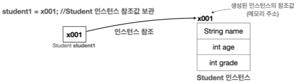
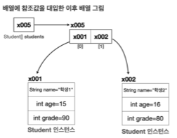

# I. Class
## A. 클래스가 필요한 이유
- 어떤 한 분류의 다양한 개체가 있을때 매번 그 특성을 변수로 선언해서 사용해야한다.
```java
    String student1Name = "학생1";
    int student1Age = 15;
    int student1Grade = 90;
    
    String student2Name = "학생2";
    int student2Age = 16;
    int student2Grade = 80;

    System.out.println("이름: "+student1Name+" 나이: "+student1Age+" 성적: "+student1Grade);
    System.out.println("이름: "+student2Name+" 나이: "+student2Age+" 성적: "+student2Grade);
```
- 입문에서 했던 것처럼 배열을 쓸 수는 있으나 결국 특성이 늘어날때마다 문제가 발생한다는 점은 변하지 않는다. 
- 또한 유지보수의 입장에서 인덱스에만 의존하는 것은 좋지 않다. 
  - 데이터가 많을때 실수를 유발할 수 있다.
  - 새로운 학생 정보를 추가할 경우 각 특성을 한번씩 거쳐가야한다. 
```java
    String[] studentNames = {"학생1","학생2"};
    int[] studentAge = {15,16};
    int[] studentGrade = {80,70};
    
    for(int i=0 ; i<studentNames.length ; i++){
        System.out.println("이름: "+studentNames[i]+" 나이: "+studentAge[i]+" 성적: "+studentGrade[i]);
    }
```
## B. 클래스 선언하기
- 현실 세계의 어떤 대상의 특징과 기능을 단순화 시켜서 하나로 묶는 것을 객체(object)로 관리하는 것이 편리함. 
- 어떤 객체의 공통의 특성과 기능을 생성하고 관리하는 class
```java
//student가 지닌 특성을 지님
public class Student {
    String name;
    int age;
    int grade;
}
```
- 클래스는 대상의 특성을 멤버변수로, 기능을 메서드로 구현
  - 대상의 특성 >>> member variable(클래스에 속하는 것을 강조), field(데이터를 나타내는 전통적 표현)
  - 대상의 기능 >>> method
- 클래스는 대문자로 시작하며 camelCase로 작성
- 클래스는 사용자가 직접 정의해서 사용하는 사용자 정의 타입을 만드는 설계도.
- 설계도인 클래스를 사용해서 실제 메모리에 만들어진 것을 객체 또는 인스턴스라 한다. 
- 만들어진 객체는 int, String 데이터처럼 특성과 기능을 갖는다.

## C. 클래스의 객체(인스턴스)
- 객체 생성 순서
  - 클래스 타입을 받을 변수 선언
  - 객체 생성(생성자 new 사용)
  - 메모리 주소에 데이터 입력(참조값 생성 - 데이터가 입력되어있는 메모리 주소)
  - 참조값 보관
```dockerfile
# ex : 사용자 정의 타입의 객체에 담긴 값 = class주소@참조값 
    step02_basic.chapter01_class.class1.Student@66a29884
```


- 객체에 들어있는 클래스@참조값으로 찾아간 뒤 '.멤버'로 객체 내부의 특성에 접근한다. 
- 클래스를 선언할때 함께 선언된 member variable의 modifier에 따라 읽고 쓰는 권한에대한 접근이 달라진다. 
```java
public class Student{
    public String studentName;
    private int studentCode;
    protected int studentAge;
    protected int studentGrade;
}
```
- 모든 클래스는 최상위 클래스인 Object 클래스의 속성을 공유한다.
[실습](../../src/step02_basic/chapter01_class/class1/Class1.java)

## D. 클래스, 객체, 인스턴스 개념 정리
|            | 내용    ㅋ                                                                 | 중점                   |
|------------|-------------------------------------------------------------------------|----------------------|
| Class      | 틀, 설계도<br/>객체가 가져야할 속성(variable)과 기능(method)을 정의                        | 설계도는 설계도일뿐 실제 대상이 아님 |
| Object(객체) | 클래스에서 정의한 속성과 기능을 가진 실체<br/>객체는 서로 독립적인 상태를 갖는다<br/>같은 클래스에서 생성되도 다른 객체 | 개별 대상을 이야기할때 주로 사용   |
| Instance   | 클래스에서 정의한 속성과 기능을 가진 실체<br/>객체와 혼용<br/>주로 어떤 클래스에 속해있는지 강조할 때 사용        | 클래스와의 관계를 표현할때 주로 사용 |
- 객체와 인스턴스 모두 클래스로부터 나온 실체라는 핵심 의미는 같기때문에 보통 둘을 구분하지 않고 사용

## E. 배열로 인스턴스 관리하기
- 배열을 사용하면 특정 타입을 연속한 데이터구조로 묶어서 편리하게 관리할 수 있다. 
- Student 클래스의 인스턴스들도 Student 타입이므로 Student[]로 관리할 수 있음
- 배열 객체도 배열의 참조값을 갖고, 배열의 참조값에 있는 값은 Student 객체의 참조값을 지닌다. 


```java
import step02_basic.chapter01_class.class1.Student;

Student[] studentArr = new Student[5];
studentArr[0] = new Student();
stduentArr[0].name = "학생1";
// 한 건 사용
System.out.println("name: "+studentArr[0].name);
//향상된 for문으로 사용가능
for(Student student :studentArr){
        System.out.println("이름: "+student.name);
}
```
[실습](../../src/step02_basic/chapter01_class/class1/Class2.java)
## F. 연습문제
```dockerfile
    문제1: 영화 리뷰 관리하기1
문제 설명 
    당신은 영화 리뷰 정보를 관리하려고 한다. 먼저, 영화 리뷰 정보를 담을 수 있는 MovieReview 클래스를 만들어보자.
요구 사항
    1. MovieReview 클래스는 다음과 같은 멤버 변수를 포함해야 한다.
    영화 제목 ( title )
    리뷰 내용 ( review )
    2. MovieReviewMain 클래스 안에 main() 메서드를 포함하여, 영화 리뷰 정보를 선언하고 출력하자.
예시 코드 구조 
java
    public class MovieReview {
     String title;
     String review;
    }

java
    public class MovieReviewMain {
     public static void main(String[] args) {
     // 영화 리뷰 정보 선언
     // 영화 리뷰 정보 출력
     }
    }

출력 예시 
    영화 제목: "인셉션", 리뷰: "인생은 무한 루프"
    영화 제목: "어바웃 타임", 리뷰: "인생 시간 영화!
```
[실습](../../src/step02_basic/chapter01_class/ex/Class1Question.java)
[MovieReview](../../src/step02_basic/chapter01_class/ex/MovieReview.java)
```dockerfile
    문제2: 영화 리뷰 관리하기2
    기존 문제에 배열을 도입하고, 영화 리뷰를 배열에 관리하자.
    리뷰를 출력할 때 배열과 for 문을 사용해서 System.out.println 을 한번만 사용하자
```
[실습](../../src/step02_basic/chapter01_class/ex/Class2Question.java)
```dockerfile
    문제3: 상품 주문 시스템 개발
문제 설명 
    당신은 온라인 상점의 주문 관리 시스템을 만들려고 한다.
    먼저, 상품 주문 정보를 담을 수 있는 ProductOrder 클래스를 만들어보자.
요구 사항
    1. ProductOrder 클래스는 다음과 같은 멤버 변수를 포함해야 한다.
    상품명 ( productName )
    가격 ( price )
    주문 수량 ( quantity )
    2. ProductOrderMain 클래스 안에 main() 메서드를 포함하여, 여러 상품의 주문 정보를 배열로 관리하고, 그
    정보들을 출력하고, 최종 결제 금액을 계산하여 출력하자.
    3. 출력 예시와 같도록 출력하면 된다.
예시 코드 구조 
java
    public class ProductOrder {
     String productName;
     int price; 
     int quantity;
    }

java
    public class ProductOrderMain {
     public static void main(String[] args) {
     // 여러 상품의 주문 정보를 담는 배열 생성
     // 상품 주문 정보를 `ProductOrder` 타입의 변수로 받아 저장
     // 상품 주문 정보와 최종 금액 출력
     }
    }

출력 예시 
    상품명: 두부, 가격: 2000, 수량: 2
    상품명: 김치, 가격: 5000, 수량: 1
    상품명: 콜라, 가격: 1500, 수량: 2
    총 결제 금액: 12000
```
[실습](../../src/step02_basic/chapter01_class/ex/Class3Question.java)
[ProductOrder](../../src/step02_basic/chapter01_class/ex/ProductOrder.java)