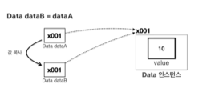

# II. Variable
- java에서 변수의 데이터타입은 기본형과 참조형으로 나뉜다.
## A. 기본
- 기본형(primary type): 변수에 사용할 값을 직접 넣을 수 있는 데이터타입
    > int, long, char, double, boolean 등 변수에 값 자체를 갖고 있음
- 참조형(reference type): 값이 위치한 메모리의 주소를 갖는 데이터 타입
    > array, set 등 복합적인 자료형, 사용자 또는 개발자(library, framework 등 포함)가 정의한 클래스
## B. 계산
- 기본형은 들어있는 값을 그대로 사용할 수 있다. 
```java
    int a = 12;
    int b = 15;
    int sum = a+b;//27
```
- 참조형이 들고있는 값은 메모리 주소일뿐 실제 연산을 위해서는 데이터에 접근하거나 method의 도움이 필요
    - 객체(instance / object)는 .(dot)을 통해 메모리에 생성된 객체 속 데이터를 찾아올 수 있다.
    - 배열은 [index]를 통해 메모리 상에 생성된 배열의 요소에 접근할 수 있다. 
```java
    int[] array1 = new int[]{1,2,3};
    int[] array2 = new int[]{3,4,5};
    int[] sumArr = new int[3];
//  sumArr = array1+array2; > 오류
    int sum;
    for(int i=0;i<array1.length;i++){
        sum = array1[i]+array2[i];
        sumArr[i]=sum;
    }
```
- 기본형을 제외한 나머지는 모두 참조형이다.
- 데이터 타입 중 기본형만 소문자로 시작한다.
    > byte, char, int, long, double, boolean
- 참고: String
  - String도 클래스(참조형)
  - String은 불변 문자 배열: 기존에 있던 String 변수의 값을 변경하면 원래 메모리 주소에 있던 값은 그대로 둔 채 다른 참조 주소를 사용.
  - 그럼에도 연산이 되는 이유: java에서 기본형처럼 사용할 수 있도록 메서드를 지원
  - 자세한건 추후에

## C. 변수 대입 : 자바는 변수의 값을 복사해서 대입한다. 
기본형, 참조형 모두 변수에 있는 값(리터럴, 메모리주소)을 복사해서 대입한다. 
```java
    //기본형
    int a = 10; //a->10
    int b = a; //b->10
    //a와 b는 값은 같으나 서로 다른 메모리 주소를 갖는다. 
    a=20; //a->20, b->10
    b=30; //a->20, b->30
    
    //참조형
    int[] aArray = {1,2,3};// aArray->package.package.Class@3a12afa
    int[] bArray = aArray;// aArray->package.package.Class@3a12afa
    // 변수는 다르나 갖는 참조값(메모리 주소)은 같음 == 같은 데이터를 이름만 다르게 갖음
    aArray[0] = 0; // aArray[0], bArray[0] 모두 0
    bArray[0] = 9; // aArray[0], bArray[0] 모두 9
```
- 같은 위치를 참조하기때문

  - 참조값이 아닌 새로운 메모리 주소로 복사하는 방법은 생성자(new)를 사용해 또 다른 위치에 넣고 값을 입력.


## D. 메서드 호출 
메서드를 호출할때 사용하는 매개변수(parameter)도 변수와 마찬가지로 작동
- 기본형은 값 자체를 복사하기에 원래의 데이터를 변경하지 않는다.
- 참조형은 참조값만 복사하기에 가리키는 값에 영향을 미친다.
```java
/*
 changeValue(int a)/(int[] a, int index) => 값을 30으로 변경하는 method
*/

//  primary type
    int a = 10;
    System.out.println("호출 전 a: "+a);//a>10
    changeValue(a);
    System.out.println("호출 후 a: "+a);//a>10
//  reference type
    int[] arr = {0,10,20};
    System.out.println("호출 전 arr[1]: "+arr[1]);//arr[1]>10
    changeValue(arr,1);
    System.out.println("호출 후 arr[1]: "+arr[1]);//arr[1]>30
```

[실습](../../src/step02_basic/chapter02_variable/Variable1.java)

## E. 참조형의 메서드 호출 활용하기([Class2](../../src/step02_basic/chapter01_class/class1/Class2.java) 리팩토링)
- 참조형은 return 없이 매개변수로 받은 객체만 변경해도 기존 데이터에 영향을 미친다. 
```java
private static void initStudent(Student student, String name, int age, int grade){
  student.name = name;
  student.age = age;
  student.grade = grade;
//      return을 사용하지 않아도 reference address로 보내기때문에 값이 변경된다.
}
```
- 객체 생성을 포함한 생성 method
  - 참조형 객체더라도 메모리 주소가 지정되지 않은 상태에서 새로만드는 것이므로 return 필요
```java
    private static Student createStudent(String name, int age, int grade) {
        Student student = new Student();//create instance
        student.name = name; //set data
        student.age = age;
        student.grade = grade;
        return student; // return reference 
    }
```
[실습](../../src/step02_basic/chapter02_variable/variable2/Ref_Class2.java)
## F. 변수와 초기화
### 1. 종류: 선언 위치
- 멤버 변수(field): Class 코드 블럭에서 선언해 Class 전체에서 공유하는 변수
```java
public class NewClass {
    String field1;
    int member2;
    boolean checker3;
}
```
- 지역 변수(local variable): method 코드 블럭에서 선언해 그 안에서만 공유하는 변수. 매개변수(parameter)도 지역변수
```java
public class MainClass{
  public static void main(String[] args) {
    String local1;
    int local2=0;
    System.out.println(local2); // method 코드 블럭 내부
  }
  int sum = local2+3; // method 코드 블럭 외부 >> 에러
}
```
### 2. 초기화
- member: 인스턴스를 생성할 때 자동 초기화(값을 입력하지 않더라도 자동으로 입력)
- local: 수동 초기화(값을 지정하지 않으면 에러)
[실습](../../src/step02_basic/chapter02_variable/variable3/InitMain.java)

## G. null : 참조형을 쓸때 아직 값을 할당하고 싶지 않지만 초기화해야할때 사용
### 1. null의 중요성
- 특히 지역변수인 경우 유용하다.
- 지역변수는 반드시 수동초기화
```java
//        Data data;
//        System.out.println("1. 초기화 안한 data = " + data); 에러
```
- 우선 null로 초기화하고 나중에 실제 객체 초기화
```java
        Data data = null;
        System.out.println("2. null data = " + data);
        data = new Data();
        System.out.println("3. 초기화 data = " + data);
        System.out.println("3-1. dat1a.value = " + data.value);
        data.value = 3;
        System.out.println("3-2. data.value 변경 = " + data);
        System.out.println("3-3. dat1a.value 값 호출= " + data.value);
```

### 2. java.lang.NullPointerException: java가 pointer를 처리할때 해당 참조값이 없는(null) 경우 발생하는 Runtime 에러
- data가 null이되면 메모리 주소가 사라지므로 null.value는 포인터가 체크할 수 없다.
  - Exception in thread "main" java.lang.NullPointerException: Cannot read field "value" because "data" is null
```java
        data = null;
        System.out.println("4. 다시 지우기 = " + data);
        System.out.println("4-1. 지운 후 dat1a.value 값 호출= " + data.value);
```
- null을 할당했다는 것은 더이상 그 참조값(메모리 주소)에 위치한 인스턴스를 참조하지 않겠다는 뜻
  - 참조형 변수에 null을 할당했다는 것은 변수가 참조하던 메모리 주소가 사라진다는 것이다.
  - 해당 인스턴스를 누구도 참조하지 않으면 더 이상 해당 인스턴스에 접근할 방법(참조값)을 지닌 변수가 없기에 그저 메모리 용량만 소모시킨다.
  - C와 같이 직접 메모리 용량을 관리하는 언어의 경우 개발자가 직접 인스턴스를 메모리에서 제거해야했다. 이를 누락하면 사용하지 않는 쓰레기 데이터들로 인해 메모리 부족 오류가 발생한다.
  - 이러한 번거로움을 줄이기위해 java에서는 JVM(Java Virtual Machine)에 GC(Garbage Collection)를 제공한다.
  - GC는 그 어떤 변수도 참조하지 않는 인스턴스가 생기면 해당 인스턴스를 모아 일정 기준 이상이 되면 자동으로 메모리에서 제거해준다.
- runTime error: 컴파일러에서 잡히지 않지만 실행할때 나타나 프로그램을 멈추는 오류
- NullPointerException: 개발자를 가장 많이 괴롭히는 예외 유형
- 특히 객체를 참조할때 .(dot)을 사용하는데 참조값(메모리 주소)이 null이면 포인터가 대상을 찾을 수 없기때문에 발생하는 에러.

[실습1](../../src/step02_basic/chapter02_variable/variable4/NullMain1.java)
- 참조형을 멤버 변수로 갖는 클래스를 사용할때 특히 조심해야한다.
```java
// 에러!!
    System.out.println("bigData.data.value = " + bigData.data.value); 
```
- 해결: 생성할때 내부 참조형의 객체를 생성하면된다. 
  - 해당 클래스에 생성을 하거나
  ```java
  public class BigData {
      Data data = new Data();
      int count;
  }
  ```
  - 호출한 외부 클래스에서 초기화하거나
  ```java
  BigData bigData = new BigData();
  bigData.data = new Data();  
  System.out.println("bigData.data.value = " + bigData.data.value); 
  ```
[실습2](../../src/step02_basic/chapter02_variable/variable4/NullMain2.java)
## H. 연습문제
```dockerfile
문제1: 상품 주문 시스템 개발 - 리팩토링
문제 설명 
    앞서 만들었던 다음 클래스에 있는 "상품 주문 시스템"을 리팩토링 하자.
    당신은 온라인 상점의 주문 관리 시스템을 만들려고 한다.
    먼저, 상품 주문 정보를 담을 수 있는 ProductOrder 클래스를 만들어보자.
요구 사항
    ProductOrder 클래스는 다음과 같은 멤버 변수를 포함해야 한다.
        상품명 ( productName )
        가격 ( price )
        주문 수량 ( quantity )
    예시 코드 구조 
        package ref.ex;
        public class ProductOrder {
         String productName;
         int price; 
         int quantity;
        }
    주문 수량을 입력 받자
        예) 입력할 주문의 개수를 입력하세요:
    가격, 수량, 상품명을 입력 받자
      입력시 상품 순서를 알 수 있게 "n번째 주문 정보를 입력하세요." 라는 메시지를 출력하세요.
      입력이 끝나면 등록한 상품과 총 결제 금액을 출력하자.
    ProductOrderMain2 클래스 안에 main() 메서드를 포함하여, 
    여러 상품의 주문 정보를 배열로 관리하고, 그 정보들을 출력하고, 
    최종 결제 금액을 계산하여 출력하자. 
이 클래스에서는 다음과 같은 메서드를 포함해야 합니다:
    static ProductOrder createOrder(String productName, int price, int quantity)
        ProductOrder 를 생성하고 매개변수로 초기값을 설정합니다. 
        마지막으로 생성한 ProductOrder 를반환합니다.
    static void printOrders(ProductOrder[] orders)
        배열을 받아서 배열에 들어있는 전체 ProductOrder 의 상품명, 가격, 수량을 출력합니다.
    static int getTotalAmount(ProductOrder[] orders)
        배열을 받아서 배열에 들어있는 전체 ProductOrder 의 총 결제 금액을 계산하고, 
        계산 결과를 반환합니다.
예시 코드 구조 
        public class ProductOrderMain2 {
         public static void main(String[] args) {
         // 여러 상품의 주문 정보를 담는 배열 생성
         // createOrder()를 여러번 사용해서 상품 주문 정보들을 생성하고 배열에 저장
         // printOrders()를 사용해서 상품 주문 정보 출력
         // getTotalAmount()를 사용해서 총 결제 금액 계산
         // 총 결제 금액 출력
         }
        }
출력 예시 
    입력할 주문의 개수를 입력하세요: 3
    1번째 주문 정보를 입력하세요.
    상품명: 두부
    가격: 2000
    수량: 2
    2번째 주문 정보를 입력하세요.
    상품명: 김치
    가격: 5000
    수량: 1
    3번째 주문 정보를 입력하세요.
    상품명: 콜라
    가격: 1500
    수량: 2
    상품명: 두부, 가격: 2000, 수량: 2
    상품명: 김치, 가격: 5000, 수량: 1
    상품명: 콜라, 가격: 1500, 수량: 2
    총 결제 금액: 12000
```
[실습](../../src/step02_basic/chapter02_variable/ex/variable1Question)
