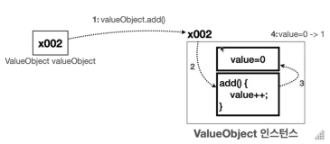

# III. Object-Oriented-Programming
## A. 절차지향 프로그래밍(Procedural Programming)
- 객체지향 이전 일반적인 프로그래밍
- 최근에는 절차지향과 객체지향을 알맞게 사용 중
### 1. 절차지향 프로그래밍이란?
- 이름 그대로 절차를 지향
- 실행 순서를 중요하게 생각한다. 
- 프로그램의 흐름을 순차적으로 따르며 처리하는 방식
- '어떻게'
### 2. 객체지향이란?
- 객체를 지향
- 실제 세계의 사물, 사건, 현상을 객체로 단순화시켜 객체간의 상호작용을 중심으로 처리
- '무엇을'

## B. 절차지향과 객체지향 체감해보기
### 1. 비교
| Procedural Programming                        | Object Oriented Programming                    |
|-----------------------------------------------|------------------------------------------------|
| 데이터와 그 데이터에대한 처리방식(method, function)이 분리되어있다. | 데이터(field)와 그 데이터에대한 처리방식(method)이 객체에 포함되어있다. |
- 단순히 class를 사용했다해서 객체지향인 것은 아니다.
- 절차지향 프로그래밍으로 간단한 프로그램을 만들어보고, 그것을 점진적으로 객체지향 프로그램으로 변경하며 체감해본다.  
### 2. 절차지향 프로그램 만들기
```dockerfile
문제: 음악 플레이어 만들기
음악 플레이어를 만들어보자.
    요구 사항:
        1. 음악 플레이어를 켜고 끌 수 있어야 한다.
        2. 음악 프레이어의 볼륨을 증가, 감소할 수 있어야 한다.
        3. 음악 플레이어의 상태를 확인할 수 있어야 한다.
    예시 출력: 
        음악 플레이어를 시작합니다
        음악 플레이어 볼륨:1
        음악 플레이어 볼륨:2
        음악 플레이어 볼륨:1
        음악 플레이어 상태 확인
        음악 플레이어 ON, 볼륨:1
        음악 플레이어를 종료합니다
    실행 결과 
        음악 플레이어를 시작합니다
        음악 플레이어 볼륨:1
        음악 플레이어 볼륨:2
        음악 플레이어 볼륨:1
        음악 플레이어 상태 확인
        음악 플레이어 ON, 볼륨:1
        음악 플레이어를 종료합니다
```
[절차지향](../../src/step02_basic/chapter03_oop/oop1_procedural/MusicPlayerMain.java)
 
### 3. 절차지향 프로그램에서 데이터를 묶어 관리하기
- 작성한 코드에 class를 도입한다. 
  - class를 사용해 데이터를 관리하고 있으나 여전히 절차지향
  - 이후에 플레이어가 더 복잡해져서 관리할 변수가 추가되더라도 음악 플레이어와 관련된 것은 한 곳에서 관리

[데이터 묶기](../../src/step02_basic/chapter03_oop/oop2_useClass/MusicPlayerMain.java)
### 4. method 추출하기
- 기능을 담당하는 코드들을 메서드로 추출해 모듈화(블럭화)하면 다음과 같은 장점이 생긴다. 
  - 중복제거: 반복되는 코드를 한번으로 줄이고 필요한 곳에 매서드만 호출하면된다
  - 변경 영향 범위: 기능을 수정할때 해당 매서드 내부만 변경하면된다
  - 가독성 증가: 해당 코드가 담당하는 것을 매서드 이름을 통해 의미를 전달해 더 쉽게 이해할 수 있다.
- 하지만 여전히 절차지향... 
    - MusicPlayerData와 그에대한 method가 분리되어있다. 
    - 데이터가 외부(client side)에 드러나있다.
    - 데이터가 변경되면 해당 method도 관리해야하는데 이게 분산되어있다(유지보수의 관리 지점이 분산됨)
  
[모듈화](../../src/step02_basic/chapter03_oop/oop3_useMethod/MusicPlayerMain.java)
### 5. 객체지향으로 만들기
- 객체지향의 핵심은 객체를 지향한다는 것이다. 객체의 틀인 class에 속성(data)과 기능(method)가 포함되어 관리 포인트가 분산되지 않는다.
- 객체는 자신의 method를 통해 자신의 멤버변수에 접근할 수 있다
  - 객체 내부에 있는 method에서 사용하는 멤버변수는 객체 자신의 멤버변수이다
  - 외부에서 값을 받아와 사용하는 경우 this로 객체의 멤버가 갖고있던 값을 표시한다.
  - 매개변수의 이름과 멤버 변수의 이름이 다른경우 굳이 소속을 표시할 필요는 없다.
```java
    int volume=0;
    void volumeUp(){
        volume++;//객체의 멤버변수
    }
    //parameter를 받는 경우
    void setVolume(int volume){
        this.volume = volume;
    //  this로 해당 객체가 갖고있던 값을 표시
    }
```


- 객체지향은 프로그램을 작성하는 것도 물론 중요하지만 실제 음악 플래이어라는 개념을 객체로 온전히 만드는 것이 더 중요하다. 객체를 찍어내는 틀인 class가 그 개념을 온전히 담아야한다. 
- 그러기 위해서는 프로그램의 실행 순서(절차)보다 음악 플레이어 클레스를 만드는것에 우선 집중해야한다. 
- 음악 플레이어의 속성과 기능은 무엇인지 그 그림을 그리는 것 우선 중요하다
  - 속성(data): volume, isOn
  - 기능(method): toggle(on, off), volumeUp, volumeDown, showStatus
- 객체지향을 했을때의 장점: 캡슐링
  - MusicPlayer의 데이터인 volume과 isOn이 외부(client side)에 드러나지 않는다. 
  - 사용하는 입장에서는 내부에 어떤 속성이 있고 어떤 로직인지 알필요도 없고 알수도 없다. 그저 필요한 곳에서 호출만 하면 된다.
  - MusicPlayer에 관련된 모든 사항은 해당 클래스에서만 이뤄지기에 유지보수의 관점이 분산되지 않는다.
- 이처럼 속성과 기능을 하나로 묶어서 필요한 기능만 메서드를 통해 외부에 제공하는 것을 캡슐화라한다. 

[OOP](../../src/step02_basic/chapter03_oop/oop4_ObjectOriented/MusicPlayerMain.java)

## C. 연습문제
```dockerfile
문제1 - 절차 지향 직사각형 프로그램을 객체 지향으로 변경하기
    다음은 직사각형의 넓이(Area), 둘레 길이(Perimeter), 정사각형 여부(square)를 구하는 프로그램이다.
    절차 지향 프로그래밍 방식으로 되어 있는 코드를 객체 지향 프로그래밍 방식으로 변경해라.
    Rectangle 클래스를 만들어라.
    RectangleOopMain 에 해당 클래스를 사용하는 main() 코드를 만들어라.

실행 결과 
    넓이: 40
    둘레 길이: 26
    정사각형 여부: false
```
- [절차 지향 코드 : RectangleProceduralMain.java](../../src/step02_basic/chapter03_oop/ex/oop1Question/RectangleProceduralMain.java)
- [실습](../../src/step02_basic/chapter03_oop/ex/oop1Question/RectangleOOPMain.java)

```dockerfile
문제2 - 객체 지향 계좌
은행 계좌를 객체로 설계해야 한다.
    Account 클래스를 만들어라.
        int balance 잔액
        deposit(int amount) : 입금 메서드
    입금시 잔액이 증가한다.
        withdraw(int amount) : 출금 메서드
    출금시 잔액이 감소한다.
    만약 잔액이 부족하면 잔액 부족을 출력해야 한다.
    AccountMain 클래스를 만들고 main() 메서드를 통해 프로그램을 시작해라.
    계좌에 10000원을 입금해라.
    계좌에서 9000원을 출금해라.
    계좌에서 2000원을 출금 시도해라. 잔액 부족 출력을 확인해라.
    잔고를 출력해라. 잔고: 1000
실행 결과1
    잔액 부족
    잔고: 1000원
```
[실습](../../src/step02_basic/chapter03_oop/ex/oop2Question/AccountMain.java)

- 객체지향과 절차지향은 서로 대치되지 않는다. 말 그대로 지향일뿐이다. 필요에 따라 개발자의 판단하에 적당이 섞어서 사용하면된다.  
- 객체 지향의 특징은 속성과 기능을 하나로 묶는 것 뿐만 아니라 캡슐화, 상속, 다형성, 추상화, 메시지 전달 같은 다양한
특징들이 있다.
- 객체지향의 대표적 특징
  - 캡슐화
  - 상속
  - 다형성