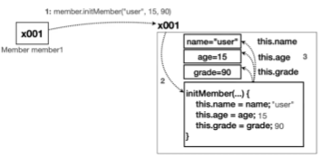

# IV. Constructor

## A. default constructor
- 객체를 생성하는 시점을 컨트롤하고 싶을때 사용
- 생성자의 기본형: 매개변수 없는 기본형. 
- class 내부에 생성자가 전혀 명시되어있지 않으면 자바 컴파일러가 기본 생성자를 적용한다. 
- 매서드와 유사한 모습이지만 가장 큰 특징은 첫 글자가 class와 마찬가지로 대문자.
- 선언
```java
public class ConstructorClass{
/*
    접근제어 클래스          (매개변수 위치){
        코드블럭
    }
*/
    public ConstructorClass(){
        super();
    }

}
```
- 호출
```java
public static void main(String[] args) {
    //선언
    ConstructorClass instance = new CharacterClass();    
}
```

## B. 명시적 생성자 선언하기
- 혼선을 막기위해 class 멤버와 매개변수를 같게 하고 this로 field(member variable)를 표시한다. 
- 기본 생성자가 아닌 사용자가 정의한 생성자만 명시된 경우 기본 생성자는 적용되지 않는다.
- 기본 생성자도 필요하면 함께 선언해준다.
```java
public class ConstructorClass{
    int intVar;
    String strVar;
    
    //매서드와 마찬가지로 매개변수를 받는다. 
    public ConstructorClass(int intVar, String strVar){
        this.intVar = intVar;
        this.strVar = strVar;
    }
    //기본 생성자가 필요하면 함께 명시
    public ConstructorClass(){}
}
```

- 따로 표시하지 않으면 더 가까이 선언된 코드블럭(클래스의 코드블럭보다 메서드의 코드블럭이 가까움)을 우선해 값이 적용되지 않는다.
```java
public class ConstructorClass{
    int intVar;
    String strVar;
    public ConstructorClass(int intVar, String strVar){
    //  매개변수에 매개변수를 대입
        intVar = intVar;
        strVar = strVar;
    }
}
```
- 생성자에서 연산을 진행할 수 있다.
```java
public class ConstructorClass{
    int num1;
    int num2; 
    int sum;
    int ex;
    public ConstructorClass(int num1, int num2){
        this.num1 = num1;
        this.num2 = num2;
        sum = num1 + num2;
        ex = num1 * num2;
    }
}
```
- 매개변수의 이름을 다르게한 경우 this가 필요는 없음. 다만 다양한 메서드가 있는 상황에서 혼란을 줄 수 있으므로 권장하지는 않음
- 오히려 class 멤버에 접근하는 모든 method에서 this를 사용하는 코딩 스타일은 있음. 매개변수의 이름이 속성과 같은 것이 가독성이 높고 캡슐링으로 인해 내부 구조를 이해하지 않아도 모듈 개발자와 모듈 사용자의 소통이 원활해지는 장점이 있음
```java
int firstScore;
double setScore(int middle1, int final1){
    //멤버변수를 사용하는 것이 명시된 method
    this.firstScore = (double)(middle1 * final1)/2;
    return firstScore;
}
```
- 물론 개발환경이 발전하면서 매개변수와 멤버변수의 색을 다르게 표시해줘 구별이 쉬워짐. 
- 최근에는 굳이 쓰지 않음

## C. 생성자 사용하기
### 1. 기본 생성자
```java
public static void main(String[] args) {
    ConstructorClass instance = new CharacterClass();    
}
```
### 2. 매개변수를 요구하는 생성자
```java
public static void main(String[] args) {
    ConstructorClass instance = new CharacterClass(int intVar, String strVar);    
}
```
## D. 생성자 장점
- 중복호출 제거: 객체 생성과 멤버변수 초기화를 한번에 처리할 수 있다. 
```java
    //default constructor
    ConstructorClass instance = new CharacterClass();    
    instance.initMemberVar("string value",1);
    
    //생성자 적용
    ConstructorClass instance = new CharacterClass("string value",1);
```
- 누락 방지: 개발자가 명시한 생성자만 있는 경우. 객체 생성 시점에서 멤버변수를 강제 초기화하도록해 필수 값을 반드시 입력하도록 강제할 수 있다.

[실습](../../src/step02_basic/chapter04_constructor/constructor1/MemberInit.java)

## E. this()
- overloading으로 생성자를 사용하다보면 중복이 많이 발생한다. 
```java
    public MemberInit(String name, int age, int grade){
        this.name = name;
        this.age = age;
        this.grade = grade;
    }
    public MemberInit(String name){
        this.name=name;
    }
    public MemberInit(String name, int age){
        this.name=name;
        this.age=age;
    }
```
- this()는 생성자 내부에서 자기 자신의 생성자를 호출해 매번 멤버변수를 적어야하는 번거로움을 줄여준다. 
    - 필요에 따라 default를 지정할 수 있다. 
    - 기본생성자도 직접 default value를 지정해줄 수 있다. 
```java
    public MemberInit(String name, int age, int grade){
        this.name = name;
        this.age = age;
        this.grade = grade;
    }
    public MemberInit(String name){
        this(name,20,50);
    }
    public MemberInit(String name, int age){
        this(name,age,50);
    }
    public MemberInit(){
        this("이릅을 입력해주세요.",20,50);
    }
```
## F. 연습문제
```dockerfile
문제1 - Book과 생성자
BookMain 코드가 작동하도록 Book 클래스를 완성하세요.
특히 Book 클래스의 생성자 코드에 중복이 없도록 주의하세요.

    public class Book {
     String title; //제목
     String author; //저자
     int page; //페이지 수
     //TODO 코드를 완성하세요.
    }

    public class BookMain {
     public static void main(String[] args) {
     // 기본 생성자 사용
     Book book1 = new Book();
     book1.displayInfo();
     // title과 author만을 매개변수로 받는 생성자
     Book book2 = new Book("Hello Java", "Seo");
     book2.displayInfo();
     // 모든 필드를 매개변수로 받는 생성자
     Book book3 = new Book("JPA 프로그래밍", "kim", 700);
     book3.displayInfo();
     }
    }
실행 결과
    제목: , 저자: , 페이지: 0
    제목: Hello Java, 저자: Seo, 페이지: 0
    제목: JPA 프로그래밍, 저자: kim, 페이지: 700
```
[실습](../../src/step02_basic/chapter04_constructor/ex/constructor1Question/BookMain.java)

