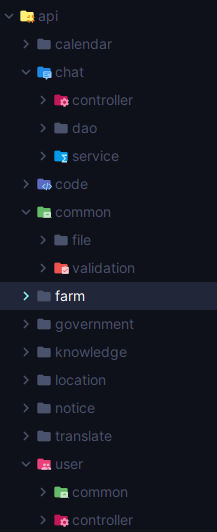

# V. Package
- 프로그램의 기능이 늘어나면 그에 필요한 class도 마찬가지로 늘어난다. 이때 class가 분리되지 않으면 관리하기가 매우 어렵다. 
- 이를 돕기 위해 디렉토리 개념이 필요한데 java에서는 이러한 개념이 package이다.
- 유사한 기능, 범위, 용도, 대상 등  개발자의 판단으로 묶을 수 있다. 

## A. 클래스에서 호출하기
- 같은 패키지의 경우 바로 클래스명으로 호출
```java
    SamePackage samePackage = new SamePackage();
```
- 다른 패키지의 경우 
  - 프로젝트 파일의 src 폴더 하위부터 패키지 경로를 적고 클래스 명을 적음
```java
public static void main(String[] args) {
    step02_basic.chapter05_package.package1.a.new1.Data data = new step02_basic.chapter05_package.package1.a.new1.Data();
}
```
  - import 키워드를 사용해 클래스까지의 경로를 적어두고 아래에서는 class 이름만 사용
```java
import step02_basic.chapter05_package.package1.a.new1.Data;
public class PackageMain {
    public static void main(String[] args) {
        Data new Data();
    }
}
```
  - 한 패키지의 여러 클래스를 사용할 경우 *을 사용해 전체를 참조할 수 있다
```java
import step02_basic.chapter05_package.package1.variableClasses.*;

public class PackageMain {
    public static void main(String[] args) {
        UnderClass1 underClass1 = new UnderClass1();
        UnderClass2 underClass2 = new UnderClass2();
    }
}
```
  - 패키지가 다르면 같은 이름의 클래스도 사용할 수 있다. 
```dockerfile
    pack.a.User
    pack.b.User
```
  - 다만 같은 클래스에서 이미 있는 클래스이름이 있는 경우 나머지는 패키지 표시가 필요
    - 자주 사용하는 것을 import하는 것을 권장
```java
    User userA = new User();
    package1.b.User userB = new package1.b.User();
```
## B. 패키지 규칙
|    | 규칙                                                                                                                                                   |
|----|------------------------------------------------------------------------------------------------------------------------------------------------------|
| 필수 | 패키지의 이름과 구조는 프로젝트 <strong style="color:red">폴더(디렉토리)</strong>와 같아야한다                                                                                 |
|관례| 패키지이름은 모두 <strong style="color:blue">소문자</strong>를 사용한다                                                                                              |
|관례| 패키지 이름의 앞부분은 잎반적으로 회사 도메인 이름을 거꾸로 사용한다(ex/<strong style="color:blue">com.comapany.myapp</strong>). 필수는 아니나 여러 라이브러리를 사용하는 경우 패키지와 클래스 이름 중복을 막을 수 있다 |
- 관례는 보통 협업, 배포 등 다른 사람들과 함께 개발할때 적용하면 좋다. 
- 계층 구조상 하위에 있는 패키지라 해도 결국 사람의 눈에만 연관이 있어보일뿐 사실상 별개의 패키지이므로 각각 import가 있어야 사용가능하다.
  - package a와 package a.b, package a.c 셋 모두 별개의 패키지 
```markdown
- a
    - b
    - c
```

[실습](../../src/step02_basic/chapter05_package/package1/a/PackageMain.java)

## C. 실습해보기
```dockerfile
전체 구조도
    com.helloshop
        user
            User
            UserService
        product
            Product
            ProductService
        order
            Order
            OrderService
            OrderHistory
```
[실습](../../src/step02_basic/chapter05_package/package2/com/helloshop)