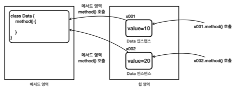
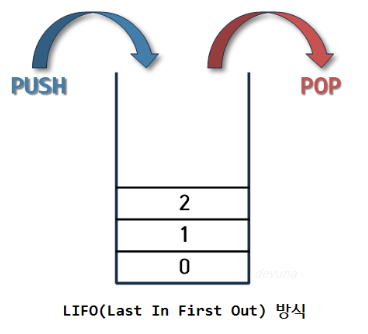
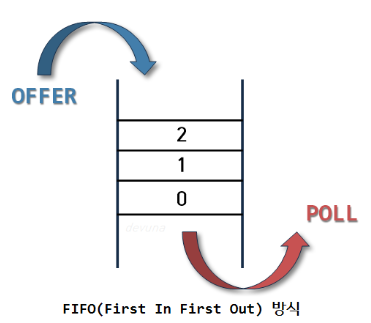

# VII. Java Virtual Machine (w. static)
## A. Java 메모리 구조

- 메서드 영역: JVM 실행시 구동되는 영역. 최우선으로 클래스 영역이 확보된다. 
  - 클래스 정보, static 영역, 런타임 상수 풀(리터럴: int, long 등)
- 스택 영역: 매서드가 호출될때 스택 프레임이 쌓이고 매서드가 처리되고나면 줄어든다. 
  - 프로그램이 실행되는 영역(main method부터 쌓이기 시작).
```java
    public static void main(){} //스택 시작
```
  - 후입선출 LIFO(last in first out) 방식으로 메모리 관리 
  - thread 별로 하나의 실행 스택이 쌓이며 쓰레드 수 만큼 동시 처리가 가능하다. 다만 현재는 멀티쓰레드를 사용하지 않으므로 하나의 쓰레드로 이해
- 힙 영역: 객체(instance)가 생성되는 영역. 리터럴이 아닌 객체와 배열 등의 데이터가 저장된다. 
  - 선언(new - 생성자 키워드)을 하면 이 영역을 사용한다. 
  - 참조 주소의 대상이 된다. 
  - 더이상 참조되지 않는 데이터는 GC에 의해 제거된다. 
### 1. 메서드의 호출
method를 호출하는 위치와 매개변수, 지니는 멤버 변수는 다 다를 수 있다. 힙 영역에 저장된 value 위치는 다를 수 있지만 메서드 코드는 모두 같다. 같은 내용을 호출때마다 메모리에 올리는것은 너무 큰 낭비. 

메서드 코드는 메서드 영역 하나에만 올려놓고 공통으로 관리되고 실행된다. 


## B. 스택 영역
### 들어가기 전에: 기본 자료구조 - stack, queue
#### a. 스택 구조 - LIFO: 후입선출
- 출입구가 하나인 통 모양
- 오래 보관하고 끝까지 있어야 할 것이 가장 먼저 들어간다.

#### b. 큐 구조 - FIFO: 선입선출
- 아래가 출구인 통모양
- 순차적으로 처리한다.


### 1. 실행 확인
[실습코드](../../src/step02_basic/chapter07_virtalMachine/javaMemory1/JavaMemoryMain.java)
- 수행결과(console)
```dockerfile
main start
method1 start
method2 start
method2 end
method1 end
main end
```
- 자바는 스택영역을 사용해 메서드 호출과 지역변수(parameter 포함)를 관리한다.
- 스택 프레임이 종료되면 해당 스택에서 선언된 지역변수도 함께 종료

## C. 스택과 힙
- 클래스의 메서드는 메서드 영역, field인 값은 힙 영역에 저장
- method와 값을 호출해서 사용하는 곳은 스택
[실습](../../src/step02_basic/chapter07_virtalMachine/javaMemory2/Stack_HeapMain.java)
- console
```dockerfile
main start
method1 start
method2 start
data.value = 1
method2 end
method1 end
main end
```
- 실행순서
  - JVM 실행
    - main method 스택 프레임 실행
      - method1 스택 프레임 실행
      - <i>힙에 Data의 인스턴스 생성</i>
        - method2 스택 프레임 실행
        - <i>힙에 있던 Data의 인스턴스 참조</i>
        - method2 스택 프레임 종료 (<i>매개변수 참조 종료</i>)
      - method1 스택 프레임 종료 > <i>지역변수 참조 종료(GC)</i>
    - main method 스택 프레임 종료
  - JVM 종료

## D. static variable
### 1. static이 없으면...
- 생성된 객체의 수를 세려고 만들려고 시도
```java
public class Data {
    private String name;
    private int count;

    public Data(String name) {
        this.name = name;
        count++;
    }
//    ...getter/setter
}
```
[실습](../../src/step02_basic/chapter07_virtalMachine/javaMemory3/static_variable1)
- 같은 클래스라도 인스턴스는 결국 개별객체. 생성된 객체 수를 체크하기위한 count는 결국 무용하다.
- 물론 외부에 해당 인스턴스를 따로 보관하는 것도 방법. 
- 그러나
  - Data class와 관련된 것을 외부에 두는 것이 유지보수의 입장에서 맞는가?
  - 생성자가 복잡해지는 점
```java
public class Data {
    private String name;
    private Counter counter;

    public Data(String name, Counter counter) {
        this.name = name;
        counter.increaseCount;
    }
//    ...getter/setter
}
```
### 2. static 변수
- 클래스와 함께 라이프사이클을 공유하는 멤버변수를 만들고 싶을때 static을 사용한다.
- static으로 선언된 변수는 인스턴스가 아닌 클래스와 함께 메서드 영역에 보관된다.
- 호칭 방법
  - static 변수: 키워드
  - 정적 변수: 인스턴스와 관계없이 고정되는 특징
  - 클래스 변수: 클래스와 생애주기(lifecycle)를 공유하기 때문
- 변수 타입 앞에 키워드를 넣는다. 
```java
//  modifier (키워드) dataType variableName;
    public static int count;
```
- static 변수를 외부에서 접근할때는 인스턴스가 아닌 class로 접근한다. 다만 static 변수를 다루는 method는 객체로 접근할 수 있다. 
  - 물론 인스턴스로 정적변수에 접근 할 수도 있다. 하지만 사용자 입장에서 이것이 인스턴스변수인지 클래스변수인지 혼란을 줄 수 있어 권장하지 않는다. 
```java
//  static 변수에 접근하는 메서드가 static이 아닌경우 객체로 접근
    Data data3 = new Data("C");
    System.out.println("C count = "+data3.getCount());
//  인스턴스가 아닌 클래스로 접근
    System.out.println(Data.count);
```
- 클래스 내부의 메서드에서 접근하는 경우 클래스를 생략할 수있지만 매개변수 이름이 같은 경우 this(인스턴스 자신을 가리킴)대신 클래스 이름을 사용한다. 
```java
    public void setCount(int count) {
        Data.count = count;
    }
```
- static/class/정적 변수는 인스턴스의 틀인 클래스에서 특별하게 관리하는 변수이다. 객체는 여럿이지만 클래스는 하나뿐이므로 static/class/정적 변수도 하나만 존재한다. 
- 어떤 클래스에서 공용으로 관리하고 싶은 데이터가 있는경우 클래스 변수를 사용한다.

[실습](../../src/step02_basic/chapter07_virtalMachine/javaMemory3/static_variable1)

### 3. 변수와 생명주기
| 종류                                      | 보관 위치                                                 | 생명주기                                                                                                     |
|-----------------------------------------|-------------------------------------------------------|----------------------------------------------------------------------------------------------------------|
| local <br/>variable <br/>(parameter 포함) | 선언된 메서드가 있는 스택 메모리의 프레임에 보관                           | 스택 프레임과 함께 생성되고 사라진다. 메서드가 종료되면 사라진다.                                                                    |
| instance <br/>variable                  | 멤버 변수 중 한 종류. 각 인스턴스 별로 관리되므로 힙영역에 저장된다.              | 해당 인스턴스를 대상으로하는 참조가 없어지면 GC에 의해 사라지는데 이때 함께 제거된다.                                                        |
| class/static <br/>variable              | 멤버 변수 중 한 종류. 클래스가 관리하는 변수로 클래스 데이터와 함께 메서드 영역에 저장한다. | 메서드 영역은 해당 클래스가 JVM에 로딩되는 순간 생성되는데, JVM은 자바 프로그램이 시작하면 전체 클래스를 컴파일링하기에 JVM과 생명주기를 공유한다. 정적 변수 역시 이와 함께한다 |

## E. static method