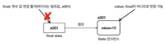

# IIX. final(불변 변수 키워드)
## A. final 지역변수
- final은 class, method, variable에 사용 가능
  - 지금은 final variable. 나머지는 상속 이후
```java
        final int data1; //선언
        data1 = 10; //초기화
//        data1 = 20; 재할당 불가
        final int data2 = 10; // 선언, 초기화
//        data2 =20;
```
## B. final 멤버변수
- 초기화는 1회만 가능
  - 직접 선언, 초기화
```java
    //인스턴스 변수
    final int instanceVariable1=10;
    //정적 변수
    static final int STATIC_VARIABLE_1=10;

//        instanceVariable1=value;
//        STATIC_VARIABLE_1=value;
```
  - 생성자때 선언 
```java
public class FinalMemberVariable{
//    생성자에서 초기화
    final int instanceVariable2;
    //    static final int STATIC_VARIABLE_2;//초기화 필수
    
    public FinalMemberVariable(int value){
        instanceVariable2=value;
//        STATIC_VARIABLE_2=value;
    }
}
```
- 인스턴스와 스태틱
  - static variable > 상수 : 변수명을 대문자로 사용. 상수는 선언 후 초기화는 불가
    - 정적 변수는 JVM이 공유하기때문에 단 하나만 존재할 수 있다. 그렇기에 처음 초기화만 사용.
  - instance variable : 선언과 초기화를 분리할 수 있으나 한 번만 가능(객체별로 불변변수가 생성)
    - 주로 불변 데이터는 클래스가 공용으로 사용하는 경우가 많으므로 정적(static)으로 사용

## C. 상수(Constant)
- 상수 
  - 변하지 않고 항상 일정한 값을 갖는 수
- java의 상수
    - 단 하나만 존재하는 변하지 않는 고정된 값
    - final static 
    - 변수명은 대문자로 snake_case(UPPER_SNAKE_CASE) 사용
```java
    final static int FINAL_STATIC_MEMBER_VARIABLE = 0;
```
- 상수는 보통 애플리케이션 전역에서 사용되므로 public을 주로 사용
- 장단점
  - 상수는 중앙에서 값을 한번에 관리할 수있다. 
  - 단, 실행 중간(Runtime)에는 변경할 수 없고 JVM을 재실행 해야 변경사항이 적용된다.

## D. final 변수와 참조
- final은 변수의 '값'을 변하지 못하게한다. 
  - 리터럴에서 값이란 말그대로 값 그 자체를 의미한다. 
  - 참조형 변수의 값은?
    - 참조형 변수의 값은 힙의 참조 주소이다.
    - 하지만 참조주소에 있는 값은? 그것은 final이 아니므로 변경 가능
    - 배열, 객체 등 그 자체는 변경할 수 없지만 그 아래의 값은 변경할 수 있다.

```java
class Data{
    public int value;
}
final Data data = new Data();
//data = new Data();// 참조값 변경 불가
data.value = 1;//하위는 가능
data.value = 2;
```


- 상황에 맞게 잘 사용하자
  - 접근제어: public 
    - 프로그램 전역에서 사용할때 
  - 불변: final 
    - 한번 선언하고 변경하지 않을 값을 사용할때 
  - 기능: static
    - 인스턴스 없이 기능만 사용할때
    - 클래스에 속한 인스턴스들이 모두 공유하게 하고싶을때

[실습](../../src/step02_basic/chapter08_final/final1/FinalMemberVariable.java)

java의 'static' 키워드는 
  클래스의 모든 인스턴스 간에 공유되는 기능을 정의하는 데 사용되며, 
  메모리 관리와 효율적인 코드 구성에 도움이 된다.