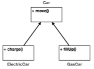
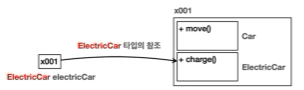
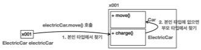
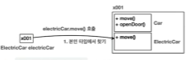
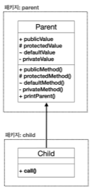
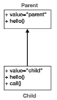

# IX. Extends and Implements
- 가솔린 차량, LPG 차량, 전기 자동차는 자동차라는 추상적인 개념으로 묶을 수 있다. 각 종류의 차량은 자동차를 더 구체적으로 구현한 개념이다.
```java
    ElectricCar electricCar = new ElectricCar();
    electricCar.charge();//특이 기능
    electricCar.move();//공통 기능

    GasCar gasCar = new GasCar();
    gasCar.fillUp();
    gasCar.move();
```
- 각 종류의 차량은 자동차로서의 공통 속성과 기능을 가지고 있으면서도 각기 차량마다의 구체적 속성과 기능을 지닌다.
- 이처럼 여러 클래스가 몇가지의 공통된 속성과 기능으로 묶을 수 있을때 '자동차'라는 부모 클래스를 다른 구체적 클래스들이 상속하게한다.

[상속을 쓰기 전](../../src/step02_basic/chapter09_extends/extends1)
## A. 상속관계
- 기존 클래스의 필드와 메서드를 새로운 클래스에서 재사용하게해준다. 기존 클래스의 속성과 기능(명시는 부모클래스에서만)을 그대로 물려받는다.
- 키워드는 extends를 사용하며 대상은 하나의 클래스만 선택할 수 있다. 
```java
public class SubClass extends SuperClass{
}
```
- 용어 정리
  - 부모 클래스(Super class): 상속을 통해 자신의 속성과 기능을 다른 클래스에 제공하는 클래스
  - 자식 클래스(Sub class): 부모 클래스로부터 속성과 메서드를 상속받는 클래스
[상속 실습](../../src/step02_basic/chapter09_extends/extends2)
- 특징
  - 자식은 부모(상속 받을 대상)의 기능을 물려받지만 부모는 자식에 영향을 받지 않는다.
  
  - 순차적인 다중상속은 가능하나 한번에 여러 부모를 두는 다중상속은 불가하다. 
  ```dockerfile
    # 부모의 부모의 부모는 가능
    extends Object
        extends Collections
            ...
  ```
  ```dockerfile
      extends Car, Airplain, train//이건 불가
  ```
## B. 상속과 메모리구조(<strong style="color:red">중요!</strong>)
### 1. 객체 생성
```java
    ElectricCar electricCar = new ElectricCar();
```

- 해당 타입의 인스턴스를 생성하면서 상속 관계인 부모도 포함해서 생성한다. 
- 참조 주소는 하나지만 정보는 부모와 자식 둘 다 공존하는 것.
- 점유하는 메모리 공간도 구분된다. 
### 2. 호출
```java
    electricCar.charge();//특이 기능 > sub
    electricCar.move();//공통 기능 > super
```

- 객체 사용하기
  - 참조 주소(힙 메모리)로 이동  
  - 본인 타입에서 찾아서 stack 생성 
  - 본인 타입에 없으면 부모 타입에서 찾아 stack 생성
  - 더 상위 부모도 탐색
  - 어디에도 없으면 컴파일 오류

- 포인트
  - 상속 관계의 객체를 생성하면 그 내부에는 부모와 자식이 모두 생성된다. 
  - 객체를 호출할때 대상 타입을 정해야하며 우선 호출자의 타입을 통해 대상 타입을 찾는다. 
  - 대상 타입에 기능이 없으면 상위 부모 타입으로 기능을 찾아서 실행한다. 
  - 없는 경우 컴파일 오류가 발생한다. 

## C. 상속 사용하기
### 1. 상속과 기능 추가
- 새로운 기능을 추가할때 
  - 공통된 기능이라면 부모 클래스
  - 또 다른 새로운 구체적 클래스라면 상속을 받아서 자녀 클래스로

[실습](../../src/step02_basic/chapter09_extends/extends3/CarMain.java)
- 새로운 기능을 추가하거나 클래스를 확장할때 코드 반복을 줄이고 기능을 명확히 분류할 수 있다. 

### 2. 부모에게 받은 기능을 더 확장하기(재정의 - overriding)
- 유사한 기능으로 묶었다 해도 각 자식 클래스마다 고유의 방식을 적용할 수 있다. 
- 기존의 코드(메서드 명)는 유지해 사용자 측은 변경이 없지만 좀더 구체적으로 기능을 확장시키고 싶을때 사용한다. 
- 사용예시
```java
public class SubClass extends SuperClass{
    @Override //재정의한 메서드임을 표시하는 annotation. 제거해도 되지만 협업과 체크를 위해..
    public void superMethod(){//재정의하는 메서드
        super.superMethod();//super에서 쓰는 과정을 사용할 경우 this처럼 
        //안쓰거나 내부 로직 변경시에는 제거
        // 변경사항
    }
}
```
- annotation
  - 주석과 유사하게 정보를 전달하지만 컴파일러에 영향을 줌
  - 개발자가 체크할 부분을 돕거나 기능을 제공
  - 그 외 다양한 용도로 활용됨(static method나 interface처럼 functional하게 사용가능)
  - 필수는 아니지만 코드의 명확성을 위해 권장



- method overriding(재정의) 조건
  - method name: 메서드의 이름은 같아야한다. 
  - parameter: 매개변수의 타입과 순서, 개수가 같아야한다. 
  - returnType: 반환타입이 같아야한다. 
  - modifier: 재정의된 메서드의 접근 제어자는 상위 클래스의 메서드보다 더 제한적이여서는 안된다.
    - super의 method가 protected로 선언되었다면 sub는 public, protected는 가능하지만 그보다 제한적인 default나 private로 재정의하는 것은 불가하다.
  - exception handling: 예외 처리에 있어서 상위 클래스의 메서드보다 더 많은 예외 체크를 throws로 선언할 수 없다. 
    - 예외처리는 뒤에서
  - static, final, private 키워드가 붙은 메서드는 재정의할 수 없다
    - static: 클래스 레벨에서 작동하므로 인스턴스 레벨에서 사용하는 오버라이딩이 의미없다. 
    - final: 메서드에 final 키워드가 붙으면 재정의 불가(참조형 변수에 붙으면 생성자로 값을 변경하는 것이 불가한 것과 같음)
    - private: 해당 클래스 내에서만 접근이 가능하므로 외부 클래스인 sub에서 접근 자체가 불가하다.
  - 생성자는 재정의할 수 없다(클래스마다 이름이 다름..).

[실습](../../src/step02_basic/chapter09_extends/extends4/CarMain.java)

- 아래와 같은 예제를 만들어보자
  - UML 표기법(modifier)

  | 기호 | 의미        |
  |----|-----------|
- | +  | public    |
- | #  | protected |
- | ~  | default   |
- | -  | private   |



[실습](../../src/step02_basic/chapter09_extends/extends5/ExtendsMain.java)

- protected와 default 모두 같은 package만 접근 허용하지만 protected는 상속관계의 클래스까지는 허용한다.

### 3. 부모 참조(super 키워드)
- super: 자식에서 부모의 필드나 메서드를 호출하고 싶을때 사용. 
  - 재정의한 메서드나 이름이 같은 멤버변수가 있는 경우 자식 클래스에서 우선적으로 접근하기때문에 키워드를 사용하지 않고는 부모의 멤버나 메서드에 접근할 수없다. 
- this: 자신 객체를 칭할때 사용. 하지만 생략해도 결국 자기 자신을 먼저 탐색하므로 기능은 같음
- 예제



 [실습](../../src/step02_basic/chapter09_extends/extends6/SuperMain.java)

### 4. super로 부모 생성자에 접근하기
- 상속관계의 인스턴스를 생성하면 부모와 자식의 객체 두개가 모두 생성해야한다. 
- 자식 클래스의 생성자를 명시적으로 처리할 경우 반드시 부모 객체를 생성하는 생성자가 super()있어야한다.
- 부모 생성자가 매개변수가 없는 형태인 경우 생략 가능 
- 다만 부모 생성자가 매개변수를 반드시 필요로하는 경우 값을 전달하기위해 반드시 필요.

```java
public class ChildClass extends ParentClass{
    public ChildClass(){
        super(); //부모 클래스 생성자 호출
        //...
    }
}
```
[실습](../../src/step02_basic/chapter09_extends/extends7/SuperMain.java)
- 실습 콘솔
  - super를 호출하면 stack memory에 순차적으로 쌓이므로 가장 나중에 쌓인 ClassA의 생성자부터 순차적으로 처리된다.
  - ClassC() 호출 > ClassB() 호출 > ClassA() 호출 > ClassA() 실행 > ClassB() 실행 > ClassC() 실행 
```dockerfile
ClassA 생성자
ClassB 생성자 a=10/ b=20
ClassC 생성자
```
- this를 사용할 수 있지만 결국 한번은 상위 클래스의 생성자를 호출해야만한다.
- 콘솔
```dockerfile
ClassA 생성자                  // 결국 상위 클래스 호출
ClassB 생성자 a=4/ b=20        // super를 사용하는 다른 생성자
ClassB 생성자 use this this    // super가 아닌 this를 사용한 생성자
```

- 키워드 final
  - +variable   : 값 변경 금지
  - +method     : 메서드 재정의 금지
  - +class      : 클래스 상속 금지
- 명칭 주의: overriding, overloading
  - overriding  : 덮어 씌우다 > 이전의 것을 다른 것으로 대체하다
    - java: super의 method를 sub class에서 다시 정의해 사용
  - overloading : 과적하다 > 일상적인 것보다 더 많이 쌓아두다
    - java: 메서드를 선언할때 메서드 이름과 반환 타입은 같지만 매개변수가 다른 여러 메서드를 만든다

## D. 연습 문제
```dockerfile
문제1 : 상속 관계 상품
쇼핑몰의 판매 상품을 만들어보자.
Book , Album , Movie 이렇게 3가지 상품을 클래스로 만들어야 한다.
코드 중복이 없게 상속 관계를 사용하자. 부모 클래스는 Item 이라는 이름을 사용하면 된다.
    공통 속성: name , price
    Book : 저자( author ), isbn( isbn )
    Album : 아티스트( artist )
    Movie : 감독( director ), 배우( actor )
다음 코드와 실행결과를 참고해서 Item , Book , Album , Movie 클래스를 만들어보자. 
    public class ShopMain {
     public static void main(String[] args) {
     Book book = new Book("JAVA", 10000, "han", "12345");
     Album album = new Album("앨범1", 15000,"seo");
     Movie movie = new Movie("영화1", 18000,"감독1", "배우1");
     book.print();
     album.print();
     movie.print();
     int sum = book.getPrice() + album.getPrice() + movie.getPrice();
     System.out.println("상품 가격의 합: " + sum);
     }
    }
실행 결과 
    이름:JAVA, 가격:10000
    - 저자:han, isbn:12345
    이름:앨범1, 가격:15000
    - 아티스트:seo
    이름:영화1, 가격:18000
    - 감독:감독1, 배우:배우1
    상품 가격의 합: 43000
```
[실습](../../src/step02_basic/chapter09_extends/ex/ShopMain.java)