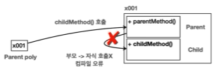

# X. Polymorphism
## A. 다형성
- 객체지향의 꽃
- 다형성: 다양한 형태, 여러 형태
  - 하나의 객체가 여러타입의 객체로 취급될 수 있는 능력
  - 보통 하나의 클래스에서 만든 하나의 인스턴스는 하나의 타입으로 고정된다. 다형성을 사용하면 하나의 객체가 다른 타입으로 사용될 수 있다.  
- 다형성을 이해하기위한 핵심이론
  - 다형적 참조
  - 메서드 오버라이딩
## B. 다형적 참조
- 부모 타입 변수의 부모 인스턴스 참조
```java
    Parent parent = new Parent();
    parent.parentMethod();
```
- 자식 타입 변수의 부모 인스턴스 참조
```java
    Child child = new Child();
    child.parentMethod();
    child.childMethod();
```
- 부모 타입 변수의 자식 인스턴스 참조(<b style="color:red">다형적 참조</b>)
```java
    Parent poly = new Child();
    poly.parentMethod();
//    poly.childMethod(); //자식 인스턴스에 바로 접근은 불가
```


- 부모타입은 자식타입을 담을 수 있다. 반대는 불가
  - 더 추상적인 객체(부모)는 덜 추상적인 객체(자식)를 담을 수 있지만 
  - 더 구체적인 객체(자식)는 덜 구체적인 객체(부모)를 담을 수 없다. 
```java
    Parent poly = new Child();// 가능
//    Child childPoly = new Parent();//불가
```
- 상속관계에서 자신에게 없을때 부모의 인스턴스에 접근 할 수 있어도 그 역은 불가하다. 
### 1. 참조형 형변환
#### a. Down-Casting(다운캐스팅)
-  부모 타입 변수가 자식 인스턴스의 것을 사용하기 위해서는 명시적 형변환(down casting)을 통해 사용한다. 
  - 어차피 인스턴스는 함께 생성되어 있기에 참조 변수가 가리키는 참조값(힙 메모리 주소)은 변화가 없다. 다만 그 대상(포인터)을 Parent 타입에서 Child 타입으로 변경할 뿐이다.
  - 그렇기에 리터럴의 명시적 형변환(down casting) 처럼 값 누락을 걱정할 필요가 없다. 
```java
    Parent poly = new Child();
    poly.parentMethod();
    Child useChild = (Child)poly;
    // 참조 주소의 child를 대상으로 삼는다는 뜻(값 변동x)
    useChild.childMethod();
```
- 일시적으로 사용할 때마다 다운 캐스팅 결과를 변수에 담는 과정은 번거롭다. 따라서 일시적으로 다운캐스팅을 사용할 경우 따로 저장 없이 일시적으로 사용한다.
  - 형변환((Child)보다 객체 접근(.)이 우선이므로 앞에 괄호를 추가한다.
```java
((Child)poly).childMethod();
```
[실습](../../src/step02_basic/chapter10_1_polymorphism/polymorphism1/PolymorphismMain.java)

#### b. Up-Casting(업캐스팅)
- 업캐스팅은 자식 타입 변수를 부모 타입으로 변경할때 일어난다. 
- 다만 너무 자주 사용하기에 생략을 권장한다. 
```java
Child child = new Child();
Parent parent1 = (Child)child;
Parent parent2 = child;//생략 권장

```

### 2. 다운 캐스팅 주의사항
#### a. 부모타입으로 객체를 생성했을때 자식 타입 객체는 생성되지 않는다. 
- 컴파일 에러가 나타나지 않고 런타임 에러만 발생하므로 주의가 필요하다
  - java.lang.ClassCastException 발생
```java
    Parent parent2 = new Parent();
    Child child2 = (Child)parent2;
    child2.childMethod();// ClassCastException
```
#### b. 업캐스팅은 상속의 특성상 이런일이 발생할일이 없다
- 상속의 특성: 인스턴스를 생성할때 상위의 모든 타입의 인스턴스가 생성된다. 

#### c. 에러가 발생할 수 있기에 다운캐스팅만 형변환을 꼭 명시하도록 한 것이다. 
```java
    Child child2 = (Child)parent2;
```
[실습](../../src/step02_basic/chapter10_1_polymorphism/polymorphism2/PolymorphismMain.java)
### 3. instanceof:인스턴스 타입 체크하기
- 어떤 인스턴스를 참조하고 있는지 확인을 하고 나서 다운캐스팅을 하면 더 안전한 프로그래밍이 가능하다.
```java
// a instanceof B: 변수 a에는 B의 인스턴스가 있는가? 
// return boolean
if(parent instanceof Child){
    ((Child)parent).childMethod();
}
```
- 자식 타입의 변수를 부모 타입인지 체크해도 true를 반환한다
  - 자식 타입으로 생성하면 부모 인스턴스도 함께 만들기때문이다.
```java
new Parent() instanceof Child   //false
new Child() instanceof Child    //true
new Grandson() instanceof Child //true
```
- java 16부터는 instanceof를 사용하면서 동시에 변수를 선언할 수 있다. 
```java
if(parent instanceof Child childVariable) {
    childVariable.childMethod();
}
```
[실습](../../src/step02_basic/chapter10_1_polymorphism/polymorphism3/PolymorphismMain.java)

## C. 메서드 오버라이딩
- 메서드 재정의는 다형성과 함께 사용하는 경우가 많다. 
  - 멤버 변수는 오버라이딩되지 않는다. 
    - 부모의 멤버가 그대로 호출됨
  - 메서드는 재정의된(자식의 인스턴스의) 메서드가 우선권을 갖는다. 
    - 스택 메모리 실행 순서상 부모 인스턴스를 찾은 뒤 자식의 것으로 재정의되어 호출된다.
```java
    Parent poly = new Child();
    System.out.println("poly.value = " + poly.value); //Parent instance
    poly.method(); // Child instance
```
- 오버라이딩된 메서드의 우선권은 생각보다 강력하다.

[실습](../../src/step02_basic/chapter10_1_polymorphism/polymorphism4/PolymorphismMain.java)
```dockerfile
# 실습 코드 콘솔 내용
C -> C
child.value = child
Child.method
C -> P
Child.method
P -> P
parent.value = parent
Parent.method
P -> C
poly.value = parent
Child.method
```

## D. 다형성 활용 - 동물 소리 문제

```java
  Dog dog = new Dog();
  Cat cat = new Cat();
  Caw caw = new Caw();

  System.out.println("동물 소리 테스트 시작");
  dog.sound();
  System.out.println("동물 소리 테스트 종료");
  System.out.println("동물 소리 테스트 시작");
  cat.sound();
  System.out.println("동물 소리 테스트 종료");
  System.out.println("동물 소리 테스트 시작");
  caw.sound();
  System.out.println("동물 소리 테스트 종료");
```
[실습1](../../src/step02_basic/chapter10_1_polymorphism/ex/polimorph1Question/Main.java): 다형성을 사용하면 여러 타입의 변수를 한번에 처리해 코드 중복을 줄일 수 있다.
- 코드가 변하는 부분은 main에 변하지 않는 부분은 다른 곳에... 이 둘을 분리하는 것이 좋다. 
- 새로운 동물이 추가될때마다 양이 늘어난다. 다형성은 변하는 내용을 최소량만 만든다.

### 남은 문제 - 개발 중 에러 발생 가능성
- Animal Class를 직접 생성해서 사용하는 문제
  - 개, 고양이 등은 직접 필요해서 사용
  - Animal은 다형성을 위해 만든 추상적인 대상의 클래스. 
- 추가된 동물(Animal을 상속받는) 클래스에서 sound()를 오버라이딩하지 않을경우 
  - 협업 중 필수 메서드를 쓰지 않은 경우를 방지해야한다
  
[Abstract Class/Method, Interface](10-2Abstract.md)
