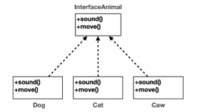
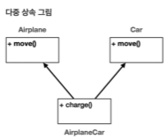
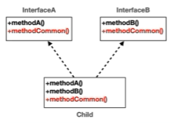
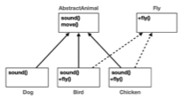

# X-1. Abstract(Abstract Class/Method, Interface)
## A. 추상클래스 
- 부모 클래스의 역할은 제공하지만 실제 객체로 생성하지 않는 객체의 클래스를 추상클래스로 만든다.
- 상속을 통해 공통점을 공유하고 다형성을 확보하기위해 사용한다. 
- 선언
```java
abstract class AbstractClass{
    
}

public static void main(String[] args) {
//    AbstractClass ab = new AbstractClass();//인스턴스 생성 불가
}
```
## B. 추상 메서드
- 상속 받는 자식 클래스가 반드시 오버라이딩 해야하는 메서드가 있을때 부모클래스에 추상 메서드를 선언한다. 
- 추상매서드는 코드 바디{}가 없다. 반드시 재정의해서 구현해야하기 때문이다.
```java
public abstract void abstractMethod();//{ } 없음
```
- 추상 메서드가 하나라도 있는 클래스는 반드시 추상 클래스로 선언해야한다. 
- 추상 메서드가 속한 클래스를 상속받는 자식 클래스가 추상 메서드를 오버라이딩으로 구현해야한다. 만약 구현하지 않는다면 자식도 추상클래스가 되어야 한다.
  - 하지 않으면 컴파일 오류
- 추상클래스에도 일반 메서드를 선언할수 있다

## C. 순수 추상 클래스
- 모든 메서드가 추상 메서드인 추상 클래스
```java
abstract class AbstractClass{
    public abstract abstractMethod1();
    public abstract abstractMethod2();
    public abstract abstractMethod3();
    public abstract abstractMethod4();
}
```
- 직접 구현할 메서드 없이 상속을 통해서만 처리
  - 자체 인스턴스 생성 불가
  - 모든 메서드 오버라이딩으로 구현 필요
  - 다형성을 위해 사용

[실습](../../src/step02_basic/chapter10_2_abstract/abstract1/Main.java)

- '상속'인가 '구현'인가
  - 기능을 전달받는 <b style="color:red">상속</b>이라기보다는 
  - 기능을 정의만 해놓은 <b style="color:green">인터페이스</b>에 가깝다. 

## D. 인터페이스
- 순수 추상 클래스보다 더 편리한 인터페이스를 사용할 수 있다. 
- 인터페이스의 멤버변수는 상수이며 상수는 인터페이스와 상관없다. 
- 특징
  - 인스턴스 생성 불가
  - 모든 메서드가 추상 메서드
  - 멤버 변수는 상수(public static final)
  - 자바8부터는 default method를 구현해 일반 메서드를 사용할 수 있으나 예외적으로 사용할뿐이다.
```java
public interface InterfaceClass{
    int PI = 3.14;//멤버 변수는 상수 public static final은 생략됨
    void abstractMethod1();//abstract 키워드 없어도 됨
    void abstractMethod2();//어차피 모두 추상 메서드
    void abstractMethod3();
    default void defaultMethod(){}//일반 메서드 선언가능
}
```
- 인터페이스를 상속받는 것을 구현(implement)이라한다.
- 인터페이스는 상속과 달리 여러 클래스를 연결할 수 있다. 
```java
public class SubClass implements InterfaceClass{
  @Override 
  public void abstractMethod1(){
      //...
  }
  @Override 
  public void abstractMethod2(){
      //...
  }
  @Override 
  public void abstractMethod3(){
      //...
  }
}
```
- 도면에서 구현은 점선으로 표시한다

[실습](../../src/step02_basic/chapter10_2_abstract/abstract2/Main.java)

## E. 상속과 구현
- 부모 클래스의 기능이 자식 클래스에서 전달받을때 상속
- 부모 인터페이스가 기능을 자식 클래스에 제한시킬때 구현
  - 상속과 구현의 구조는 같아 같은 동작으로 이뤄지지만 다음과 같은 이점으로 인터페이스를 사용한다
### 1. 인터페이스의 특징
- 제약: 자식 클래스에서 반드시 메서드를 구현하도록 규칙으로 작동 > 설계와 구현을 분리할때 안정적 개발을 진행할 수 있다.
- 다중 구현: 하나의 부모만 갖는 상속과 달리 여러 인터페이스를 연결할 수있다. 

- 다중 상속을 사용하면 같은 이름의 method가 있는 경우, 클래스간 계층 구조가 복잡해질 수 있어 Java는 다중상속을 막았다.

- 인터페이스는 기능을 구현하지 않고 상속받는 자식 클래스가 구현하기 나름이기때문에 다중상속의 문제가 없다. 따라서 다중구현은 지원

```java
public class ChildClass implements InterfaceA, InterfaceB{
    @Override
    public void dupMethod(){
        
    } 
}
```
- InterfaceA와 InterfaceB가 모두 dupMethod를 가지고있는 상태에서 ChildClass를 통해 인스턴스를 호출했을때 둘 모두 자녀클래스가 구현한 것을 바라보기때문에 결국 자식의 메서드를 향하므로 문제가 없다.
### 2. 상속과 구현을 동시에
- 상속은 하나만 가능하고 구현은 여러개가 가능하기에 extends 키워드를 먼저 적는다
```java
public class ZooClass extends Animal implements Fly, Swim{
    
}
```

[실습](../../src/step02_basic/chapter10_2_abstract/abstract3/AnimalMain.java)

[다형성과 설계](10-3polymorphism&architecture.md)로 이동