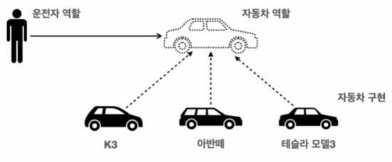

# X-3. polymorphism과 architecture
## A. 좋은 객체지향 프로그래밍이란
- 객체 지향의 특징
  - 추상화
  - 캡슐화
  - 상속
  - <b>다형성</b>
- 객체지향 프로그래밍
  - 컴퓨터 프로그램을 "객체"들의 모임으로 보는 시각
  - 각각의 객체는 메세지를 주고 받고 데이터를 처리할 수 있다
  - 프로그램을 유연하고 변경이 용이하게 만든다
### 1. 특히 다형성
- 다형성은 실세계와 객체 지향을 1:1로 매칭하지 않는다
- 세상을 역할(Interface)과 구현(implemented class)으로 구분
  - 역할은 대체할 수 없으나 구현된 객체는 대체할 수있다
  - 역할에 맞게 기능만 수행할 수 있다면 객체의 종류는 변경할 수 있다\


### 2. 자바 언어의 다형성 활용
- 인터페이스와 구현된 클래스, 객체
  - <span style="color:red">역할</span> => 인터페이스
  - <span style="color:blue">구현</span> => 인터페이스를 구현한 클래스와 그 객체
- 객체 설계시 <span style="color:red">역할</span>을 먼저 부여하고 그 역할을 수행하는 객체를 <span style="color:blue">구현</span>한다
- 디자인 패턴, 제어의 역전, 의존관계 주입 등도 결국 다형성을 활용하는 것.
### 3. 객체의 협력
- 객체의 협력을 통해 프로그래밍을 진행. 혼자 있는 객체는 없다.
- 수많은 객체 클라이언트와 수많은 객체 서버의 대화를 통한 협력
    - client : request => 역할에 필요한 기능을 요청
    - server : response => 역할에 맞게 구현된 기능을 응답
- client는
    - 대상의 역할만 알면된다.
    - 구현 대상의 내부구조를 몰라도 사용할 수 있다.
    - 구현 대상의 내부구조가 변경되어도 영향을 받지 않는다.
    - 구현 대상 자체가 변걍되도 영향을 맏지 않는다.
- 클라이언트의 변경 없이 기능을 변경할 수 있어야한다.
### 4. 한계
- 역할 자체가 변경되면 클라이언트, 서버 모두에 큰 변경이 발생
- 인터페이스를 안정적으로 잘 설계하는 것(확장 가능성까지 고려)이 중요

## B. 구현 예제: 운전자와 자동차
### 1. [다형성없이 개발하기](../../src/step02_basic/chapter10_3_architecture/car0/CarMain.java)
- 개발 당시에는 더 간단하지만 
- 차량을 추가하거나 기능을 추가하는 등의 변경마다 Driver, Main도 변경 필요
### 2. [역할과 기능 분리하기](../../src/step02_basic/chapter10_3_architecture/car1/CarMain.java)
- Driver는 Interface Car의 역할에만 의존할뿐 구현한 K3, Model3에 의존하지 않는다.
- Car의 종류가 늘어나도 Driver나 Main에 영향을 주지 않는다. 

## C. OCP(Open-Closed Principle)
- 객체지향 SOLID 원칙 중 하나
  - Open for extension      : 기능의 추가나 변경에 대해 코드는 확장적이어야 한다.
  - Closed for modification : 그 외의 코드는 수정되지 않아야한다.

## D. 전략 패턴(Strategy Pattern)
디자인 패턴 중에 가장 중요한 패턴을 하나 뽑으라고 하면 전략 패턴을 뽑을 수 있다. 전략 패턴은 알고리즘을 클
라이언트 코드의 변경 없이 쉽게 교체할 수 있다. 방금 설명한 코드가 바로 전략 패턴을 사용한 코드이다. Car 인
터페이스가 바로 전략을 정의하는 인터페이스가 되고, 각각의 차량이 전략의 구체적인 구현이 된다. 그리고 전략
을 클라이언트 코드( Driver )의 변경 없이 손쉽게 교체할 수 있다

## E. 연습 문제
```dockerfile
문제1: 다중 메시지 발송
한번에 여러 곳에 메시지를 발송하는 프로그램을 개발하자.
다음 코드를 참고해서 클래스를 완성하자
요구사항
    다형성을 활용하세요.
    Sender 인터페이스를 사용하세요.
    EmailSender , SmsSender , FaceBookSender 를 구현하세요.

    public class SendMain {
     public static void main(String[] args) {
     Sender[] senders = {new EmailSender(), new SmsSender(), new
    FaceBookSender()};
     for (Sender sender : senders) {
     sender.sendMessage("환영합니다!");
     }
     }
    }

실행 결과 
    메일을 발송합니다: 환영합니다!
    SMS를 발송합니다: 환영합니다!
    페이스북에 발송합니다: 환영합니다!     
```
[실습](../../src/step02_basic/chapter10_3_architecture/ex/polymorphism1Question/SendMain.java)
```dockerfile
문제2: 결제 시스템 개발
    여러분은 기대하던 결제 시스템 개발팀에 입사하게 되었다.
    이 팀은 현재 2가지 결제 수단을 지원한다. 앞으로 5개의 결제 수단을 추가로 지원할 예정이다.
    새로운 결제수단을 쉽게 추가할 수 있도록, 기존 코드를 리펙토링해라.
요구사항
    OCP 원칙을 지키세요.
    메서드를 포함한 모든 코드를 변경해도 됩니다. 클래스나 인터페이스를 추가해도 됩니다.
    단 프로그램을 실행하는 PayMain0 코드는 변경하지 않고, 그대로 유지해야 합니다.
    리펙토링 후에도 실행 결과는 기존과 같아야 합니다.

    package poly.ex.pay0;
    public class KakaoPay {
     public boolean pay(int amount) {
     System.out.println("카카오페이 시스템과 연결합니다.");
     System.out.println(amount + "원 결제를 시도합니다.");
     return true;
     }
    }

    package poly.ex.pay0;
    public class NaverPay {
     public boolean pay(int amount) {
     System.out.println("네이버페이 시스템과 연결합니다.");
     System.out.println(amount + "원 결제를 시도합니다.");
     return true;
     }
    }

    package poly.ex.pay0;
    public class PayService {
     public void processPay(String option, int amount) {
     boolean result;
     System.out.println("결제를 시작합니다: option=" + option + ", amount=" +
    amount);
     if (option.equals("kakao")) {
     KakaoPay kakaoPay = new KakaoPay();
     result = kakaoPay.pay(amount);
     } else if (option.equals("naver")) {
     NaverPay naverPay = new NaverPay();
     result = naverPay.pay(amount);
     } else {
     System.out.println("결제 수단이 없습니다.");
     result = false;
     }
     if (result) {
     System.out.println("결제가 성공했습니다.");
     } else {
     System.out.println("결제가 실패했습니다.");
     }
     }
    }

    package poly.ex.pay0;
    public class PayMain0 {
     public static void main(String[] args) {
     PayService payService = new PayService();
     //kakao 결제
     String payOption1 = "kakao";
     int amount1 = 5000;
     payService.processPay(payOption1, amount1);
     //naver 결제
     String payOption2 = "naver";
     int amount2 = 10000;
     payService.processPay(payOption2, amount2);
     //잘못된 결제 수단 선택
     String payOption3 = "bad";
     int amount3 = 15000;
     payService.processPay(payOption3, amount3);
     }
    }

실행 결과 
    결제를 시작합니다: option=kakao, amount=5000
    카카오페이 시스템과 연결합니다.
    5000원 결제를 시도합니다.
    결제가 성공했습니다.
    결제를 시작합니다: option=naver, amount=10000
    네이버페이 시스템과 연결합니다.
    10000원 결제를 시도합니다.
    결제가 성공했습니다.
    결제를 시작합니다: option=bad, amount=15000
    결제 수단이 없습니다.
    결제가 실패했습니다
```
[실습](../../src/step02_basic/chapter10_3_architecture/ex/polymorphism2Question/PayMain.java)
```dockerfile
문제3 scanner를 사용해 사용자 입력 받기
위의 문제에서 사용자 입력을 직접 받도록 수정하세요
실행 결과
    결제 수단을 입력하세요:kakao
    결제 금액을 입력하세요:5000
    결제를 시작합니다: option=kakao, amount=5000
    카카오페이 시스템과 연결합니다.
    5000원 결제를 시도합니다.
    결제가 성공했습니다.
    결제 수단을 입력하세요:exit
    프로그램을 종료합니다
```
[실습](../../src/step02_basic/chapter10_3_architecture/ex/polymorphism2Question/ClientMain.java)