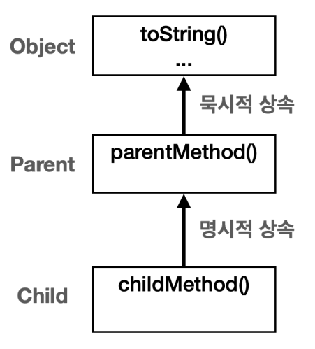
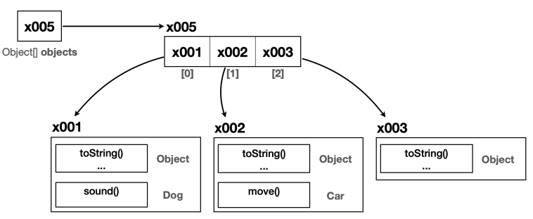

# I. Object class?
- 모든 객체 클래스의 최상위 부모 클래스는 Object 
- 따로 적혀있지 않아도(묵시적으로) `extends Object`
```java
public class AnyClass /* extends Object */ {
    //...
}
```

## A. Object 제공 이유
- 공통 기능 제공: 객체 정보와 객체 비교 메서드 제공
  - Object의 method : 상위 클래스들의 메서드는 따로 작성하지 않아도 상속하므로 사용할 수 있다.
      - toString(): 객체 정보를 문자열로 전달
        - package, class 정보
        - 해당 인스턴스 메모리 주소
      - equals(): 값 동등 확인 메서드
          - 메모리주소 기반 얕은 비교
      - getClass(): 객체 클래스 정보 제공
      - 그외 기타 여러 기능
      ```java
      String string = child.toString();// method in Object class
      System.out.println(string);//class name, reference(memory address)
      ```
- 다형성의 기본 제공
  - 부모 클래스는 자녀 클래스를 담을 수 있다
  - == 모든 클래스를 Object 클래스로 담을 수 있다. 
```java
List<Object> = new ArrayList<>();
Map<String, Object> = new HashMap<>();
```
## B. Object 다형성
- 모든 객체를 담을 수 있으나 자녀 클래스의 method를 다룰 수 없다
  - 필요에 따라 다운 캐스팅을 통해 처리
```java
private static void action(Object obj){
//        obj.move(); // super class에는 sub의 method가 없다.
//        obj.sound();// 컴파일 에러 발생
    // 객체에 따른 down casting
    if(obj instanceof Cat) ((Cat) obj).sound();
    else if(obj instanceof Car) ((Car) obj).move();
}
```
## C. Object 배열
- Object class는 모든 클래스를 담을 타입
```java
        Cat cat = new Cat();
        Car car = new Car();
        Object obj = new Object();

        Object[] objects = {car, cat, obj};
```
- Object를 사용하면 java의 모든 위치에서 사용할 수 있는 method
```java
    private static void size(Object[] objects) {
        System.out.println("전달된 객체 수: "+objects.length);
    }
```

- Object 객체가 없으면 각 개발자들이 자신들의 여러가지 이유로 만든 클래스를 계속 만들어야한다. 

# II. Object의 method
## A. toString()
## B. equals()

# III. 
