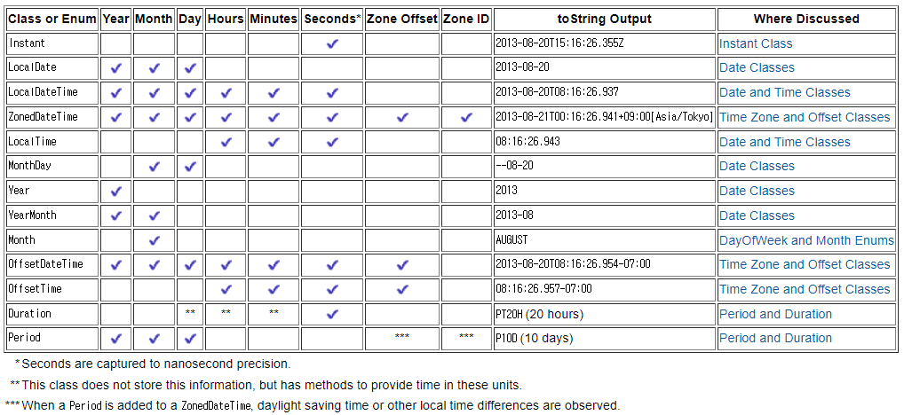
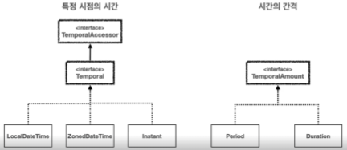
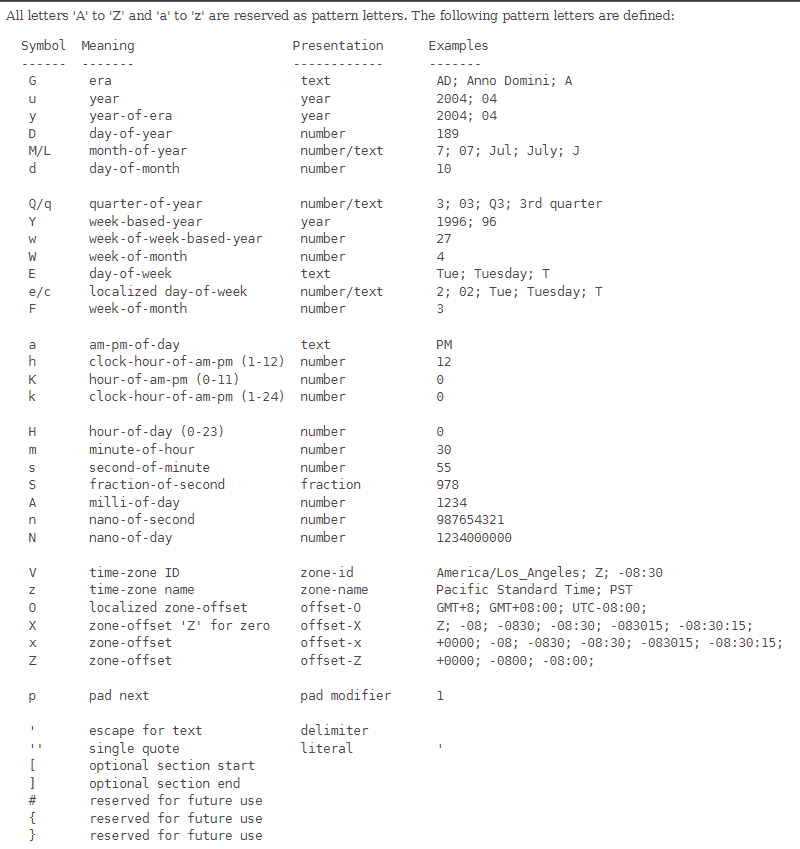

# I. 날짜와 시간 라이브러리가 필요한 이유 
## A. 날짜와 시간 차이 계산
- 특정 날짜에서 다른 날짜까지의 정확한 일수를 계산하는 것은 매우 복잡하다
  - 윤년: 보통 4년에 한 번씩 발생. 하지만 100년 단위일때는 윤년이 아니고, 400면 단위일때는 다시 윤년
  - 각 달의 일수: 28일? 29일? 30일? 31일?
  - 언어에 따른 표현
  - 일광 절약시간(Daylight Saving Time, DST) 변환: 한국엔 없지만 미국에서는 사용 중
  - TimeZone: UTC 기준 시간을 공유하는 영역이 정해져있음
    - 세계 표준시: 
      - Europe/London
      - GMT(Greenwich Mean Time - 그리니치 천문대 기준 세계 표준시, UTC로 대체 됨)
      - UTC(Universal Time Coordinated - GMT를 대체하는 시간으로 원자시로 더 정확한 표준시)
    - 나머지 지역에서는 표준시 기준 
      - US/Arizona-07:00 
      - America/New_York-05:00 
      - Asia/Seoul+09:00
      - Asia/Dubai+
      - 04:00...
    - 서울(UTC+9)과 독일(UTC+1)의 시간계산
      - DST 적용: 8~10 시간
      - DST 미적용: 8시간
## B. Java 날짜/시간 라이브러리의 역사
- 직접 작성하면 사람마다 오차가 발생할 수 있으므로 라이브러리 사용이 안전
- JDK 1.0 : java.util.Date
  - 문제점
    - Timezone 처리 부족
    - 날짜와 시간 연산 불편
    - 불변객체 부재
- JDK 1.1: java.util.Calendar
  - 보완
    - 타임존 지원 개선
    - 날짜, 시간 연산을 위한 method 제공
 - 문제점
   - 복잡하고 직관적이지 않음
   - 일부 사례에서 성능저하
   - 불변객체 부재
 - 해결을 위해 Joda-Time Library(Open Source)를 사용
   - 표준 라이브러리가 아님 => 매번 추가
- JDK 8(1.8): java.time(JSR-310) 
  - 보완
    - 표준라이브러리에 기능을 추가
    - 이전 API 문제점 해결
    - 사용성, 성능, 스레드 안정성, 타임존 처리 등으로 개선
    - 직관적으로 작성
    - 연산 단순화
    - Joda-Time open library에서 많은 기능을 표준 플랫폼으로 가져옴
  - 포함된 class
    - LocalDate
    - LocalTime
    - LocalDateTime
    - ZoneDateTime
    - Instant...
> JPA도 유사하게 편입됨
## C. 라이브러리 소개

[dateTime docs](https://docs.oracle.com/javase/tutorial/datetime/iso/overview.html)
### 1. LocalDate, LocalTime, LocalDateTime
- 특정지역(시스템 정보)에서만 사용하는 경우(세계표준시나 타임존을 고려하지 않는다)
  - LocalDate: 날짜(`2023-01-01`)
  - LocalTime: 시간(`08:01:01.211`)
  - LocalDateTime: 날짜와 시간(`2023-01-01T08:01:01.211`)
### 2. ZonedDateTime, OffsetDateTime
- 세계 협정시 기준 차이를 표시
  - ZonedDateTime: 시간대를 고려한 날짜와 시간을 표현할 때 사용
    - `2023-01-01T08:01:01.211+9:00[Asia/Seoul]`
    - 타임존 표시
    - 일광 절약 시간제 적용
  - OffsetDateTime: 시간대를 고려한 날짜와 시간을 표현. 타임존은 표시되지 않음
    - `2023-01-01T08:01:01.211+9:00`
    - 일광 절약 시간제 미적용
### 3. Year, Month, YearMonth, MonthDay, DayOfWeek
- 날짜 데이터 중 일부 자료만 사용할때
- 자주 사용되지는 않음
- DayOfWeek: 요일 표시 Enum
### 4. Instant
- UTC를 기준으로 시간의 한 지점을 나타냄.
- 전자 측정이 시작된 1970.01.01T00:00:00.000을 기준으로 경과한 초
- 나노초 정밀도로 표현
- 날짜 시간을 위한 자료로는 잘 사용안함(모듈 내부 시간측정 등)
### 5. Period, Duration
- 특정 지점의 시간(시각)이 아닌 시간의 간격(기간)을 표시
- amount of time
  - Period: 날짜(년, 월, 일) 단위 기간
  - Duration: 시간(시, 분, 초) 단위 기간

# II. 자주 사용하는 java.time class
## A. 기본 날짜와 시간(LocalDateTime)
[실습코드](../../src/step03_middleClass/chapter06_DateTime/local)
- 보통은 한국의 앱은 TimeZone 내에서 사용하므로 다른 시간이나 표준시를 고려할 필요가 없다
  - 글로벌 서비스에서 상대 시간 체크가 필요한 경우가 아닌 이상 거의..
- LocalDate(날짜만), LocalTime(시간만)을 내부로 갖는 것이 LocalDateTime
- local date 
  - 생성
```java
public static void main(String[] args) {
    LocalDate nowDate = LocalDate.now();
    System.out.println("nowDate = " + nowDate);//현재시간
    LocalDate birthday = LocalDate.of(1989,10,5);//특정시간
    System.out.println("birthday = " + birthday);
}
```
```
nowDate = 2024-04-26
birthday = 1989-10-05
```
  - 계산: LocalDate/Time/DateTime은 불변객체
```java
public static void main(String[] args) {
    //계산
    LocalDate birthPlus10Day = birthday.plusDays(10);
    System.out.println("birth+10d = " + birthPlus10Day);
}
```
- local Time: 시간자료 사용
```java
public static void main(String[] args) {
    LocalTime nowTime = LocalTime.now();
    System.out.println("nowTime = " + nowTime);
    LocalTime ofTime = LocalTime.of(12,10,30,0);
    System.out.println("ofTime = " + ofTime);

    LocalTime plus4000s = ofTime.plusHours(4000);
    System.out.println("+4000s = " + plus4000s);
}
```
```
nowTime = 15:47:51.043899700
ofTime = 12:10:30
+4000s = 04:10:30
```
- local Date Time
  - 기본적인 연산은 같음
```java
public static void main(String[] args) {
    LocalDateTime nowDt = LocalDateTime.now();
    System.out.println("nowDt = " + nowDt);
    LocalDateTime ofDt = LocalDateTime.of(2018, 10, 10, 10, 10, 10, 0);
    System.out.println("ofDt = " + ofDt);

    LocalDateTime plus20000s = ofDt.plusSeconds(20000);
    System.out.println("+20000s = " + plus20000s);
    LocalDateTime minus2years = ofDt.minusYears(2);
    System.out.println("- 2y = " + minus2years);
}
```
```
nowDt = 2024-04-26T15:51:49.230605300
ofDt = 2018-10-10T10:10:10
+20000s = 2018-10-10T15:43:30
- 2y = 2016-10-10T10:10:10
```
  - 날짜와 시간 데이터 분리, 재조합 가능
```java
public static void main(String[] args) {
    // 날짜와 시간 데이터 분리 가능
    LocalDate date = ofDt.toLocalDate();
    System.out.println("date = " + date);
    LocalTime time = ofDt.toLocalTime();
    System.out.println("time = " + time);

    // LocalDate+LocalTime
    LocalDateTime newDt = LocalDateTime.of(date,time);
    System.out.println("newDt = " + newDt);
}
```
  - 비교
    - isBefore/isAfter : 전후 비교 
    - isEquals: 시간적으로 같은지 비교
      - 시간으로만 비교(TimeZone 무시, UTC 기준 비교): 서울 9시 == UTC 0시
      - equals는 내부 데이터의 모든 구조가 같아야함: 서울 9시 != UTC 0시
```java
public static void main(String[] args) {
    System.out.println("오늘 기준 ofDt는 과거인가? "+nowDt.isBefore(ofDt)); // false
    System.out.println("오늘 기준 ofDt는 미래인가? "+nowDt.isAfter(ofDt)); // true
    System.out.println("오늘 기준 newDt는 과거인가? "+nowDt.isBefore(newDt)); // false
}
```
## B. TimeZone(ZonedDateTime)
[실습코드](../../src/step03_middleClass/chapter06_DateTime/timezone)
- UTC로부터의 오프셋(offset: 시간 차이) 정보를 포함
### 1. Zone Id 
- [zoneId 문서](https://docs.oracle.com/javase/8/docs/api/java/time/ZoneId.html)
- zoneId 사용
  - 직접 문자여로 입력도 가능 but...
```java
public static void main(String[] args) {
    Set<String> availableZoneIds = ZoneId.getAvailableZoneIds();
    int count = 0;
    System.out.println("### Available ZoneIds");
    for(String zoneId : availableZoneIds) {
        count++;
        System.out.println("\t"+count+". "+zoneId+": "+ZoneId.of(zoneId).getRules());
    }

    System.out.println("input ZoneID - "+ZoneId.of("Asia/Seoul").getRules());
    //input ZoneID - ZoneRules[currentStandardOffset=+09:00]
}
```
- 시스템 기본: OS 기준 처리
```java
public static void main(String[] args) {
    ZoneId sysDefault = ZoneId.systemDefault();
    System.out.println("### System Default: zoneId - "+sysDefault + " | "+sysDefault.getRules());
}
```
### 2. ZonedDateTime: LocalDateTime + ZoneId
```java
public final class ZonedDateTime
        implements Temporal, ChronoZonedDateTime<LocalDate>, Serializable {
    /**
     * The local date-time.
     */
    private final LocalDateTime dateTime;
    /**
     * The offset from UTC/Greenwich.
     */
    private final ZoneOffset offset;
    /**
     * The time-zone.
     */
    private final ZoneId zone;
```
- 사용방법은 LocalDateTime과 유사
```java
public static void main(String[] args) {
    ZonedDateTime now = ZonedDateTime.now();
    System.out.println("now = " + now);

    LocalDateTime ofLocalDt = LocalDateTime.of(2024,12,25,12,01,11,100);
    ZonedDateTime ofZonedDt = ZonedDateTime.of(ofLocalDt, ZoneId.systemDefault());
    System.out.println("ofLocalDt = " + ofLocalDt);
    System.out.println("ofZonedDt = " + ofZonedDt);

}
```
```
now = 2024-04-26T16:30:31.719120200+09:00[Asia/Seoul]
ofLocalDt = 2024-12-25T12:01:11.000000100
ofZonedDt = 2024-12-25T12:01:11.000000100+09:00[Asia/Seoul]
```
- 시간 변환
```java
public static void main(String[] args) {
    ZonedDateTime minus365d = ofZonedDt.plusDays(365);
    System.out.println("- 365d = " + minus365d);
    ZonedDateTime transUTC = ofZonedDt.withZoneSameInstant(ZoneId.of("UTC"));
    System.out.println("transUTC = " + transUTC);
    ZonedDateTime transParis = ofZonedDt.withZoneSameInstant(ZoneId.of("America/Chicago"));
    System.out.println("transParis = " + transParis);
}
```
```
- 365d = 2025-12-25T12:01:11.000000100+09:00[Asia/Seoul]
transUTC = 2024-12-25T03:01:11.000000100Z[UTC]
transParis = 2024-12-24T21:01:11.000000100-06:00[America/Chicago]
```
### 3. OffsetDateTime: LocalDateTime과 UTC의 관계
- 시간 차이를 직접 입력
```java
public static void main(String[] args) {
    OffsetDateTime nowOdt = OffsetDateTime.now();
    System.out.println("nowOdt = " + nowOdt);
    LocalDateTime ofLocalDt = LocalDateTime.of(2024,12,25,12,1,11,100);
    OffsetDateTime ofOffsetDt = OffsetDateTime.of(ofLocalDt, ZoneOffset.of("+01:00"));
    System.out.println("ofOffsetDt = " + ofOffsetDt);
}
```
### 4. ZonedDateTime vs OffsetDateTime
- ZonedDateTime: 구체적인 지역시간대를 다룰때 사용, 일광 절약 시간을 자동으로 처리. 
  - 사용자 지정 시간에 대한 시간 계산이 필요할때 사용
- OffsetDateTime: 세계협정시와의 시간 차이만을 나타냃때 사용. 지역 시간대의 복잡성(TimeZone, DST)을 고려하지 않음
  - 사용자에게 보이지 않고 관리적 입장에서 처리(로그 기록)할때 사용
## C. 기계 중심의 시간(Instant)
- 협정시를 기준으로 전산 기록 시점(1970.01.01T00:00:00.000)에서 얼마나 지났는지를 표현
- UTC로만 계산
- nano second(나노초) 정밀도로 표현
- EPOCH: 에포크 시간. Unix timestamp - 기록 시점부터 현재까지의 시간을 초단위로 표현. Timezone에 영향을 받지 않는 절대적 시간표현 방식
```java
public final class Instant
        implements Temporal, TemporalAdjuster, Comparable<Instant>, Serializable {
    /**
     * Constant for the 1970-01-01T00:00:00Z epoch instant.
     */
    public static final Instant EPOCH = new Instant(0, 0);

    //...

    /**
     * The number of seconds from the epoch of 1970-01-01T00:00:00Z.
     */
    private final long seconds;
    /**
     * The number of nanoseconds, later along the time-line, from the seconds field.
     * This is always positive, and never exceeds 999,999,999.
     */
    private final int nanos;

```
- Instance의 장단점
  - 장점
    - 시간대 독립성
    - 고정된 기준점
  - 단점
    - 사용자 친화적이지 않음(직관적이지 않음)
    - 시간대 정보가 없음
- 사용 예시
  - 세계 여러 시점에서의 같은 시간이 필요할때
  - 시간 변환 없이 고정 데이터가 필요할때 
  - 데이터 저장 및 교환에서 로그 기록을 사용할때(데이터 일관성)
  - 필요할때만 ZonedDateTime을 변환해서 사용
    - LocalDateTime은 TimeZone 정보가 없어 사용할 수 없음
```java
public static void main(String[] args) {
    Instant now = Instant.now();
    System.out.println("now = " + now);
    
    ZonedDateTime znow = ZonedDateTime.now();
    System.out.println("znow = " + znow);
    Instant fromZoned = Instant.from(znow);
    System.out.println("fromZoned = " + fromZoned);

    Instant epochStart = Instant.ofEpochSecond(0);
    System.out.println("epochStart = " + epochStart);
    Instant epochPlus3600 = epochStart.plusSeconds(3600);
    System.out.println("epochPlus3600 = " + epochPlus3600);
    long epochSeconds = epochPlus3600.getEpochSecond();
    System.out.println("epoch 기준 경과시간 = " + epochSeconds);

}
```
```
now = 2024-04-26T08:08:02.833399700Z
znow = 2024-04-26T17:08:02.845401500+09:00[Asia/Seoul]
fromZoned = 2024-04-26T08:08:02.845401500Z
epochStart = 1970-01-01T00:00:00Z
epochPlus3600 = 1970-01-01T01:00:00Z
epoch 기준 경과시간 = 3600
```
## D. 기간, 시간의 간격(Duration, Period)
[실습코드](../../src/step03_middleClass/chapter06_DateTime/periodDuration)
### 1. Period: 년, 월, 일
```java
public final class Period
        implements ChronoPeriod, Serializable {
    /**
     * The number of years.
     */
    private final int years;
    /**
     * The number of months.
     */
    private final int months;
    /**
     * The number of days.
     */
    private final int days;
```
- 내부에 각 데이터를 멤버로 갖고 그것을 꺼내는 메서드
- `getYears()`, `getMonths()`, `getDays()`
```java
    public static void main(String[] args) {
    //기간
    Period period = Period.ofDays(10);//ofMonths, ofYears
    System.out.println("period = " + period);
    // 기준 시간에 추가
    LocalDate nowDate = LocalDate.now();
    System.out.println("nowDate = " + nowDate);
    LocalDate plusPeriod = nowDate.plus(period);
    System.out.println("+Period = " + plusPeriod);
    //기간 차이
    LocalDate birthday = LocalDate.of(1990, 1, 1);
    Period between = Period.between(birthday, plusPeriod);
    System.out.println("between = " + between);
    System.out.println(between.getYears()+"년 "+between.getMonths()+"월 "+between.getDays()+"일");
}
```
```
period = P10D
nowDate = 2024-04-26
+Period = 2024-05-06
between = P34Y4M5D
34년 4월 5일
```
### 2. Duration: 시, 분, 초(나노초)
```java
public final class Duration
        implements TemporalAmount, Comparable<Duration>, Serializable {
    /**
     * The number of seconds in the duration.
     */
    private final long seconds;
    /**
     * The number of nanoseconds in the duration, expressed as a fraction of the
     * number of seconds. This is always positive, and never exceeds 999,999,999.
     */
    private final int nanos;
```
- 내부 멤버로 seconds와 nanos만 있음. 
  - to로 시작하는 메서드는 seconds를 변환하는 메서드
  - get은 멤버인 데이터를 꺼내는 메서드
- `toHours()`, `toMinutes()`, `getSeconds()`, `getNano()`
```java
public static void main(String[] args) {
    Duration duration = Duration.ofMinutes(30);
    System.out.println("duration = " + duration);

    LocalTime time = LocalTime.of(1, 0, 0, 0);
    System.out.println("time = " + time);
    LocalTime plus30min = time.plus(duration);
    System.out.println("plus30min = " + plus30min);

    LocalTime now = LocalTime.now();
    Duration between = Duration.between(now, plus30min);
    System.out.println("between = " + between);
    System.out.println("분 = "+between.toMinutes());
    System.out.println("초 = " + between.getSeconds());
    System.out.println("시, 분, 초 = "+between.toHours()+"시 "+between.toMinutesPart()+"분 "+between.toSecondsPart()+"초");
}
```
```
duration = PT30M
time = 01:00
plus30min = 01:30
between = PT16H16M52.8770813S
분 = 976
초 = 58612
시, 분, 초 = 16시 16분 52초
```
# III. 날짜와 시간의 핵심 인터페이스 
[실습 코드](../../src/step03_middleClass/chapter06_DateTime/temporalInterface)

## A. 시간 관련 객체들의 인터페이스
- 시간은 특정 시점의 시간(시각)과 시간의 간격(기간 = 시간의 양)으로 나뉜다
- 이에 대한 패키지 구조는 다음과 같다
  
  - interface `TemporalAccessor`: 날짜와 시간을 읽기위한 기본 인터페이스. 정보 읽기를 위한 기능 제공
    - interface `Temporal`: 날짜와 시간을 조작(추가, 빼기 위한 기능 제공)
      - class: LocalDate, LocalDateTime, LocalTime, ZonedDateTime, OffsetDateTime, Instance
  - interface `TemporalAmount`: 시간의 간격을 나타내며 시간 객체에 적용하여 그 객체를 조정할 수 있다.
    - class: Duration, Period
## B. 시간의 단위와 시간 필드
- interface `TemporalUnit` -> class `ChronoUnit`
  - 열거형 구조
  - 날짜와 시간을 측정하는 단위
  - Duration의 seconds 단위로 값을 지녀 편리
  <table>
    <thead>
      <tr>
        <td>ChronoUnit</td>
        <td>설명</td>
      </tr>
    </thead>
    <tbody>
      <tr>
        <td colspan="2">시간</td>
      </tr>
      <tr>
        <td>NANOS</td>
        <td>나노초</td>
      </tr>
      <tr>
        <td>MICROS</td>
        <td>마이크로초</td>
      </tr>
      <tr>
        <td>MILLIS</td>
        <td>밀리초</td>
      </tr>
      <tr>
        <td>SECONDS</td>
        <td>초</td>
      </tr>   
      <tr>
        <td>MINUTES</td>
        <td>분</td>
      </tr>
      <tr>
        <td>HOURS</td>
        <td>시간</td>
      </tr>
      <tr>
        <td COLSPAN="2">날짜</td>
      </tr>
      <tr>
        <td>DAYS</td>
        <td>일</td>
      </tr>
      <tr>
        <td>WEEKS</td>
        <td>주</td>
      </tr>
      <tr>
        <td>MONTHS</td>
        <td>월</td>
      </tr>
      <tr>
        <td>YEARS</td>
        <td>년</td>
      </tr>  
      <tr>
        <td>DECADES</td>
        <td>10년</td>
      </tr>
      <tr>
        <td>CENTURIES</td>
        <td>세기</td>
      </tr>
      <tr>
        <td>MILLENNIA</td>
        <td>천년</td>
      </tr>
    </tbody>
  </table>
```java
public static void main(String[] args){
    ChronoUnit[] values = ChronoUnit.values();
    System.out.print("chronos unit: ");
    int count = 0;
    for(ChronoUnit value : values){
        if(count!=0) System.out.print(", ");
        System.out.print(value);
        count++;
        if(count == values.length) System.out.println();
    }
    System.out.println("ChronoUnit.HOURS = " + ChronoUnit.HOURS);
    System.out.println("ChronoUnit.HOURS.getDuration().getSeconds() = " + ChronoUnit.HOURS.getDuration().getSeconds());
    System.out.println("ChronoUnit.DAYS.getDuration().getSeconds() = " + ChronoUnit.DAYS.getDuration().getSeconds());

    // 차이 구하기
    LocalTime lt1 = LocalTime.of(1,10,0);
    LocalTime lt2 = LocalTime.of(1,20,0);
    long secondsBetween = ChronoUnit.SECONDS.between(lt1, lt2);
    System.out.println("secondsBetween = " + secondsBetween);
}
```
- interface `TemporalField` -> class `ChronoField`
  - 열거형 구조
  - 날짜와 시간의 일정 부분을 나타내는 정보를 지니는 필드
  - 시간의 단위가 아닌 시간의 정보를 표시
    - 각각의 필드항목은 날짜/시간으 일부 정보를 사용
      - ex) 2024-08-16
        - YEAR: 2024
        - MONTH_OF_YEAR: 8
        - DAY_OF_MONTH: 16
  - 각 필드는 `ValueRange.of(0, 999_999_999)`로 범위를 지정하며 `ChronoUnit`으로 단위를 지닌다. 
  - [docs](https://docs.oracle.com/javase/8/docs/api/java/time/temporal/ChronoField.html)
```java
public static void main(String[] args) {
    ChronoField[] fields = ChronoField.values();
    System.out.print("chronos fields: ");
    int count = 0;
    for (ChronoField field : fields) {
        if(count!=0) System.out.print(", ");
        System.out.print(field);
        count++;
        if(count == fields.length) System.out.println();
    }

    System.out.println("ChronoField.MONTH_OF_YEAR.range() = " + ChronoField.MONTH_OF_YEAR.range());
    System.out.println("ChronoField.DAY_OF_MONTH.range() = " + ChronoField.DAY_OF_MONTH.range());
}
```
## C. 사용하기
[실습코드](../../src/step03_middleClass/chapter06_DateTime/useMethod)
### 1. 조회하기
- 날짜와 시간 데이터에서 어떤 필드를 조회할지 선택 => `ChronoField`
- `TemporalAccessor` 인터페이스의 구현체는  `TemporalField`의 구현체를 get()의 매개변수로 받아 필요한 데이터를 얻을 수 있다. 
- get(`ChronoField.ENUM`)보다 가독성 좋은 편의 메서드도 존재
```java
public static void main(String[] args) {
    LocalDateTime dt = LocalDateTime.of(2030,1,2,13,34,59,123);
    // 원하는 데이터 입력
    System.out.println("Year: " + dt.get(ChronoField.YEAR));
    System.out.println("Month of year: " + dt.get(ChronoField.MONTH_OF_YEAR));
    System.out.println("Day of month: " + dt.get(ChronoField.DAY_OF_MONTH));
    System.out.println("Hour of day: " + dt.get(ChronoField.HOUR_OF_DAY));
    System.out.println("Minute of hour: " + dt.get(ChronoField.MINUTE_OF_HOUR));
    System.out.println("Nano of Second = " + dt.get(ChronoField.NANO_OF_SECOND));
    System.out.println();
    // 편의 메서드
    System.out.println("get Year: " + dt.getYear());
    System.out.println("get Month value: " + dt.getMonthValue());
    System.out.println("get Month object: "+dt.getMonth());
    System.out.println("get Day of month: " + dt.getDayOfMonth());
    System.out.println("get Hour of day: " + dt.getHour());
    System.out.println("get Minute of hour: " + dt.getMinute());
    System.out.println("get Nano of Second = " + dt.getNano());
    System.out.println();
    // 편의 메서드에 없는 경우
    System.out.println("Minute of day: "+dt.get(ChronoField.MINUTE_OF_DAY));
    System.out.println("Second of day: "+dt.get(ChronoField.SECOND_OF_DAY));
}
```
### 2. 조작하기
- 날짜와 시간 데이터를 어떤 단위로 변환할지 선택 => `ChronoUnit`
- `TemporalAccessor` 인터페이스의 구현체에 어떤 단위(`TemporalUnit`)을 얼마나 조절할지 각 연산 메서드 사용
-  역시 편의 메서드도 존재
```java
public static void main(String[] args) {
    LocalDateTime ldt = LocalDateTime.of(2010, 1, 1, 12,0,0,0);
    System.out.println("ldt = " + ldt);

    //plus(amount, ChronoUnit)
    LocalDateTime plus10y = ldt.plus(10, ChronoUnit.YEARS);
    System.out.println("+10y = "+plus10y);
    //plusYears(amount)
    LocalDateTime plus10yMethod = ldt.plusYears(10);
    System.out.println("+10y(Method)= "+plus10yMethod);
    //plus(Period/Duration)
    Period p10y = Period.ofYears(10);
    LocalDateTime plus10yPeriod = ldt.plus(p10y);
    System.out.println("+10y(period): "+plus10yPeriod);
}
```
### 3. 모든 시간 필드를 다 조작할 순 없다
- 없는 필드를 사용하는 경우 에러발생 가능
```java
public static void main(String[] args) {
    LocalDate now = LocalDate.now();
    int dateSeconds = now.get(ChronoField.SECOND_OF_MINUTE);
    System.out.println("dateSeconds = " + dateSeconds);
}
```
> Exception in thread "main" java.time.temporal.UnsupportedTemporalTypeException: Unsupported field: SecondOfMinute
- 이를 체크하기 위한 메서드가 존재
  - `ChronoUnit`과 `ChronoField` 모두 체크
```java
public static void main(String[] args) {
    LocalDate now = LocalDate.now();
    if(now.isSupported(ChronoField.SECOND_OF_MINUTE)){
        int dateSeconds = now.get(ChronoField.SECOND_OF_MINUTE);
        System.out.println("dateSeconds = " + dateSeconds);
    }else{
        System.out.println("SECOND_OF_MINUTE is not supported");
    }
}
```
### 4. with() method
- 원하는 값으로 변경(연산 x)
- [문서](https://docs.oracle.com/javase/8/docs/api/java/time/temporal/TemporalAdjusters.html)
```java
public static void main(String[] args) {
    LocalDateTime ldt = LocalDateTime.of(2010, 1, 1, 12,0,0,0);
    System.out.println("ldt = " + ldt);

    LocalDateTime with10y = ldt.with(ChronoField.YEAR, 2020);
    System.out.println("with10y = " + with10y);
    LocalDateTime withYear = ldt.withYear(2020);
    System.out.println("withYear = " + withYear);
    LocalDateTime withMonth = ldt.withMonth(2);
    System.out.println("withMonth = " + withMonth);

    // TemporalAdjuster 사용
    LocalDateTime nextFriday = ldt.with(TemporalAdjusters.next(DayOfWeek.FRIDAY));
    System.out.println("next Friday = " + nextFriday);
    LocalDateTime lastSunday = ldt.with(TemporalAdjusters.lastInMonth(DayOfWeek.SUNDAY));
    System.out.println("last Sunday of month = " + lastSunday);
    LocalDateTime lastDayOfMonth = ldt.with(TemporalAdjusters.lastDayOfMonth());
    System.out.println("lastDayOfMonth = " + lastDayOfMonth);
}
```
## D. 문자열 파싱과 포매팅(parsing, formatting)
[docs](https://docs.oracle.com/javase/8/docs/api/java/time/format/DateTimeFormatter.html)
- Formatting : 날짜를 사용자의 편의에 맞춰 문자열로 표시
  - `DateTimeFormatter`로 사용할 포매터를 지정
  - format(`지정된 포멧 객체`)
- Parsing : 일정 포멧의 문자열을 날짜 객체로 변환
  - `DateTimeFormatter`로 해석할 포매터를 지정
  - LocalDate.parse(`String 시간표시문자열`,`지정된 포멧 객체`)
  - 지정된 포멧과 확실하게 일치된 문자열만 변환할 수 있다.
- Formatter: Month와 Minute을 구분하기위해 대소문자를 사용: M(Month), m(minute)

```java
public static void main(String[] args) {
    LocalDate date = LocalDate.of(2024,12,25);
    
    //formatting: TemporalAccessor => String
    System.out.println("date.toString(): " + date);
    System.out.println("직접작성 (date.getYear()+\"년 \"...) : " + date.getYear() + "년 " + date.getMonthValue() + "월 " + date.getDayOfMonth() + "일");
    DateTimeFormatter formatter = DateTimeFormatter.ofPattern("yyyy년 MM월 dd일");
    System.out.println("use DateTimeFormatter: " + date.format(formatter));

    //parsing: String => TemporalAccessor
    String dateStr = "2030년 12월 23일";
    LocalDate parsedDate = LocalDate.parse(dateStr, formatter);
    System.out.println("parsedDate = " + parsedDate);

    // DateTime의 경우
    LocalDateTime ldt = LocalDateTime.of(2024,12,25,12,59,0);
    DateTimeFormatter dtFormatter = DateTimeFormatter.ofPattern("yyyy-MM-dd HH:mm:ss");
    String dtStr = ldt.format(dtFormatter);
    System.out.println("dtStr = " + dtStr);
    
    String dateTimeStr = "2025-01-01 10:00:00";
    LocalDateTime parsedDateTime = LocalDateTime.parse(dateTimeStr, dtFormatter);
    System.out.println("parsedDateTime = " + parsedDateTime);
}
```
# IV. 실습문제 