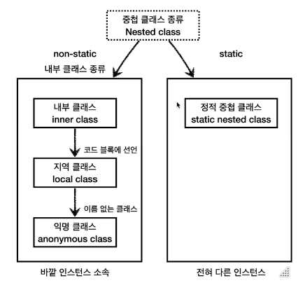
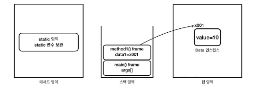

[실습코드](../../src/step03_middleClass/chapter07_InnerClass)

# I. 중첩클래스? 
- 클래스 내부에 다른 클래스가 정의된 상태로 정의하는 위치에 따라 분류할 수 있다

  - 정적 중첩 클래스(static nested class): static이 붙은 클래스
  - 내부 클래스
    - 내부 클래스(inner class)
    - 지역 클래스(local class): 지역 변수에 접근하는 내부 클래스
    - 익명 클래스(anonymous class): 지역 클래스의 name을 사용하지 않음 > 단발성으로 사용
```java
class Outer {
    //static nested class
    static class StaticNested {

    }

    //inner class(like instance variable)
    class Inner {

    }

    //스코프 내부에서 선언한 클래스
    public void process() {
       int localVariable=  0;
        //local class
        class Local {
            public void localMethod(){
                System.out.printf(localVariable);
            };
        }
        //instance of Inner class
        Local local = new Local();
        local.localMethod();
    }
}
```
- 구분 비교 
  - 정적 중첩 클래스는 결국 현재 클래스와 별개인 외부 클래스로 인스턴스에 소속되지 않는다
  - 내부 클래스는 현재 클래스의 인스턴스에 속한다.
  - 실무에서는 중첩과 내부를 따로 구분하지 않고 사용하므로 상황과 문맥에 맞게 사용
- Outer class와 Inner class 사이에서만 긴밀한 연결이 있을때만 사용. 외부에서 접근할 이유가 있는 경우 내부 클래스에 부적합하다
- 사용하는 이유: 보안성을 강화시키기 위한 것으로 캡슐화를 깨뜨리는 경우 외부에 선언하는 것이 맞다. 
  - 논리적 그룹화
  - 캡슐화
# II. 정적 중첩 클래스(static class)
- 내부에 위치하여 `private`에도 접근할수있음
- 그외에는 별개 클래스와 다를게 없음
```java
public class NestedOuter {
    private static int outClassValue = 3;
    private int outInstanceValue = 2;

    static class Nested{
        private int nestedInstanceValue = 1;
        public void print(){
            //자신의 멤버
            //내부 클래스도 본인 클래스 내부이기때문에 private으로 선언해도 사용 가능
            System.out.println(nestedInstanceValue);

            //외부 클래스의 멤버(outer instance 접근 불가
//            System.out.printf(outInstanceValue);

            //외부클래스더라도 static은 가능
            System.out.println(outClassValue);
        }
    }
}
```
- 사용 예시
  - [원본](../../src/step03_middleClass/chapter07_InnerClass/staticNested/ex_before_refactoring) >refactoring> [정적 중첩 클래스 적용](../../src/step03_middleClass/chapter07_InnerClass/staticNested/ex_after_refactoring)
```java
public class Network {
    public void sendMessage(String text){
        NetworkMessage networkMessage = new NetworkMessage(text);
        networkMessage.print();
    }
    private static class NetworkMessage{
        private final String content;
        public NetworkMessage(String content){
            this.content = content;
        }
        private void print(){
            System.out.println("network message: "+content);
        }
    }
}
```
# III. 내부 클래스(inner class)
- `static`을 사용하지 않는다(class 메모리 영역을 사용하지 않는다)
- 외부 클래스의 instance 소속(인스턴스를 생성하면 그때마다 개별 적용)
```java
public class InnerOuter {
    private static int outClassValue=3;
    private int outInstanceValue=2;
    class Inner{
        private int innerInstanceValue=1;
        public void callFromInner(){
            //외부 정적 변수(private 사용 가능)
            System.out.println("out class value: "+outClassValue);
            //외부 멤버
            System.out.printf("out instance value: "+outInstanceValue);
            //자기 자신 멤버
            System.out.printf("inner instance value: "+innerInstanceValue);
        }
    }
    public void callFromOuter(){
        //자신 정적 변수
        System.out.println("out class value: "+outClassValue);
        //자신 멤버
        System.out.printf("out instance value: "+outInstanceValue);
        //내부 클래스의 private 인스턴스 접근 불가
//        System.out.printf("inner instance value: "+innerInstanceValue);
    }
}
```
- 내부클래스의 인스턴스 생성은 외부 클래스의 인스턴스 소속(논리상)
  - 외부 클래스의 인스턴스에서 생성자를 호출함을 기억하자
  - 물리적 위치는 외부 클래스 인스턴스의 참조주소를 내부 클래스의 인스턴스가 들고 있을뿐(LinkedList의 노드관리와 유사하게 이해)
```java
    public static void main(String[] args) {
        InnerOuter outer = new InnerOuter();
        //인스턴스에서 생성자 키워드 사용
        InnerOuter.Inner inner = outer.new Inner();
        //메서드 접근
        outer.callFromOuter();
        inner.callFromInner();
    }
```
- 내부 클래스 사용 예시
- [적용 전](../../src/step03_middleClass/chapter07_InnerClass/innerClass/ex_before_refactoring)  
  - 어떤 클래스가 다른 한 클래스에서만 사용 
  - 생성자에서부터 관리 시작
  - 메서드에서 반복적으로 사용
- [적용 후](../../src/step03_middleClass/chapter07_InnerClass/innerClass/ex_after_refactoring)
  - 굳이 인스턴스 내부 맴버를 전달할 메서드가 필요 없음
    - `getModel()`, `getChargeLevel()` 제거
  - `private`으로 전환해 보안성을 강화
- 같은 이름의 바깥 변수에 접근하기
  - 거리 순 접근: `import`과정과 유사
    - 같은 스코프
    - this를 사용한 인스턴스 접근
    - class 이름으로 명확한 위치 지정
```java
public class ShadowingInner {
    public int value = 1;
    class Inner {
        public int value = 2;
        void innerScope(){
            int value = 3;
            System.out.println("innerScope: value = "+value);
            System.out.println("inner.value: this.value = "+this.value);
            System.out.println("outer.value: OuterClass.this.value = "+ShadowingInner.this.value);
        }
    }
    public static void main(String[] args) {
        ShadowingInner shadowingInner = new ShadowingInner();
        Inner inner = shadowingInner.new Inner();
        inner.innerScope();
    }
}
```
# IV. 지역 클래스(inner class - local class)
- 내부 클래스의 한 종류
  - 외부 클래스의 인스턴스
  - 외부 클래스의 인스턴스 멤버(private)에 접근하여 사용가능
- 내부 클래스와 다른점
  - 외부 클래스의 지역변수(메서드 스코프 내에서 선언되어 스택과 수명을 공유함)
  - 지역변수의 특성(스코프 내에서만 사용)으로 접근제어자를 사용할 필요가 없다
```java
class Outer{
    public void process(){//scope
        //지역 변수
        int localVariable = 0;
        //지역 클래스
        class LocalInner{
        }
        //지역 클래스의 인스턴스 생성
        LocalInner local = new LocalInner();
    }
}
```
## A. 지역 클래스의 접근 범위 확인
```java
public class LocalOuter {
    private int outInstanceVariable = 3;
    public void process(int paramVariable){
        int localVariable = 1;
        class LocalPrinter{
            int variable = 0;
            public void printData(){
                System.out.println("variable: "+variable);//지역 클래스 내의 지역변수
                System.out.println("local variable: "+localVariable);//지역 클래스와 같은 스코프의 지역변수
                System.out.println("parameter variable: "+paramVariable);//매개변수는 지역변수의 한종류
                System.out.println("outer instance variable: "+outInstanceVariable);// 외부 클래스의 멤버
            }
        }
        LocalPrinter printer = new LocalPrinter();
        printer.printData();
    }
}
```
- 호출부
```java
public static void main(String[] args) {
    LocalOuter localOuter = new LocalOuter();
    localOuter.process(2);
}
```
## B. 지역변수 캡쳐
  - 완전히 이해할 필요는 없음
  - 지역 클래스가 접근하는 지역변수의 값은 변경하면 안된다를 이해하는 정도가 목표
### 1. 변수의 생명주기
- 클래스 변수
  - 사용 메모리 영역: method area
  - java가 클래스 정보를 읽는 순간부터 프로그램 종료까지
- 인스턴스 변수
  - 사용 메모리 영역: heap area
  - 소속된 인스턴스 생성부터 GC(JVM의 메모리 관리)되기 전까지 
- 지역 변수
  - 사용 메모리 영역: stack area
  - 소속 메서드의 스코프에 존재. 메서드가 호출되면 생성되고 종료되면 스택 프레임과 함께 제거됨. 

- 생명주기 체크
```java
public class LocalOuter {
    // 클래스(static) 변수: 
      //java 실행할 때 클래스정보를 읽으면서 메서드 영역에 등록할때 정적 변수도 함께 지니므로 그때부터 종료 전까지 이어짐  
    public static int outClassVariable = 0;
    
    // 인스턴스 변수: 
      //인스턴스가 더 이상 참조되지 않는 경우 GC 처리되어 힙 영역에서 제거된다
    private int outInstanceVariable = 3; 
    
    public void process(int paramVariable){
        // 지역 변수: 
          //소속 스코프의 메서드가 호출될때 생성되고 사용이 종료되고 스택프래임에서 제거될때 함께 종료 
        int localVariable = 1;
    }
}
```
### 2. 이미 제거된 지역변수의 값을 사용...
```java
public class CheckVariableLifecycle {
    private int outInstanceVariable = 3;
    public Printer process(int paramVariable){
        int localVariable = 1;

        class LocalPrinter implements Printer{
            int variable = 0;

            @Override
            public void print() {
                System.out.println("variable: "+variable);//지역 클래스 내의 지역변수
                System.out.println("local variable: "+localVariable);//지역 클래스와 같은 스코프의 지역변수
                System.out.println("parameter variable: "+paramVariable);//매개변수는 지역변수의 한종류
                System.out.println("outer instance variable: "+outInstanceVariable);// 외부 클래스의 멤버
            }
        }
        return new LocalPrinter();
//        printer.print();
    }

    public static void main(String[] args) {
        CheckVariableLifecycle localOuter = new CheckVariableLifecycle();
        Printer printer = localOuter.process(2);//stack 프레임 제거 후 처리
            // 스택 프레임이 제거된 후 = 지역변수는 스택프레임과 함께 제거됨
            // 이미 제거된 프레임의 지역변수에 접근하는 인스턴스...
            // 지역변수 localVariable과 parameterVariable은 어떻게?
            // 당시의 값을 캡쳐하여 사용하기때문에 값이 변경되면 사이드 이팩트로 이어질 수 있음
        printer.print();
    }
}
```
### 3. 이미 제거된 스택 프레임의 지역변수에 인스턴스가 어떻게 접근하는가? 
- 
## C. 


# V. 익명 클래스(inner class - anonymous class)
# VI. 실습