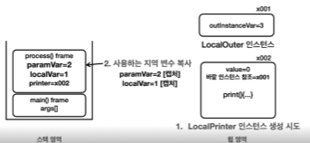
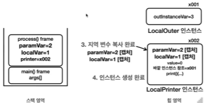

[실습코드](../../src/step03_middleClass/chapter07_InnerClass)

# I. 중첩클래스? 
- 클래스 내부에 다른 클래스가 정의된 상태로 정의하는 위치에 따라 분류할 수 있다

  - 정적 중첩 클래스(static nested class): static이 붙은 클래스
  - 내부 클래스
    - 내부 클래스(inner class)
    - 지역 클래스(local class): 지역 변수에 접근하는 내부 클래스
    - 익명 클래스(anonymous class): 지역 클래스의 name을 사용하지 않음 > 단발성으로 사용
```java
class Outer {
    //static nested class
    static class StaticNested {

    }

    //inner class(like instance variable)
    class Inner {

    }

    //스코프 내부에서 선언한 클래스
    public void process() {
       int localVariable=  0;
        //local class
        class Local {
            public void localMethod(){
                System.out.printf(localVariable);
            };
        }
        //instance of Inner class
        Local local = new Local();
        local.localMethod();
    }
}
```
- 구분 비교 
  - 정적 중첩 클래스는 결국 현재 클래스와 별개인 외부 클래스로 인스턴스에 소속되지 않는다
  - 내부 클래스는 현재 클래스의 인스턴스에 속한다.
  - 실무에서는 중첩과 내부를 따로 구분하지 않고 사용하므로 상황과 문맥에 맞게 사용
- Outer class와 Inner class 사이에서만 긴밀한 연결이 있을때만 사용. 외부에서 접근할 이유가 있는 경우 내부 클래스에 부적합하다
- 사용하는 이유: 보안성을 강화시키기 위한 것으로 캡슐화를 깨뜨리는 경우 외부에 선언하는 것이 맞다. 
  - 논리적 그룹화
  - 캡슐화
# II. 정적 중첩 클래스(static class)
- 내부에 위치하여 `private`에도 접근할수있음
- 그외에는 별개 클래스와 다를게 없음
```java
public class NestedOuter {
    private static int outClassValue = 3;
    private int outInstanceValue = 2;

    static class Nested{
        private int nestedInstanceValue = 1;
        public void print(){
            //자신의 멤버
            //내부 클래스도 본인 클래스 내부이기때문에 private으로 선언해도 사용 가능
            System.out.println(nestedInstanceValue);

            //외부 클래스의 멤버(outer instance 접근 불가
//            System.out.printf(outInstanceValue);

            //외부클래스더라도 static은 가능
            System.out.println(outClassValue);
        }
    }
}
```
- 사용 예시
  - [원본](../../src/step03_middleClass/chapter07_InnerClass/staticNested/ex_before_refactoring) >refactoring> [정적 중첩 클래스 적용](../../src/step03_middleClass/chapter07_InnerClass/staticNested/ex_after_refactoring)
```java
public class Network {
    public void sendMessage(String text){
        NetworkMessage networkMessage = new NetworkMessage(text);
        networkMessage.print();
    }
    private static class NetworkMessage{
        private final String content;
        public NetworkMessage(String content){
            this.content = content;
        }
        private void print(){
            System.out.println("network message: "+content);
        }
    }
}
```
# III. 내부 클래스(inner class)
- `static`을 사용하지 않는다(class 메모리 영역을 사용하지 않는다)
- 외부 클래스의 instance 소속(인스턴스를 생성하면 그때마다 개별 적용)
```java
public class InnerOuter {
    private static int outClassValue=3;
    private int outInstanceValue=2;
    class Inner{
        private int innerInstanceValue=1;
        public void callFromInner(){
            //외부 정적 변수(private 사용 가능)
            System.out.println("out class value: "+outClassValue);
            //외부 멤버
            System.out.printf("out instance value: "+outInstanceValue);
            //자기 자신 멤버
            System.out.printf("inner instance value: "+innerInstanceValue);
        }
    }
    public void callFromOuter(){
        //자신 정적 변수
        System.out.println("out class value: "+outClassValue);
        //자신 멤버
        System.out.printf("out instance value: "+outInstanceValue);
        //내부 클래스의 private 인스턴스 접근 불가
//        System.out.printf("inner instance value: "+innerInstanceValue);
    }
}
```
- 내부클래스의 인스턴스 생성은 외부 클래스의 인스턴스 소속(논리상)
  - 외부 클래스의 인스턴스에서 생성자를 호출함을 기억하자
  - 물리적 위치는 외부 클래스 인스턴스의 참조주소를 내부 클래스의 인스턴스가 들고 있을뿐(LinkedList의 노드관리와 유사하게 이해)
```java
    public static void main(String[] args) {
        InnerOuter outer = new InnerOuter();
        //인스턴스에서 생성자 키워드 사용
        InnerOuter.Inner inner = outer.new Inner();
        //메서드 접근
        outer.callFromOuter();
        inner.callFromInner();
    }
```
- 내부 클래스 사용 예시
- [적용 전](../../src/step03_middleClass/chapter07_InnerClass/innerClass/ex_before_refactoring)  
  - 어떤 클래스가 다른 한 클래스에서만 사용 
  - 생성자에서부터 관리 시작
  - 메서드에서 반복적으로 사용
- [적용 후](../../src/step03_middleClass/chapter07_InnerClass/innerClass/ex_after_refactoring)
  - 굳이 인스턴스 내부 맴버를 전달할 메서드가 필요 없음
    - `getModel()`, `getChargeLevel()` 제거
  - `private`으로 전환해 보안성을 강화
- 같은 이름의 바깥 변수에 접근하기
  - 거리 순 접근: `import`과정과 유사
    - 같은 스코프
    - this를 사용한 인스턴스 접근
    - class 이름으로 명확한 위치 지정
```java
public class ShadowingInner {
    public int value = 1;
    class Inner {
        public int value = 2;
        void innerScope(){
            int value = 3;
            System.out.println("innerScope: value = "+value);
            System.out.println("inner.value: this.value = "+this.value);
            System.out.println("outer.value: OuterClass.this.value = "+ShadowingInner.this.value);
        }
    }
    public static void main(String[] args) {
        ShadowingInner shadowingInner = new ShadowingInner();
        Inner inner = shadowingInner.new Inner();
        inner.innerScope();
    }
}
```
# IV. 지역 클래스(inner class - local class)
- 내부 클래스의 한 종류
  - 외부 클래스의 인스턴스
  - 외부 클래스의 인스턴스 멤버(private)에 접근하여 사용가능
- 내부 클래스와 다른점
  - 외부 클래스의 지역변수(메서드 스코프 내에서 선언되어 스택과 수명을 공유함)
  - 지역변수의 특성(스코프 내에서만 사용)으로 접근제어자를 사용할 필요가 없다
```java
class Outer{
    public void process(){//scope
        //지역 변수
        int localVariable = 0;
        //지역 클래스
        class LocalInner{
        }
        //지역 클래스의 인스턴스 생성
        LocalInner local = new LocalInner();
    }
}
```
## A. 지역 클래스의 접근 범위 확인
```java
public class LocalOuter {
    private int outInstanceVariable = 3;
    public void process(int paramVariable){
        int localVariable = 1;
        class LocalPrinter{
            int variable = 0;
            public void printData(){
                System.out.println("variable: "+variable);//지역 클래스 내의 지역변수
                System.out.println("local variable: "+localVariable);//지역 클래스와 같은 스코프의 지역변수
                System.out.println("parameter variable: "+paramVariable);//매개변수는 지역변수의 한종류
                System.out.println("outer instance variable: "+outInstanceVariable);// 외부 클래스의 멤버
            }
        }
        LocalPrinter printer = new LocalPrinter();
        printer.printData();
    }
}
```
- 호출부
```java
public static void main(String[] args) {
    LocalOuter localOuter = new LocalOuter();
    localOuter.process(2);
}
```
## B. 지역변수 캡쳐
  - 완전히 이해할 필요는 없음
  - 지역 클래스가 접근하는 지역변수의 값은 변경하면 안된다를 이해하는 정도가 목표
### 1. 변수의 생명주기
- 클래스 변수
  - 사용 메모리 영역: method area
  - java가 클래스 정보를 읽는 순간부터 프로그램 종료까지
- 인스턴스 변수
  - 사용 메모리 영역: heap area
  - 소속된 인스턴스 생성부터 GC(JVM의 메모리 관리)되기 전까지 
- 지역 변수
  - 사용 메모리 영역: stack area
  - 소속 메서드의 스코프에 존재. 메서드가 호출되면 생성되고 종료되면 스택 프레임과 함께 제거됨. 

- 생명주기 체크
```java
public class LocalOuter {
    // 클래스(static) 변수: 
      //java 실행할 때 클래스정보를 읽으면서 메서드 영역에 등록할때 정적 변수도 함께 지니므로 그때부터 종료 전까지 이어짐  
    public static int outClassVariable = 0;
    
    // 인스턴스 변수: 
      //인스턴스가 더 이상 참조되지 않는 경우 GC 처리되어 힙 영역에서 제거된다
    private int outInstanceVariable = 3; 
    
    public void process(int paramVariable){
        // 지역 변수: 
          //소속 스코프의 메서드가 호출될때 생성되고 사용이 종료되고 스택프래임에서 제거될때 함께 종료 
        int localVariable = 1;
    }
}
```
### 2. 이미 제거된 지역변수의 값을 사용...
```java
public class CheckVariableLifecycle {
    private int outInstanceVariable = 3;
    public Printer process(int paramVariable){
        int localVariable = 1;

        class LocalPrinter implements Printer{
            int variable = 0;

            @Override
            public void print() {
                System.out.println("variable: "+variable);//지역 클래스 내의 지역변수
                System.out.println("local variable: "+localVariable);//지역 클래스와 같은 스코프의 지역변수
                System.out.println("parameter variable: "+paramVariable);//매개변수는 지역변수의 한종류
                System.out.println("outer instance variable: "+outInstanceVariable);// 외부 클래스의 멤버
            }
        }
        return new LocalPrinter();
//        printer.print();
    }

    public static void main(String[] args) {
        CheckVariableLifecycle localOuter = new CheckVariableLifecycle();
        Printer printer = localOuter.process(2);//stack 프레임 제거 후 처리
            // 스택 프레임이 제거된 후 = 지역변수는 스택프레임과 함께 제거됨
            // 이미 제거된 프레임의 지역변수에 접근하는 인스턴스...
            // 지역변수 localVariable과 parameterVariable은 어떻게?
            // 당시의 값을 캡쳐하여 사용하기때문에 값이 변경되면 사이드 이팩트로 이어질 수 있음
        printer.print();
    }
}
```

### 3. 이미 제거된 스택 프레임의 지역변수를 사용하는 힙의 인스턴스? 
- 지역 변수와 지역 클래스의 인스턴스
  - 지역 변수의 생명주기는 스택 프레임과 공유하기때문에 짧고,
  - 지역 클래스를 통해 생성한 인스턴스의 생명주기는 스택이 아닌 힙에 저장되므로 길다.
- Java의 해결책: 지역 변수 캡쳐(Capture)
  - 지역 클래스의 인스턴스를 생성하는 시점에서 필요한 지역변수를 복사해 생성한 인스턴스에 함께 넣어둔다.



1. 지역 클래스가 인스턴스 생성을 시도한다
   - 이때 지역클래스가 접근하는 지역변수를 확인한다 
2. 사용하는 지역변수 복사
    - 지역 클래스가 사용하는 지역변수를 복사한다(매개변수 포함).
3. 복사한 지역변수를 인스턴스에 포함
4. 인스턴스 생성 완료
    - 인스턴스에 포함해놓은 캡쳐된 지역변수에 접근
5. 매서드가 종료되면서 지역변수 원본이 있던 스택 프레임이 제거됨
6. 힙에 캡쳐된 지역변수의 사본에 접근

- 캡쳐된 지역 변수 소속 확인하기
  - 소속 멤버는 variable 하나
```java
class LocalPrinter implements Printer {
    int variable = 0;
    //...
}
```
- 소속 필드 확인용 코드
```java
public static void main(String[] args) {
    CheckVariableLifecycle localOuter = new CheckVariableLifecycle();
    Printer printer = localOuter.process(2);//stack 프레임 제거 후 처리
        //스택 프레임이 제거된 후 = 지역변수는 이미 제거된 상태
    printer.print();

    System.out.println("check field class name");
    Field[] fields = printer.getClass().getDeclaredFields();
    int counter = 0;
    for(Field field : fields){
        counter++;
        System.out.print("\t"+counter+"."+field+"\n");
    }
}
```
- 콘솔에 지역변수 3개가 추가되어있음
  - 지역 클래스가 접근한 지역변수: `localVariable`
  - 매개변수로 사용중인 지역변수: `paramVariable`
  - ???: `LocalPrinter.this$0`
    - 밖깥 클래스의 인스턴스를 참조하기위한 필드
    - 내부 클래스들이 외부 클래스를 참조하기 위해 참조값을 지닌다
    - java가 내부에서 만들어 사용하는 필드들이 추가됨
```
variable: 0
local variable: 1
parameter variable: 2
outer instance variable: 3
check field class name
	1.int step03_middleClass.chapter07_InnerClass.localClass.CheckVariableLifecycle$1LocalPrinter.variable
	2.final int step03_middleClass.chapter07_InnerClass.localClass.CheckVariableLifecycle$1LocalPrinter.val$localVariable
	3.final int step03_middleClass.chapter07_InnerClass.localClass.CheckVariableLifecycle$1LocalPrinter.val$paramVariable
	4.final step03_middleClass.chapter07_InnerClass.localClass.CheckVariableLifecycle step03_middleClass.chapter07_InnerClass.localClass.CheckVariableLifecycle$1LocalPrinter.this$0
```
- 이미 캡쳐를 한 상태에서 지역변수를 변경하면....?
## C. 이미 캡쳐된 지역변수의 값을 변경시키면? 
- 우선 결론
  - 지역 클래스가 접근하는 지역변수는 절대로 중간에 값이 변하면 안된다. 
  - `final`로 선언하거나 또는 사실상 `final`
  - 사실상 `final`: effectively final - 키워드를 사용하지 않아도 값을 변경하지 않음. 키워드의 존재와 관계없이 사실상 final 변수
- 변경을 한 경우
```java
//...
    Printer printer =  new LocalPrinter();
    //캡쳐 후 지역변수 변경
    localVariable = 10;
    paramVariable = 20;
    return printer;
//...
```
> error message: java: local variables referenced from an inner class must be final or effectively final
- 스택 영역의 지역 변수의 값과 인스턴스에 캡쳐된 변수의 값이 달라서 동기화 문제 발생
  - 지역 변수 값과 인스턴스의 캡쳐된 값을 함께 변경하도록하면 되는거 아닌가? 
    - 동기화 문제는 지역 변수만이 아닌 인스턴스의 캡쳐 변수도 변동 요인이 될 수 있음
    - 예상하지 못한 곳에서 값이 변경되어 디버깅을 난해하게 함
    - 지역 변수의 값과 캡쳐 변수의 값이 서로 동기화 되어야 하는데 멀티 쓰레드 상황에서는 성능에 악영향을 끼칠 수 있음.
  - 자바는 캡쳐한 지역변수의 값을 `effective final`으로 변경 불가로 처리해 이런 복잡한 문제를 근본적으로 차단한다.  
- 중간에 관련 값의 변경이 필요한 경우 다음과 같이 새로 변수를 선언해서 사용한다
```java
  int x = localVariable + 10;
  x++;
```
# V. 익명 클래스(inner class - local class - anonymous class)
- 지역 클래스의 한 종류
  - 클래스의 이름이 없다는 특징
## A. 익명클래스 기본 설명
- 선언과 생성이라는 2가지 단계를 한번에 처리
  - `new Interface(){...}` 형태로 인터페이스를 구현한 클래스를 익명으로 생성
    - `new 익명클래스생성자();`의 역할을 수행
```java
//선언
class LocalPrinter implements Printer{
    //body
}
//생성
Printer printer = new LocalPrinter();
```
- 사용 예시
```java
//선언과 생성을 함께
Printer printer =new Printer(){
    int variable = 0;
    @Override
    public void print() {
        System.out.println("variable: "+variable);//지역 클래스 내의 지역변수
        System.out.println("local variable: "+localVariable);//지역 클래스와 같은 스코프의 지역변수
        System.out.println("parameter variable: "+paramVariable);//매개변수는 지역변수의 한종류
        System.out.println("outer instance variable: "+outInstanceVariable);// 외부 클래스의 멤버
    }
};
```
- 익명 클래스의 특징
  - 이름 없는 지역 클래스를 선언하면서 동시에 선언
  - 부모 클래스를 상속 받거나 인터페이스를 구현해야한다
    - 상위 클래스나 인터페이스로 구성이 정의되어 있어야 함
  - 이름이 없기때문에 기본 생성자 외에 생성자를 가질 수 없다
  - 자바 내부에서 `OuterClassName$숫자`로 정의됨. 
    - 익명 클래스가 여러 개라면 `OuterClassName$1`,`OuterClassName$2`,`OuterClassName$3`..로 정의됨
- 익명 클래스의 장점
  - 클래스를 별도로 정의하지 않고도 인터페이스나 추상 클래스를 즉석에서 구현할 수 있어 코드가 간결해진다
  - 다음의 경우 별도의 클래스를 정의하는 것이 좋다 
    - 복잡한 코드로 구성되어 분할과 구성이 복잡한 경우
    - 코드의 재사용이 반복되는 경우(같은 기능을 여러번 생성하는 경우)
## B. 중첩클래스(static nested > local class > anonymous class)
### 1. 간단한 리팩토링 예제
- [소스](../../src/step03_middleClass/chapter07_InnerClass/anonymous/useNested/justHello)
- 우선 혼자 고민해보기
  - 변하는 부분은 단순 문자열 변경이므로 조건에 따라 문자열 변경
  - 따로 조건문을 처리하기보다 배열의 인댁스 사용
  - 잘못된 번호 입력시 제한
```java
public class HelloRefactoring {
    private static String[] langArr = {"Java", "Spring"};
    public static void helloLang(int type) {
        if (type < 0 || type >= langArr.length) {
            System.out.println("잘못된 입력입니다: " + type);
            return;
        }
        System.out.println("프로그램 시작");
        System.out.println("Hello " + langArr[type]);
        System.out.println("프로그램 종료");
    }

    public static void main(String[] args) {
        helloLang(0);
        helloLang(1);
    }
}
```
- 적용
#### a. 변하는 부분과 변하지 않는 부분 분리하기
```java
public static void hello(){
  System.out.println("프로그램 시작");//변하지 않는 부분
  //변하는 부분 시작
  System.out.println("Hello Java");
  System.out.println("Hello Spring");
  //변하는 부분 종료
  System.out.println("프로그램 종료");//변하지 않는 부분
}
```
#### b. 변하는 부분을 매개변수로 받아 처리하기
- 변하는 부분은 메서드 외부에서 전달받아 사용하는 것이 핵심!
```java
public static void hello(String str){
    System.out.println("프로그램 시작");
    System.out.println("Hello "+str);
    System.out.println("프로그램 종료");
}
```
### 2. 정적 중첩 클래스 사용하기
- [소스](../../src/step03_middleClass/chapter07_InnerClass/anonymous/useNested/calc_useStaticNested)
- 단순 데이터가 아닌 코드 조각을 외부에서 받아서 사용해보자
  - 변하는 부분의 메서드를 분리해서 처리
  - 경우를 switch-case로 조건 분할
  - 그외 경우 안내
```java
public class ReceiveSource {
    public static void calcDice(){
        int randomValue = new Random().nextInt(6) + 1;
        System.out.println("주사위: "+randomValue);
    }
    public static void calcSum(){
        for(int i = 1; i<=3; i++){
            System.out.println("i: "+i);

        }
    }
    public static void helloCalc(int type){
        System.out.println("프로그램 시작");
        switch (type){
            case 1:
                calcDice();
                break;
            case 2:
                calcSum();
                break;
            default:
                System.out.printf("잘못된 입력: %d",type);
                break;
        }
        System.out.println("프로그램 종료");
    }
    public static void main(String[] args) {
        helloCalc(1);
        helloCalc(2);
    }
}
```
- 좀 더 관리하기 좋게
#### a. 인터페이스로 기본 레이아웃 생성
```java
public interface Process {
    void run();
}
```
#### b. 인터페이스를 구현한 두개의 내부 클래스 생성
```java
public class UseInnerClass {
    //inner class
    static class Dice implements Process{
        @Override
        public void run() {
            int randomValue = new Random().nextInt(6) + 1;
            System.out.println("주사위: "+randomValue);
        }
    }
    static class Sum implements Process{
        @Override
        public void run() {
            for(int i = 1; i<=3; i++){
                System.out.println("i: "+i);

            }
        }
    }
}
```
#### c. 다형성을 이용해 소스코드 받아 실행하도록 함
```java
public static void  helloInner(Process process){
    System.out.println("프로그램 시작");
    //코드조각 시작
    process.run();
    //코드조각 종료
    System.out.println("프로그램 종료");
}
```
#### d. 사용 처리
```java
public static void main(String[] args) {
    helloInner(new Dice());
    helloInner(new Sum());
}
```
### 3. 지역클래스 사용
- 개별 정적 클래스로 있던 것을 main method 내부의 지역 클래스로 정의 후 사용
```java
public static void main(String[] args) {
    //local inner class
    class Dice implements Process {
        @Override
        public void run() {
            int randomValue = new Random().nextInt(6) + 1;
            System.out.println("주사위: "+randomValue);
        }
    }
    class Sum implements Process{
        @Override
        public void run() {
            for(int i = 1; i<=3; i++){
                System.out.println("i: "+i);
            }
        }
    }

  helloInner(new Dice());
  helloInner(new Sum());
}
```
### 4. 익명 클래스 적용하기
```java
public class UseAnonymousClass {
    public static void  helloInner(Process process){
        System.out.println("프로그램 시작");
        process.run();
        System.out.println("프로그램 종료");
    }
    public static void main(String[] args) {
        helloInner(new Process() {
            @Override
            public void run() {
                int randomValue = new Random().nextInt(6) + 1;
                System.out.println("주사위: "+randomValue);
            }
        });
        helloInner(new Process(){
            @Override
            public void run() {
                for(int i = 1; i<=3; i++){
                    System.out.println("i: "+i);
                }
            }
        });
    }
}
```
## C. 람다(lambda)
- java 8부터 적용됨: java 8에서의 엄청난 변화. 함수를 인수로 전달하게되는데 이 방식을 람다라한다. 
  - javascript의 arrowFunction
- 인스턴스 생성 없이 소스코드 조각(메서드) 전달
- 함수형 인터페이스(소속 메서드가 하나뿐인 인터페이스)를 사용
```java
public class UseLambda {
    public static void  helloInner(Process process){
        System.out.println("프로그램 시작");
        process.run();
        System.out.println("프로그램 종료");
    }
    public static void main(String[] args) {
        helloInner(()->{
            int randomValue = new Random().nextInt(6) + 1;
            System.out.println("주사위: "+randomValue);
        });
        helloInner(()->{
            for(int i = 1; i<=3; i++){
                System.out.println("i: "+i);
            }
        });
    }
}

```
# VI. 실습
## A. 복습
- 문제 1의 main class 코드는 [여기](../../src/step03_middleClass/chapter07_InnerClass/test/ex01_nestedClass/NestedClassMain.java)
### 1. 정적 중첩 클래스
```
문제1 - 정적 중첩 클래스를 완성해라 

package nested.test;
public class OuterClass1 {
 // 여기에 NestedClass를 구현해라. 그리고 hello() 메서드를 만들어라.
}

package nested.test;
public class OuterClass1Main {
 public static void main(String[] args) {
 // 여기에서 NestedClass의 hello() 메서드를 호출하라.
 }
}
실행 결과
NestedClass.hello
```
- [실습코드](../../src/step03_middleClass/chapter07_InnerClass/test/ex01_nestedClass/StaticNestedClass.java)

### 2. 내부 클래스
```
문제2 - 내부 클래스를 완성해라 
package nested.test;
public class OuterClass2 {
 // 여기에 InnerClass를 구현해라. 그리고 hello() 메서드를 만들어라.
}

package nested.test;
public class OuterClass2Main {
 public static void main(String[] args) {
 // 여기에서 InnerClass의 hello() 메서드를 호출해라.
 }
}

실행 결과 
InnerClass.hello
```
[실습코드](../../src/step03_middleClass/chapter07_InnerClass/test/ex01_nestedClass/InnerClass.java)
### 3. 지역클래스
```
문제3 - 지역 클래스를 완성해라 
package nested.test;
class OuterClass3 {
 public void myMethod() {
 // 여기에 지역 클래스 LocalClass를 구현하고 hello() 메서드를 호출해라.
 }
}

package nested.test;
class OuterClass3Main {
 public static void main(String[] args) {
 OuterClass3 outerClass3 = new OuterClass3();
 outerClass3.myMethod();
 }
}

실행 결과 
LocalClass.hello    
```
[실습코드](../../src/step03_middleClass/chapter07_InnerClass/test/ex01_nestedClass/LocalClass.java)
### 4. 익명 클래스
```
문제4 - 익명 클래스를 완성해라 
package nested.test;
public interface Hello {
 void hello();
}

package nested.test;
class AnonymousMain {
 public static void main(String[] args) {
 // 여기에서 Hello의 익명 클래스를 생성하고 hello()를 호출해라.
 }
}

실행 결과 
Hello.hello
```
### 5. 람다식
```
문제5 - 람다식 사용
익명 클래스의 내용을 람다식 적용

실행 결과
Hello.hello
```
## B. 도서 관리 시스템
```
문제: 도서 관리 시스템
도서관에서 사용할 수 있는 간단한 도서 관리 시스템을 만들어 보자. 이 시스템은 여러 권의 도서 정보를 관리할 수 있어
야 한다. 각 도서는 도서 제목( title )과 저자명( author )을 가지고 있다. 시스템은 도서를 추가하고, 모든 도서의 정
보를 출력하는 기능을 제공해야 한다.
    Library 클래스를 완성해라.
    LibraryMain 과 실행 결과를 참고하자.
    Book 클래스는 Library 내부에서만 사용된다. Library 클래스 외부로 노출하면 안된다.
    Library 클래스는 Book 객체 배열을 사용해서 도서 목록을 관리한다.

package nested.test.ex1;
public class Library {
 //코드 작성
}

package nested.test.ex1;
public class LibraryMain {
 public static void main(String[] args) {
 Library library = new Library(4); // 최대 4권의 도서를 저장할 수 있는 도서관 생성
 library.addBook("책1", "저자1");
 library.addBook("책2", "저자2");
 library.addBook("책3", "저자3");
 library.addBook("자바 ORM 표준 JPA 프로그래밍", "김영한");
 library.addBook("OneMoreThing", "잡스");
 library.showBooks(); // 도서관의 모든 도서 정보 출력
 }
}

실행 결과 
    도서관 저장 공간이 부족합니다.
    == 책 목록 출력 ==
    도서 제목: 책1, 저자: 저자1
    도서 제목: 책2, 저자: 저자2
    도서 제목: 책3, 저자: 저자3
    도서 제목: 자바 ORM 표준 JPA 프로그래밍, 저자: 김영한
```
[실습코드](../../src/step03_middleClass/chapter07_InnerClass/test/ex02_librarySystem)