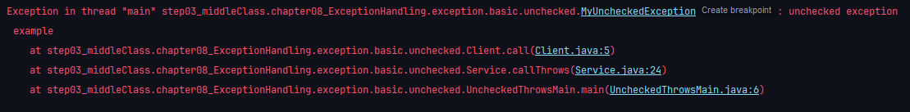

[코드 위치](../../src/step03_middleClass/chapter08_ExceptionHandling) 

# I. 예외 처리가 필요한 이유
## A. 예제 프로그램
- 목적: 사용자의 입력을 받아 입력받은 문자를 외부 서버에 전송하는 프로그램
- 제한 
  - 실제 네트워크 처리는 포함하지 않음
  - `connect()`를 우선 호출
  - `connect()`가 실패하면 `send(data)` 불가
  - 전송이 완료되거나 오류 등으로 사용을 끝낼 때 `disconnect()`로 반드시 연결 종료
- 프로그램 구성도

  - `NetworkClient`: 외부 서버와 연결하고, 데이터를 전송하고, 연결을 종료하는 기능
  - `NetworkService`: `NetworkClient`를 사용해 데이터를 전송. 연결, 전송, 연결 종료와 같은 흐름을 제어
  - `Main`: 사용자의 입력을 받음
- workflow: 
  - `Main`에서 사용자의 입력을 받아 `NetworkService`에 전달
  - `NetworkService`는 `NetworkClient`를 사용해 외부 서버와 연결, 데이트 전달, 연결 종료를 진행
- NetworkService 예시 코드: [여기](../../src/step03_middleClass/chapter08_ExceptionHandling/example01_firstModule)
- 실행 예시
```
전송할 문자(종료:exit): hello
http://example.com 서버에 연결 성공
http://example.com 서버에 데이터 전송: hello
http://example.com 서버 연결 해제

전송할 문자(종료:exit): exit
프로그램을 정상 종료합니다. 
```
- 이후 점진적으로 발전 시켜나갈 예정
## B. 오류상황 만들기
- 외부 서버와 통신시 예상가능한 문제
  - 외부 서버와 연결에 실패
    - 네트워크 오류
    - 물리적 장비 오류
    - 기타 사유
  - 데이터 전송에 문제가 발생한다
    - 일시적 이상
    - 데이터 연동 실패 
    - 수신 측 에러
    - 데이터 이상 등등
- 오류상황을 위한 시뮬레이션
  - 연결 실패: 사용자 입력 문자에 "error1"이 있으면 연결에 실패. 오류코드는 "connectError"
  - 전송 실패: 사용자 입력 문자에 "error2"가 있으면 데이터 전송에실패. 오류 코드는 "sendError"
- 코드: [여기](../../src/step03_middleClass/chapter08_ExceptionHandling/example02_occurredError)
  - 에러 확인만 가능
  - 오류사항
    - 에러발생시 이후 과정이 멈춰야함
  - 추가 요구사항
    - 오류 발생시 오류에 대한 로그를 남겨야함
## C. 반환값으로 예외처리
- 요구사항
  - 연결 실패시 데이터 전송을 진행하면 안됨
  - 오류 로그를 남겨야함
- 코드: [여기](../../src/step03_middleClass/chapter08_ExceptionHandling/example03_useReturnValue)
  - 로그를 남기고 return으로 빠져나가게 함
- 팁
  - 조건문을 복잡하게 하기보다 메서드로 분리가 좋음
```java
    private boolean isError(String resultMessage){
        return !resultMessage.equals(NetworkStatus.SUCCESS.getStatusName());
    }
```
- 오류사항
  - 어떠한 경우에도 `disconnect()`로 연결 종료가 일어나야하나 안됨
    - error1은 연결이 안됐으니(그래도 disconnect해야 함) 그렇다 쳐도 error2는 연결이 된상황에서 네트워크 자원을 계속 소모한다
    - 자바 내부의 연결(인스턴스 연결 등)은 JVM의 GC가 사용하지 않는 연결을 해제하고 제거하지만 자바 외부 연결에는 접근할 수없다.
    - 자원 누수가 계속 일어나면 서버가 멈춰 리셋해야하는 경우가 많다. 
  - return으로 중단시키지 않고 조건문을 중첩해서 사용
```java
    client.initError(data);
    String connectResult = client.connect();
    if(isError(connectResult)) {
        System.out.println("[네트워크 오류 발생] 오류코드("+NetworkStatus.FAIL_CONNECTED.getStatusName()+"): "+NetworkStatus.FAIL_CONNECTED.getStatusName());
    }else {
        String sendResult = client.send(data);
        if(isError(sendResult)) {
            System.out.println("[네트워크 오류 발생] 오류코드("+NetworkStatus.FAIL_SEND.getStatusName()+"): "+NetworkStatus.FAIL_SEND.getStatusName());
        }
    }
    client.disconnect();
```
## D. 정상흐름과 예외흐름
- 현재 코드는 정상흐름과 예외 흐름이 분리되어있지 않다.
  - 흐름이 분리되지 않은 코드는 복잡한 비즈니스 코드에 적용되면 가독성을 낮추고 혼란을 만든다. 
  - 가장 중요한 것이 정상흐름이지만 갈수록 예외처리는 더 복잡해지기 마련이다. 
- 정상흐름
```java
client.initError(data);
client.connect();
client.send(data);
client.disconnect();
```
- 오류흐름
```java
client.initError(data);
String connectResult = client.connect();
if(isError(connectResult)) {
    System.out.println("[네트워크 오류 발생] 오류코드("+NetworkStatus.FAIL_CONNECTED.getStatusName()+"): "+NetworkStatus.FAIL_CONNECTED.getStatusName());
}
else{
    String sendResult = client.send(data);
    if(isError(sendResult)) {
        System.out.println("[네트워크 오류 발생] 오류코드("+NetworkStatus.FAIL_SEND.getStatusName()+"): "+NetworkStatus.FAIL_SEND.getStatusName());
    }
}
client.disconnect();
```
- 이러한 예외를 자바에서는 어떻게 예외를 처리하고 있는지 알아보자
# II. 자바의 예외처리 
- 자바는 프로그램 실행 중에 발생할 수 있는 예외(Exception)를 처리하기 위한 메커니즘을 제공한다
- 관련 키워드
  - `try`, `catch`, `finally`, `throw`, `throws`
- 예외 계층

  - Error: Application layer에서 다룰 수 없는 복구 불가한 시스템 예외. 애플리케이션 개발자의 영역이 아님
    - 메모리 부족이나 심각한 시스템 오류 등
  - Exception: 애플리케시연 로직에서 사용할 수 있는 실질적인 최상위 예외
    - 컴파일러가 체크하는 예외들이 주를 이룸
      - children: SQLException, IOException
    - RuntimeException: Exception 소속 중 언체크 예외
      - 실행 중 예외이므로 컴파일 시기에는 감지되지 않는다 
      - children: NullPointerException, IllegalArgumentException
  - 예외 처리를 할때도 상위 예외는 하위 예외를 포함하므로 개별 처리가 필요한 경우 하위 예외를 먼저 처리하고 최상위인 Exception으로 처리
  - 단, Throwable은 Error까지 다루기때문에 Application layer를 다루는 개발자의 범위를 넘어선다. 따라서 Exception이 사실상 최상위 예외 객체라 이해하면 된다 
## A. 예외 기본 규칙
- 예외 처리는 폭탄 돌리기와 같다.
- 발생한 예외를 직접 처리하거나 밖으로 던져야 한다. 
  - Client에서 예외가 발생했다면 그곳에서 처리하거나 그 인스턴스를 사용하는 곳으로 예외를 던져야한다. 
  - Client가 Service로 예외를 던졌다면 마찬가지로 Service에서 예외를 처리하거나 그 인스턴스를 사용하는 Main으로 던져야한다.
  - 예외를 처리했다면 그 이후에는 정상흐름을 반환한다. 
  - 예외를 처리하지 못하면 전체 애플리케이션이 중단된다. 
- 기본 규칙
  - 잡아서 처리하거나 밖으로 던지거나
  - 그 예외의 자식들도 함께 처리할 수 있다. 
    - Exception을 처리하도록 해놓으면 그 하위인 SQLException, IOException, RuntimeException 모두 처리할 수 있다. 
    - 던지는 것도 마찬가지
  - java에서 `public static void main()` 밖으로 예외를 던지면 예외 로그를 출력하면서 시스템이 종료된다. 
## B. 체크 예외 - Compile time
- 체크 예외를 처리(catch or throw)하지않으면 컴파일 오류가 발생
- Exception 상속 = 체크 예외
```java
public class CheckedException extends Exception{
  public MyCheckedException(String message){
    //부모(Exception)가 message를 보관해 관련 기능들을 사용
      super(message);
  }
}
```
### 1. 예외 발생시키기
- `throw new 예외객체()`;
  - 예외도 객체이므로 `new`를 사용해 생성자를 호출한다. 이때 사전에 지정한 매개변수를 사용할 수 있다
### 2. 예외 던지기
- `... methodName() throws 예외클래스`{ `코드블럭...` }
  - 지정한 범위의 예외를 처리.
  - 실질적 최상위 예외 객체인 `Exception`을 사용하면 하위 예외 객체들도 함께 처리할 수 있다.
  ```java
  public void call() throws MyCheckedException/*예외 던지기*/{
      //예외 상황
      throw new MyCheckedException("example");//새로운 예외 발생하는 코드
  }
  ```
- 외부에서 받은 예외 던지기
```java
/**
 * throw MyCheckedException
 * @throws MyCheckedException
 */
public void callThrows() throws MyCheckedException{
    client.call();
}
```
- [실습코드](../../src/step03_middleClass/chapter08_ExceptionHandling/exception/basic/checked/CheckedThrowsMain.java)
  - 예외를 main() 외부로 예외를 던지면 에러 메세지, 콜스텍 리스트가 출력됨(exceptionObject.printStackTrace())

### 3. 예외 잡기 
- 다양한 구문이 존재하므로 필요에따라 선택 처리
  - `try-catch-finally`
  - `try` 구문 내에 예외 발생 가능성(`throws` 포함)이 있는 코드를 위치
  - 예외가 발생하면 `catch` 구문으로 이동해 처리
    - 해당 예외에 포함되지 않는 예외는 컴파일 단계에서 체크됨
    - 하위 예외부터 상위 예외 순으로 catch문 작성
    - 따로 예외 처리를 다르게 하지 않는 경우 그냥 상위에서 처리해 코드 길이를 줄이는 것 검토
  - 정상 흐름이 종료되고 반드시 처리할 내용이 있다면 `finally` 구문 작성
    - 정상, 예외 흐름 관계없이 반드시 수행
    - optional
```java
    /**
     * catch MyCheckedException
     */
    public void callCatch(){
        try{
            client.call();//예외 발생 가능성 있는 코드
        }
        catch (MyCheckedException me){// 더 좁은 범위의 예외처리를 별도로 할 경우
          System.out.println("예외: "+me.getMessage());
        }
        catch(Exception e){// 사실상 최상위 예외 객체(개별 처리 외의 예외)
            e.printStackTrace();//예시
        }
        finally {//선택사항
            client.close();//반드시 수행해야할 기능이 있다면 이곳에서 수행
        }
    }
```
### 4. 실습
- [실습](../../src/step03_middleClass/chapter08_ExceptionHandling/exception/basic/checked/CheckedCatchMain.java)
```
예외 처리, message: example
정상 흐름
정상 종료
```
### 5. 정리
- 체크 예외는 처리하거나 던지거나 하는 예외 처리를 개발자가 직접 명시적으로 표시해야한다. 
- Exception을 상속한 예외는 모두 이 과정이 필수
- 호출하는 곳의 예외 처리 범위는 던지는 곳의 예외 처리를 포함해야한다.
  - 작거나 다른 예외처리만 하는 경우 컴파일러 에러
- 장단점: 예외를 반드시 처리해야만 컴파일러의 체크를 통과할 수 있다. 
  - 장점: 개발자가 실수로 에러를 누락하지 않도록 컴파일러를 사용해 잡아주는 안전장치
  - 단점: 번거로움. 크게 신경쓰고 싶지 않은 예외까지 처리해야함.

## C. 런타임 예외
- RuntimeException과 그 하위 예외는 언체크 예외로 분류된다.
- 체크 예외와의 차이는 throws를 생략해도 자동으로 예외를 밖으로 던진다.
```java
public class MyUncheckedException extends RuntimeException {
    public MyUncheckedException(String message) {
        super(message);
    }
}
```
### 1. 발생
- `throws`나 `try-catch` 없이도 사용 
```java
public void call(){
    throw new RuntimeException();
}
```
### 2. 잡기
- 방식은 같음
```java
public void callCatch(){
    try{
        client.call();
    }
    catch(MyUncheckedException mue){
        System.out.println("에러 메세지] "+mue.getMessage());
    }
    catch(Exception e){
        e.printStackTrace();
    }
    finally {
        client.close();
    }
}
```
### 3. 던지기
- `throws` 구문이 없어도 예외를 밖으로 던지기때문에 컴파일 에러가 발생하지 않는다
- `main()`도 마찬가지
```java
public void callThrows(){
    client.call();
}
```

- 다만 다른 개발자가 인지할 수 있도록 `throws 예외클래스`를 명시하는 것도 좋다.
  - 생략해도 된다...
  - 사람마다 다름
### 4. 정리
- 장단점: 
  - 장점: `throws 예외클래스`를 생략할 수 있어 편리
  - 단점: 개발자가 실수로 누락할 수 있다
- 체크 예외와의 차이는 예외를 처리할 수 없을때 던지는 구문을 생략할수 있다는 점.
  - 필요와 중요도에 따라 택1... 
  - 안정성 vs 편의성
    - 현대 애플리케이션 개발의 흐름은 checked Exception을 거의 사용하지 않음.
    - 설명은 이후에
# III. 예외처리 도입하기
- 해결할 문제
  - java의 Exception 기능 사용 필요
  - 예제 코드는 간단한 예외 흐름임에도 정상 흐름보다 더 많은 코드 분량을 차지함
    - 실제과정에서는 예외의 종류와 처리가 더 복잡함
    - 정상 흐름과 예외 흐름을 분리해 정상흐름에 대한 가독성 향상 필요
## A. checked exception 적용하기
- [실습코드](../../src/step03_middleClass/chapter08_ExceptionHandling/example04_checkedException)
- 기존과 거의 유사하지만 오류가 발생했을때 오류 코드가 아닌 예외를 던진다.
  - 따라서 반환값이 필요없음 없음  => `void`로 처리해도 됨 
  - 오류가 발생하면 예외객체를 생성해 외부로 던짐
    - `throw new 예외객체(...)`
```java
    //public methods
    public void connect() throws NetworkClientException {
        if(connectError){
            //연결 실패
            throw new NetworkClientException(String.valueOf(NetworkStatus.FAIL_CONNECTED.getStatusCode()),address+" 서버 연결 실패: "+NetworkStatus.FAIL_CONNECTED.getStatusName());
        }
        //연결 성공
        System.out.println(address+" 서버에 연결 성공");
//        return NetworkStatus.SUCCESS.getStatusName();
    }
    public void send(Object data) throws NetworkClientException {
        if(sendError){
            //전송 실패
            throw new NetworkClientException(String.valueOf(NetworkStatus.FAIL_SEND.getStatusCode()), address+" 서버에 데이터 전송 실패: "+NetworkStatus.FAIL_SEND.getStatusName());
        }
        //전송 성공
        System.out.println(address+" 서버에 데이터 전송: "+data.toString());
//        return NetworkStatus.SUCCESS.getStatusName();
    }
```
- 호출 하는 곳에서 일단 던지기
  ```java
    public void sendMessage(String data) throws NetworkClientException {
        String address = "http://example.com";
        NetworkClient client = new NetworkClient(address);

        client.initError(data);
        client.connect();
        client.send(data);
        client.disconnect();
    }
  ```
- 남은 문제
  - 예제 코드는 간단한 예외 흐름임에도 정상 흐름보다 더 많은 코드 분량을 차지함
    - 실제과정에서는 예외의 종류와 처리가 더 복잡함
    - 정상 흐름과 예외 흐름을 분리해 정상흐름에 대한 가독성 향상 필요
  - 예외 처리는 되지만 정상 흐름으로 복귀하지 못하고 프로그램이 종료된다.
    - 예외 복구
  - 사용 후에는 반드시 `disconnect()`를 호출해 외부 연결을 해제해야한다.
    - 외부 리소스 누수 문제 해결
## B. 예외 복구
- try-catch 구문으로 예외처리시 지정한 코드블럭을 실행하고 정상 흐름으로 진행
```java
public void sendMessage(String data) {
    String address = "http://example.com";
    NetworkClient client = new NetworkClient(address);

    client.initError(data);
    try {
        client.connect();
    } catch (NetworkClientException ne) {
        System.out.println("[오류] 코드: "+ne.getErrorCode()+"/ 메세지: "+ne.getMessage());
        return;
    }
    try {
        client.send(data);
    } catch (NetworkClientException ne) {
      System.out.println("[오류] 코드: "+ne.getErrorCode()+"/ 메세지: "+ne.getMessage());
      return;
    }
    client.disconnect();
}
```
- 결과
```
전송할 문자(종료:exit): hello
http://example.com 서버에 연결 성공
http://example.com 서버에 데이터 전송: hello
http://example.com 서버 연결 해제

전송할 문자(종료:exit): error1
[오류] 코드: 500/ 메세지: http://example.com 서버 연결 실패: connectError

전송할 문자(종료:exit): error2
http://example.com 서버에 연결 성공
[오류] 코드: 400/ 메세지: http://example.com 서버에 데이터 전송 실패: sendError

전송할 문자(종료:exit): exit
프로그램을 정상 종료합니다. 
```
- 정상, 예외 흐름 분리
  - 정상흐름이 잘 보이도록 한곳에서 처리 
  - 좁은 범위의 예외부터 하나씩 catch 실행
```java
    public void sendMessage(String data) {
        String address = "http://example.com";
        NetworkClient client = new NetworkClient(address);
        client.initError(data);
        try {
            // 정상 흐름 정리
            client.connect();
            client.send(data);
            client.disconnect();
        } 
        //예외 흐름 정리
        catch (NetworkClientException ne) {
            System.out.println("[오류] 코드: "+ne.getErrorCode()+"/ 메세지: "+ne.getMessage());
            return;
        } 
        catch (Exception e) {
            e.printStackTrace();
            return;
        }
```
- 실행결과
```
전송할 문자(종료:exit): hello
http://example.com 서버에 연결 성공
http://example.com 서버에 데이터 전송: hello
http://example.com 서버 연결 해제

전송할 문자(종료:exit): error1
[오류] 코드: 500/ 메세지: http://example.com 서버 연결 실패: connectError

전송할 문자(종료:exit): error2
http://example.com 서버에 연결 성공
[오류] 코드: 400/ 메세지: http://example.com 서버에 데이터 전송 실패: sendError

전송할 문자(종료:exit): exit
프로그램을 정상 종료합니다. 
```
- 남은 문제
  - ~~예제 코드는 간단한 예외 흐름임에도 정상 흐름보다 더 많은 코드 분량을 차지함~~
    - ~~실제과정에서는 예외의 종류와 처리가 더 복잡함~~
    - ~~정상 흐름과 예외 흐름을 분리해 정상흐름에 대한 가독성 향상 필요~~
  - ~~예외 처리는 되지만 정상 흐름으로 복귀하지 못하고 프로그램이 종료된다.~~
    - ~~예외 복구~~
  - 사용 후에는 반드시 `disconnect()`를 호출해 외부 연결을 해제해야한다.
    - 외부 리소스 누수 문제
## C. finally
### 1. 리소스 반환 문제
- JVM GC의 메모리 관리의 영향 밖 외부 자원 관리 필요
- if문 처럼 `try-catch` 이후 배치하면 되지않을까?
```java
try {
    client.connect();
    client.send(data);
} 
catch (NetworkClientException ne) {
    System.out.println("[오류] 코드: "+ne.getErrorCode()+"/ 메세지: "+ne.getMessage());
} 
client.disconnect();
```
- catch로 처리한 예외가 아닌 경우 정상흐름으로 복귀하지 못하므로 disconnect() 불가
```java
try {
    client.connect();
    client.send(data);
} catch (NetworkClientException ne) {
    throw new RuntimeException("ex");// another exception...
//    System.out.println("[오류] 코드: "+ne.getErrorCode()+"/ 메세지: "+ne.getMessage());
} 
// 여기까지 닿지 않기 때문에 외부 리소스 연결이 계속 유지되고 있음
client.disconnect();
```
### 2. finally {...} 사용
- 정상/예외 흐름 관계없이 반드시 예외 처리 후 진행하는 코드블럭
```java
    public void sendMessage(String data) {
        String address = "http://example.com";
        NetworkClient client = new NetworkClient(address);
        client.initError(data);
        try {
            client.connect();
            client.send(data);
        }
        catch (NetworkClientException ne) {
            throw new RuntimeException("ex");// 예외 체크용일뿐 확인 후 삭제
//            System.out.println("[오류] 코드: "+ne.getErrorCode()+"/ 메세지: "+ne.getMessage());
        }
        finally {
            client.disconnect();

        }
    }
```
```
http://example.com 서버에 연결 성공
http://example.com 서버 연결 해제
Exception in thread "main" java.lang.RuntimeException: ex
	at step03_middleClass.chapter08_ExceptionHandling.example04_checkedException.NetworkServiceV4.sendMessage(NetworkServiceV4.java:16)
	at step03_middleClass.chapter08_ExceptionHandling.example04_checkedException.NetworkMain.main(NetworkMain.java:22)
```
- catch를 여러개를 사용해도 finally 사용가능
```java
public void sendMessage(String data) {
    String address = "http://example.com";
    NetworkClient client = new NetworkClient(address);
    client.initError(data);
    try {
        client.connect();
        client.send(data);
    } catch (NetworkClientException ne) {
//            throw new RuntimeException("ex");// 예외 체크용일뿐 확인 후 삭제
        System.out.println("[오류] 코드: " + ne.getErrorCode() + "/ 메세지: " + ne.getMessage());
    } catch (RuntimeException re) {
        System.out.println(re.getMessage());
    } catch (Exception e) {
        e.printStackTrace();
    } finally {
        client.disconnect();
    }
}
```
# IV. 예외 계층
- 단순히 `Exception`을 각각 상속받기보다 예외를 계층화하여 더 세밀하게 예외를 처리할 수 있다. 
- 예외를 계층화하면 
  - 유사 계열의 예외를 부모 예외에 포함시켜 잡을 수 있어 같은 처리를 하는 유사 예외를 묶어서 처리할 수 있다.
  - 특정한 예외만 따로 처리 과정을 진행할 경우 하위 예외를 사용해 처리한다. 

## A. 적용
- 예시 구조
  - NetworkClientException
    - ConnectException: 예외 발생시 연결 시도한 서버 주소 보관
      - `String address`
    - SendException: 예외 발생시 전송 시도한 데이터 보관
      -` String sendData`
- 상위 예외에서 생성자가 parameter 필수(RequiredArgsConstructor)
```java
public class ConnectException extends NetworkClientException{
    private final String address;
    public ConnectException(String address, String message) {
        super(message);
        this.address = address;
    }
    public String getAddress() {
        return address;
    }
}
public class SendException extends NetworkClientException {
  private final String sendData;
  public SendException(String sendData, String message) {
    super(message);
    this.sendData = sendData;
  }
  public String getSendData() {
    return sendData;
  }
}
```
- try-catch
```java
public void sendMessage(String data) {
    String address = "http://example.com";
    NetworkClient client = new NetworkClient(address);
    client.initError(data);
    try {
        client.connect();
        client.send(data);
    } catch (ConnectException e) {
        System.out.println("[연결 오류] 코드: " + e.getStatusCode() + "/ 서버: " + e.getAddress() + "/ 메세지: " + e.getMessage());
    } catch (SendException e) {
        System.out.println("[전송 오류] 코드: " + e.getStatusCode() + "/ 전송 데이터: " + e.getSendData() + " 메세지: " + e.getMessage());
    } catch (Exception e) {
        e.printStackTrace();
    } finally {
        client.disconnect();
    }
}
```
- [코드](../../src/step03_middleClass/chapter08_ExceptionHandling/example05_exceptionLayer)
```
전송할 문자(종료:exit): error1
[연결 오류] 코드: 500/ 서버: http://example.com/ 메세지: http://example.com 서버 연결 실패: connectError
http://example.com 서버 연결 해제

전송할 문자(종료:exit): error2
http://example.com 서버에 연결 성공
[전송 오류] 코드: 400/ 전송 데이터: error2 메세지: http://example.com 서버에 데이터 전송 실패: sendError
http://example.com 서버 연결 해제
```
## B. 예외가 더 많으면?
- 모든 예외를 하나하나 `catch`로 잡는 것은 상당히 번거롭다
  - 연결 오류의 가중치가 가장 높다고 가정, 명확하게 인식하도록 한다
    - `[연결 오류] 주소: ...`
  - 기타 다른 네트워크 오류는 하나로 표시
    - `[네트워크 오류] 메시지: ...`
  - 네트워크 외 다른 예외
    - `[알 수 없는 오류] 메시지: ...`
- `try-catch`를 사용할때 좁은 범위 > 넓은 범위 순으로
  - `ConnectException`보다 `NetworkClientException`이 먼저 작성되면 이미 하위 예외가 처리가 되었기때문에 `ConnectionException`의 처리 코드에 닿을 수 없다
  ```java
    catch (NetworkClientException e) {
        System.out.println("[네트워크 오류] 메시지: "+...);
    }
    catch (ConnectException e) {
        System.out.println("[연결 오류] 메시지: "+...);
    }
  ```
  - 같은 부모를 상속받은 여러 예외를 같은 방식으로 처리할 경우 `|`(또는)로 처리
  ```java
      catch(SendException|AnotherNetworkException e) {
          e.printStackTrace();
      }
  ```
- [코드](../../src/step03_middleClass/chapter08_ExceptionHandling/example06_lotsOfException)
```java
try {
    client.connect();
    client.send(data);
}
catch (ConnectException e) {
    System.out.println("[연결 오류] 코드: "+e.getStatusCode()+"/ 서버: "+e.getAddress()+"/ 메시지: "+e.getMessage());
}
catch(SendException|AnotherNetworkException e) {
    e.printStackTrace();
}
catch (NetworkClientException e) {
    System.out.println("[네트워크 오류] 코드: "+e.getStatusCode()+" 메시지: "+e.getMessage());
}
catch (Exception e) {
    System.out.println("[알 수 없는 오류] 에러 클래스: "+e.getClass().getName()+" 메시지: "+e.getMessage());
}
finally {
    client.disconnect();
}
```
```
전송할 문자(종료:exit): hello
http://example.com 서버에 연결 성공
http://example.com 서버에 데이터 전송: hello
http://example.com 서버 연결 해제

전송할 문자(종료:exit): error1
[연결 오류] 코드: 500/ 서버: http://example.com/ 메시지: http://example.com 서버 연결 실패: connectError
http://example.com 서버 연결 해제

전송할 문자(종료:exit): error2
http://example.com 서버에 연결 성공
http://example.com 서버 연결 해제
step03_middleClass.chapter08_ExceptionHandling.example06_lotsOfException.exception.SendException: http://example.com 서버에 데이터 전송 실패: sendError
...

전송할 문자(종료:exit): error3
http://example.com 서버에 연결 성공
[알 수 없는 오류] 에러 클래스: java.lang.RuntimeException 메시지: error3 occurred
http://example.com 서버 연결 해제

전송할 문자(종료:exit): error4
http://example.com 서버 연결 해제
step03_middleClass.chapter08_ExceptionHandling.example06_lotsOfException.exception.AnotherNetworkException: http://example.com 서버 연결 실패: connectError
...

전송할 문자(종료:exit): exit
프로그램을 정상 종료합니다. 
```
# V. 실무에서 예외처리 방안
## A. 설명
- 처리할 수 없는 예외: 
  - 시스템 예외: 애플리케이션 범위를 넘어선 시스템 예외가 일시적인경우 일정 횟수는 정상 흐름으로 이어가 재시도
    - 일정 횟수 이상이라면 이상을 안내하고 시스템을 종료
  - 네트워크 예외: 타 서버, DB 서버 등 애플리케이션 내에서 처리할 수 없는 경우 예외를 확인해 정상흐름으로 넘겨 재시도 해도 계속 같은 예외가 발생할 수 있다. 
    - 이 경우 고객에게 시스템 이상을 알리고 더이상 재시도를 하지 않도록 멈추도록 빠르게 안내하는 것이 좋을 수 있다
    - 또한 개발자에게 로그를 남겨야함
- 체크 예외(checked Exception)의 부담
  - 개발자의 실수, 누락을 확인할 수 있는 장점은 있으나
  - 너무 많은 예외의 발생으로 업무가 과중해진다.
    - 처리할 수 없는 예외가 많아지고 프로그램이 점점 복잡해지면서 체크 예외를 사용하는 것이 점점 더 부담스러워진다
  - 처리할 수 없는 경우: catch가 의미가 있나?
 

  ```java
    try{
  //    ...
    }
    catch(){}
    catch(){}
    catch(){}
    catch(){}
  //    ...
  ```
  - 던지는 경우: method 단에서 긴 예외 목록을? 굳이 안써도 예외를 던지는 unchecked exception과 비교..
  ```java
  void method() throws NetworkClientException, DatabaseException, ConnectUserException, RuntimeException {
    //...
  }
  ```
  - `throws Exception`의 문제: 최상위 예외 객체를 던지면 개별 처리가 필요한 예외까지 모두 던져버림
- 본인이 해결할 수 있는 예외만 잡아서 처리하고 해결할 수 없는 예외는 신경쓰지 않는다
  - 필요할때만 `try-catch`로 잡아서 처리
  - 만약 공통으로 처리할 경우 한 곳(부모/패키지)으로 모아 예외를 공통으로 처리한다
## B. Unchecked Exception 구현하기
- unchecked Exception + 공통 처리 
- unchecked exception: RuntimeException 상속
- 해결할 수 없는 에러인 경우 알아서 `throws`
  - Service 단에서 처리하던 이전과 달리 전체 로직이 모이는 곳에서 공통적으로 처리
  - 그냥 main method 외부로 내보낼 경우 시스템이 멈추기때문에 이를 방지하기 위함
  -  
- [코드](../../src/step03_middleClass/chapter08_ExceptionHandling/example07_uncheckedException)
```java
while(true) {
    System.out.print("전송할 문자(종료:exit): ");
    String input = scanner.nextLine();
    if(input.equalsIgnoreCase("exit")) {
        break;
    }
    try{
        networkService.sendMessage(input);
        System.out.println();
    }
    catch(Exception e){
        //공통 예외 처리
        exceptionHandler(e);
    }
}
System.out.println("프로그램을 정상 종료합니다. ");

/**
 * 공통 예외 처리
 * @param e Exception object
 */
private static void exceptionHandler(Exception e) {
  System.out.println("사용자 메시지: 죄송합니다. 알 수 없는 문제가 발생했습니다");
  System.out.println("==== 개발자용 디버깅 메시지 ====");
  e.printStackTrace(System.out);
}
```
- 예외별로 별도로 처리하는 경우
  - 사용자(client)가 시스템 내의 자세한 오류 정보를 알 필요는 없다.
    - 이후 조치사항이나 문의처, 연락망을 전달하거나 안내문을 표시하는 것이 좋다.
  - 디테일한 정보는 개발자가 알면 된다. 
```java
private static void exceptionHandler(Exception e) {
    System.out.println("사용자 메시지: 죄송합니다. 알 수 없는 문제가 발생했습니다");
    System.out.println("==== 개발자용 디버깅 메시지 ====");
    if(e instanceof SendException sendException) {
        System.out.println("[전송 오류] 코드: "+sendException.getStatusCode()+"/ data: "+sendException.getSendData()+"/ 메시지: "+sendException.getMessage());
    }
    else if(e instanceof AnotherNetworkException anotherNetworkException | e instanceof ConnectException connectException) {
        System.out.println("[연결 오류] 코드: "+e.getClass().getName()+" / 메시지: "+e.getMessage());
    }
    else if(e instanceof NetworkClientException networkClientException) {
        System.out.println("[네트워크 오류] 코드: "+networkClientException.getStatusCode()+" 메시지: "+e.getMessage());
    }
    else{
        System.out.println("[알 수 없는 오류] 에러 클래스: "+e.getClass().getName()+" 메시지: "+e.getMessage());
    }
    e.printStackTrace(System.out);//표준 출력으로 표시
}
```
- `printStackTrace()`: 
  - default: `printStackTrace(System.err)`를 사용해 CLI 창에서 빨간색으로 표시
  - 매개변수로 `System.out` 사용시: 표준 출력 처리로 일반 구문 색과 동일하게 표시
  - 실무에서는 콘솔에 출력하기보다 로그 관리 라이브러리(`Slf4j`, `logback`)를 사용해 콘솔과 로그 기록 파일에 함께 처리한다.
  - 프로젝트에서 지정한 라이브러리를 사용하도록한다

# VI. try-with-resource
- 반드시 호출해야하는 마지막 과정이 있는 경우 `try-catch-finally` 구문으로 처리
  - ex) 외부자원 연결 종료, 네트워크 연결 종료, 스트림 닫기 등
  - 외부 라이브러리나 네트워크 연결의 사용이 많아지면서 이를 위한 편의 기능을 java7에서 도입됬다
    - Try with resources
- Java 7에서 추가된 인터페이스
```java
public interface AutoCloseable{
    void close() throws Exception;
}
```
- 사용하기
1. AutoCloseable interface 구현
```java
public class NetworkClient implements AutoCloseable {
  //...
  @Override
  public void close() {// 보통 예외를 던지지 않기때문에 throws Exception 제거
    System.out.println("NetworkClient close");
    disconnect();
  }
}
```
2. try with Resource 구문 사용
- try 문이 종료되면 자동 적용 
  - try 스코프를 넘어가는 순간 바로 AutoCloseable.close() 바로 호출 > 그 후 catch 문
```java
public void sendMessage(String data) {
  String address = "http://example.com";
//  try(Resource resource = new Resource()){...}
  try(NetworkClient client = new NetworkClient(address)) {
    client.initError(data);
    client.connect();
    client.send(data);
  }catch(Exception e) {
    System.out.println("catch!! "+e.getMessage());
  }
}
```
- [코드](../../src/step03_middleClass/chapter08_ExceptionHandling/example08_tryWithRescources)
```
전송할 문자(종료:exit): hello
http://example.com 서버에 연결 성공
http://example.com 서버에 데이터 전송: hello
NetworkClient close
http://example.com 서버 연결 해제

전송할 문자(종료:exit): error1
NetworkClient close
http://example.com 서버 연결 해제
catch!! http://example.com 서버 연결 실패: connectError

전송할 문자(종료:exit): error2
http://example.com 서버에 연결 성공
NetworkClient close
http://example.com 서버 연결 해제
catch!! http://example.com 서버에 데이터 전송 실패: sendError

전송할 문자(종료:exit): error3
http://example.com 서버에 연결 성공
NetworkClient close
http://example.com 서버 연결 해제
catch!! error3 occurred

전송할 문자(종료:exit): error4
NetworkClient close
http://example.com 서버 연결 해제
catch!! http://example.com 서버 연결 실패: connectError

전송할 문자(종료:exit): exit
프로그램을 정상 종료합니다. 
```
- 장점
  - 리소스 누수 방지: `finally` 없이도 반드시 리소스를 종료시킴
  - 코드 간결성 및 가독성 향상: 직접 `close()`를 명시적으로 작성하지 않아도 됨
  - 스코프 범위 한정: 리소스를 `try{}` 스코프에서만 사용
  - 조금 더 빠른 자원해제: `try-catch-finally`는 `finally`에서야 처리하지만 `Try with resources`는 try 구문 종료와 함께 처리

# VII. 마치며
- 예외처리는 따로 문제를 갖기보다 Network 관련 모듈의 변화를 복습해 큰 흐름을 기억하는 것이 더 좋다. 
- 초기 자바에서는 체크 예외를 기본으로 사용했으나 갈수록 언체크 예외가 주가되었다.
- Spring, JPA 등 최근 라이브러리에서도 이러한 경향을 기억하자.