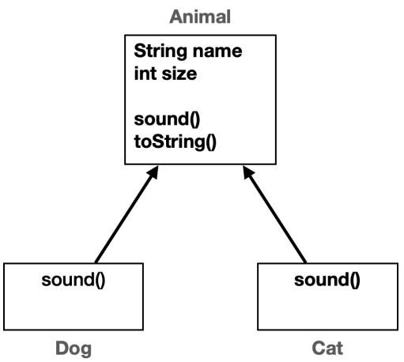

[실습코드](../../src/step04_middleClass2/chapter01_Generic)

# I. 제네릭이 필요한 이유
- 최근 프로그래밍 언어에서는 Generic 개념을 제공 중
- 왜 필요한지부터 단계적으로 알아가보자
## A. 다른 유형 같은 로직
- 사용하는 참조형(객체 타입)은 다르지만 로직은 같은 상황
```java
public static void main(String[] args) {
    IntegerBox intBox = new IntegerBox();
    intBox.set(10);
    Integer integer = intBox.get();
    System.out.println("integer = " + integer);

    StringBox stringBox = new StringBox();
    stringBox.set("hello");
    String string = stringBox.get();
    System.out.println("string = " + string);
}
```
- 문제: `DoubleBox`, `BooleanBox`... 타입이 추가될때마다 새로 만들어지는 클래스... 

## B. 다형성으로 해결 시도
- Object class를 사용하면 되지 않을까?
```java
public class ObjectBox {
    private Object value;
    public void set(Object value) {
        this.value = value;
    }
    public Object get() {
        return value;
    }
}
```
- 해결?
```java
ObjectBox objectBox = new ObjectBox();
objectBox.set(10);
Object object = objectBox.get();
Integer integerObj = (Integer) object;// Object -> Integer 캐스팅
System.out.println("integerObj = " + integerObj);
objectBox.set("no Integer");
System.out.println("stringObj= " + (String)objectBox.get());// Object -> String 캐스팅
```
- `Integer`를 사용할 곳에서 실수로 문자열을 넣는 경우... Integer를 위한 처리가 에러를 발생시킴
  - 혼자, 짧은 코딩은 문제가 되지 않음
    - 협업하는 곳에서 여러 개발자가 사용하는 경우 
    - 긴 코드 가운데 발생하는 실수 등
```java
public static void main(String[] args) {
    ObjectBox integerBox2 = new ObjectBox();
    integerBox2.set("아차차");
    Integer integer2 = (Integer) integerBox2.get();// Error!@!  java.lang.ClassCastException
    System.out.println("integer2 = " + integer2);

    ObjectBox stringBox2 = new ObjectBox();
    stringBox2.set(123);
    boolean checked = ((String)stringBox2.get()).equals("aaa");
    System.out.println("is aaa? " + checked);
}
```
- 다형적 참조를 통해
  - 코드 중복 제거
  - 재사용성 증가
- but 타입 안정성이 불안정해진다.
  - 타입 안정성 vs 코드 재사용성
- 둘 다 고려는 못하는 걸까?
## C. Generic 적용하기
- <>를 사용한 클래스를 제네릭 클래스라 한다. 보통 `다이아몬드`라 읽는다
- 제네릭 클래스를 정의하는 곳에서는 타입을 지정하지 않는다. 
- 클래스의 인스턴스를 생성할 때 타입을 지정하고 그외의 타입을 받지 않도록해 타입 안정성과 코드 재사용성을 함께 만족시킨다
  - 참조형만 가능. 기본형은 Wrapper class 
  - 각 유형별 코드를 생성하는 것이 아닌 T를 가정한 뒤 실제 인스턴스 처리시 타입 정보를 반영
  - 실제 처리과정은 후반부에서
- 정의하기
```java
public class GenericBox<T> {//생성시 지정될 타입을 T로 표시
    private T value;
    public void set (T value) {
        this.value = value;
    }
    public T get () {
        return value;
    }
}
```
- 생성하기
  - 인스턴스를 생성할 때 지정한 타입과 다른 값을 전달하면 컴파일 오류
```java
    public static void main(String[] args) {
    // 앞에서 Generic이 입력되어있으면 뒤의 생성자에서는 타입지정을 생략해도 컴파일러가 타입을 추론
        GenericBox<Integer> integerBox = new GenericBox<>();
        integerBox.set(100);
        Integer integer = integerBox.get();
        System.out.println(integer);
//        integerBox.set("string type value");

        GenericBox<String> stringBox = new GenericBox<>();
        stringBox.set("Hello");
        String str = stringBox.get();
        System.out.println(str);
//        stringBox.set(111);
    }
```
# II. 제네릭 용어와 관례
## A. 제네릭에 대한 이해
- 핵심: 사용할 타입을 미리 결정하지 않는다
  - 클래스 내부에서 사용하는 타입을 클래스를 정의하는 시점이 아닌 사용하는(인스턴스를 생성하는) 시점에 결정
- 이해를 돕기위한... 
  - 매서드와 매개변수 인자 관계: `void method(String str)`
    - `str`의 값이 정확히 어떤 문자열인지 알 수 없음
    - 결국 매서드를 호출(사용)하는 시점에서 값이 정해짐
  ```java
      method("hello");
      method("hi");
      method("bye");
  ```
  - 메서드의 매개변수와 인자
  ```java
      void method(String parameter){//3. 매개변수가 인자를 받음
          println(parameter);//4. 매개변수가 인자로 고정됨
      }   
        
      void main(){
          String argument = "hello";//1. 인자
          method(argument);//2. 인자를 매개변수에 전달
      }   
  ```
- 제네릭 클래스는 타입 매개변수에 타입인자를 전달해서 사용할 타입을 결정한다
```java
public class GenericClass<T>{//2. T: 타입 매개 변수에 타입 인자를 받음
    private T value;//3. 타입 매개 변수가 타입 인자로 고정됨
}

void main(String[] args){
//  1. <Integer> : 타입 인자 전달
    GenericClass<Integer> integerGenericClass = new GenericClass<>();
}
```
## B. 용어 이해와 사용 관례
### 1. 용어 정리
- Generic
    - 단어 뜻: 일반적인, 범용적인
    - 타입을 고정하지않고 일반적으로, 범용적으로 사용할 수 있다
- Generic Type
    - 클래스나 인터페이스를 정의할 때 타입 매개변수를 사용하는 것
    - `GenericClass<Integer>`를 제네릭 타입이라 한다.
- Type Parameter(타입 매개변수)
    - 제네릭 타입이나 메서드에서 사용되는 변수로, 실제 사용(생성)시 실제 타입으로 대체된다
    - 대명사와 같은 역할
    - `T`를 타입 매개변수라 한다./
- Type Argument(타입 인자)
    - 제네릭 타입을 사용(생성)할 때 지정하는 실제 타입
    - `GenericClass<Integer>`에서 `Integer`를 타입 인자라 한다
### 2. 명명 관례
- 어떤 단어, 알파벳이든 가능 but 관례를 따르는 것이 좋음
- 일반적으로 대문자를 사용(소문자도 가능은 함)
- 용도에 맞는 단어의 첫 글자를 사용하는 관례
- 주요 사용하는 예시
  - `T`: Type - 일반적으로 사용
    - `GenericClass<T>()`
  - `S,U,V` etc. : 2nd, 3rd, 4th types - `T` 이후 순차적으로 알파벳 배치
    - `GenericClass<T,S,U,V>()`
  - `E`: Element - 요소
    - 컬렉션이나 집합, 리스트 등
    - `GenericArray<E>()`
  - `K`: Key - 키
    - `ResultMap<K,V>()` 
    - 맵 요소나 JSON 등에서 키를 나타낼 때 사용
    - Value와 짝을 이룸
  - `V`: Value - 값
    - 맵 요소나 JSON 등에서 값을 나타낼 때 사용
    - Key와 짝을 이룸
### 3. Row Type
- Generic type임에도 <>를 지정하지 않는 경우 이를 raw type 또는 원시 타입이라 한다. 
  - `GenericClass genericInstance = new GenericClass();`는 
  - `GenericClass<Object> genericInstance = new GenericClass<>();`로 처리
- 제네릭이 없던 시기의 코드를 위한 하위호환
  - 다형성으로 처리한것과 같음
  - 이전 코드가 아닌이상 사용 x
  - 굳이 필요하면 `GenericClass<Object>` 권장
## C. 활용 예제
- 제네릭을 도입해볼 예제

- [코드](../../src/step04_middleClass2/chapter01_Generic/genericBasic)
```java
    public static void main(String[] args) {
        Animal animal = new Animal("동물",0);
        Dog dog = new Dog("개",100);
        Cat cat = new Cat("고양",70);

        Box_V1<Dog> dogBox = new Box_V1<>();
        dogBox.set(dog);
//        dogBox.set(cat);// 다른 타입 불가
        Dog findDog = dogBox.get();
        System.out.println("findDog = " + findDog);

        Box_V1<Cat> catBox = new Box_V1<>();
        catBox.set(cat);
        Cat findCat = catBox.get();
        System.out.println("findCat = " + findCat);

        Box_V1<Animal> animalBox = new Box_V1<>();
        //다형성이 적용됨
        animalBox.set(animal);
        System.out.println("animalBox = " + animalBox.get());
        animalBox.set(dog);
        System.out.println("animalBox = " + animalBox.get());
        animalBox.set(cat);
        System.out.println("animalBox = " + animalBox.get());
    }
```
## D. 실습문제
### 1. 문제1 - 제네릭 기본1
```
문제 설명
다음 코드와 실행 결과를 참고해서 Container 클래스를 만들어라.
Container 클래스는 제네릭을 사용해야 한다.

public class ContainerMain {
 public static void main(String[] args) {
 Container<String> stringContainer = new Container<>();
 System.out.println("빈값 확인1: " + stringContainer.isEmpty());
 stringContainer.setItem("data1");
 System.out.println("저장 데이터: " + stringContainer.getItem());
 System.out.println("빈값 확인2: " + stringContainer.isEmpty());
 Container<Integer> integerContainer = new Container<>();
 integerContainer.setItem(10);
 System.out.println("저장 데이터: " + integerContainer.getItem());
 }
}

실행 결과 
빈값 확인1: true
저장 데이터: data1
빈값 확인2: false
저장 데이터: 10
```
[코드](../../src/step04_middleClass2/chapter01_Generic/test/ex01_basic/ContainerMain.java)
### 2. 문제2 - 제네릭 기본2
```
문제 설명
다음 코드와 실행 결과를 참고해서 Pair 클래스를 만들어라.
Pair 클래스는 제네릭을 사용해야 한다.

package generic.test.ex2;
public class PairTest {
 public static void main(String[] args) {
 Pair<Integer, String> pair1 = new Pair<>();
 pair1.setFirst(1);
 pair1.setSecond("data");
 System.out.println(pair1.getFirst());
 System.out.println(pair1.getSecond());
 System.out.println("pair1 = " + pair1);
 Pair<String, String> pair2 = new Pair<>();
 pair2.setFirst("key");
 pair2.setSecond("value");
 System.out.println(pair2.getFirst());
 System.out.println(pair2.getSecond());
 System.out.println("pair2 = " + pair2);
 }
}

실행 결과 
1
data
pair1 = Pair{first=1, second=data}
key
value
pair2 = Pair{first=key, second=value}
```
[코드](../../src/step04_middleClass2/chapter01_Generic/test/ex01_basic/PairMain.java)
# III. 