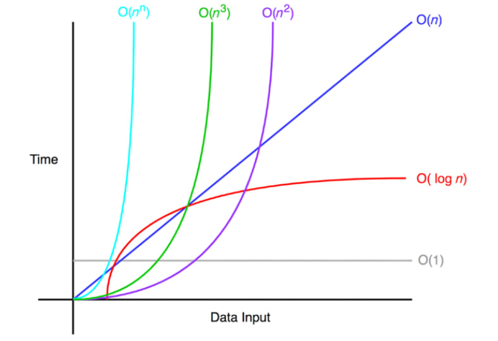

[코드](../../../src/step04_middleClass2/chapter02_CollectionFramework)

# I. 빅오(O) 표기법
- 알고리즘의 성능을 분석할때 사용하는 수학적 표현 방식
- 자료구조에서 알고르즘을 사용할때 데이터를 찾기까지 얼마나 걸리는지
- 해당 알고리즘이 처리해야할 데이터량 기준 처리 속도(연산 수)를 나타낸다.
- 실제 연산 실행시간이 아닌 자료량 증가에따른 성능 변화 추세를 이해하는 것이 목표
- 매우 큰 데이터량을 다룰때 추세를 파악하기 위해 사용
    - 매우 큰 수를 분석할때는 단건보다는 흐름을 파악한다
    - 숲을 보고 진단하기위해 사용
- 상수의 의미가 없어지기때문에 빅오 표기법에서 상수는 제거
    - `O(n+2`) -> `O(n)`
    - `O(n/2)` -> `O(n)`
- 보통 최악의 상황(전체를 순회하는 경우)을 가정
    - 최적, 최악, 보통으로 나눠서 분석하기도 함(예시: 배열에서 순차검색)
        - 최적: 배열의 첫 항목에서 찾음 -> `O(1)`
        - 최악: 배열의 마지막 요소나 자료가 없는 경우 -> `O(n)`
        - 보통: 배열의 중간에 자료가 있는 경우 최악과 비교를 위해 상수를 남기기도함 -> `O(n/2)`
          
- `O(1)`: 데이터 크기에 관계없이 알고리즘의 실행시간이 일정하다
    - ex) 배열에서 인덱스를 사용해 값 조회
- `O(n)`: 선형 시간 알고리즘. 데이터 크기에 연산수가 비례하는 직선을 그림
    - ex) 배열의 검색. 배열의 모든 요소를 순회하는 경우
- `O(n^2)`: 알고리즘의 실행시간이 입력 데이터 크기의 제곱에 비례하여 증가
    - ex) 이중 루프를 사용하는 알고리즘에서 나타남
- `O(log n)`: 데이터 크기 증가에 비해 연산수 증가가 적게 증가
    - ex) 이진트리 검색(binary-tree)
- `O(n log n)`: 선형로그. 효율성을 증대시킨 정렬 알고리즘들

# II. 자료구조의 기본 - 배열
- 자료 구조: 여러 데이터(자료)를 구조화해서 다루는 것 
- 자료구조의 가장 기본: 배열
- 배열
  - 참조 주소는 배열의 첫 요소(index 0)의 위치를 가리키며 이후 배열의 타입의 크기만큼 차지 
  - 인덱스를 통한 자료찾기가 용이: 데이터량에 관계없이 한번 연산으로 가능
    - (index 0의 주소) + (요소의 자료 크기) * (index 번호)를 통해 한 번 계산(`O(1)`)에 대상 자료의 메모리 위치를 찾을 수있다. 
## A. 배열에서 인덱스 사용
- 입력, 변경, 조회는 인덱스를 사용해 자료를 지정
```java
public static void main(String[] args) {
    int[] arr = new int[5];
    System.out.println("=== index 입력: O(1) ===");
    arr[0] = 1;
    arr[1] = 2;
    arr[2] = 3;
    arr[3] = 4;
    arr[4] = 5;
    System.out.println(Arrays.toString(arr));

    System.out.println("=== index 변경: O(1) ===");
    arr[2]= 10;//arr[0]의 참조주소 + (4byte(int 자료 크기) * 인덱스번호) 에 덮어쓰기
    System.out.println(Arrays.toString(arr));

    System.out.println("=== index 조회: O(1) ===");
    System.out.println("arr[2]: "+arr[2]);
}
```
## B. 배열의 검색
- 검색은 인덱스을 지정할 수없어 찾을때까지 순회해야한다
- 배열의 마지막에 대상이 있는경우 배열 크기만큼 연산이 요구된다: O(n)
```java
public static void main(String[] args) {
    System.out.println("=== 배열 검색: O(n) ===");
    System.out.println(Arrays.toString(arr));
    int searchingValue = 10;
    for(int i=0;i<arr.length;i++){
        System.out.println("arr["+i+"]: "+arr[i]);
        if(arr[i]==searchingValue){
            System.out.println("index: "+i);
            break;
        }
    }
}
```
## C. 배열에 특정 데이터 추가하기
- 기존 데이터를 유지하면서 새로운 뎅이터를 입력
- 배열에서 데이터 추가는 3가지로 나뉨
  - 첫번째 위치: `O(1+n+1)` => `O(n)`
    1. 대상 인덱스를 찾고
    2. 기존 데이터를 모두 한칸씩 밀고
    2. 데이터 추가

    | 기존 | 1 | 2 | 3 | 0 |
    |----|---|---|---|---|
    | 이동 | 1 | 2 | 0 | 3 |
    | 이동 | 1 | 0 | 2 | 3 |
    | 이동 | 0 | 1 | 2 | 3 |
    | 삽입 | 4 | 1 | 2 | 3 |
- 중간 위치: `O(1+(n-idx)+1)` => `O(n)` 또는 `O(n/2)`(평균치)
  1. 대상 인덱스를 찾고
  2. 대상 요소부터 뒤로 밀기
  3. 데이터 추가

     | 기존 | 1 | 2 | 3 | 0 |
     |----|---|---|---|---|
     | 검색 | 1 | 2 | 3 | 0 |
     | 이동 | 1 | 2 | 0 | 3 |
     | 이동 | 1 | 0 | 2 | 3 |
     | 삽입 | 1 | 4 | 2 | 3 |
- 배열의 마지막 위치: `O(1+1)` => `O(1)`
  1. 대상 인덱스를 찾고
  2. 마지막에 추가

     | 기존 | 1 | 2 | 3 | 0 |
     |----|---|---|---|---|
     | 삽입 | 1 | 2 | 3 | 4 |
## D. 배열의 한계
- 배열의 생성 시점에서 크기가 정해진다
  - `User[] array = new User[1000];` 
    - 부족하면 추가할 수 없다: 1032명이 온다면?
    - 남으면 메모리 낭비다: 그렇다고 10000으로?
- 처음부터 정적으로 크기가 지정된 배열의 한계를 보완한 자료구조의 필요성 -> List

- [배열 코드](../../../src/step04_middleClass2/chapter02_CollectionFramework/array)
# III. 배열 리스트