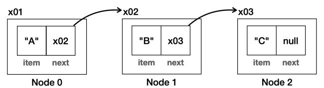

- 배열 리스트의 단점
    - 사용하지 않는 공간 낭비: 사용할 공간을 정확히 예측하지 못하면 나머지 공간이 낭비됨
    - 배열의 마지막 데이터 수정/삭제(`O(1)`)를 제외한 나머지의 경우(`O(n)`) 성능이 좋지 않음
# I. 노드(Node)와 연결(Link)
- 필요한 만큼 만들고, 중간에 연결 부분만 만지면 되지 않을까? -> 노드
- 데이터를 저장하는 부분과 함께 다른 노드의 정보를 담는 부분으로 구성
```java
public class Node{
    Object item; //데이터 보관
    Node next;//다음 데이터의 인스턴스 주소(참조값)
}
```

- [노드 클래스](../../../src/step04_middleClass2/chapter02_CollectionFramework/linkedList/Node.java)
```java
public static void main(String[] args) {
// A -> B -> C
Node first = new Node("A");
first.setNext(new Node("B"));//second
first.getNext().setNext(new Node("C"));//third
System.out.println("First Node: " + first.getItem());
System.out.println("Second Node: " + first.getNext().getItem());
System.out.println("Third Node: " + first.getNext().getNext().getItem());
}
```
- 모든 노드 순회하기
  - `next`가 `null`이면 종료
```java
public static void main(String[] args) {
    System.out.println("## iterate all node");
    Node currentReference = first;
    int count = 0;
    while (currentReference != null) {
        System.out.println((++count)+". " + currentReference.getItem());
        currentReference = currentReference.getNext();
    }
}
```
# II. 기능 추가
## A. override toString method
- 좀 더 보기 좋게 toString 재정의
```java
@Override
public String toString() {
    StringBuffer sb = new StringBuffer();
    Node current = this;
    sb.append("[");
    while (current != null) {
        sb.append(current.getItem());
        if(current.getNext() != null)
            sb.append(" -> ");
        current = current.getNext();
    }
    sb.append("]");
    return sb.toString();
}
```
## B. 기타 기능 추가하기
- 추가할 기능
  - 데이터로 노드 검색하기
  - 마지막 노드 조회하기
  - 특정 index의 노드 조회하기
  - 노드 리스트에 데이터 추가하기
### 1. 데이터로 노드 검색
```java
private static int indexOf(Node n, Object o) {
    int i = 0;
    while (n != null) {
        if(o.equals(n.getItem()))
            return i;
        i++;
        n = n.getNext();
    }
    return -1;
}
```
### 2. 마지막 노드 조회하기
```java
private static Node getLastNode(Node targetNode) {
    while (targetNode.getNext() != null) {
        targetNode = targetNode.getNext();
    }
    return targetNode;
}
```
### 3. 특정 index의 노드 조회하기
```java
private static Node findNodeByIdx(Node n, int idx) {
    for (int i = 0; i < idx; i++) {
        if(n.getNext()==null) {
            System.out.println("index " + i + "가 마지막입니다. 요청한 index: " + idx);
            return n;
        }
        n=n.getNext();
    }
    return n;
}
```
### 4. 노드 리스트에 데이터 추가하기
```java
private static void addNode(Node n, Object o) {
    while (n.getNext() != null) {
        n = n.getNext();
    }
    n.setNext(new Node(o));
}
```
# III. 직접 LinkedList 만들기
## A. \
[MyLinkedList](../../../src/step04_middleClass2/chapter02_CollectionFramework/linkedList/MyLinkedListV0.java): Basic
## B. [MyLinkedList](../../../src/step04_middleClass2/chapter02_CollectionFramework/linkedList/MyLinkedListV1.java): 추가와 삭제
## C. [MyLinkedList](../../../src/step04_middleClass2/chapter02_CollectionFramework/linkedList/MyLinkedListV2.java): 기능 향상
## D. [MyLinkedList](../../../src/step04_middleClass2/chapter02_CollectionFramework/linkedList/MyLinkedListV3.java): 제네릭


 
- [전체 코드](../../../src/step04_middleClass2/chapter02_CollectionFramework/linkedList)