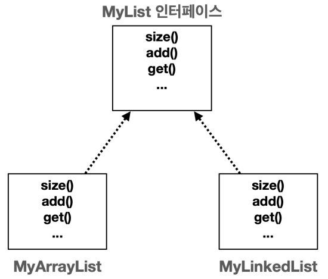
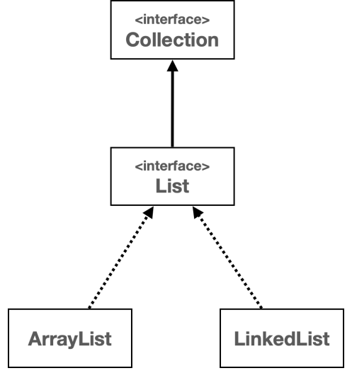

# I. List 추상화
- List 자료구조의 특징
  - 순서
  - 중복 허용
- ArrayList와 LinkedList
  - 모두 List의 특징을 사용자에게 제공
  - 내부구조가 배열을 사용하느냐 노드를 사용하느냐의 차이
    - 데이터 추가, 수정, 삭제가 자주 일어나는 경우 => 연결 리스트
    - 데이터 조회, 찾기가 자주 일어나는 경우 => 배열 리스트
- List interface를 사용해 ArrayList와 LinkedList를 구현
  - 다형성과 OCP를 적용
  
# II. 직접 리스트 만들기
## A. 인터페이스 구현
- 인터페이스 도입
```java
public interface MyList <E>{
    int size();
    void add(E e);
    void add(int index, E e);
    E get(int index);
    E set(int index, E e);
    E remove(int index);
    int indexOf(E e);
}
```
- MyArrayList, MyLinkedList에 구현(`implement MyList`)
## B. 구체적 대상보단 추상적 대상을 의존하자
- 상황에 따라 배열 리스트를 쓸지, 연결 리스트를 쓸지는 개발자가 선택
- 구체적 대상 사용
  - 배열 리스트는 앞에 데이터가 삽입되는 경우 매번 모든 데이터를 뒤로 밀어야함
  - 이를 위해 `MyArrayList`보다 `MyLinkedList` 유리
  - 로직에따라 매번 변경해야하는 단점
  - 이처럼 외부 객체의 변경에따라 매번 코드가 변경될때 "의존한다"
```java
public class BatchProcessor {
  private final MyArrayList<Integer> list = new MyArrayList<>();
  public void logic(int size) {
    for (int i = 0; i < size; i++) {
      list.add(0, i);
    }
  }
}
```
- 추상적 대상에 의존하기
  - 직접생성하는 것이 아닌 생성 시점에서 코드가 객체를 주입받도록함
  - 다형성을 사용해 제일 추상 객체의 구현체를 적용하면 편리
      - 매변 변경 필요 x
      - 같은 기능, 다른 로직의 여러 객체를 사용 가능
```java
public class BatchProcessor {
  private final MyList <Integer> list;
  
  public BatchProcessor(MyList<Integer> list){
      this.list = list;
  }
  
  public void logic(int size) {
    for (int i = 0; i < size; i++) {
      list.add(0, i);
    }
  }
}
```
- 객체를 생성하는 시점에서 원하는 알고리즘(전략) 선택 가능
```java
public static void main(String[] args) {
  new BatchProcessor(new MyArrayList<Integer>());
  new BatchProcessor(new MyLinkedList<Integer>());
}
```
- [Test](../../../src/step04_middleClass2/chapter02_CollectionFramework/list/BatchProcessor.java)
  - array list
```
### 앞 추가 - 연산 종료: 
	 size: 50000
	 duration: 1400ms
### 뒤에 추가 - 연산 종료: 
	 size: 50000
	 duration: 2748ms
```
  - linked list 
```
### 앞 추가 - 연산 종료: 
	 size: 50000
	 duration: 7ms
### 뒤에 추가 - 연산 종료: 
	 size: 50000
	 duration: 1310ms
```
- interface MyList의 구현체의 결정은 실행시점에 호출되는 생성자의 인자에 의해 결정된다. 
  - 의존관계가 class가 아닌 외부에서 주입되는것 같다해서 `의존성(의존관계) 주입`이라고 한다. 
  - 의존관계 주입(Dependency injection)이 생성자에 의해 이뤄지고 있으므로 생성자 의존관계 주입이라 한다. 
## C. 전략 패턴: 시점마다의 의존관계 관리
- 어떤 대상에 의존한다는것은 어떤 대상에 대해 알고 있음(내부에 관련 코드가 있음)을 의미한다
  -  `BatchProcessor`가 `MyList<E>`를 알고 있지만 역은 없음
  - 자식 class(구현체)는 부모 class(interface)를 알지만 부모는 자식을 의존하지 않는다
  - `------>`의 의미(알고있다, 보고있다, 의존하고있다)
- 의존 시점에따라 분류
  - compile time: 코드 컴파일 시점 - 소스코드
    - 소스코드 상에 드러난 의존관계
    - ex) `BatchProcessor`가 `MyList<E>`에 의존 중
      - `MyArrayList`나 `MyLinkedList`에는 의존중이지 않음(소스 코드 상)
  - run time: 프로그램 실행 시점 - 실행상태
    - 프로세스가 실행되고 있을때 인스턴스간의 의존관계
    - 프로그램 실행중에 변경될 수 있다. 
    - ex) 실행시점 1과 실행시점 2에서 BatchProcessor의 인스턴스마다 의존 대상이 다르다
      ```java
      public static void main(String[] args){
          int dataSize = 1_00_000;
          MyArrayList<Integer> list = new MyArrayList<>();
          BatchProcessor processor = new BatchProcessor(list);//실행시점 1: MyArrayList
          processor.insertFront(dataSize);
          processor.insertTail(dataSize);
          MyLinkedList<Integer> list2 = new MyLinkedList<>();
          BatchProcessor processor2 = new BatchProcessor(list2);//실행시점 2: MyLinkedList
          processor2.insertFront(dataSize);
          processor2.insertTail(dataSize);
      }
      ```
- client class(BatchProcessor class)의 수정 없이 의존 대상을 변경시켜 사용할 수있다는 장점이 있다. 
- 디자인 패턴 중 하나: 전략 패턴(Strategy pattern): java Spring framework에서 자주 사용. Singleton pattern과 함께 중요한 디자인 패턴. 전략패턴은 알고리즘을 클라이언트 코드의 변경없이 쉽계 교체할 수 있다. 클라이언트 클래스를 매우 유연하게 만들 수 있다. 
  - 전략을 정의하는 인터페이스: `interface MyList<E>`
  - 전략의 구체적인 구현: `class MyArrayList<E>`, `class MyLinkedList<E>`, ...
  - 클라이언트 클래스: `class BatchProcessor`
## D. [성능비교](../../../src/step04_middleClass2/chapter02_CollectionFramework/list/MyListPerformanceTest.java)
- 데이터 추가시 성능비교
```
==MyArrayList==
insert to front: 
    size: 50000 time: 1320ms
insert to medium: 
    size: 50000 time: 618ms
insert to last: 
    size: 50000 time: 2ms
==MyLinkedList==
insert to front: 
    size: 50000 time: 3ms
insert to medium: 
    size: 50000 time: 779ms
insert to last: 
    size: 50000 time: 1298ms
```
- 데이터 조회시 성능비교
```
==MyArrayList==
get by index: 
	index: 00000	loop: 10000	time: 1ms
get by index: 
	index: 25000	loop: 10000	time: 0ms
get by index: 
	index: 49999	loop: 10000	time: 0ms
==MyLinkedList==
get by index: 
	index: 00000	loop: 10000	time: 0ms
get by index: 
	index: 25000	loop: 10000	time: 258ms
get by index: 
	index: 49999	loop: 10000	time: 512ms
```
- 데이터 검색시 성능비교
```
==MyArrayList==
find data: 
	search key word: 0	loop: 10000	time: 0ms
find data: 
	search key word: 25000	loop: 10000	time: 101ms
find data: 
	search key word: 49999	loop: 10000	time: 193ms
==MyLinkedList==
find data: 
	search key word: 0	loop: 10000	time: 1ms
find data: 
	search key word: 25000	loop: 10000	time: 300ms
find data: 
	search key word: 49999	loop: 10000	time: 604ms
```
- 자료를 사용하는 곳에따라 전략을 선택
- 단, 시간복잡도(big-O)와 실제 성능은 차이가 있을 수 있다.
  - Linked List 연산은 순차적 접근 속도, 메모리 할당 및 해제 비용, CPU 캐시 활용도 등 다양한 변인이 존재
  - Array List 연산은 메모리 상 연속적으로 위치하기때문에 CPU 캐시 효율이 좋고 메모리 접근 속도도 빠르고 일정하다
    - 배열 리스트의 크기(`CAPACITY`)가 가득차면 배열을 새로 생성하고 복사하는 과정이 추가되는데, 한번에 큰 크기가 생성되므로 자주 발생하지 않는다. 전체 성능에 큰 영향을 주지는 않음
- 현대 컴퓨터 시스템의 메모리접근 패턴, CPU 캐시 최적화 등 전반적인 성능이 향상된 하드웨어와 관리 알고리즘이 개발되면서 연결리스트보다 배열리스트가 실제 사용 환경에서 더 나은 성능을 보여주는 경우가 많다. 
- 데이터의 앞부분에서 추가, 수정, 삭제 등의 작업이 일어날 경우에는 연결 리스트를 사용하기도함
  - 주로 초기/과거 데이터는 조회 기능이 많음
  - 수정 및 추가는 신규 데이터에 대한 접근이 많음
  - 주로 배열리스트(ArrayList)가 보편적으로 사용됨
# III. Collection framework: List
- 자바 컬렉션 프레임워크가 지원

- Collection interface: java.util 패키지의 하위 패키지. 다양한 자료구조(List, Set, Queue)를 사용하는데 편리한 메서드, 속성 등을 지원한다.
- List interface: 순서가 있고 중복을 허용하는 자료들을 다룰 자료구조를 위한 인터페이스. 배열을 동적으로 관리할때 편리하다.
  - 구현 클래스: ArrayList, LinkedList
  - 주요 메서드: [java.util.collection.List(java 8)](https://docs.oracle.com/javase/8/docs/api/java/util/List.html)
    - 유용한 기능이 많으므로 필요에 따라 사용
## A. ArrayList
- 직접 만든 예시코드인 `MyArrayList`보다 많은 기능을 지원하고 최적화되어 있음
- 배열을 사용해서 데이터를 관리
- `CAPACITY`의 기본 값은 10(DEFAULT_CAPACITY = 10)
  - 크기를 넘어가면 배열 크기를 50% 증가시킨다
  - 메모리 사용 관련 최적화 자바 버전마다 다를 수 있다
- 메모리 고속 복사 연산을 사용한다. 
  - `System.arraycopy()`: 초중반부 데이터 추가시 배열 이동을 돕기 위해 사용되는 시스템(혹은 그 하위 계층) 레벨 메서드
  - 한 칸씩 이동시키는 기존 방식과 달리 해당 인덱스부터 끝까지의 값을 통째로 복사시켜 연산을 최적화 시킴
## B. LinkedList
- 직접 만든 `MyLinkedList`보다 많은 기능과 최적화
- 이중 연결 리스트 구조로 노드가 `prev`, `next`를 갖고있어 노드간 이동이 더 편리해진다.
- 첫 노드인 `head`와 마지막 노드인 `tail`을 참조해 후반부에 대한 데이터 관리시 조회 속도도 빠르다.
```java
class Node<E>{
    E item;
    Node prev;
    Node next;
}
class LinkedList{
    Node head;//first
    Node tail;//last
    int size; 
}
```
## C. 성능비교
- [MyListPerformanceTest.java](../../../src/step04_middleClass2/chapter02_CollectionFramework/list/MyListPerformanceTest.java)의 코드를 List, ArrayList, LinkedList로 변경
- [JavaListPerformanceTest.java](../../../src/step04_middleClass2/chapter02_CollectionFramework/list/JavaListPerformanceTest.java)
- import
```java
import java.util.ArrayList;
import java.util.LinkedList;
import java.util.List;
```
- 결과
```
=추가=
== ArrayList==
insert to front: 
    size: 50000   time: 50ms
insert to medium: 
    size: 50000   time: 26ms
insert to last: 
    size: 50000   time: 2ms
== LinkedList==
insert to front: 
    size: 50000   time: 3ms
insert to medium: 
    size: 50000   time: 813ms
insert to last: 
    size: 50000   time: 2ms

=조회=
== ArrayList==
get by index: 
	index: 00000	loop: 10000	time: 1ms
get by index: 
	index: 25000	loop: 10000	time: 0ms
get by index: 
	index: 49999	loop: 10000	time: 1ms
== LinkedList==
get by index: 
	index: 00000	loop: 10000	time: 0ms
get by index: 
	index: 25000	loop: 10000	time: 263ms
get by index: 
	index: 49999	loop: 10000	time: 0ms
	
=검색=
== ArrayList==
find data: 
	search key word: 0	loop: 10000	time: 1ms
find data: 
	search key word: 25000	loop: 10000	time: 90ms
find data: 
	search key word: 49999	loop: 10000	time: 190ms
== LinkedList==
find data: 
	search key word: 0	loop: 10000	time: 1ms
find data: 
	search key word: 25000	loop: 10000	time: 298ms
find data: 
	search key word: 49999	loop: 10000	time: 583ms
```
- java의 코드를 직접 만들 수 있으나 최적화되어있는 라이브러리를 사용하는 것이 훨씬 효율적
- 최적화를 했지만 더 많은 데이터는 결국 시간이 걸린다. 
# IV. 실습 코드
## A. 리스트 사용하기
### 1. 배열을 리스트로
```
문제1 - 배열을 리스트로 변경하기
문제 설명
ArrayEx1 는 배열을 사용한다. 이 코드를 배열 대신에 리스트를 사용하도록 변경하자.
다음 코드와 실행 결과를 참고해서 리스트를 사용하는 ListEx1 클래스를 만들어라.

package collection.list.test.ex1;
public class ArrayEx1 {
 public static void main(String[] args) {
 int[] students = {90, 80, 70, 60, 50};
 int total = 0;
 for (int i = 0; i < students.length; i++) {
 total += students[i];
 }
 double average = (double) total / students.length;
 System.out.println("점수 총합: " + total);
 System.out.println("점수 평균: " + average);
 }
}

실행 결과 
  점수 총합: 350
  점수 평균: 70.0`
```
[실습코드](../../../src/step04_middleClass2/chapter02_CollectionFramework/test/list/)
### 2. 입력과 출력
```
문제 설명
사용자에게 n 개의 정수를 입력받아서 List 에 저장하고, 입력 순서대로 출력하자.
0 을 입력하면 입력을 종료하고 결과를 출력한다.
출력시 출력 포멧은 1, 2, 3, 4, 5와 같이 , 쉼표를 사용해서 구분하고, 마지막에는 쉼표를 넣지 않아야 한다.
실행 결과 예시를 참고하자.
문제는 ListEx2 에 풀자
실행 결과 
  n개의 정수를 입력하세요 (종료 0)
  1
  2
  3
  4
  5
  0
  출력
  1, 2, 3, 4, 5
```
[실습코드](../../../src/step04_middleClass2/chapter02_CollectionFramework/test/list/)
### 3. 합계와 평균
```
문제3 - 합계와 평균
  사용자에게 n 개의 정수를 입력받아서 List 에 보관하고, 보관한 정수의 합계와 평균을 계산하는 프로그램을 작성하
  자.
  ListEx3 에 작성하자.
실행 결과 예시 
  n개의 정수를 입력하세요 (종료 0)
  1
  2
  3
  4
  5
  0
  입력한 정수의 합계: 15
  입력한 정수의 평균: 3.0
```
[실습코드](../../../src/step04_middleClass2/chapter02_CollectionFramework/test/list/)
## B. 리스트를 사용한 쇼핑카트
```
문제 - 쇼핑카트
  ShoppingCartMain 코드가 작동하도록 ShoppingCart 클래스를 완성해라.
  ShoppingCart 는 내부에 리스트를 사용해야 한다.
Item 클래스 
  public class Item {
   private String name;
   private int price;
   private int quantity;
   public Item(String name, int price, int quantity) {
   this.name = name;
   this.price = price;
   this.quantity = quantity;
   }
   public String getName() {
   return name;
   }
   public int getTotalPrice() {
   return price * quantity;
   }
  }
  
Main class
  public class ShoppingCartMain {
   public static void main(String[] args) {
   ShoppingCart cart = new ShoppingCart();
   Item item1 = new Item("마늘", 2000, 2);
   Item item2 = new Item("상추", 3000, 4);
   cart.addItem(item1);
   cart.addItem(item2);
   cart.displayItems();
   }
  }

ShoppingCart - 코드 작성 ```java
  public class ShoppingCart {
  // 코드 작성
  }
실행 결과 
  장바구니 상품 출력
  상품명:마늘, 합계:4000
  상품명:상추, 합계:12000
  전체 가격 합:16000 
```

[실습코드](../../../src/step04_middleClass2/chapter02_CollectionFramework/test/list/)