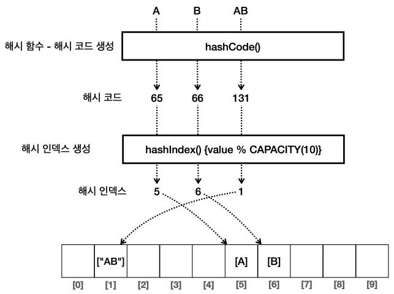

# I. 시작
- List vs Set

| List  | 비교    | Set |
|-------|-------|-----|
| O     | 순서    | X   |
| O     | 중복 허용 | X   |
| index | 접근    | 순회  |
| 순열    | 이해    | 집합  |

- [기본적인 Set 구현하기](../../../src/step04_middleClass2/chapter02_CollectionFramework/set/MyHashSetV0.java)
  - 순서(index)가 없기때문에 더 단순
  - 물론 정말 기초임을 기억
  - 기본 기능
    - `boolean add(value)`: 추가
    - `boolean contains(value)`: 조회
    - `int getSize()`: 자료 수
    - `boolean remove(value)`: 삭제
- 반복문을 돌릴경우 `O(n)`으로 검색 효율이 좋진 않다
- 데이터를 추가할때마다 중복데이터를 확인하기위한 검색을 진행하므로 성능의 발목을 잡는다. 
- 이를 해결하기 위한 것이 Hash 알고리즘이다
# II. Hash Algorithm
## A. 이해를 위한 예제: 배열을 사용해 구현하기
- 기능
  - 입력: 0~9 사이의 임의의 값 입력, 중복은 입력되지 않음
  - 찾기: 0~9 사이의 하나 입력되면 해당 값이 있는지 확인
- 배열을 사용한 경우: [HashStart0](../../../src/step04_middleClass2/chapter02_CollectionFramework/set/hashAlgorithm/HashStart0.java)
  - 검색: `O(n)`
    ```java
        for(int intValue: intArr){
            if(intValue == searchValue){
                System.out.println(intValue);
            }
        }
    ```
  - 조회: `O(1)`
    - 인덱스를 사용하는 경우는 매우 효율적.
## B. 검색에 배열을 사용할 수 없을까?
- index와 값을 일치시키면 되지 않을까?????
```java
Integer[] intArr2 = new Integer[10];
intArr2[1] = 1;
intArr2[2] = 2;
intArr2[5] = 5;
intArr2[8] = 8;
System.out.println("inputArr: "+ Arrays.toString(intArr2));
int searchValue2 = 8;
System.out.println("search: "+intArr2[searchValue2]);
```
- 순서는 무시되지만 검색 효율이 매우 높아짐: `O(1)`
- 문제: 입력 가능한 값의 범위(0~9)만큼 메모리가 요구되므로 메모리 낭비가 심해진다
## C. [메모리 낭비](../../../src/step04_middleClass2/chapter02_CollectionFramework/set/hashAlgorithm/HashStart1.java)
- 기능: 범위를 더 늘린다
    - 입력: 0~99 사이의 임의의 값 입력, 중복은 입력되지 않음
    - 찾기: 0~99 사이의 하나 입력되면 해당 값이 있는지 확인
```
[
    null, 1, 2, null, null, 5, null, 7, null, null, null, 
    null, 12, null, null, null, null, null, null, null, 
    null, null, null, null, null, null, null, null, null, null, 
    null, null, null, null, null, null, null, null, null, null, 
    null, null, null, null, null, null, null, null, null, null, 
    null, null, null, null, null, null, 56, null, null, null, 
    null, null, null, null, null, null, null, null, null, null, 
    null, null, null, null, null, null, null, 77, null, null, 
    null, null, null, null, null, null, null, null, null, null, 
    null, null, null, null, null, null, null, null, null, 99
]
```
- 속도는 빠르나...메모리 낭비가...
  - 만약 입력 기대값이 int 범위(-2,147,483,648~2,147,483,647)이라면... 
  - 4byte * 42억 = 17GB
## D. [Hash Index](../../../src/step04_middleClass2/chapter02_CollectionFramework/set/hashAlgorithm/HashStart2.java)
- CAPACITY가 10인 배열을 사용한다면
- 나머지 연산 : 대상 % 배열크기 = 배열크기 내 나머지 -> index
```
    1 % 10 = 1
    2 % 10 = 2
    ...
    9 % 10 = 9
    10 % 10 = 0
```
- 이를 통해
  - 14 -> index 4에 저장
  - 99 -> index 9에 저장
- 이처럼 배열의 인덱스로 사용할 수 있도록 원래의 값을 계산한 인덱스를 해시 인덱스(hashIndex)라 한다
  - 빠른 성능(`O(1)`)을 제공
  - 추가할때 조회할 때 매번 연산
  - 메모리 낭비를 많이 줄임
- 문제
  - 19와 99가 동시에 들어온다면..?
    - 19 -> index 9
    - 79 -> index 9
    - 99 -> index 9
  - 뒤에 입력되는 값에 덮어씌워짐 => 해시 충돌
## E. [해시 충돌](../../../src/step04_middleClass2/chapter02_CollectionFramework/set/hashAlgorithm/HashStart3.java)
- 다른 값을 입력했지만 같은 hash index가 나와 충돌이 발생(데이터가 충돌)
  - 조건 처리에 따라 덮어씌울지 추가를 거절시킬지 달라짐
  - 해결방법? CAPACITY 확장 -> 데이터 낭비 원점
    - 해시 충돌 발생의 확률을 인정하면...
      - 같은 해시의 값을 같은 인덱스에 저장(이중 배열)
- [LinkedList[] 사용](../../../src/step04_middleClass2/chapter02_CollectionFramework/set/hashAlgorithm/HashStart4.java): HashStart3와 같으나 LinkedList[]사용
  - 더 편리함
  - ArrayList도 가능
- 입력하는 데이터의 수가 CAPACITY 크기의 75%를 넘으면 해시 인덱스는 자주 충돌을 만들지 않는다.
- 그러나 이를 위해 배열의 크기를 늘리면 메모리 낭비가 심해진다.
- Hash Index 효율: 배열의 크기가 적절하다면 크게 문자가 생기지 않는다
  - 입력
    - 평균: O(1)
    - 최악: O(n) - 충돌
  - 조회
    - 평균: O(1)
    - 최악: O(n) - 충돌
# III. HashSet 구현해보기
- 핵심 특성
  - 중복 x 
  - 순서 x 
  - 빠른 검색기능
- [Main class](../../../src/step04_middleClass2/chapter02_CollectionFramework/set/MyHashSetMain.java): 같은 기능을 다른 로직으로 진행하므로 클라이언트 코드에 영향을 주지 않음
```java
//        MyHashSetV0 set = new MyHashSetV0();
        MyHashSetV1 set = new MyHashSetV1();
        MyHashSetV2 set = new MyHashSetV2();
        MyHashSetV3 set = new MyHashSetV3();
```
## A.[MyHashSetV1](../../../src/step04_middleClass2/chapter02_CollectionFramework/set/MyHashSetV1.java): 해시 알고리즘(hash index)
```java
public class MyHashSetV1 {
    private final int DEFAULT_INITIAL_CAPACITY = 16;
    LinkedList<Integer>[] buckets;
    private int size = 0;
    private int capacity = DEFAULT_INITIAL_CAPACITY;

    public MyHashSetV1();
    public MyHashSetV1(int initialCapacity);
    
    public boolean add(int value);
    public boolean contains(int searchValue);
    public boolean remove(int value);
    public int getSize();
    
    private void initBucket();
    private int getHashIndex(int value);
    
    @Override
    public String toString();
```
- 특징
  - 최악의 경우를 제외하고 검색시 O(1)을 보장
    - 등록, 검색, 삭제 모두 평균 O(1) 
  - 충돌가능성 낮춤
- 문제: 데이터의 값이 index인 양의 정수가 아니라면..?
- 주의: List의 remove()의 매개변수 타입에 따라 호출되는 메서드가 다름 
  - 기본형인 int가 전달되면 index 기준으로 삭제함
## B. MyHashSetV2: 해시 코드
### 1. [문자 해시코드](../../../src/step04_middleClass2/chapter02_CollectionFramework/set/objectHash/StringHashMain.java)
- 모든 문자는 각자 고유한 코드를 지닌다: ASCII, UTF-8 ...
```java
public static void main(String[] args) {
    //char
    char charA = 'A';
    char charB = 'B';
    
  System.out.println("charA = " + charA);
  System.out.println("charA code = " + (int) charA);
  System.out.println("charB code = " + (int) charB);
  //charA = A
  //charA code = 65
  //charB code = 66
}
```
- 문자열을 코드화 시키는 가장 단순한 방법 -> 문자 코드를 더해서 사용
```java
private static int hash(char ch) {
  return (int) ch;
}
private static int hash(String str) {
    int hash = 0;
    char[] chars = str.toCharArray();
    for(char ch : chars) {
        hash += (int) ch;
    }
    return hash;
}
private static int hashIndex(char value){
  int hash = hash(value);
  return hash % CAPACITY;
}
private static int hashIndex(String str){
  int hash = hashCode(str);
  return hash % CAPACITY;
}
```
- 이렇게 배열의 인덱스를 사용해 값을 저장, 조회
  - 알고리즘에 따라 암호화를 위해 사용될 수 있음

- 충돌 가능: 다른 데이터임에도 값 자체가 같을 수 있다.
  - "AD" -> A(65) + D(68) => 133
  - "BC" -> B(66) + C(67) => 133
- 해시코드화 시키고나면 해시 인덱스를 통해 사용할 수 있다. 
  - 사용자가 직접 만든 Custom type은 어떻게???
### 2. [java의 hashCode](../../../src/step04_middleClass2/chapter02_CollectionFramework/set/objectHash/JavaHashCodeMain.java): Object 클래스의 method
- 모든 객체에 적용할 수있는 방법: Object class 이용
  - default: 인스턴스의 참조값(메모리주소)
  - 그대로 사용하지않고 재정의해서 사용
```java
public class Object{
//  ...
    public int hashCode();
}
```
- Java 소속 클래스들은 이미 재정의 되어있음
  - 음의 정수도 있음
```
10.hashCode() = 10
strA.hashCode() = 65
strAB.hashCode() = 2081
Integer.valueOf(-1).hashCode() = -1
```
- 사용자가 직접 만든 클래스에서 값은 같지만 다른 인스턴스인 경우
- 사용하는 데이터를 기반으로 비교하도록 재정의
  - `Objects.hashCode(hash 변환에 사용할 값);`
```java
@Override
public int hashCode() {
    return Objects.hashCode(id);
}
```
- 동일성과 동등성
```java
public static void main(String[] args) {
  System.out.println("member1 == dupMember1 = " + (member1==dupMember1));
  System.out.println("identity String(member1) = " + Objects.toIdentityString(member1));
  System.out.println("identity String(dupMember1) = " + Objects.toIdentityString(dupMember1));
  System.out.println("member1.equals(dupMember1) = " + member1.equals(dupMember1));
  System.out.println("member1.hashCode() = " + member1.hashCode());
  System.out.println("dupMember1.hashCode() = " + dupMember1.hashCode());
}

// member1 == dupMember1 = false 동일성
// identity String(member1)    = ....Member@7530d0a
// identity String(dupMember1) = ....Member@27bc2616
// member1.equals(dupMember1) = true 동등성
// member1.hashCode() = 104070
// dupMember1.hashCode() = 104070
```
- 값을 비교해야하므로 equals()도 재정의해야한다
  - `instanceof` 사용
  ```java
  @Override
  public boolean equals(Object o) {
      if (this == o) return true;
      if (!(o instanceof Member member)) return false;
      return Objects.equals(id, member.id);
  }
  ```
  - `getClass()` 사용
  ```java
  @Override
  public boolean equals(Object o) {
    if (o == null || getClass() != o.getClass()) return false;
    Member member = (Member) o;
    return Objects.equals(id, member.id);
  }
  ```
### 3. [MyHashSetV2](../../../src/step04_middleClass2/chapter02_CollectionFramework/set/MyHashSetV2.java): Hash code 사용
- 이를 사용해 구현해보자
- hash index는 0~양수이므로 절대값 처리(`Math.abs()`)
```java
private int getHashIndex(Object value){
    int hashCode = Math.abs(value.hashCode());
    int hashIndex = hashCode % capacity;
    return hashIndex;
//    return Math.abs(value.hashCode()) % capacity;
}
```
## C.[직접만든 클래스 저장하기](../../../src/step04_middleClass2/chapter02_CollectionFramework/set/MyHashSetMainCustom.java)
- 주의!! 
  - 커스텀 클래스에 `equals()`와 `hashCode()`가 재정의되어있지 않으면 문제가 생긴다
  - java의 객체들은 기본적으로 재정의되어있으나 개발자가 직접 만든 클래스는 없음을 주의하자
- `Member`에 equals()가 재정의되어있지않으면 내부에서 이를 사용하는 contain()이 제대로 작동하지 않음
## D. equals(), hashCode() 재정의의 중요성
- hash 자료구조를 사용하기 위해서는 hash 알고리즘 만큼 중요한 것이 equals().
  - 해시 인덱스가 간략하게 만들어주지만 저장 데이터 비교를 위한 equals()가 필수
    - 같은 index 내에 다른 값이 있을 수 있기때문에 반드시 비교과정이 필요
- 이를 위해 Java 라이브러리의 기본 클래스(String, Integer...)는 `hashCode()`, `equals()`를 필수로 재정의한다
  - 직접 만든 인스턴스를 자료구조에서 사용할경우 반드시 구현해야 제 기능을 수행함
  - Object class 메서드 기능
    - hashCode: 참조값(메모리 주소) 반환
    - equals: 참조값 비교
### 1. [메서드 구현 비교](../../../src/step04_middleClass2/chapter02_CollectionFramework/set/hashEquals/HashAndEqualsMain.java)
- 테스트 코드
```java
public static void main(String[] args) {
  MyHashSetV2 set = new MyHashSetV2();

  //test target: instance
  MemberAllNo m1 = new MemberAllNo("A12");
  MemberAllNo m2 = new MemberAllNo("A12");
  MemberAllNo searchTarget = new MemberAllNo("A12");
    
  //hashCode
  System.out.println("m1.hashCode() = " + m1.hashCode());
  System.out.println("m2.hashCode() = " + m2.hashCode());
  //equals
  System.out.println("m1.equals(m2) = " + m1.equals(m2));

  //값 추가
  set.add(m1);
  set.add(m2);
  System.out.println(set);

  //값 검색
  System.out.println("searchTarget.hashCode() = " + searchTarget.hashCode());
  System.out.println("set.contains(searchTarget) = " + set.contains(searchTarget));
}
```
- 둘다 구현하지 않은 경우
  - 참조값을 반환하면 내부의 값(id)이 같음에도 다른 값(인스턴스 메모리 주소)이 있기때문에 다른 곳에 배치됨
  - 마찬가지로 검색도 같은 값을 조회해도 다른 값으로 취급
```
m1.hashCode() = 1922154895
m2.hashCode() = 960604060
m1.equals(m2) = false
MyHashSetV2: 
	0. []
	1. []
... 
    12. [No hashCode/ No equals - id: A12]
	13. []
	14. []
	15. [No hashCode/ No equals - id: A12]
size: 2
searchTarget.hashCode() = 205797316
set.contains(searchTarget) = false
```
- hashCode()만 구현한 경우
  - 같은 해시코드를 반환
  - but 비교할 때 여전히 부모인 Object 소속 메서드를 사용하므로 같은 곳의 equals(메모리 주소를 사용한 비교)를 사용하기에 다름으로 나옴
```
m1.hashCode() = 64034
m2.hashCode() = 64034
m1.equals(m2) = false
MyHashSetV2: 
	0. []
	1. []
	2. [
	    No hashCode/ No equals - id: A12, 
	    No hashCode/ No equals - id: A12
      ]
...
size: 2
searchTarget.hashCode() = 64034
set.contains(searchTarget) = false
```
- 둘 다 구현한 경우
  - 중복을 방지하고 검색도 정상적으로 처리됨
```
m1.hashCode() = 64065
m2.hashCode() = 64065
m1.equals(m2) = true
has duplicated value: Member id: A12
MyHashSetV2: 
	0. []
	1. [Member id: A12]
	2. []
...
size: 1
searchTarget.hashCode() = 64065
set.contains(searchTarget) = true
```
- Hash 내부에는 해시 충돌을 최소화하기위한 알고리즘이 포함됨
- 동시에 같은 결과를 반환시켜야함
## E. [MyHashSetV3](../../../src/step04_middleClass2/chapter02_CollectionFramework/set/MyHashSetV3.java): Generic, Interface 적용
- generic 사용
# IV. [Set](https://docs.oracle.com/javase/8/docs/api/java/util/Set.html)
- Java가 제공하는 Set
  - 해시 자료구조를 사용해 저장
  - 순서 x
  - 시간복잡도: 주요 연산에서 평균 `O(1)`
  - 중복 x
- Set의 구현체: HashSet, LinkedHashSet, TreeSet
  - HashSet: hash algorithm
  - LinkedHashSet: LinkedList를 사용해 입력한 순서를 보장
  - TreeSet: red-black tree algorithm


## A. HashSet/LinkedList
- HashSet은 지금까지 우리가 만든 MyHashSet
- 해시 알고리즘을 사용한 자료구조로 그 기본 특성을 그대로 유지한다.
- LinkedHashSet은 Set에 편입할때 노드를 지니게해 순서를 표시
  - 추가 구조가 있다보니 hashSet에 비해 무거움
- 굳이 순서가 필요하지 않은 이상 HashSet.
- 순서가 정말 중요하다면 List
## B. TreeSet
- 트리구조를 사용한 Set
  - 이진 탐색 트리(binary search tree)를 개선한 레드-블랙 트리를 사용
  - 요소들은 정렬된 순서대로 저장됨(Comparator-정렬기준를 사용해 정렬)
  - 시간복잡도: 주요 연산은 `O(log n)`(O(1)과 O(n) 사이)
  
  - 단, 트리가 한쪽으로 이어져 균형이 무너진 경우 List처럼되어 `O(n)`이 됨
    - 이때 Comparator를 변경
  - 용도: 무작위로 호출되는 HashSet에 비해 무거우나 원하는대로 정렬이 가능하다는 점에서 사용
- 트리구조
  - 
  - 첫 조상은 루트(root: 8을 지닌 노드)라 하며 각 구성체를 노드(node)라한다. 
  - 노드는 부모와 자식의 관계를 가지며 이진 트리(binary tree)를 사용하기에 한 부모 노드당 자식 노드를 두 개까지만 갖는다. 
  - 두 자식 노드 중 비교자(Comparator)의 결과 더 작은 자식노드가 왼쪽, 더 큰 자식노드가 오른쪽에 위치한다.  
  - TreeSet에서는 이진 트리를 더 발전 시킨 레드-블랙 트리를 사용. 기본 개념은 유사
  
```java
class TreeNode {
    Object item; 
    TreeNode left;//item.comparator(left) < 0
    TreeNode right;//item.comparator(right) > 0
}
```
- tree도 set과 마찬가지로 순회라는 표현 사용
  - 순회시 중위 순회를 사용
  - 
  - 선택된 노드를 기준으로 왼쪽을 우선 처리 > 본인 처리 > 우측 노드 처리 
- 예시
```java
public static void main(String[] args) {
    //순회 처리를 위한 객체
    Iterator<String> iterator = strSet.iterator();
    while (iterator.hasNext()) {// 더 꺼낼 자료가 있는지를 boolean으로
         System.out.print(iterator.next()+"  \n");//다음을 꺼냄(포인터 이동)
    }
}
```
## C. 최적화
### A. [활용을 위한 코드](../../../src/step04_middleClass2/chapter02_CollectionFramework/set/javaSet/JavaSetMain.java)
### B. 최적화
- 자바 `HashSet`의 default 크기는 16.  
  - 해시 기반 자료구조를 사용하는 경우 데이터 수가 배열의 크기를 75% 정도를 넘어가면 해시 인덱스가 자주 충돌 = 일반 리스트의 효율
  - 데이터가 동적으로 추가되기때문에 배열으 크기를 정하기 어렵다
  - 어떻게?
    - 자바의 `HashSet`은 데이터의 양이 배열의 크기의 75%를 넘어가면 
      - 배열의 크기를 2배로 늘리고(resizing) 
      - 늘어난 크기를 기준으로 모든 요소의 인덱스를 다시 적용(rehashing)
- 용례
  - 일반적으로 HashSet
  - 순서가 필요하면 LinkedHashSet
  - 정렬이 필요하면 TreeSet
## D. 실습코드
### 1. 문제 1 : 중복 제거
```
문제1 - 중복 제거
문제 설명
여러 정수가 입력된다. 여기서 중복 값을 제거하고 값을 출력해라.
30, 20, 20, 10, 10이 출력되면 중복을 제거하고 출력하면 된다. 출력 순서는 관계없다.
출력 예): 30, 20, 10 또는 10, 20, 30 또는 20, 10, 30등과 같이 출력 순서는 관계 없다.
package collection.set.test;
import java.util.HashSet;
import java.util.Set;
public class UniqueNamesTest1 {
 public static void main(String[] args) {
 Integer[] inputArr = {30, 20, 20, 10, 10};
 // 코드 작성
 }
}
실행 결과 
20
10
30
```
[실습 코드](../../../src/step04_middleClass2/chapter02_CollectionFramework/test/set/SetTest1.java)
### 2. 문제 2 : 중복 제거와 순서 유지
```
문제2 - 중복 제거와 입력 순서 유지
문제 설명
여러 정수가 입력된다. 여기서 중복 값을 제거하고 값을 출력해라.
30, 20, 20, 10, 10이 출력되면 중복을 제거하고 출력하면 된다.
단 입력 순서대로 출력해라.
출력 예): 30, 20, 10
package collection.set.test;
import java.util.HashSet;
import java.util.Set;
public class UniqueNamesTest2 {
 public static void main(String[] args) {
 Integer[] inputArr = {30, 20, 20, 10, 10};
 // 코드 작성
 }
}
실행 결과 
30
20
10
```
[실습 코드](../../../src/step04_middleClass2/chapter02_CollectionFramework/test/set/SetTest2.java)
### 3. 문제 3: 중복제거와 순서 정렬
```
문제3 - 중복 제거와 데이터 순서 유지
문제 설명
여러 정수가 입력된다. 여기서 중복 값을 제거하고 값을 출력해라.
30, 20, 20, 10, 10이 출력되면 중복을 제거하고 출력하면 된다.
데이터의 값 순서로 출력해라.
출력 예): 10, 20, 30
package collection.set.test;
import java.util.HashSet;
import java.util.Set;
public class UniqueNamesTest3 {
 public static void main(String[] args) {
 Integer[] inputArr = {30, 20, 20, 10, 10};
 // 코드 작성
 }
}
실행 결과 
10
20
30
```
[실습 코드](../../../src/step04_middleClass2/chapter02_CollectionFramework/test/set/SetTest3.java)
### 4. 문제 4: 합집합, 교집합, 차집합
```
문제4 - 합집합, 교집합, 차집합
문제 설명
두 숫자의 집합이 제공된다.
집합1: 1, 2, 3, 4, 5
집합2: 3, 4, 5, 6, 7
두 집합의 합집합, 교집합, 차집합을 구해라. 출력 순서는 관계없다.
합집합: 두 집합의 합이다. 참고로 중복은 제거한다. [1, 2, 3, 4, 5, 6, 7]
교집합: 두 집합의 공통 값이다. 참고로 중복은 제거한다. [3, 4, 5]
차집합: 집합1에서 집합2와 같은 값을 뺀 나머지 [1, 2]
다음 실행 결과를 참고하자.
Set 인터페이스의 주요 메서드를 참고하자.
SetOperationsTest - 코드 작성 
package collection.set.test;
import java.util.HashSet;
import java.util.List;
import java.util.Set;
public class SetOperationsTest {
 public static void main(String[] args) {
 Set<Integer> set1 = new HashSet<>(List.of(1, 2, 3, 4, 5));
 Set<Integer> set2 = new HashSet<>(List.of(3, 4, 5, 6, 7));
 //코드 작성
 }
}

합집합: [1, 2, 3, 4, 5, 6, 7]
교집합: [3, 4, 5]
차집합: [1, 2] 
```
[실습 코드](../../../src/step04_middleClass2/chapter02_CollectionFramework/test/set/SetTest4.java)
### 5. 문제 5: Equals, HashCode
```
문제5 - Equals, HashCode
문제 설명
RectangleTest , 실행 결과를 참고해서 다음 Rectangle 클래스를 완성하자.
Rectangle 클래스는 width , height 가 모두 같으면 같은 값으로 정의한다.
package collection.set.test;
public class Rectangle {
 private int width;
 private int height;
 // 코드 작성
}

package collection.set.test;
import java.util.HashSet;
import java.util.Set;
public class RectangleTest {
 public static void main(String[] args) {
 Set<Rectangle> rectangleSet = new HashSet<>();
 rectangleSet.add(new Rectangle(10, 10));
 rectangleSet.add(new Rectangle(20, 20));
 rectangleSet.add(new Rectangle(20, 20)); //중복
 for (Rectangle rectangle : rectangleSet) {
 System.out.println("rectangle = " + rectangle);
 }
 }
}
실행 결과 
rectangle = Rectangle{width=10, height=10}
rectangle = Rectangle{width=20, height=20}
```
[실습 코드](../../../src/step04_middleClass2/chapter02_CollectionFramework/test/set/SetTest5.java)

# V. 정리
- 쓰면서 유용한 메서드에 익숙해지자
```java
public static void main(String[] args) {
    Set<Integer> set1 = new HashSet<>(List.of(1, 2, 3, 4, 5));
    Set<Integer> set2 = new HashSet<>(List.of(3, 4, 5, 6, 7));
    
    Set<Integer> unionSet = new TreeSet<>();
  //  for(Integer i: set1){
  //      unionSet.add(i);
  //  }
  //  for(Integer i: set2){
  //      unionSet.add(i);
  //  }
    unionSet.addAll(set1);
    unionSet.addAll(set2);
    System.out.println("합집합: "+unionSet);
  
    Set<Integer> intersectionSet = new TreeSet<>();
  //        for(Integer i : set1){
  //            if(set2.contains(i)){
  //                intersectionSet.add(i);
  //            }
  //        }
    intersectionSet.addAll(set1);
    intersectionSet.retainAll(set2);
    System.out.println("교집합: "+intersectionSet);
  
    Set<Integer> differenceSet = new TreeSet<>();
  //        for(Integer i : set1){
  //            if(set2.contains(i)){
  //                continue;
  //            }
  //            differenceSet.add(i);
  //        }
    differenceSet.addAll(set1);
    differenceSet.removeAll(set2);
    System.out.println("차집합: "+differenceSet);
}
```
- 객체를 만들어서 자료구조에서 사용할때 hashCode(), equals()가 제대로 구현되어있어야한다. 
- 필요에따라 Set 선택
  - 일반적: hashSet
  - 입력순서: LinkedHashSet
  - 정렬: TreeSet
- java는 최악을 회피하기 위한 최적화를 진행한다: 버전마다 다름
  - HashSet의 같은 해시인덱스에 서로 다른 데이터 8개가 몰린다면 O(n) 
    - 일정 이상 몰려버리면 연결리스트인 내부를 트리구조로 변경해버림 
  - TreeSet이 한쪽에만 데이터가 몰리는 경우 
    - 비교자 재설정 