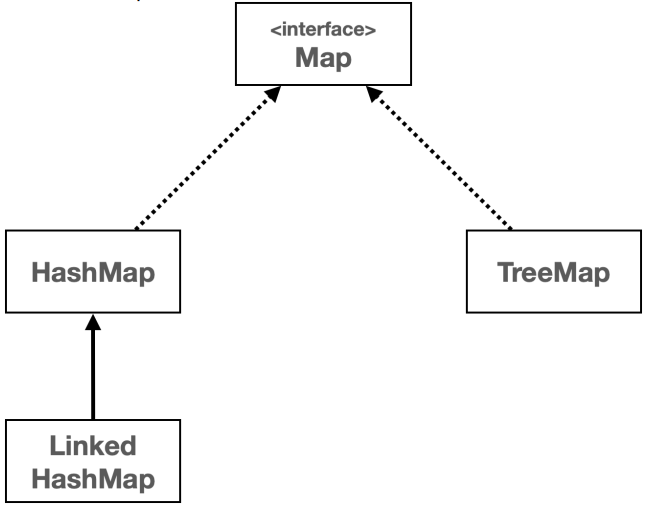
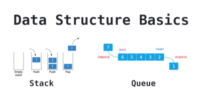
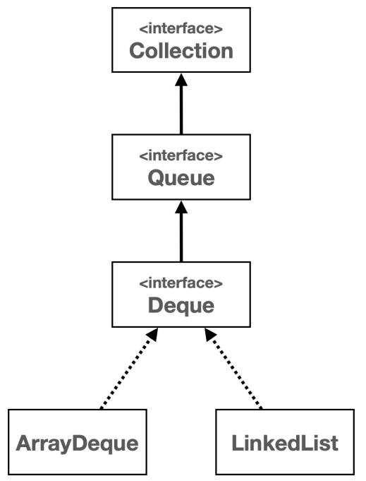
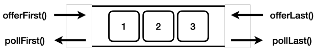

# I. Map
## A. 구조 설명
- Key-Value 쌍으로 이뤄진 데이터 구조
  - Key: 중복 불가로 유일값으로 사용. 순서를 유지하지 않음
  - Value: 중복 허용

| Key | Value |
|-----|-------|
| 학생1 | 90    |
| 학생2 | 100   |
| 학생3 | 85    |
| 학생4 | 90    |

## B. Java Map

- [java 8 document page - map](https://docs.oracle.com/javase/8/docs/api/java/util/Map.html)
- Collection interface와 상관 없으나 함께 자주 사용됨
- Hash Map 

## C. [유용한 method](../../../src/step04_middleClass2/chapter02_CollectionFramework/map/MapBasic.java)
- 생성: generic으로 Key, Value 타입 지정
```java
  Map<String, Integer> studentMap = new TreeMap<>();
```
- 데이터 추가: key는 중복 x. value는 큰상관 x
  - 같은 key를 사용하는 경우 덮어씌워짐
```java
    studentMap.put("Bob", 80);
    studentMap.put("Jack", 80);
    studentMap.put("Jill", 100);
    studentMap.put("Jill", 10);//덮어씌워짐
    
```
- 생성과 추가를 한번에..
  - Interface `Map`을 사용. 
  - 단 HashMap과 조금 달라 내부 값을 변경이 불가(불변객체)
```java
    Map<String,Integer> map2 = Map.of("B", 4, "C", 5, "D", 6);
```
- 데이터 조회: key를 사용해서 값 사용 가능
```java
    Integer bobScore = studentMap.get("Bob");
```
- KeySet: 중복x, 순서x인 Key의 집합(Set)
```java
    Set<String> keySet = studentMap.keySet();
```
- values collection: 중복 허용 but 순서 x > list는 아닌 Collection
```java
    Collection<Integer> values = studentMap.values();
```
- entries: map을 각각 사용
```java
    Set<Map.Entry<String, Integer>> entries = studentMap.entrySet();
```
- contains: key로 등록된 자료가 있는지 확인
```java
    boolean isContained = studentMap.containsKey("John");
```
- remove: 특정 값 제거
```java
    studentMap.remove("John");    
```
- [Map 이용해보기](../../../src/step04_middleClass2/chapter02_CollectionFramework/map/StudentMapMain.java)
## D. Map vs Set
- 순서가 없고 중복이 없는 Key의 특성은 Set과 같음
  - 다만 key는 Value와 1:1로 연결되어있다는 점이 다름
  - 실제로 HashSet은 HashMap을 이용해 구현되어있음
- Key를 직접 만든 객체로 삼는 경우 Set처럼 동등 비교가 진행된다
  - 온전한 기능을 만들기 위해서는 Key로 사용되는 클래스의 `equals()`와 `hashCode()`를 재정의해야함을 잊지말자
  - 재정의하지 않으면 참조값(메모리 주소)를 기준으로 비교하기때문에 사이드이펙트(원하지 않는 결과)를 반환
```java
public class HashSet<E>
    implements Set<E> //...
{
  transient HashMap<E, Object> map;//내부에서 작동하는 map
  public boolean contains(Object o) {
    return map.containsKey(o);// 사용중
  }
  public boolean add(E e) {
    return map.put(e, PRESENT)==null;// 생성시 value는 null
  }
  public boolean remove(Object o) {
    return map.remove(o)==PRESENT;// 사용중
  }
}
```
- 순서가 없고 중복은 허용하는 Value는 List와 다름. Collection 객체
- Set의 종류와 같음. 옆에 value가 있는 차이
  - HashMap: 일반적으로 사용
  - LinkedHashMap: 입력 순서를 노드로 유지
  - TreeMap: 정렬이 필요한 경우 사용
- Map 작동 원리
  - Key 해시코드 생성 -> 해시 인덱스 -> 저장
  - 저장될때 엔트리(key|value)가 함께 저장 
  - 이처럼 키와 벨류로 저장되는 방식을 hashTable
- Key는 Hash algorithm을 사용하므로 반드시 `hashCode`와 `equals`를 구현해야한다
  - value는 별도의 자료구조를 사용하지 않으므로 탐색에서 사용하지 않는 것을 권장
- 이와같은 구조를 `dictionary`라고 부르기도함
# II. Stack & Queue


## A. [Stack](../../../src/step04_middleClass2/chapter02_CollectionFramework/stack_queue/StackMain.java) 
- 아래가 막힌 통에 직사각형 블럭을 넣고 빼는 순서의 로직
- 후입선출(LIFO: Last in First out)
  - 입력: `push`
  - 출력: `pop`
  - 다음확인: `peek`
- 주의사항: Stack class 사용 금지
  - Stack 클래스는 자바 내부에 `Vector`(java 1.0) 자료구조를 사용한다. 
  - 지금은 사용되지 않으나 하위호환을 위해 남겨지있다
  - 더 좋은 자료구조가 많으므로 굳이 벡터를 사용한 스택을 사용할 필요는 없다. 
  - 차라리 `Deque` 사용이 권장된다.
## B. [Queue](../../../src/step04_middleClass2/chapter02_CollectionFramework/stack_queue)
- 아래가 뚫린 통에 블럭을 넣고 꺼내는 것
- 선입선출(FIFO: First in First out)
  - 입력: `offer`
  - 출력: `poll`
  - 다음확인: `peek`

## C. [Deque](../../../src/step04_middleClass2/chapter02_CollectionFramework/stack_queue/DequeMain.java): Double Ended Queue 
- 양 쪽에서 입출력이 가능한 유연한 자료구조
- 대표적 구현체
  - ArrayDeque: 배열 사용 - 모든 면에서 더 빠름
  - LinkedList: 노드 사용
- 기능
  - 입력
    - `offerFirst`: 앞에서 넣음
    - `offerLast`: 뒤에서 넣음
  - 출력
    - `pollFirst`: 앞에서 꺼냄
    - `pollLast`: 뒤에서 꺼냄
  - 이 외에도 `Stack`과 `Queue`의 메서드도 지원한다
    - Stack 
      - `push`: 앞에서 입력 
      - `pop`: 앞에서 출력
    - Queue: 추가적 기능이 필요없다면 굳이 `Deque`를 쓸필요는 없음
      - `offer`: 뒤에서 입력
      - `poll`: 앞에서 출력

# III. 실습 문제
## A. array to map
```
문제1 - 배열을 맵으로 전환
문제 설명
상품의 이름과 가격이 2차원 배열로 제공된다.
다음 예제를 참고해서 2차원 배열의 데이터를 Map<String, Integer> 로 변경해라.
그리고 실행 결과를 참고해서 Map 을 출력해라. 출력 순서는 상관없다.
package collection.map.test;
public class ArrayToMapTest {
 public static void main(String[] args) {
 String[][] productArr = {{"Java", "10000"}, {"Spring", "20000"}, {"JPA", 
"30000"}};
 // 주어진 배열로부터 Map 생성 - 코드 작성
 // Map의 모든 데이터 출력 - 코드 작성
 }
}
실행 결과 
제품: Java, 가격: 10000
제품: JPA, 가격: 30000
제품: Spring, 가격: 20000
```
[코드](../../../src/step04_middleClass2/chapter02_CollectionFramework/test/map/ArrayToMapTest.java)
## B. 공통 대상의 합
```
문제2 - 공통의 합
문제 설명
map1 과 map2 에 공통으로 들어있는 키를 찾고, 그 값의 합을 구해라.
실행 결과를 참고하자. 
package collection.map.test;
import java.util.HashMap;
import java.util.Map;
public class CommonKeyValueSum1 {
 public static void main(String[] args) {
 Map<String, Integer> map1 = new HashMap<>();
 map1.put("A", 1);
 map1.put("B", 2);
 map1.put("C", 3);
 Map<String, Integer> map2 = new HashMap<>();
 map2.put("B", 4);
 map2.put("C", 5);
 map2.put("D", 6);
 // 코드 작성
 }
}

실행 결과 
{B=6, C=8}
```
[코드](../../../src/step04_middleClass2/chapter02_CollectionFramework/test/map/SameKeySum.java)
## C. 같은 단어가 나타난 수
```
문제3 - 같은 단어가 나타난 수
문제 설명
각각의 단어가 나타난 수를 출력해라.
실행 결과를 참고하자. 
package collection.map.test;
import java.util.HashMap;
import java.util.Map;
public class WordFrequencyTest1 {
 public static void main(String[] args) {
 String text = "orange banana apple apple banana apple";
 // 코드 작성
 }
}

실행 결과 
{orange=1, banana=2, apple=3}
```
[코드](../../../src/step04_middleClass2/chapter02_CollectionFramework/test/map/WordFrequencyTest.java)
## D. search Price
```
문제4 - 값으로 검색
문제 설명
다음 예제에서 Map 에 들어있는 데이터 중에 값이 1000원인 모든 상품을 출력해라.
실행 결과를 참고하자. 
package collection.map.test;
import java.util.*;
public class ItemPriceTest {
 public static void main(String[] args) {
 Map<String, Integer> map = new HashMap<>();
 map.put("사과", 500);
 map.put("바나나", 500);
 map.put("망고", 1000);
 map.put("딸기", 1000);
 // 코드 작성
 }
}
실행 결과 
[망고, 딸기]
```
[코드](../../../src/step04_middleClass2/chapter02_CollectionFramework/test/map/ItemPriceTest.java)
## E. English Dictionary
```
문제5 - 영어 사전 만들기
문제 설명
영어 단어를 입력하면 한글 단어를 찾아주는 영어 사전을 만들자.
먼저 영어 단어와 한글 단어를 사전에 저장하는 단계를 거친다.
이후에 단어를 검색한다.
실행 결과를 참고하자.

package collection.map.test;
public class DictionaryTest {
 // 코드 작성
}

실행 결과 
==단어 입력 단계==
영어 단어를 입력하세요 (종료는 'q'): apple
한글 뜻을 입력하세요: 사과
영어 단어를 입력하세요 (종료는 'q'): banana
한글 뜻을 입력하세요: 바나나
영어 단어를 입력하세요 (종료는 'q'): q
==단어 검색 단계==
찾을 영어 단어를 입력하세요 (종료는 'q'): apple
apple의 뜻: 사과
찾을 영어 단어를 입력하세요 (종료는 'q'): banana
banana의 뜻: 바나나
찾을 영어 단어를 입력하세요 (종료는 'q'): hello
hello은(는) 사전에 없는 단어입니다.
찾을 영어 단어를 입력하세요 (종료는 'q'): q
```
[코드](../../../src/step04_middleClass2/chapter02_CollectionFramework/test/map/EnglishDictionary.java)
## F. MemberRepository
```
문제6 - 회원 관리 저장소
문제 설명
Map 을 사용해서 회원을 저장하고 관리하는 MemberRepository 코드를 완성하자.
Member , MemberRepositoryMain 코드와 실행 결과를 참고하자.

package collection.map.test.member;
public class Member {
 private String id;
 private String name;
 public Member(String id, String name) {
 this.id = id;
 this.name = name;
 }
 public String getId() {
 return id;
 }
 public String getName() {
 return name;
 }
 @Override
 public String toString() {
 return "Member{" +
 "id='" + id + '\'' +
 ", name='" + name + '\'' +
 '}';
 }
}

package collection.map.test.member;
public class MemberRepositoryMain {
 public static void main(String[] args) {
 Member member1 = new Member("id1", "회원1");
 Member member2 = new Member("id2", "회원2");
 Member member3 = new Member("id3", "회원3");
 // 회원 저장
 MemberRepository repository = new MemberRepository();
 repository.save(member1);
 repository.save(member2);
 repository.save(member3);
 // 회원 조회
 Member findMember1 = repository.findById("id1");
 System.out.println("findMember1 = " + findMember1);
 Member findMember3 = repository.findByName("회원3");
 System.out.println("findMember3 = " + findMember3);
 // 회원 삭제
 repository.remove("id1");
 Member removedMember1 = repository.findById("id1");
 System.out.println("removedMember1 = " + removedMember1);
 }
}

MemberRepository 코드 작성 

실행 결과 
findMember1 = Member{id='id1', name='회원1'}
findMember3 = Member{id='id3', name='회원3'}
removedMember1 = null
```
[코드](../../../src/step04_middleClass2/chapter02_CollectionFramework/test/map/MemberRepository.java)
## G. ShoppingCart
```
문제7 - 장바구니
문제 설명
장바구니 추가 - add()
장바구니에 상품과 수량을 담는다. 상품의 이름과 가격이 같으면 같은 상품이다.
장바구니에 이름과 가격이 같은 상품을 추가하면 기존에 담긴 상품에 수량만 추가된다.
장바구니에 이름과 가격이 다른 상품을 추가하면 새로운 상품이 추가된다.
장바구니 제거 - minus()
장바구니에 담긴 상품의 수량을 줄일 수 있다. 만약 수량이 0보다 작다면 상품이 장바구니에서 제거된다.
CartMain 과 실행 결과를 참고해서 Product , Cart 클래스를 완성하자.
Cart 클래스는 Map 을 통해 상품을 장바구니에 보관한다.
Map 의 Key는 Product 가 사용되고, Value는 장바구니에 담은 수량이 사용된다.

package collection.map.test.cart;
public class CartMain {
 public static void main(String[] args) {
 Cart cart = new Cart();
 cart.add(new Product("사과", 1000), 1);
 cart.add(new Product("바나나", 500), 1);
 cart.printAll();
 cart.add(new Product("사과", 1000), 2);
 cart.printAll();
 cart.minus(new Product("사과", 1000), 3);
 cart.printAll();
 }
}

==모든 상품 출력==
상품: Product{name='사과', price=1000} 수량: 1
상품: Product{name='바나나', price=500} 수량: 1
==모든 상품 출력==
상품: Product{name='사과', price=1000} 수량: 3
상품: Product{name='바나나', price=500} 수량: 1
==모든 상품 출력==
상품: Product{name='바나나', price=500} 수량: 1
```
[코드](../../../src/step04_middleClass2/chapter02_CollectionFramework/test/map/ShoppingCart.java)

## H. Stack 
### 1. 히스토리 관리
```
문제1 - 간단한 히스토리 확인
스택에 push() 를 통해서 다음 데이터를 순서대로 입력해라.
"youbute.com"
"google.com"
"facebook.com"
스택에 pop() 을 통해서 데이터를 꺼내고, 꺼낸 순서대로 출력해라.
"facebook.com"
"google.com"
"youtube.com"
입력 순서와 반대로 출력되는 것을 확인할 수 있다. 가장 마지막에 입력한 데이터가 가장 먼저 출력된다.

public class SimpleHistoryTest {
 public static void main(String[] args) {
 Deque<String> stack = new ArrayDeque<>();
 // 코드 작성
 }
}

Stack 을 사용해도 되지만 Deque 인터페이스에 ArrayDeque 구현체를 사용하는 것이 성능상 더 나은 선택
이다.
실행 결과 
facebook.com
google.com
youtube.com
```
[코드](../../../src/step04_middleClass2/chapter02_CollectionFramework/test/stack_queue/SimpleHistory.java)
### 2. 브라우저 히스토리 관리
```
문제2 - 브라우저 히스토리 관리
BrowserHistoryTest 와 실행 결과를 참고해서 BrowserHistory 클래스를 완성하자.
브라우저의 방문 기록 관리 기능을 개발하자. 다음 기능을 개발해야 한다.
visitPage() : 특정 페이지 방문
goBack() : 뒤로가기
뒤로가기는 가장 나중에 넣은 데이터가 먼저 나온다. 따라서 스택 구조를 고려하는 것이 좋다.
문제 설명 
package collection.deque.test.stack;
public class BrowserHistoryTest {
 public static void main(String[] args) {
 BrowserHistory browser = new BrowserHistory();
 
 // 사용자가 웹페이지를 방문하는 시나리오
 browser.visitPage("youtube.com");
 browser.visitPage("google.com");
 browser.visitPage("facebook.com");
 // 뒤로 가기 기능을 사용하는 시나리오
 String currentPage1 = browser.goBack();
 System.out.println("currentPage1 = " + currentPage1);
 String currentPage2 = browser.goBack();
 System.out.println("currentPage2 = " + currentPage2);
 }
}

방문: youtube.com
방문: google.com
방문: facebook.com
뒤로 가기: google.com
currentPage1 = google.com
뒤로 가기: youtube.com
currentPage2 = youtube.com

BrowserHistory 코드 작성 
package collection.deque.test.stack;
public class BrowserHistory {
 // 코드 작성
}
```
[코드](../../../src/step04_middleClass2/chapter02_CollectionFramework/test/stack_queue/BrowserHistory.java)
## I. Queue
# 1. 프린터 대기
```
문제1 - 프린터 대기
프린터에 여러 문서의 출력을 요청하면 한번에 모든 문서를 출력할 수 없다. 따라서 순서대로 출력해야 한다.
문서가 대기할 수 있도록 큐 구조를 사용하자.
"doc1", "doc2", "doc3" 문서를 순서대로 입력하고, 입력된 순서대로 출력하자.
실행 결과를 참고하자.
문제 설명 
package collection.deque.test.queue;
import java.util.ArrayDeque;
import java.util.Queue;
public class PrinterQueueTest {
 public static void main(String[] args) {
 Queue<String> printQueue = new ArrayDeque<>();
 // 코드 작성
 }
}

실행 결과 
출력: doc1
출력: doc2
출력: doc3
```
[코드](../../../src/step04_middleClass2/chapter02_CollectionFramework/test/stack_queue/PrinterQueue.java)
### 2. 작업 예약
```
문제2 - 작업 예약
서비스를 운영중인데, 낮 시간에는 사용자가 많아서 서버에서 무거운 작업을 하기 부담스럽다. 무거운 작업을 예
약해두고 사용자가 없는 새벽에 실행하도록 개발해보자.
다양한 무거운 작업을 새벽에 실행한다고 가정하자.
작업은 자유롭게 구현하고 자유롭게 예약할 수 있어야 한다.
다음 예제 코드와 실행 결과를 참고해서 TaskScheduler 클래스를 완성하자.
문제 설명 
package collection.deque.test.queue;
public interface Task {
 void execute();
}

package collection.deque.test.queue;
public class CompressionTask implements Task {
 @Override
 public void execute() {
 System.out.println("데이터 압축...");
 }
}

package collection.deque.test.queue;
public class BackupTask implements Task {
 @Override
 public void execute() {
 System.out.println("자료 백업...");
 }
}

package collection.deque.test.queue;
public class CleanTask implements Task {
 @Override
 public void execute() {
 System.out.println("사용하지 않는 자원 정리...");
 }
}

package collection.deque.test.queue;
public class SchedulerTest {
 public static void main(String[] args) {
 //낮에 작업을 저장
 TaskScheduler scheduler = new TaskScheduler();
 scheduler.addTask(new CompressionTask());
 scheduler.addTask(new BackupTask());
 scheduler.addTask(new CleanTask());
 //새벽 시간에 실행
 System.out.println("작업 시작");
 run(scheduler);
 System.out.println("작업 완료");
 }
 private static void run(TaskScheduler scheduler) {
 while (scheduler.getRemainingTasks() > 0) {
 scheduler.processNextTask();
 }
 }
}

실행 결과 
==작업 시작==
데이터 압축...
자료 백업...
사용하지 않는 자원 정리...
==작업 완료== 

TaskScheduler - 코드 작성 
package collection.deque.test.queue;
import java.util.ArrayDeque;
import java.util.Queue;
public class TaskScheduler {
 private Queue<Task> tasks = new ArrayDeque<>();
 // 코드 작성
}
```
[코드](../../../src/step04_middleClass2/chapter02_CollectionFramework/test/stack_queue/TaskScheduler.java)


