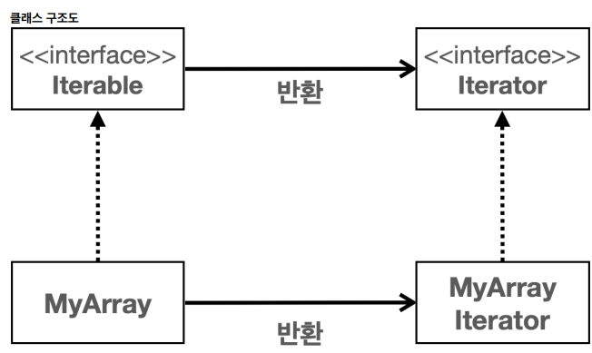
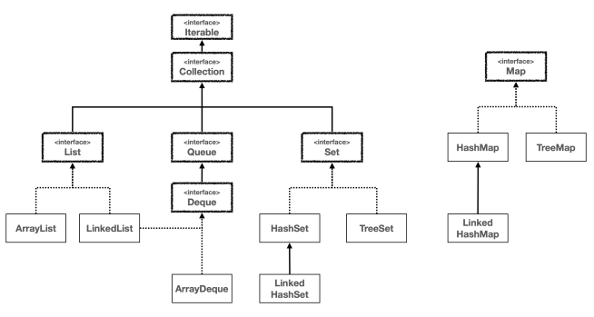

# I. 순회
- 다양한 자료구조가 있고 자료에 접근하는 방법이 다르다. 
  - ArrayList, LinkedList, HashMap, TreeMap, LinkedHashMap...
## A. Iterable, Iterator
- `Iterable`, `Iterator`: 자료구조가 갖는 자료 전체에 접근할때 내부 구조를 몰라도, 다알지 못해도 알 수 있도록 도와주는 기능을 담당
  - Iterable: 반복자를 수행할 클래스에서 구현할 인터페이스
  ```java
    public interface Iterable<T>{
      Iterator<T> iterator();
    }
  ```
  - Iterator: 반복에 필요한 기능을 갖는 인터페이스.
  ```java
    public interface Iterator<E>{
        boolean hasNext();// 순회 중 다음 포인터에 대상이 있는지 확인
        E next();// 다음의 값을 반환. 
    }
  ```

- [직접 만들기](../../../src/step04_middleC lass2/chapter02_CollectionFramework/utils/iterator/MyArrayIterator.java)
  - Iterable 사용
    ```java
    public class MyArray implements Iterable<Integer>{
        private int[] numbers;
        public MyArray(int[] numbers) {
            this.numbers = numbers;
        }
        
        @Override
        public Iterator<Integer> iterator() {
            return new MyArrayIterator(numbers);
        }
    }
    ```
  - Iterator 사용
    ```java
    public class MyArrayIterator implements Iterator<Integer> {
        private int currentIndex = -1;
        private int[] targetArr;
    
        public MyArrayIterator(int[] targetArr) {
            this.targetArr = targetArr;
        }
        @Override
        public boolean hasNext() {
            return currentIndex < targetArr.length -1;// index 기준 마지막 항목
        }
    
        @Override
        public Integer next() {
            return targetArr[++currentIndex];//증가 시키고 해당 항목 전달
            //hasNext()로 체크하지 않으면 예외
        }
    }
    ```
  - main
    ```java
        public static void main(String[] args) {
            MyArray myArray = new MyArray(new int[]{3,4,5,6});
            Iterator<Integer> iterator = myArray.iterator();
            while (iterator.hasNext()) {
                System.out.println(iterator.next());
            }
        }
    ```
## B. enhanced For Loop
- `Iterable`을 사용하면 향상된 for 문을 사용할 수 있다.  
- `forEach`도 사용 가능해진다
```java
        for(Integer i : myArray) {
            System.out.print(i+"\t");
        }
        myArray.forEach(System.out::print);
```
## C. 자바의 Iterable
- `Collection`의 부모가 `Iterable` 
  - `Map`은 key - value 구조이므로 별도의 메서드로 Collection 객체로 만들어 순회시킬 수 있다. 
    - `keySet()`, `values()`, `entrySet()`
  - Collection의 내부 구조는 보이지 않지만 사용자가 사용할 수 있고, 코드 재사용성도 


```java
import java.util.*;

public static void main(String[] args) {
  useEnhancedForLoop(new LinkedList<Integer>());
  useEnhancedForLoop(new HashSet<Integer>());
  useEnhancedForLoop(new ArrayDeque<Integer>());
//  ....
}

private static void useEnhancedForLoop(Iterator<Integer> iterator) {
  //generic이 일치하는 모든 컬렉션에서 사용 가능
  for (Integer i : iterator)
    System.out.println(i);
}
```
# II. 정렬
## A. [가장 단순한 정렬](../../../src/step04_middleClass2/chapter02_CollectionFramework/utils/comparator/ArraySortMain.java)
```java
for(int i=0;i<arr.length-1;i++){
    for(int j=0 ; j<arr.length - 1 - i ; j++){
        if(arr[j]>arr[j+1]){// 비교
            int temp = arr[j];
            arr[j] = arr[j+1];//변경
            arr[j+1] = temp;
        }
    }
}
```
- 반복을 통한 정렬은 효율이 좋지 않음
  - 자바 초기: 퀵 소트
  - 현재: 평균 `O(n log n)`
    - 데이터가 작을때(32개 이하): Dual-Pivot QuickSort
    - 데이터가 많을때: TimSort
## B. 정렬의 시작은 비교자
  - Comparable: 직접 만든 객체에 기본 비교 로직을 지원
  - Comparator: sort()에 인수로 들어가는 비교연산 객체
### 1. [Comparator](../../../src/step04_middleClass2/chapter02_CollectionFramework/utils/comparator/SortMain1.java)
```java
public interface Comparator<T>{
  /**
   * @return int 
   * 첫 인수가 작으면 음수 반환(-1)
   * 두 값이 같으면 0
   * 첫 인수가 크면 양수 반환(1)
   */
    int compare(T o1, T o2);// 비교 메서드 구현
}
```
- 오름차순
```java
static class AscComparator implements Comparator<Integer> {
@Override
public int compare(Integer o1, Integer o2) {
    System.out.println("o1: " + o1 + " / o2: " + o2);
    return (o1 < o2) ? -1 : ((o1 == o2) ? 0 : 1);
    }
}
```
- 내림차순
```java
static class DescComparator implements Comparator<Integer> {
    @Override
    public int compare(Integer o1, Integer o2) {
        return ((o1<o2)?-1:(o1==o2) ?0 :1) * -1;
    }
}
```
- 비교 처리하는 곳에서 인자로 전달
```java
    Arrays.sort(arr,new AscComparator());
```
- 역방향 정렬을 지원해줌
  - ASC.reversed() -> DESC
```java
    Arrays.sort(arr,new AscComparator().reversed()); // == DescComparator
```
### 2. [Comparable](../../../src/step04_middleClass2/chapter02_CollectionFramework/utils/comparator/SortMain2.java)
- 직접 만든 객체가 기본적으로 비교 방식을 처리하도록 돕는 인터페이스
  - 별도의 비교자(Comparator)를 처리하지 않는 이상 기본 적용
```java
public class MyUser implements Comparable<MyUser> {
    private String id;
    private int age;

    //...

    @Override
    public int compareTo(MyUser o) {
        return age-o.age;
    }
}
```
- Comparable이나 Comparator 둘 중 하나도 없이 sort()를 호출하면 문제가 발생한다. 
  - ClassCastException
## C. 자료구조에 적용하기
- 당연한 말이지만 Set과 같이 순서가 없는 자료구조에는 쓸 수 없다
### 1. [List](../../../src/step04_middleClass2/chapter02_CollectionFramework/utils/comparator/ListSort.java)
- 객체에 있는 메서드(권장)
```java
    list.sort(null);//기본 정렬(Comparable)
    list.sort(new IdComparator());//비교자 사용
```
- Collections 사용
```java
    Collections.sort(list);//Collections 가능
    Collections.sort(list, new IdComparator());
```
### 2. [Tree](../../../src/step04_middleClass2/chapter02_CollectionFramework/utils/comparator/TreeSort.java)
- tree 구조는 데이터를 넣을때부터 비교가 진행되므로 비교자(Comparable, Comparator)가 필수
```java
    //MyUser 기본 비교자
    TreeSet<MyUser> users = new TreeSet<MyUser>();
    users.add(m1);
    users.add(m2);
    users.add(m3);

    //외부 비교자
    TreeSet<MyUser> users2 = new TreeSet<MyUser>(new IdComparator());
    users2.add(m1);
    users2.add(m2);
    users2.add(m3);
```
- 자바의 정렬 알고리즘이 이미 잘 되어있으므로 직접 구현하기보다 있는걸 잘쓰는걸로
# III. Collection 관련 유틸
## A. [Collections class](../../../src/step04_middleClass2/chapter02_CollectionFramework/utils/collections/CollectionsSortMain.java)
- `Collections.max(list)`: 리스트 중 최대값(comparator 기준)
- `Collections.min(list)`: 리스트 중 최소값(comparator 기준)
- `Collections.sort(list);`: 정렬. Comparator를 두번째 인자로 전달할 수 있다
- `Collections.shuffle(list);`: 혼합. 내부에 `Random` 객체를 사용. 직접 인스턴스를 인자로 전달할 수있다.
- `Collections.reverse(list);`: 역순. 리스트의 순서를 역순으로 배치
## B. [편하게 불변 Collection 생성하기](../../../src/step04_middleClass2/chapter02_CollectionFramework/utils/collections/OfMain.java)
- `of()`를 사용해 만든 자료는 불변 객체를 생성
```java
    List<Integer> list = List.of(1, 2, 3, 4, 5, 6, 7, 8, 9, 10);
    list.set(2,99);//Immutable object is modified 
    Set<Integer> set = Set.of(1, 2, 3, 4, 5, 6, 7, 8, 9, 10);
    Map<String, Integer> map = Map.of("a", 1, "b", 2, "c", 3, "d", 4);
```
- 구현된 인스턴스의 이름: ImmutableCollections
```
list: java.util.ImmutableCollections$ListN
set: java.util.ImmutableCollections$SetN
map: java.util.ImmutableCollections$MapN
```
- 다시 가변 컬렉션으로 생성: 생성자의 인수로 불변 컬랙션 전달
```java
ArrayList<Integer> mutableList = new ArrayList<>(list);
```
- 가변 컬렉션 -> 불변 컬렉션: `Collections.unmodifiableList()`
```java
Collections.unmodifiableList(mutableList);
```
- 빈 리스트 : 데이터가 없는 경우 `null`보다 빈 배열(`[]`)을 전달하는 것이 더 좋을 수 있다

```java
import java.util.Collections;//가변 리스트
List<Integer> list = new ArrayList<>();
List<Integer> list2 = new LinkedList<>();
//불변 리스트
List<Integer> unmodifiableList = Collections.emptyList();//java 5 Collections$Empty$List
List<Integer> unmodifiableList2 = List.of();//java 9 ImmutableCollections$List
```
## C. 배열 > 리스트로 전환
- `Arrays.asList(...elements)`: java 1.2부터 사용. 요소의 값은 변경(set)할 수 있지만 길이 변경(add, remove)은 불가하다. 
- `List.of(...elemnets)`: 불변리스트 반환. 권장(java 9 하위 버전인 경우를 제외하고)
- 둘다 배열을 인수로 전달할 수 있다. 
  - asList: 배열을 그대로 사용
    - 배열이 매우 큰 경우 효과적
  - of: 요소를 가지고 새로운 리스트 생성
    - 그외 모두 효과적
```java
    static <E> List<E> of(E... elements) {
        switch (elements.length) { // implicit null check of elements
            case 0:
                @SuppressWarnings("unchecked")
                var list = (List<E>) ImmutableCollections.EMPTY_LIST;
                return list;
            case 1:
                return new ImmutableCollections.List12<>(elements[0]);
            case 2:
                return new ImmutableCollections.List12<>(elements[0], elements[1]);
            default:
                return ImmutableCollections.listFromArray(elements);
        }
```
## D. 멀티스레드 사용시 동기화 문제 처리(synchronized)
- 멀티스레드 사용시 여러 시점에서 데이터에 접근할 수 있는데 이때 동기화 처리시 문제가 발생할 수 있다. 이때를 위해 동기화 처리를 자바가 지원
```java
    System.out.println("list : "+list.getClass().getName());
    List<Integer> synchronizedList = Collections.synchronizedList(list);
    System.out.println("synchronizedList className: "+synchronizedList.getClass().getName());
```

# IV. Collection Framework 정리
- Collection framework
  - 일관성: 다양한 컬렉션의 하위 클래스, 인터페이스에서 작업의 일관성을 확보할 수 있다.
  - 재사용성, 다형성: 또한 다형성을 통해 코드 재사용성을 키울 수 있다.
  - 확장성: 새로운 컬렉션 타입을 개발할때 Collection 타입을 통해 구현할 수 있고 사용처의 수정없이 사용할 수 있다. 
- Interface
  - List: 순서가 있고 중복이 허용됨
    - 구현체: ArrayList, LinkedList
  - Set: 순서가 없고 중복이 불가함
    - 구현체: HashSet, LinkedHashSet, TreeSet
  - Queue: 요소를 사용되면 사라지게끔 만들어 임시로 보관하는 용도
    - 구현체: LinkedList, ArrayDeque, PriorityQueue
  - Map: 키와 값 쌍으로 보관. 직접 Collection을 상속하지 않지만 key, value, entry의 집합은 Collection 타입을 사용한다
    - 구현체: HashMap, LinkedHashMap, TreeMap
- 실무에서는 거의... 
  - 보통 데이터 정렬은 DB 수준에서 처리. 
  - 이미 전달된 데이터를 수정하는 경우는 드물다
    - List -> ArrayList
    - Set -> HashSet
    - Map -> HashMap
    - Queue -> ArrayDeque
# V. 실습문제
```
카드 게임을 만들어보자.
요구사항
    카드( Card )는 1 ~ 13까지있다. 각 번호당 다음 4개의 문양이 있다.
    ♠: 스페이드
    ♥: 하트
    䡫: 다이아
    ♣: 클로버
    예) 1(♠), 1(♥), 1(䡫), 1(♣), 2(♠), 2(♥), 2(䡫), 2(♣) ... 13(♠), 13(♥), 13(䡫), 13(♣)
    따라서 13 * 4 = 총 52장의 카드가 있다.
    52장의 카드가 있는 카드 뭉치를 덱( Deck )이라 한다.
    2명의 플레이어( Player )가 게임을 진행한다.
    게임을 시작하면 다음 순서를 따른다.
    1. 덱에 있는 카드를 랜덤하게 섞는다.
    2. 각 플레이어는 덱에서 카드를 5장씩 뽑는다.
    3. 각 플레이어는 5장의 카드를 정렬된 순서대로 보여준다. 정렬 기준은 다음과 같다.
    작은 숫자가 먼저 나온다.
    같은 숫자의 경우 ♠, ♥, 䡫, ♣ 순으로 정렬한다. ♠가 가장 먼저 나온다.
    예) 1(♠), 1(♥), 2(䡫), 3(♣) 순서로 출력된다.
    4. 카드 숫자의 합계가 큰 플레이어가 승리한다.
    게임을 단순화 하기 위해 숫자만 출력한다.
    합계가 같으면 무승부이다.

실행 결과 예시 
    플레이어1의 카드: [2(♠), 7(♥), 7(♦), 8(♣), 13(♠)], 합계: 37
    플레이어2의 카드: [1(♠), 1(♣), 6(♠), 9(♠), 9(♣)], 합계: 26
    플레이어1 승리 
    
    플레이어1의 카드: [2(♦), 3(♠), 6(♥), 10(♣), 13(♦)], 합계: 34
    플레이어2의 카드: [2(♠), 4(♣), 5(♠), 11(♣), 12(♥)], 합계: 34
    무승부

참고
스페이드, 하트 같은 아이콘을 직접 사용하기 어려운 경우 다음과 같이 \ (백슬래시 backslash)와 함께 다음 코드를 적
어주면 아이콘을 출력할 수 있다.
"\u2660" : 스페이드(♠)
"\u2665" : 하트(♥)
"\u2666" : 다이아몬드(䡫)
"\u2663" : 클로버(♣)
예) System.out.println("\u2660")

이 문제는 정해진 정답이 없다. 실행 결과 예시를 참고하되, 자유롭게 풀면 된다.
CardGameMain 에 main() 메서드를 만들고 시작하자. 필요하면 클래스를 추가해도 된다.
CardGameMain - 코드 작성
package collection.compare.test;
public class CardGameMain {
 public static void main(String[] args) {
 // 코드 작성
 }
}
```

[내가 한 코드](../../../src/step04_middleClass2/chapter02_CollectionFramework/test/myCardGame)

[강의 코드](../../../src/step04_middleClass2/chapter02_CollectionFramework/test/cardGame)