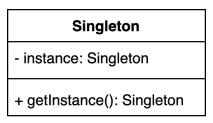
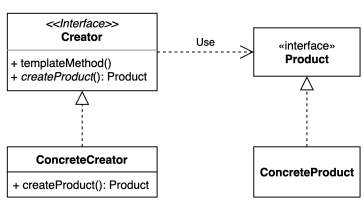
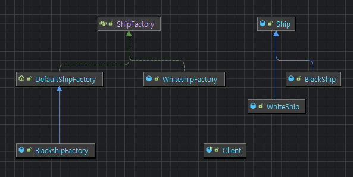

- 객체 생성과 관련된 패턴
# I. [Singleton pattern](../../src/step05_designPatterns/singleton)
- 인스턴스를 `오직 한 개만` 제공하는 클래스
- 시스템 런타임, 환경 세팅에 대한 정보 등을 하나의 인스턴스로 생성해 글로벌하게 접근하도록 하는 방식


## A. 하나의 인스턴스를 사용해야하는 이유
- 여러 인스턴스는 각각의 정보를 담기때문에 일정한 정보가 유지되지 않는다
```java
public static void main(String[] args){
    //setting을 관리하는 인스턴스가 여러번 생성됨
    Settings setting = new Settings();
    Settings setting1 = new Settings();
    //생성된 인스턴스들이 같지 않음
    System.out.println("settings1 == settings2: "+ (settings1 == settings2));
}
```
- 일정한 상태를 유지하고 인스턴스를 반복해서 생성할 필요가 없는 경우 사용
## B. 가장 단순한 방법: 단일쓰레드에서만 사용
- 생성자 private
- 내부에 private instance 보관
- 그것을 관리하는 메서드 사용
```java
public class Settings {
    private static Settings instance;
    private Settings(){}
    public static Settings getInstance(){
        if(instance == null){
            instance = new Settings();
        }
        return instance;
    }
}
```
- 한계 
  - 멀티쓰레드 환경에서 안전하지 않음
    - ex) 동시에 접근하는 경우
      - 인스턴스가 null인 상태에서 여러쓰레드가 들어온 경우 둘다 null 상태이므로 둘다 if문 속 생성자에 접근가능
## C. 멀티쓰레드 환경에서 안전하게 구현하기
### 1. 동기화를 위한 `synchronized` 삽입
- 동시에 여러 스레드 접근 불가
```java
    public static synchronized Settings getInstance(){
        if(instance == null){
            instance = new Settings();
        }
        return instance;
    }
```
- 단점: 동기화처리 작업으로 인해 성능이 느릴 수 있다
### 2. Eager initalization: 이른 초기화
- 객체를 미리 생성해두고 호출만 진행
- 클래스 정보가 메서드 영역에서 저장될때 미리 객체를 생성해 보관
```java
public class Settings {
    private static final Settings INSTANCE = new Settings();
    private Settings(){}
    public static Settings getInstance(){
//        if(instance == null){
//            instance = new Settings();
//        }
        return INSTANCE;
    }
}
```
- 단점: 인스턴스 생성이 무거운 경우 미리 만들어둘때 과도한 자원 소모가 일어남. 
- 인스턴스를 쓰지 않음에도 필요
### 3. double checked locking
- java 1.5 이상부터 사용가능
- `volatile`:  모든 스레드가 항상 같은 공유 변수의 값을 읽어올 수 있도록 보장
- 인스턴스 null checking을 두번 진행
```java
    //volatile: CPU의 휘발성 메모리에 넣어 공유변수 값을 읽어오도록
    private static volatile Settings instance;
    private Settings(){}
    public static Settings getInstance(){
        //null일때만 동기화처리 locking
        if(instance == null){ 
            // 동시에 두 스레드가 if문 진입해도 동기화락
            synchronized(Settings.class){
                if(instance == null){// 동기화 처리 상태에서 null check
                    instance = new Settings();
                }
            }
        }
        return instance;
    }
```
### 4. static inner class: lazy initialization
- 정적 중첩 클래스를 사용해 인스턴스를 관리한다. 
- 권장되는 방식
```java
    private Settings(){}
    private static class SettingsHolder{
        private static final Settings INSTANCE = new Settings();
    }
    public static Settings getInstance(){
        return SettingsHolder.INSTANCE;
    }
```
- 싱글톤 패턴 구현 방법을 깨뜨리는 방법이 있음
## D. 싱글톤 패턴 구현방법을 깨뜨리는 방법
- 개발한 의도와 관계없이 사용자 측에서 깨뜨릴 수 있음
### 1. 리플렉션
```java
    //use reflection
    try{
        Constructor<Settings> constructor = Settings.class.getDeclaredConstructor();
        constructor.setAccessible(true);
        Settings setting2 = constructor.newInstance();
        System.out.println("use reflection : " + (settings == settings2));//false
    }catch (NoSuchMethodException ne){
        ne.printStackTrace();
    } catch (InvocationTargetException e) {
        throw new RuntimeException(e);
    } catch (InstantiationException e) {
        throw new RuntimeException(e);
    } catch (IllegalAccessException e) {
        throw new RuntimeException(e);
    }
```
### 2. 직렬화 - 역직렬화 사용
- 우선 직렬화를 하려면 `Serializable` 인터페이스 구현
```java
public class Settings implements Serializable {...}
```
- 보통 직접 역직렬화를 쓰는 경우는 없으나 이런 경우가 있다는 점만 기억
```java
    //직렬화
    Settings setting3 = Settings.getInstance();
    try(ObjectOutput out = new ObjectOutputStream(new FileOutputStream("settings.obj"))) {
        out.writeObject(setting3);
    }catch (FileNotFoundException e) {
        throw new RuntimeException(e);
    } catch (IOException e) {
        throw new RuntimeException(e);
    }
    Settings setting4 = null;
    //역직렬화
    try(ObjectInput in = new ObjectInputStream(new FileInputStream("settings.obj"))){
        setting4 = (Settings) in.readObject();
    } catch (FileNotFoundException e) {
        throw new RuntimeException(e);
    } catch (IOException e) {
        throw new RuntimeException(e);
    } catch (ClassNotFoundException e) {
        throw new RuntimeException(e);
    }
    System.out.println("serialization: " + (setting4 == setting3));//false
```
- 역직렬화 대응방안: create readResolve method
```java
    protected Object readResolve(){
        return getInstance();
    }
```
## E. Enum 사용
- 안전하고 단순하게 구현됨
- 리플렉션을 이용한 파괴를 방지
- 미리 객체가 생성되어있다는 점만 제외하면 방지가 됨
```java
SettingEnum setting6 = null;
//모든 생성자 가져오기
Constructor<?>[] constructors = SettingEnum.class.getDeclaredConstructors();
for(Constructor<?> constructor : constructors){
    constructor.setAccessible(true);//private 접근 허용
    setting6 = (SettingEnum) constructor.newInstance("INSTANCE");
    //enum에서 reflection 방지:  Cannot reflectively create enum objects
}
System.out.println("use reflection : " + (setting6==setting5));//false****
```
- `show bytecode`로 생성된 코드 살펴보기
- enum도 싱글톤을 구현하는데 권장되는 방법 중 하나

## F. 혼자 정리해보기

<details>
  <summary> 
    자바에서 enum을 사용하지 않고 싱글톤 패턴을 구현하는 방법 
  </summary> 
  <ul>
    <li>synchronized 사용</li>
    <li>Eager Initialization</li>
    <li>double checked locking</li>
    <li>static inner class</li>
  </ul>
</details>
<details>
  <summary>
    private 생성자와 static 메소드를 사용하는 방법의 단점    
  </summary>
  <ul>
    <li>
      멀티쓰레드 환경에서 여러쓰레드가 접근했을때 의도와 달리 별개의 인스턴스 여러개가 생성될 수 있음
    </li>
  </ul>
</details>
<details>
  <summary>
    enum을 사용해 싱글톤 패턴을 구현하는 방법의 장점과 단점    
  </summary>
  <ul>
    <li>
      장점1: Enum을 상속받아 이미 구현된 코드를 사용할 수 있어 단순하게 구현 가능. 
    </li>
    <li>
      장점2: 싱글톤을 깨뜨릴 수 있는 여러 요인이 미리 막혀있음(역직렬화, 리플렉션)
    </li>
    <li>
      단점: 미리 생성해놓기 때문에 초기 자원소모가 커지고, 자원 낭비가 될 수 있다
    </li>
  </ul>
</details>
<details>
  <summary>
        static inner class를 사용해 싱글톤 패턴을 구현  </summary>
  </summary>
  <ul style="list-style: none; padding-left: 0">
<li>

```java
private Settings(){}
private static class SettingsHolder{
    private static final Settings INSTANCE = new Settings();
}
public static Settings getInstance(){
    return SettingsHolder.INSTANCE;
}
```
</li>
  </ul>
</details>

## G. java와 spring에서 찾아보는 패턴
### 1. Java
- Runtime: JVM의 실행환경 정보를 갖고 있음
```java
public static void main(String[] args) {
    Runtime runtime = Runtime.getRuntime();
    System.out.println(runtime.maxMemory());
    System.out.printf(String.valueOf(runtime.freeMemory()));
}
```
### 2. Spring
- 자바가 자주 사용되는 프레임워크
- Application 관리를 담당하는 ApplicationContext
  - class/Annotation/XML 등 다양한 방법으로 설정을 관리할 수 있음
  - main()에서 어떻게 접근할 것인지를 결정
```java
public static void main(String[] args){
  ApplicationContext applicationContext = new AnnotationConfigApplicationContext(SpringConfig.class);
}
```
- `@Bean`으로 필요한 데이터를 싱글톤으로 관리하도록 함
  - 설정을 관리하는 곳에서 미리 생성해 들고 있도록 함
  - 다만 엄밀히 따지자면 singleton pattern과 다른 singleton scope 방식
    - ApplicationContext 안에서 유일한 객체로 사용하기에 유사한 이유로 사용
```java
@Configuration
public class SpringConfig{
    @Bean
    public String hello(){
        return "hello";
    }
}
```
- 설정된 `Bean`이 같은 것인지 확인
```java
public static void main(String[] args){
  ApplicationContext applicationContext = new AnnotationConfigApplicationContext(SpringConfig.class);
  String hello1 = applicationContext.getBean("hello",String.class);
  String hello2 = applicationContext.getBean("hello",String.class);
  System.out.printf(hello2==hello1);//같은 인스턴스(참조주소 기준)인지 확인
}
```
### 3. 기타
- 이 외에도 다른 디자인 패턴(builder, facade, abstract factory 등) 구현체의 일부로 쓰이기도함

# II. [Factory method pattern](../../src/step05_designPatterns/factoryMethod)
- 구체적으로 어떤 인스턴스를 만들지는 서브 클래스가 정한다
- 인스턴스 생성의 책임을 추상적인 인터페이스로 감싸는 것
- 예시: 다양한 구현체(Product)가 있고 그 중 특정한 구현체를 만들 수 있는 다양한 팩토리(Creator)를 제공할 수 있다.

- 팩토리 인터페이스(Creator interface)의 구현체(ConcreteCreator class)가 의존하는 인터페이스(Product interface)의 구현체(ConcreteProduct class)를 생성하도록 함
- OCP를 만족하도록 도움
## A. 필요한 이유
### 1. 예제
- client
```java
public class Client {
    public static void main(String[] args) {
        Client client = new Client();
        
        Ship whiteship = ShipFactory.orderShip("Whiteship","keesss@mail.com");
        System.out.println(whiteship);
        
        Ship blackship = ShipFactory.orderShip("Blackship","keesss@mail.com");
        System.out.println(blackship);
    }
}
```
- factory
```java
public class ShipFactory {
    //validate
    public static Ship orderShip(String name, String email){
        if(name==null || name.isBlank()){
            throw new IllegalArgumentException("배 이름을 지어주세요");
        }
        if(email==null || email.isBlank()){
            throw new IllegalArgumentException("연락처를 남겨주세요");
        }

        prepareFor(name);

        Ship ship = new Ship();
        ship.setName(name);

        //customizing for specific name
        if(name.equalsIgnoreCase("Whiteship")){
            ship.setLogo("\uD83D\uDEE5");
        }else if(name.equalsIgnoreCase("Blackship")){
            ship.setLogo("\uD8BD\uDEA5");
        }

        //coloring
        if(name.equalsIgnoreCase("Whiteship")){
            ship.setColor("white");
        }else if(name.equalsIgnoreCase("Blackship")){
            ship.setColor("black");
        }

        //notify
        sendEmailTo(email, ship);

        return ship;
    }
    private static void prepareFor(String name){
        System.out.printf("%s 만들 준비 중\n",name);
    }
    private static void sendEmailTo(String email, Ship ship){
        System.out.printf("to %s: \n\t %s 제작 완료. \n\t %s\n",email,ship.getName(),ship);
    }
}
```
- product
```java
public class Ship {
    private String name;
    private String logo;
    private String color;

    //getter and setter
    //overrided toString
}
```
### 2. 단점
- 새로운 객체가 필요할때 전체 코드의 수정이 필요하게됨
  - 배가 추가(확장)되면 client가 매번 변경되어야함
  - 유지보수에 좋지 않음
- 확장에는 열려있고 변경에는 닫혀야한다
  - 변경된 것에의해 다른 코드가 변경되지 않도록
  - 코드의 확장에는 열려있도록
## B. [적용해보기](../../src/step05_designPatterns/factoryMethod/ex01_usePattern) 
- 변하지 않는 부분은 계속 내부에 두고
- 달라지는 부분은 밖으로 빼서 method로(인터페이스에서 규정만 하도록)
  - 특히 제어문
- interface 만들기(기존은 WhiteshipFactory로 변경)
  - java 11 이상: default/private으로 내장 클래스를 사용할 수 있음
  - 그 이하: 중간에 추상 클래스를 만들어 내장 클래스 사용
- 중간에 추상 클래스가 들어간 경우
  - 공정 내에서 필요에따라 공정을 진행하면되는 것. 
  - 반드시 인터페이스, 반드시 추상메서드가 정해진 것은 아님
```java
public abstract class DefaultShipFactory implements ShipFactory{
    @Override
    public void sendEmailTo(String email, Ship ship){
        System.out.printf("to %s: \n\t %s 제작 완료. \n\t %s\n",email,ship.getName(),ship);
    }
}
```


- 각 구현체의 특이 공정을 재정의(overriding)하여 사용하도록 함
- Blackship을 추가(확장)했지만 이전 코드의 변경이 없음
  - client code의 변경을 최소화하기위해 의존성 주입(Dependency Inspect)
- 다형성을 사용해 client 부의 코드를 변경하지 않도록함
  - 일종의 의존성 역전
```java
private void print(ShipFactory shipFactory, String shipName, String email) {
      System.out.println(shipFactory.orderShip(shipName, email));
}
```
## C. 복습

<details>
  <summary> 
    팩토리 메소드 패턴을 적용했을 때 장점과 단점 
  </summary> 
  <ul>
    <li> 
      내답: 장점은 OCP를 만족시켜 운영 및 유지보수할때 안정성이 높다. 단점은 객체를 관리하는 코드가 분산되고 구조가 복잡해져서 한번에 파악하기 힘들어진다
    </li>
    <ul>
      <li> 
        장점: 기존의 인스턴스를 생성하는 코드를 변경하지않고 새로운 인스턴스를 만드는 로직을 생성할 수 있다. creator와 product의 연결을 느슨하게 함(loosely coupling)으로써 서로의 의존성을 낮춰 OCP를 만족하도록한다. 코드를 건드리지 않으므로 복잡해지지 않는다. 
      </li>
      <li> 
        단점: 기능을 나누고 분리하다보니 클래스가 늘어난다. 단순한 구조가 점점 복잡해진다. 
      </li>
    </ul>
  </ul>
</details>
<details>
  <summary> 
    확장에 열려있고 변경에 닫혀있는 객체지향 원칙 설명
  </summary> 
  <ul>
    <li>
      내 답: 아이템이 추가되거나 기능이 세분화되는 등 기능의 확장에는 열려 있고 확장으로 인한 다른 코드들의 변경에는 닫혀있어 유지보수의 효율을 높히는 전략 
    </li>
    <li>
      강의: 기존 코드를 변경하지 않으면서 새로운 기능을 확장할 수 있다는 객체지향 원칙
    </li>
  </ul>
</details>
<details>
  <summary> 
    자바 8에 추가된 default method 설명
  </summary> 
  <ul>
    <li>내 답: 같은 패키지 소속에서 접근할 수 있도록하는 제어자. protected는 거기에 상속관계에 있는 대상이 추가됨. 주로 Interface 내에 구현부가 완성된 상태에서 default 구현을 포함한다 </li>
    <li>강의: 이전에는 인터페이스에서 추상메서드만 사용하고 구현된 클래스에서 만들었으나 인터페이스 내에 기본 메서드를 구현할 수 있도록 돕는 접근제어자. java 9는 인터페이스에서 private method도 구현 가능하다</li>
  </ul>
</details>

## D. java와 spring에서 찾아보는 패턴
### 1. [단순한 팩토리 패턴](../../src/step05_designPatterns/factoryMethod/SimpleFactoryMethodExample.java)
- 매개변수의 값에 따라 또는 메소드에 따라 각기 다른 인스턴스를 리턴하는 단순한 버전의 팩토리 패턴
```java
public class SimpleFactory {
    public Object createProduct(String name){
        if(name.equals("whiteship")){
            return new WhiteShip();
        }
        else if(name.equals("blackship")){
            return new BlackShip();
        }
        throw new IllegalArgumentException("no data");
    }
}
```
- java.lang.Calendar or java.lang.NumberFormat
### 2. Spring Bean Factory
- Object 타입의 Product를 만드는 BeanFactory라는 Creator
- Spring의 핵심적인 IoC 컨테이너 : Bean factory
```java
public static void main(String[] args) {
    BeanFactory xmlFactory = new ClassPathXmlApplicationContext("config.xml");
    xmlFactory.getBean("username",String.class);
    
    Bean javaFactory = new AnnotationConfigApplicationContext(Config.class);
    javaFactory.getBean("id", String.class);
}
```
# III. 