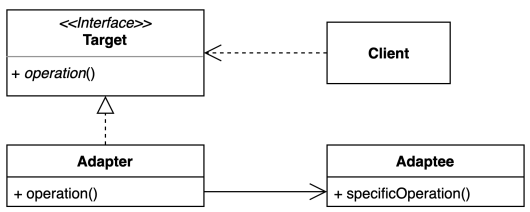
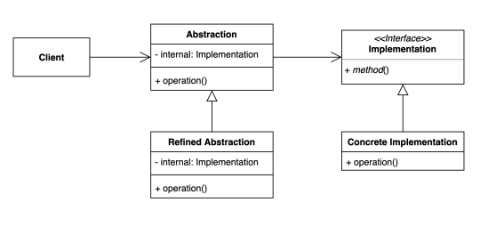

- 구조적인 패턴(Structural Patterns): 만들어내는 패턴과 달리 구조적 패턴

# I. Adepter
- 서로 맞지 않는 두 대상을 연결하기 위해 중간에서 연결을 중재하는 역할
  - 220V 냉장고 - 변압기(어댑터) - 110V 코드
- 클라이언트가 사용하는 인터페이스와 기존 코드의 인터페이스가 다를때 이를 조정해주는 역할
- 주로 기존 코드를 클라이언트가 사용하는 인터페이스에 맞게 구현체(Adeptee)로 변경
- ex) security package와 account package(Adeptee)의 간극을 매워줄 어댑터 구성이 필요

## A. Adepter 만들기
- client가 어떤 인터페이스를 사용하는지 확인
  - client: LoginHandler
  - 사용 중인 인터페이스: UserDetailsService
- [Account와 User 연결하기](../../src/step05_designPatterns/adapter/after/AccountUserDetailsService.java)
    - 서드 파티 앱을 만들때 타겟이나 이전 코드를 손댈 수 없을때 새로운 클래스를 만들어 사용
    - 인터페이스를 구현받아 사용
```java
public class AccountUserDetailsService implements UserDetailsService {

    AccountService accountService;
    public AccountUserDetailsService(AccountService accountService) {
        this.accountService = accountService;
    }

    @Override
    public UserDetails loadUserByUsername(String username) {
        Account account = accountService.findAccountByUsername(username);
        return new AccountUserDetails(account);
    }
}
```
```java
public class AccountUserDetails implements UserDetails {
    private Account account;
    public AccountUserDetails(Account account) {
        this.account = account;
    }

    @Override
    public String getUsername() {
        return this.account.getName();
    }

    @Override
    public String getPassword() {
        return this.account.getPassword();
    }
}
```
- 사용 예
```java
public static void main(String[] args) {
    // 동작 체크용
    AccountService accountService = new AccountService();
    UserDetailsService userDetailsService = new AccountUserDetailsService(accountService);
    LoginHandler loginHandler = new LoginHandler(userDetailsService);
    String login = loginHandler.login("admin", "admin");
    System.out.println(login);
}
```
- 직접 Account와 AccountService를 직접 수정할 수 있다면 UserDetails와 UserDetailsService를 직접 구현하도록함
    - 클래스를 줄여 복잡도를 줄일 수 있다
    - 단일책임 원칙에는 조금 위배
```java
public class Account implements UserDetails{...}
```
```java
public class AccountService implements UserDetailsService{...}
```
## B. 장점과 단점
- 장점
  - 기존 코드를 변경하지 않고 원하는 인터페이스 구현체를 만들어 사용할 수 있다. => OCP 
  - 기존 코드가 하던 일과 특정인터페이스 구현체로 변환하는 작업을 각기 다른 클래스로 분리하여 관리할 수 있다 => SRP
- 단점
  - 새 클래스가 생겨 복잡도 증가. 경우에 따라서는 기존 코드가 해당 인터페이스를 구현하도록 수정하는 것이 좋은 선택일 때도 있다.
## C. java and spring
### 1. [java](../../src/step05_designPatterns/adapter/AdepterInJava.java)
- Collection 타입 사이의 어뎁터들
```java
    //Arrays.asList: Array -> List
    List<String> list = Arrays.asList("a", "b", "c");
    //List -> enumeration
    Enumeration<String> enumeration = Collections.enumeration(list);
    //enumeration -> ArrayList
    ArrayList<String> arrayList = Collections.list(enumeration);
```
- 입출력 관련 작업
```java
        try(
                // String -> InputStream
            InputStream is = new FileInputStream("input.txt");
                // InputStream -> InputStreamReader
            InputStreamReader isr = new InputStreamReader(is);
                // InputStreamReader -> BufferedReader
            BufferedReader reader = new BufferedReader(isr);
        ){
            System.out.println(reader.readLine());
        }catch (IOException e) {
            throw new RuntimeException(e);
        }
```
### 2. spring
- Spring security: User 관련 처리는 대부분 어댑터
- Spring MVC의 HandlerAdapter: 자주 사용하는 controller(어노테이션을 지닌 컨트롤러)만 아니라 다양한 핸들러가 존재한다
  - `protected HandlerAdapter getHandlerAdapter(Object handler) throws ServletException...`
  - 핸들러는 Object를 받아 탐색하므로 다양한 종류로 구성될 수 있다. 
  - HandlerAdapter interface를 직접 구현해서 사용 가능: request와 response를 받아 ModelAndView를 반환하는 메서드
    - `ModelAndView handle(HttpServletRequest request, HttpServletResponse response, Object handler) throws Exception;`
```java
protected void doDispatch(HttpServletRequest request, HttpSerletResponse response) throws Exception{
    HttpServletRequest processedRequest = request;
    HandlerExecutionChain mappedHandler = null;
    boolean multipartRequestParsed = false;
    WebAsyncManager asyncManager = WebAsyncUtils.gewtAsyncManager(request);
    
    try{
        try{
            ModelAndView mv = null;
            Exception dispatchException = null;
            
            try{
                processedRequest = this.checkMultipart(request);
                multipartRequestParsed = processedRequest != request;
                mappedHandler = this.getHandler(processedRequest);
                if(mappedHandler==null){
                    this.noHandlerFound(processedRequest, request);
                    return;
                }
                
                //핸들러를 처리할 수 있는 핸들러를 찾아 처리
                HandlerAdapter ha = this.getHandlerAdapter(mapperHandler.getHandler());
                String method = request.getMethod();
                boolean isGet = HttpMethod.GET.matches(method);
                if(isGet||HttpMethod.HEAD.matches(method)){
                    long lastModified = ha.getLastModified(request, mapperedHandler.getHandler());
                    if((new ServletWebRequest(request,response)).checkNoModified(lastModified) && isGet){
                        return;
                    }
                    if(!mappedHandler.applyPreHandle(precessedRequest, response)){
                        return; 
                    }
                    //찾은 핸들러가 요청을 처리 -> ModelAndView 호환
                    mv = ha.handle(processedRequest, response, mappedHandler.getHandler());
                    if(asyncManager.isConcurrentHandlingStarted()){
                        return;
                    }
                    
                    this.applyDefaultViewName(processedRequest, mv);
                    mappedHandler.applyPostHandle(processedRequest, response, mv);
                }catch(Exception var20){
                    dispatchException = var20;
                }catch(Throwable var21){
                    dispatchException = new ServletException("Handler dispatch failed: "+var21, var21);
                }
                
                this.processDispatchRequest(processedRequest, response, mappedHandler, mv, (Exception)dispatchException);
            }
        }catch (Exception var22) {
            this.triggerAfterCompletion(processedRequest,response,mappedHandler, var22);
        }catch (Throwable var23){
            this.triggerAfterCompletion(processedRequest,response,mappedHandler, new ServletException("Handler processing failed: "+var23, var23));
        }
    }catch (Exception e){
        throw new RuntimeException(e);
    }
}
```

# II. Bridge 
- 추상적인 것과 구체적인 것 사이의 브릿지를 분리하여 연결
- 상속이 아닌 composition()
- 하나의 계측구조일때보다 나눴을때 독립적인 계층구조로 발전 시킬 수 있다. 
  - 서로 성격이 상이한 것을 분리해 관리하도록함. 
  - 그들을 연결시킴
- client는 간접적으로 추상적인 대상을 사용
- ex)

- Abstraction, Refined Abstraction: 추상적 확장
- Implementation: 구체적 코드를 갖도록 하고 구체적 Concrete Implementation으로 구현
- [예시 코드](../../src/step05_designPatterns/bridge/before)
  - 단층인 경우 너무 많은 클래스가 생성됨. 
  - 스킨이 추가된 경우 또 추가되어야 함(중복 코드가 너무 많아짐)
- 종류에 따라 분리해 구현하고 관리하도록함
## A. [적용](../../src/step05_designPatterns/bridge/after)
- 챔피언, 스킨 추가에도 다른 쪽이나 클라이언트에 영향(변경)을 주지 않고 확장 가능
- 반복 코드 최소화
- 의존성 주입을 통해 생성자를 거치지않게 하면 더욱 간략히 사용할 수 있다.
```java
public static void main(String[] args) {
    Champion kdaAri = new Ari(new KDA());
    kdaAri.skillQ();
    kdaAri.move();
    kdaAri.skillR();

    Champion poolPartyKaisa = new Kaisa(new PoolParty());
    poolPartyKaisa.skillQ();
    poolPartyKaisa.move();
    poolPartyKaisa.skillR();
}
```
## B. 장점과 단점 
- 장점
  - 추상적인 코드를 구체적인 코드 변경 없이 독립적으로 확장할 수 있다 
  - 추상적인 코드와 구체적인 코드를 분리하여 관리할 수 있다
  - 코드 재사용성을 높힐 수 있다 
- 단점
  - 계층 구조가 늘어나 복잡도가 증가할 수 있다. 
## C. java and spring
### 1. java
- JDBC: 구체적 코드는 driver에 위치하지만 사용자(client)는 인터페이스를 사용해 편하게 조정한다
```java
public static void main(String[] args) throws ClassNotFoundException {
    //JDBC
    Class.forName("org.h2.Driver");//구체적 코드 위치


    //추상적 브릿지 사용
    try (
            Connection conn = DriverManager.getConnection(
                    "jdbc:h2:mem:~/test",
                    "sa",
                    ""
            )
    ) {

        String sql = "CREATE TABLE ACCOUNT " +
                "(" +
                "id INTEGER NOT NULL AUTO_INCREMENT, " +
                "email VARCHAR(255), " +
                "name VARCHAR(255), " +
                "address VARCHAR(255), " +
                "PRIMARY KEY ( id )" +
                ")";

        Statement statement = conn.createStatement();
        statement.execute(sql);

//            PreparedStatement preparedStatement = conn.prepareStatement(sql);
//            ResultSet resultSet = preparedStatement.executeQuery(sql);

    } catch (SQLException ex) {
        throw new RuntimeException(ex);
    }
}
```
- Slf4j: 추상화된 로깅 퍼사드, 구체적 코드는 라이브러리에 있음
```java
public class Slf4jExample{
    // 추상화된 인터페이스 LoggerFactory, Logger
    private static Logger logger = LoggerFactory.getLogger(Slf4jExample.class);
    // 구체적 코드는 사용하는 로거 코드가 따로 선택
    public static void main(String[] args){
        logger.info("hello logger");
    }
}
```
### 2. spring
- Portable Service Abstraction: 환경의 변화와 관계없이 일관된 방식으로 기술로 접근 환경을 제공
  - MailSender
    ```java
    MailSender mailSender = new JavaMailSenderImpl();
    ```
  - PlatformTransactionManager: 다양한 TransactionManager들(구체적으로 처리된 인터페이스)
    ```java
    PlatformTransactionManager platformTransactionManager = new JdbcTransactionManager();
    ```
    - ex) [TransactionTemplate](https://docs.spring.io/spring-framework/reference/data-access/transaction/programmatic.html)


# III. 
# IV. 
# V. 
# VI. 
# V. Proxy