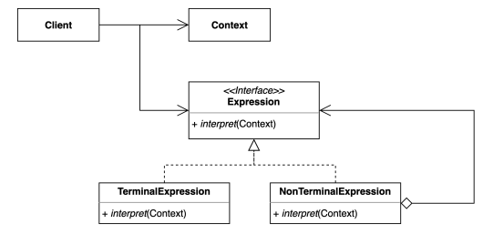
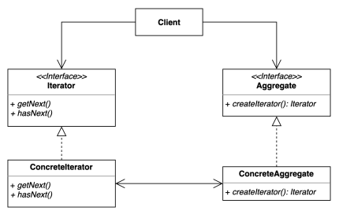

- Behavioral Patterns: 동작과 관련된 패턴
# I. Chain-of-Responsibility
- 책임들의 연쇄적 연결 
  - 책임: 기능, 역할처럼 SRP의 '책임'을 의미
- [ex)](../../src/step05_designPatterns/chain_of_responsibility/before)
- request의 body를 처리하기전에 인증, 인가를 하고싶다면?
  - ReqeustHandler에서 하는 것은 SRP에 위배
  ```java
  public class RequestHandler {
      public void handler(Request request) {
          System.out.println("has Authority? or Role?");
          System.out.println("check Authentication");
  
          System.out.printf("request: %s\n", request.getBody());
      }
  }
  ```
  - 다형성으로 처리하기: SRP를 지킬 수 있으나 client가 각각 선택을 해야한다는 점(확장에 변형이 요구됨, 복수의 기능을 사용하기 위해 client에 알아야할 정보가 늘어나고 복잡해짐)
  ```java
  public class AuthRequestHandler extends RequestHandler{
      @Override
      public void handler(Request request) {
          System.out.println("has Authority? or Role?");
          System.out.println("check Authentication");
  
          super.handler(request);
      }
  }
  ```
- 책임(기능)을 연쇄시켜 클라이언트가 그 구체적 타입을 알 필요가 없음
- 코드간 결합을 최소화
  
## A. 적용
- 가장 단순한 구조
```java
public abstract class RequestHandler {
    private RequestHandler nextHandler;
    public RequestHandler(RequestHandler nextHandler) {
        this.nextHandler = nextHandler;
    }
    void handler(Request request) {
        if (nextHandler != null) {
            nextHandler.handler(request);
        }
        else{
            System.out.println("chain exit");
        }
    };
}
```
- extend
```java
public class AuthRequestHandler extends RequestHandler{
    public AuthRequestHandler(RequestHandler nextHandler) {
        super(nextHandler);
    }
    @Override
    void handler(Request request) {
        if( !(request.getBody() instanceof String) ) {
            System.out.println("request body is not String");
            return;
        }
        System.out.println("has Authority? or Role?");
        System.out.println("check Authentication");

        super.handler(request);
    }
}
```
- client에서 다른 메서드나 인자를 요청하지 않음
  - 필요에 따라 다음 책임(기능) 결정
```java
public class Client {
    public static void main(String[] args) {
        RequestHandler chainingRequestHandler = new AuthRequestHandler(new LoginRequestHandler(new PrintRequestHandler(null)));
        Request request= new Request("술래잡기 고무줄 놀이 말뚝박기");
        chainingRequestHandler.handler(request);
    }
}
```
## B. 장단점
- 장점
  - OCP: 확장에 대해 클라이언트 코드의 변경이 최소화됨
  - SRP: 각각 책임을 처리하도록 함
  - 순서를 지정해서 처리할 수 있음
  - 각 상황에 따라 핸들러를 선택적으로 처리하도록 할 수 있음
- 단점
  - 연쇄적으로 흘러가다보니 디버깅이 번거로워짐(너무 많은 클래스를 거치게 됨)
## C. java and spring
### 1. java
- [Filter interface](../../src/step05_designPatterns/chain_of_responsibility/MyFilter.java): Servlet을 거쳐 들어오는 요청들이 mappingHandler에 닿기 전에 처리할 것을 채이닝하여 처리
- 직접 만든 필터 적용
```java
@ServletComponentScan
@SpringBootApplication
public class App{
    public static void main(String[] args){
        SpringApplication.run(App.class, args);
    }
}
```
- 필터에서 처리할 매핑 요청("/yourgame")을 지정
```java
@WebFilter(urlPatterns = "/yourgame")
public class MyFilter implements Filter {

    //...
  
  @Override
  public void doFilter(ServletRequest servletRequest, ServletResponse servletResponse, FilterChain filterChain) throws IOException, ServletException {
    System.out.println("게임에 참여하신 여러분을 환영합니다");
    filterChain.doFilter(servletRequest, servletResponse);
    System.out.println("게임을 종료합니다");
  }
  
    //...    
}
```
### 2. spring
- Spring Security 적용
```java
@Configuration
public class SecurityConfig extends WebSecurityConfigurerAdapter{
    @Override
    protected void configure(HttpSecurity http)throws Exception{
        http
                .authorizeRequests()//filter chaining
                .anyRequest()
                .permitAll()
                .and()//필터 추가
                .addFilter(new Filter(){
                    
                  })
                .and()
        //...
        ;
    }
}
```
- Spring security 필터 적용 예


# II. Command
- request하는 객체(invoker)와 response하는 객체(receiver) 사이에 Command객체를 위치시켜 둘을 decoupling 시킴
- [ex)](../../src/step05_designPatterns/command/before/Button.java)

- 또 다른 기기가 추가된다면?
  - 모두 on()이지만 다른 기능...
- 코드의 변경이 자주 일어나고 비슷한 코드가 반복됨
## A. [적용하기](../../src/step05_designPatterns/command/after/Button.java)
- Command로 재사용성을 높임
## B. 장단점
- 장점
  - 기존 코드를 변경하지 않고 새로운 커맨드를 추가할 수있다: OCP
  - 수신자의 코드의 변경이 생겨도 요청자의 코드는 변경되지 않는다
  - 각자 자신의 책임을 처리: SRP
  - 반대 기능을 지정해 처리를 단순화 시킬 수 있다
- 단점
  - 코드가 여러단계를 거쳐 복잡하다
## C. java and spring
### 1. java
- [`ExecutorService` interface](../../src/step05_designPatterns/command/CommandInJava.java): thread pool을 생성해 처리하도록 함
- `Runable` interface를 사용한 객체들
  - Runable interface가 팩토리고 구현체가 concretCommand class
    - 내부 익명 클래스
    - lambda식으로 축약한 것도 같은 방식
    - method reference
- SimpleJdbcInsert: JdbcTemplate 내부에서 작용

# III. Interpreter
- cs에서는 사람의 소스를 기계어로 변경시켜주는 프로그램을 칭하지만  
  - regex로 지정한 패턴 내에서 일치, 불일치를 점검하는 것이 예시
- 일반적으로 악보를 음악으로 변환시켜주거나 어떤 언어를 다른 언어로 변환하는 번역가의 의미
- 자주 등장하는 문제를 간단한 언어로 정의하고 재사용
- [ex)](../../src/step05_designPatterns/interpreter/before/PostfixNotation.java)
  - Domain Specific Language: 언어를 해당 도메인에 특화된 언어를 구현할 수 있다.
 
- 컴포짓 패턴과 유사. 
- 처리 결과 트리구조를 생성
  - Abstract Syntax Tree
## A. 적용하기
- [단순하게 처리해서 반환하기](../../src/step05_designPatterns/interpreter/after/VariableExpression.java)
- [부호별로 interpreter 만들기](../../src/step05_designPatterns/interpreter/after/PlusExpression.java)
- [Parser](../../src/step05_designPatterns/interpreter/after/App.java)
- [하나의 인터페이스에서 관리](../../src/step05_designPatterns/interpreter/after/PostfixExpression.java)
## B. 장단점
- 장점
  - 자주 등장하는 문제 패턴을 언어와 문법으로 표현
  - 기존 코드의 변화를 최소화하고 문법을 확장할 수 있다: OCP
  - 각각의 대상들이 하나의 기능을 담당
- 단점
  - 복잡도가 매우 커진다
  - 구현하는 문법의 복잡성에 의해 난이도가 커진다: return of interest
## C. java and spring 
### 1. java
- 컴파일러
- [정규 표현식](../../src/step05_designPatterns/interpreter/InterpreterInJava.java)
### 2. spring
- 표현식: 연속되는 객체의 내부 데이터를 사용하는 class
```java
public static void main(String[] args){
    Book book = new Book("spring");
    ExpressionParser parser = new SpelExpressionParser();
    Expression expression = parser.parseExpression("title");// title field 호출
    System.out.println(expression.getValue(book));//book 객체에서 탐색
}
```
- `@Value` annotation
```java
@Value("#{2 + 5}")
private String value;
```
# IV. Iterator
- Collection(또는 집합) 객체의 모든 요소를 순회하는 행동을 수행
- Java의 Iterator는 순번이 있는 배열 자료구조를 제외하고 대다수의 순회를 담당
- 집합 객체 내부 구조(List, Set, Map 등)를 노출시키지 않고 순회하는 방법을 제공
- client source code를 변경하지 않고 다양한 순회 방법을 제공

- [ex)](../../src/step05_designPatterns/iterator/before/Client.java)
  - List 객체가 노출됨
  - 내부 구조가 다른 컬랙션으로 변경되면 client 코드도 변경해야함
## A. [적용하기](../../src/step05_designPatterns/iterator/after)
### 1. Client에서 Iterator 사용하기
```java
Iterator<Post> iterator = posts.iterator();
while(iterator.hasNext()) {
    Post post = iterator.next();
    System.out.println(post.getTitle());
}
```
### 2. Collection Class에서 Iterator 반환하기
```java
public class Board{
    // ... 
    public Iterator<Post> getDefaultIterator(){
      return posts.iterator();
    }
}
```
### 3. customized Iterator interface 
- [interface를 사용해 처리](../../src/step05_designPatterns/iterator/customized/Client.java)
```java
public class RecentContentsIterator<T extends BoardContent> implements Iterator<T> {
    private Iterator<T> internalIterator;
    public RecentContentsIterator(List<T> contents) {
        List<T> tempList = contents;
        Collections.sort(tempList,(c1,c2)->c2.getRegIndex().compareTo(c1.getRegIndex()));
        this.internalIterator = (Iterator<T>) tempList.iterator();
    }
    @Override
    public boolean hasNext() {
        return this.internalIterator.hasNext();
    }
    @Override
    public T next() {
        return this.internalIterator.next();
    }
}
```
## B. 장단점
- 장점
  - 집합 객체가 가지고 있는 요소에 손 쉽게 접근할 수 있다 
  - client가 내부 구조를 몰라도 접근할 수 있다
- 단점
  - 구조가 복잡해진다(클래스 구조)
## C. java and spring
### 1. java
- java.util.Enumeration: java 9 이후에는 거의 Iterator로 대체됨
- java.util.Iterator: remove, forEachRemaining method가 지원하는 경우도 있을 수 있음
  - remove()는 지원하지 않는 경우도 있음
  - forEachRemaining(ConsumerFunctionalInterface)을 사용하기도 함
  ```java
  //컨슈머 함수형 인터페이스(내부 익명 클래스)
  board.getPosts().iterator().forEachRemaining(new Consumer<Post>(){
      @Override
      public void accept(Post post){
          System.out.println(post.getTitle());
      }
  });
  
  // 람다식
  board.getPosts().iterator().forEachRemaining(post->System.out.println(post.getTitle()));
  ```
  - java StAX(Streaming API for XML)의 Iterator 기반 API
    - 주의) java SAX(Simple API for XML)와 다름
      - XML을 읽을때만 사용
    - XmlEventReader, XmlEventWriter
      - XML을 읽고 쓰기 가능
    ```java
    import javax.xml.namespace.QName;
    import javax.xml.stream.XMLEventFactory;
    import javax.xml.stream.XMLEventReader;
    import javax.xml.stream.XMLInputFactory;
    import javax.xml.stream.events.Attribute;
    import javax.xml.stream.events.StartElement;
    import javax.xml.stream.events.XMLEvent;
  
    public static void main(String[] args) {
        XMLInputFactory xmlInputFactory = XMLInputFactory.newInstance();
        //Book.xml 파일 읽기
        XMLEventReader reader = xmlInputFactory.createXMLEventReader(new FileInputStream("Book.xml"));
        
        while (reader.hasNext()) {
            XMLEvent nextEvent = reader.nextEvent();
            if (nextEvent.isStartElement()) {
                StartElement startElement = nextEvent.asStartElement();
                QName name = startElement.getName();
                // 파일 내에 book tag의 title 특성(attribute)의 값을 꺼냄
                if (name.getLocalPart().equals("book")) {
                    Attribute title = startElement.getAttributeByName(new QName("title"));
                    System.out.println(title.getValue());
                }
            }
        }
    }
    ```
### 2. spring
- CompositeIterator: 기존 iterator에 add()를 추가
  - 따로 setter를 처리하는 경우가 많아 자주 사용되지는 않음

# V. Mediator
# VI. Memento
# VII. Observer
# IIX. State
# IX. Strategy
# X. Template method/Callback
# XI. Visitor