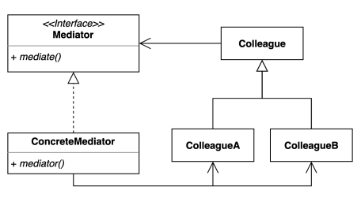
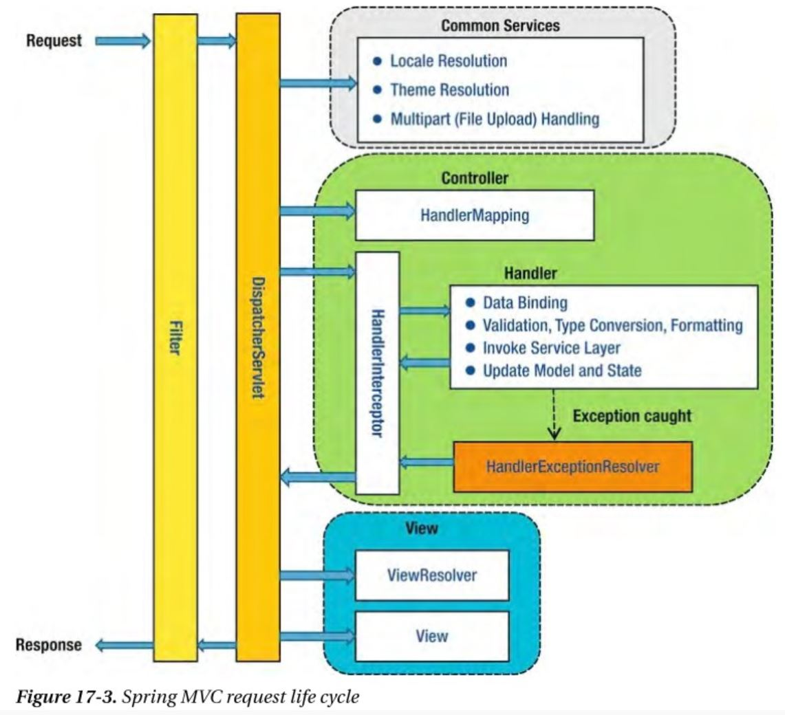
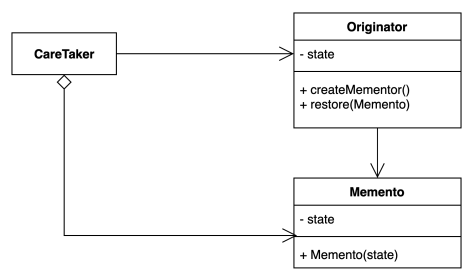
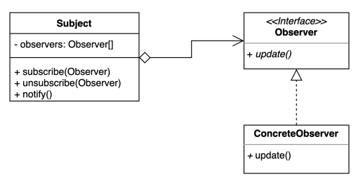
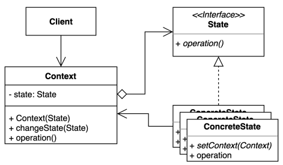
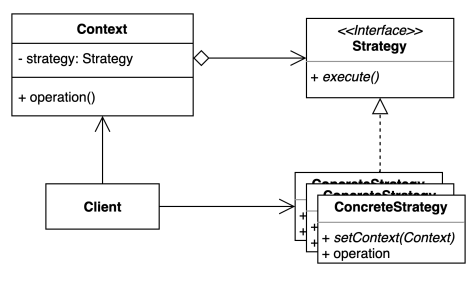
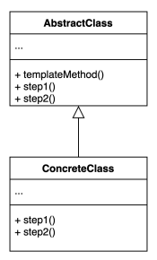
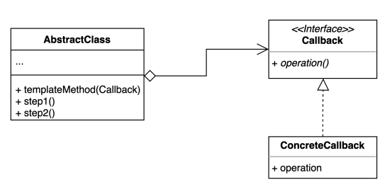
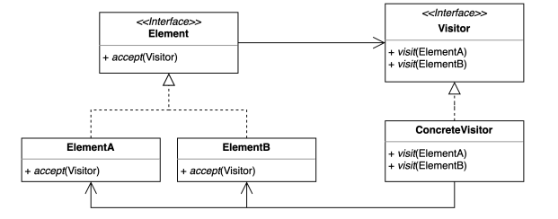

- Behavioral Patterns: 동작과 관련된 패턴
# I. Chain-of-Responsibility
- 책임들의 연쇄적 연결 
  - 책임: 기능, 역할처럼 SRP의 '책임'을 의미
- [ex)](../../src/step05_designPatterns/chain_of_responsibility/before)
- request의 body를 처리하기전에 인증, 인가를 하고싶다면?
  - ReqeustHandler에서 하는 것은 SRP에 위배
  ```java
  public class RequestHandler {
      public void handler(Request request) {
          System.out.println("has Authority? or Role?");
          System.out.println("check Authentication");
  
          System.out.printf("request: %s\n", request.getBody());
      }
  }
  ```
  - 다형성으로 처리하기: SRP를 지킬 수 있으나 client가 각각 선택을 해야한다는 점(확장에 변형이 요구됨, 복수의 기능을 사용하기 위해 client에 알아야할 정보가 늘어나고 복잡해짐)
  ```java
  public class AuthRequestHandler extends RequestHandler{
      @Override
      public void handler(Request request) {
          System.out.println("has Authority? or Role?");
          System.out.println("check Authentication");
  
          super.handler(request);
      }
  }
  ```
- 책임(기능)을 연쇄시켜 클라이언트가 그 구체적 타입을 알 필요가 없음
- 코드간 결합을 최소화
  
## A. 적용
- 가장 단순한 구조
```java
public abstract class RequestHandler {
    private RequestHandler nextHandler;
    public RequestHandler(RequestHandler nextHandler) {
        this.nextHandler = nextHandler;
    }
    void handler(Request request) {
        if (nextHandler != null) {
            nextHandler.handler(request);
        }
        else{
            System.out.println("chain exit");
        }
    };
}
```
- extend
```java
public class AuthRequestHandler extends RequestHandler{
    public AuthRequestHandler(RequestHandler nextHandler) {
        super(nextHandler);
    }
    @Override
    void handler(Request request) {
        if( !(request.getBody() instanceof String) ) {
            System.out.println("request body is not String");
            return;
        }
        System.out.println("has Authority? or Role?");
        System.out.println("check Authentication");

        super.handler(request);
    }
}
```
- client에서 다른 메서드나 인자를 요청하지 않음
  - 필요에 따라 다음 책임(기능) 결정
```java
public class Client {
    public static void main(String[] args) {
        RequestHandler chainingRequestHandler = new AuthRequestHandler(new LoginRequestHandler(new PrintRequestHandler(null)));
        Request request= new Request("술래잡기 고무줄 놀이 말뚝박기");
        chainingRequestHandler.handler(request);
    }
}
```
## B. 장단점
- 장점
  - OCP: 확장에 대해 클라이언트 코드의 변경이 최소화됨
  - SRP: 각각 책임을 처리하도록 함
  - 순서를 지정해서 처리할 수 있음
  - 각 상황에 따라 핸들러를 선택적으로 처리하도록 할 수 있음
- 단점
  - 연쇄적으로 흘러가다보니 디버깅이 번거로워짐(너무 많은 클래스를 거치게 됨)
## C. java and spring
### 1. java
- [Filter interface](../../src/step05_designPatterns/chain_of_responsibility/MyFilter.java): Servlet을 거쳐 들어오는 요청들이 mappingHandler에 닿기 전에 처리할 것을 채이닝하여 처리
- 직접 만든 필터 적용
```java
@ServletComponentScan
@SpringBootApplication
public class App{
    public static void main(String[] args){
        SpringApplication.run(App.class, args);
    }
}
```
- 필터에서 처리할 매핑 요청("/yourgame")을 지정
```java
@WebFilter(urlPatterns = "/yourgame")
public class MyFilter implements Filter {

    //...
  
  @Override
  public void doFilter(ServletRequest servletRequest, ServletResponse servletResponse, FilterChain filterChain) throws IOException, ServletException {
    System.out.println("게임에 참여하신 여러분을 환영합니다");
    filterChain.doFilter(servletRequest, servletResponse);
    System.out.println("게임을 종료합니다");
  }
  
    //...    
}
```
### 2. spring
- Spring Security 적용
```java
@Configuration
public class SecurityConfig extends WebSecurityConfigurerAdapter{
    @Override
    protected void configure(HttpSecurity http)throws Exception{
        http
                .authorizeRequests()//filter chaining
                .anyRequest()
                .permitAll()
                .and()//필터 추가
                .addFilter(new Filter(){
                    
                  })
                .and()
        //...
        ;
    }
}
```
- Spring security 필터 적용 예


# II. Command
- request하는 객체(invoker)와 response하는 객체(receiver) 사이에 Command객체를 위치시켜 둘을 decoupling 시킴
- [ex)](../../src/step05_designPatterns/command/before/Button.java)

- 또 다른 기기가 추가된다면?
  - 모두 on()이지만 다른 기능...
- 코드의 변경이 자주 일어나고 비슷한 코드가 반복됨
## A. [적용하기](../../src/step05_designPatterns/command/after/Button.java)
- Command로 재사용성을 높임
## B. 장단점
- 장점
  - 기존 코드를 변경하지 않고 새로운 커맨드를 추가할 수있다: OCP
  - 수신자의 코드의 변경이 생겨도 요청자의 코드는 변경되지 않는다
  - 각자 자신의 책임을 처리: SRP
  - 반대 기능을 지정해 처리를 단순화 시킬 수 있다
- 단점
  - 코드가 여러단계를 거쳐 복잡하다
## C. java and spring
### 1. java
- [`ExecutorService` interface](../../src/step05_designPatterns/command/CommandInJava.java): thread pool을 생성해 처리하도록 함
- `Runable` interface를 사용한 객체들
  - Runable interface가 팩토리고 구현체가 concretCommand class
    - 내부 익명 클래스
    - lambda식으로 축약한 것도 같은 방식
    - method reference
- SimpleJdbcInsert: JdbcTemplate 내부에서 작용

# III. Interpreter
- cs에서는 사람의 소스를 기계어로 변경시켜주는 프로그램을 칭하지만  
  - regex로 지정한 패턴 내에서 일치, 불일치를 점검하는 것이 예시
- 일반적으로 악보를 음악으로 변환시켜주거나 어떤 언어를 다른 언어로 변환하는 번역가의 의미
- 자주 등장하는 문제를 간단한 언어로 정의하고 재사용
- [ex)](../../src/step05_designPatterns/interpreter/before/PostfixNotation.java)
  - Domain Specific Language: 언어를 해당 도메인에 특화된 언어를 구현할 수 있다.
 
- 컴포짓 패턴과 유사. 
- 처리 결과 트리구조를 생성
  - Abstract Syntax Tree
## A. 적용하기
- [단순하게 처리해서 반환하기](../../src/step05_designPatterns/interpreter/after/VariableExpression.java)
- [부호별로 interpreter 만들기](../../src/step05_designPatterns/interpreter/after/PlusExpression.java)
- [Parser](../../src/step05_designPatterns/interpreter/after/App.java)
- [하나의 인터페이스에서 관리](../../src/step05_designPatterns/interpreter/after/PostfixExpression.java)
## B. 장단점
- 장점
  - 자주 등장하는 문제 패턴을 언어와 문법으로 표현
  - 기존 코드의 변화를 최소화하고 문법을 확장할 수 있다: OCP
  - 각각의 대상들이 하나의 기능을 담당
- 단점
  - 복잡도가 매우 커진다
  - 구현하는 문법의 복잡성에 의해 난이도가 커진다: return of interest
## C. java and spring 
### 1. java
- 컴파일러
- [정규 표현식](../../src/step05_designPatterns/interpreter/InterpreterInJava.java)
### 2. spring
- 표현식: 연속되는 객체의 내부 데이터를 사용하는 class
```java
public static void main(String[] args){
    Book book = new Book("spring");
    ExpressionParser parser = new SpelExpressionParser();
    Expression expression = parser.parseExpression("title");// title field 호출
    System.out.println(expression.getValue(book));//book 객체에서 탐색
}
```
- `@Value` annotation
```java
@Value("#{2 + 5}")
private String value;
```
# IV. Iterator
- Collection(또는 집합) 객체의 모든 요소를 순회하는 행동을 수행
- Java의 Iterator는 순번이 있는 배열 자료구조를 제외하고 대다수의 순회를 담당
- 집합 객체 내부 구조(List, Set, Map 등)를 노출시키지 않고 순회하는 방법을 제공
- client source code를 변경하지 않고 다양한 순회 방법을 제공

- [ex)](../../src/step05_designPatterns/iterator/before/Client.java)
  - List 객체가 노출됨
  - 내부 구조가 다른 컬랙션으로 변경되면 client 코드도 변경해야함
## A. [적용하기](../../src/step05_designPatterns/iterator/after)
### 1. Client에서 Iterator 사용하기
```java
Iterator<Post> iterator = posts.iterator();
while(iterator.hasNext()) {
    Post post = iterator.next();
    System.out.println(post.getTitle());
}
```
### 2. Collection Class에서 Iterator 반환하기
```java
public class Board{
    // ... 
    public Iterator<Post> getDefaultIterator(){
      return posts.iterator();
    }
}
```
### 3. customized Iterator interface 
- [interface를 사용해 처리](../../src/step05_designPatterns/iterator/customized/Client.java)
```java
public class RecentContentsIterator<T extends BoardContent> implements Iterator<T> {
    private Iterator<T> internalIterator;
    public RecentContentsIterator(List<T> contents) {
        List<T> tempList = contents;
        Collections.sort(tempList,(c1,c2)->c2.getRegIndex().compareTo(c1.getRegIndex()));
        this.internalIterator = (Iterator<T>) tempList.iterator();
    }
    @Override
    public boolean hasNext() {
        return this.internalIterator.hasNext();
    }
    @Override
    public T next() {
        return this.internalIterator.next();
    }
}
```
## B. 장단점
- 장점
  - 집합 객체가 가지고 있는 요소에 손 쉽게 접근할 수 있다 
  - client가 내부 구조를 몰라도 접근할 수 있다
- 단점
  - 구조가 복잡해진다(클래스 구조)
## C. java and spring
### 1. java
- java.util.Enumeration: java 9 이후에는 거의 Iterator로 대체됨
- java.util.Iterator: remove, forEachRemaining method가 지원하는 경우도 있을 수 있음
  - remove()는 지원하지 않는 경우도 있음
  - forEachRemaining(ConsumerFunctionalInterface)을 사용하기도 함
  ```java
  //컨슈머 함수형 인터페이스(내부 익명 클래스)
  board.getPosts().iterator().forEachRemaining(new Consumer<Post>(){
      @Override
      public void accept(Post post){
          System.out.println(post.getTitle());
      }
  });
  
  // 람다식
  board.getPosts().iterator().forEachRemaining(post->System.out.println(post.getTitle()));
  ```
  - java StAX(Streaming API for XML)의 Iterator 기반 API
    - 주의) java SAX(Simple API for XML)와 다름
      - XML을 읽을때만 사용
    - XmlEventReader, XmlEventWriter
      - XML을 읽고 쓰기 가능
    ```java
    import javax.xml.namespace.QName;
    import javax.xml.stream.XMLEventFactory;
    import javax.xml.stream.XMLEventReader;
    import javax.xml.stream.XMLInputFactory;
    import javax.xml.stream.events.Attribute;
    import javax.xml.stream.events.StartElement;
    import javax.xml.stream.events.XMLEvent;
  
    public static void main(String[] args) {
        XMLInputFactory xmlInputFactory = XMLInputFactory.newInstance();
        //Book.xml 파일 읽기
        XMLEventReader reader = xmlInputFactory.createXMLEventReader(new FileInputStream("Book.xml"));
        
        while (reader.hasNext()) {
            XMLEvent nextEvent = reader.nextEvent();
            if (nextEvent.isStartElement()) {
                StartElement startElement = nextEvent.asStartElement();
                QName name = startElement.getName();
                // 파일 내에 book tag의 title 특성(attribute)의 값을 꺼냄
                if (name.getLocalPart().equals("book")) {
                    Attribute title = startElement.getAttributeByName(new QName("title"));
                    System.out.println(title.getValue());
                }
            }
        }
    }
    ```
### 2. spring
- CompositeIterator: 기존 iterator에 add()를 추가
  - 따로 setter를 처리하는 경우가 많아 자주 사용되지는 않음

# V. Mediator
- 중재자 패턴: 여러 객체간 의사소통에 있어서 결합도를 줄임
  - 컴포넌트간 소통을 캡슐화
- 비행기 - 관제탑 - 비행기 처럼 중간 처리 단계를 둠
- 여러 서비스가 교차하는 경우 코드 재사용성이 낮아짐

- mediator 객체가 모든 연결을 중재함
- [ex)](../../src/step05_designPatterns/mediator/before/Hotel.java)
## A. [적용](../../src/step05_designPatterns/mediator/after/Hotel.java)
- mediator: FrontDesk
- Colleague: Guest가 이용하는 서비스(CleaningService, Restaurant)
## B. 장단점
- 장점
  - (mediator를 인터페이스로 선언했을 때) 컴포넌트 코드를 변경하지 않고 새로운 중재자를 만들어서 사용할 수 있다. 
  - 각각 컴포넌트 코드를 보다 간결하게 유지할 수 있다. 
- 단점
  - 중재자 클래스의 복잡도와 결합도가 증가한다.
## C. java and spring
### 1. java
- ExecutorService & Executor
  - mediator 역할을 담당하는 클래스
  - but 사용하는 경우가...
### 2. spring
- DispatcherServlet
  - Front-Controller 타입 운영
  - interceptor, handlerMapper, adepter, viewResolver 등 Container를 통과하는 대상을 모두 중재 

# VI. Memento
- 객체 내부의 상태를 외부에 보관하고 필요할때 복원. 
- 내부의 상태를 외부에 저장하지만 캡슐링을 유지하는 패턴
- [ex)](../../src/step05_designPatterns/memento/before/Client.java)
  - 게임의 상태를 외부에 저장하고
  - 그것을 다시 사용....
  - but 내부의 정보가 client까지 이어짐. 캡슐링 파괴됨


- CareTaker
  - 메멘토를 지닌 객체로 필요시점에 원래 데이터를 복원
- Originator
  - 원래 데이터
- Memento
  - 정보를 기억하는 객체 
## A. [적용](../../src/step05_designPatterns/memento/after/Client.java)
- game 내부 데이터를 몰라도 정보를 보관하고 복원
  - GameSave: memento
  - Game: Originator
  - Client: CareTaker
## B. 장단점
- 장점
  - 객체 내부의 상태를 외부에 노출하지 않고도 상태(snapshot)를 보관할 수 있다. 
  - Originator의 구조가 변경되어도 클라이언트에 노출되지 않음
  - 복원이라는 하나의 기능(책임)을 별도의 클래스로 분리
- 단점
  - 너무 많은 사용으로인해 메모리 낭비가 될 수 있다
  - 별도의 memento 관리 모듈이 필요
## C. java and spring
- 데이터를 외부에 보관해놓고 그것을 복원하는 패턴
### 1. [java](../../src/step05_designPatterns/memento/MementoInJava.java)
- Date: date 객체를 getTime 등 다양한 정보로 변환해 보관
- Serializable interface: 단순히 다른 객체가 아닌 다른 파일에 넣고 보관, 재사용
  - 객체를 직렬화(byteStream)해 다른 곳에 보관하고 다시 복원함.
  - 대상 Originator `impleaments Serializable`
-  
# VII. Observer
- 감지하고 상태 변화를 체크
- [Publish Subscribe pattern](https://en.wikipedia.org/wiki/Publish%E2%80%93subscribe_pattern)을 구현하는데 사용 
- 다수 객체가 특정 객체 상태 변화를 감지하고 알림을 받는 패턴
- [ex)](../../src/step05_designPatterns/observer/before) 간단한 채팅


- 옵저버 등록과 해지를 통해 감지 대상(Subject)을 변경
- subject 변경에 등록된 옵저버들이 감지
- java의 reflection 기능을 사용해서 대체가능하긴 함
- 공통된 기능을 사용하는 곳이라면 Subject도 interface를 사용해 공용 기능을 지정할 수 있다.
## A. [적용](../../src/step05_designPatterns/observer/after/Client.java)
- 최대한 정보는 Observer가 연결된 대상으로 처리
## B. 장단점
- 장점
  - 상태를 변경하는 객체(publisher)와 변경을 감지하는 객체(subscriber)의 관계를 느슨하게 유지
  - Subject의 상태 변경을 주기적으로 조회하지 않아도 변경되면 이벤트를 감지할 수 있다
  - 런타임 중에 옵저버 추가 제거가 가능
- 단점
  - 복잡도
  - 다수의 Observer 객체를 등록 후 해지하지 않으면 메모리 자원이 지속적으로 소모되어 memory leak 발생 가능
    - 참조하는 객체가 있으면 힙 메모리의 데이터가 GC 처리되지 않는다
    - 명시적으로 해지하는 것이 제일 좋음
    - 만약 어렵다면 최소한 [WeakReference class](https://docs.oracle.com/javase/8/docs/api/java/lang/ref/WeakReference.html) 적용(완전 해결은 아님)
## C. java and Spring
### 1. java
- [Observer Interface](../../src/step05_designPatterns/observer/ObserverInJava.java)
  - java 9 이후부터는 권장하지 않음
    - `setChanged();`: 계속 주시하는 것이 아닌 상태 변경시마다 체크해야함
  ```java
    /*
      Deprecated
      This class and the Observer interface have been deprecated. 
      The event model supported by Observer and Observable is quite limited, 
      the order of notifications delivered by Observable is unspecified, 
      and state changes are not in one-for-one correspondence with notifications. 
      For a richer event model, consider using the java. 
      desktop/ java. 
      beans package. 
      For reliable and ordered messaging among threads, 
      consider using one of the concurrent data structures in the java. util. concurrent package. 
      For reactive streams style programming, see the java. util. concurrent. Flow API.
    */
  ```
  - 대체하면 좋은 interface: [PropertyChangeListener interface](../../src/step05_designPatterns/observer/PropertyChangeListenerInJava.java)
    - 유연하게 처리할 수 있음
    - index로 처리 순서도 조절 가능
    - 프로그램에서 설정 처리할때 사용하기 좋은 인터페이스
- [Flow API](../../src/step05_designPatterns/observer/FlowInJava.java)
  - WebFlux 사용시 유용한 인터페이스
  - 동기적 처리도 가능
  - 더 공부하고 싶다면
    - [Reactor](https://projectreactor.io/docs/core/release/api/)
    - [RxJava](https://reactivex.io/tutorials.html)
### 2. spring
```java
@SpringBootApplication // 구동용
public class ObserverInSpring{
    public static void main(String[] args){
        SpringApplication app = new SpringApplication(ObserverInSpring.class);
        app.setWebApplicationType(WebApplicationType.NONE);
        app.run(args);
    }
}
```
- IoC 자체가 이벤트 퍼블리셔
```java
public class MyEvent extends ApplicationEvent{
    private String message; 
    public MyEvent(Object source, String message){
        super(source);
        this.message = message;
    }
    public String getMessage(){
        return message;
    }
}
```
- Spring boot의 기능
```java
@Component
public class MyRunner implements ApplicationRunner{
//    private ApplicationContext // 가능
    private ApplicaionEventPublisher publisher;//좀 더 구체적인 명시
    public MyRunner(ApplicationEventPublisher publisher){
        this.publisher = publisher;
    }
    @Override
    public void run(ApplicaionArguments args)throws Exception{
        publisher.publishEvent(new MyEvent(this, "hello Listener! "));
    }
}
```
- 해당 이벤트 발생시 처리: generic으로 처리
```java
@Component
public class MyEventListener implements ApplicaionListener<MyEvent>{
    @Override
    public void onApplicationEvent(MyEvent event){
      System.out.println(event.getSource());
      System.out.println(event.getMessage());
    }
}
```
- 사실 이벤트 소스가 필요 없기도 함.
  - 스프링이 지향하는 비침투적 프레임워크의 방향
```java
public class MyEvent {
    private String message; 
    public MyEvent(String message){
        this.message = message;
    }
    public String getMessage(){
        return message;
    }
}
```
```java
@Component
public class MyEventListener{
    
    @EventListener(MyEvent.class)
    public void onApplicationEvent(MyEvent event){
      System.out.println(event.getSource());
      System.out.println(event.getMessage());
    }
}

```
# IIX. State
- 상태(state)에 따른 행동이 달라짐
- [ex)](../../src/step05_designPatterns/state/before/Client.java)
- State에 대한 공용 interface, 구현한 state의 변화에 따라 처리할 Context 

## A. [적용](../../src/step05_designPatterns/state/after/Client.java)
- 상태에 따른 동작을 class로 나눠 분할
- 과도한 if-else-if같은 조건문을 줄임 => 가독성
- 각각의 책임
## B. 장단점
- 장점
  - 상태에 따른 동작을 개별 클래스로 옮겨 관리
  - 기존 특정 상태에따른 동작 변경없이 새로운 상태의 동작 추가 가능
  - 코드복잡도가 줄어듦
  - 가독성높임
- 단점
  - 복잡도 증가

# IX. Strategy
- 알게모르게 자주 사용되는 패턴
- 어떤 비즈니스를 수행하는데 여러 방법을 사용할수 있는 경우
  - 캡슐링
  - 추상화된 인터페이스 지정
  - 개별 클래스마다 다른 전략을 선택하도록 함
- ex) Comparator 
- [예제코드](../../src/step05_designPatterns/strategy/before/Client.java)
  - Strategy를 개별 ConcreteStrategy 사용하도록함
  - Client 코드에서는 변경이 없음
  - 어떤 매개변수나 상황에 따라 달라지는 경우 유용

## A. [적용](../../src/step05_designPatterns/strategy/after/Client.java)
- Client 변경 없이 전략 추가, 변경 가능
- 익명클래스를 사용해서도 가능
## B. 장단점
- 장점
  - 새로운 전략 추가에 기존 코드가 영향을 받지 않는다. OCP
  - 상속 대신 위임을 사용. Implements / 단일 상속의 단점, 강요 제외 등
  - 전략을 Runtime에 결정할 수 있다.
- 단점
  - 코드 복잡성
  - 클라이언트 코드가 구체화된 전략(ConcreteStrategy)을 알아야함
  - 클래스 수가 많아짐(단발성으로 사용될경우 익명클래스 사용으로 크게 늘어나지 않음)
## C. java and Spring
### 1. java
- Comparator interface: 비교 기준을 그때 그때 처리할 수 있다 
  - java에서 지원하는 기본 라이브러리들은 이 함수가 기본으로 지정되어있음
  - java 8 이후에는 기본 메서드가 많이 지원됨
    - `Comparator.reverseOrder`
### 2. Spring
- 대부분 인터페이스에 전략패턴이 사용됨
  - 전략에 따라 `Spring Bean`에 저장/사용됨
```java
public class StrategyInSpring(){
  public static void main(String[] args) {
      //sping 설정 전략
    ApplicationContext applicationContextXml = new ClassPathXmlAppicationContext();
    ApplicationContext applicationContextFileSystem = new FileSystemXmlAppicationContext();
    ApplicationContext applicationContextAnnotation = new AnnotationConfigAppicationContext();
    
    //빈 정의 전략
    BeanDefinitionParser parser;
    //트랜젝선 애노테이션 전략
    PlatformTransactionManager platformTransactionManager;
    //캐시관리 전략
    CacheManager cacheManager;
  }
}
```

# X. Template method/Callback
- 처리하는 알고리즘의 구조를 Template으로 만들어 Sub class를 구현하도록하는 패턴
- [예시](../../src/step05_designPatterns/template/before/Client.java)
- 파일을 읽어서 그것을 처리해 결과를 반환하는 방식
- 같은 활동을 하거나 서로를 곱해서 하는 경우 로직의 상당부분이 곂침
- 대다수 로직은 상위 템플릿에, 일부 코드를 하위에서 적용

- template method 패턴: abstract class 상속으로 처리

- template callback 패턴: interface 사용으로 익명내부클래스나 람다식을 활용할 수 있다

## A. [적용](../../src/step05_designPatterns/template/after_template_method/Client.java)
- template method 패턴
  - class를 통째로 복사해서 일부만 변경하는 경우에 적용하기 좋은 패턴
  - 변경될 부분과 변경되지 않을 부분을 나눠서 처리
  - 고정된 부분은 default, 아니라면 abstract로 method 정의
- template callback 패턴
  - 콜백으로 상속 대신 위임을 사용하는 템플릿 패턴
  - 인터페이스에 추상메서드로 구현시켰던 것을 인터페이스로 분리
  - 인터페이스 하나에 한 기능만 담당할 경우 FunctionalInterface가 됨
    - 익명 내부 클래스나 람다식을 이용할 수 있음
  ```java 
      public interface Operator {
           int setResult(int result, int line);
      }
  ```
## B. 장단점
- GoF에는 template method
- 장점
  - 템플릿 코드를 재사용하고 중복 코드를 줄일 수 있다
  - 템플릿 코드를 변경하지 않고 상속받아서 구체적 알고리즘만 변경가능
- 단점
  - 리스코프 치환원칙을 위반할 수 있다
    - 리스코프 치환원칙: 상속 구조에서 상위 타입을 상속받은 모든 클래스들이 위임을 받을때 부모가 작성한 의도를 지켜야한다
    - sub에서 super의 의도를 유지하지 못하는 경우도 발생할 수 있음
    - 예시에서 변경되서는 안될 메서드까지 재정의할 수 있다. 
      - 이를 방지하기 위해 `final`을 선언해 메서드 재정의를 방지
        ```java
            public final String getResult(){
                //  ...
            }
        ```
      - but 구현하게끔 한 메서드의 경우 의도를 깨뜨릴 수 있다
  - 알고리즘 구조가 복잡할 수록 템플릿을 유지하기 어려워진다
## C. java and Spring
### 1. java
- `HttpServlet`: doGet, doPost와 같이 HTTP 통신에 필요한 처리
  - 코드의 제어권이 해당 클래스가 아닌 외부에 있음 -> IoC
### 2. spring
- Spring Configure..
  - 최종의 SecurityConfigurer 를 구현하게 되고 그 속의 init method에 영향을 주면서 filter 과정을 변경시킬 수 있다
```java
    @Configuration
    class SecurityConfig extends WebSecurityConfigurerAdepter{
        @Override
        protected void configure(HttpSecurity http) throws Exception{
            http.authorizeRequests().anyRequest().permitAll();
        }
    }
```
- JDBC: 사용하는 통신 방식에 따라 Template을 선택해 사용. 
```java
import com.sun.net.httpserver.HttpHandler;

import java.net.http.HttpHeaders;
import java.util.Arrays;

public static void main(String[] args) {
    JdbcTemplate jdbcTemplate = new JdbcTemplate();
    
    //Insert
    jdbcTemplate.excute("insert into DATA_BASE_TABLE(...) values(...)");
    
    //select...
    jdbcTemplate.query("select * from DATA_BASE_TABLE");
}
```
- RestAPI 마찬가지로 해당 처리 로직이 정해져있어 그것을 선택해 사용하도록함
```java
    RestTemplate restTemplate = new RestTemplate();
    HttpHeaders headers = new HttpHandler();
    
    headers.setAccept(Arrays.asList(MediaType.APPLICATION_JSON));
    headers.set("X-COM-PERSIST","NO");
    headers.set("X-COM-LOCATION","USA");
    
    HttpEntity<String> entity = new HttpEntity<>(headers);
    ResponseEntity<String> responseEntity = restTemplate.exchange("http://localhost:8080/user",HttpMethod.GET, entity, String.class);
```

# XI. Visitor
- 기존 코드를 건들이지 않고 새로운 기능을 추가할 수 있는 패턴 
- 코드의 재사용성을 늘리고 다른 코드의 개입을 최소화 할수 있음
- 구현과 오버라이딩을 통해 구현 가능
- [ex)](../../src/step05_designPatterns/visitor/before/Client.java)
- 도형에 새로운 기능을 추가하기
  - 기능 추가 > 기기마다 수정
  - 기기 추가 > 각 도형마다 수정

- [오버라이딩만 사용](../../src/step05_designPatterns/visitor/before_overriding/Client.java)
  - `if(device instanceOf Device)`를 줄이기 위해 오버라이딩
  - method Overriding일때는 정적 매핑을 권장 - 추상적 객체보다는 하위 객체로
## A. [적용](../../src/step05_designPatterns/visitor/after/Client.java)
- device 인터페이스에 기기를 분별하는 방식으로 변경
```java
public interface Device {
    void printTo(Circle circle);
    void printTo(Rectangle rectangle);
    void printTo(Triangle triangle);
}
```
- 도형추가도 간단히
```java
public class Circle implements Shape {
    @Override
    public void accept(Device device) {
        device.printTo(this);
    }
}
```
- double dispatch: 런타임 중에 다형성을 이용한 분기처리가 두번 이어짐
## B. 장단점
- 장점
  - 기존 코드의 수정을 최소화해서 기능을 추가할 수 있다.
- 단점
  - double dispatch 구조에 대한 이해가 되어야 사용할 수 있다. 
  - element(예제에서는 Shape를 구현한 class)의 수정시에 모든 visitor를 수정
    - Device를 구현한 모든 class
## C. java and Spring
- method Overloading 보다 다른 메서드명을 사ㅓ용하는 것도 좋음
### 1. java
- FileVisitor
  - main
  ```java
  import java.nio.file.Files;
  import java.nio.file.Path;
  
  public static void main(String[] args) {
      Path startingDirectory = Path.of("/Users/user/workspace/design-pattern");
      // 파일 순회를 통해 검색 후 종료
      SearchFileVisitor searchFileVisitor = new SearchFileVisitor("Triangle.java", startingDirectory);
      Files.walkFileTree(startingDirectory, searchFileVisitor);
  }
  ```
  - 적용한 visitor
  ```java
  import java.io.IOException;
  import java.nio.file.*;
  import java.nio.file.attribute.BasicFileAttributes;
  
  public class SearchFileVisitor implements FileVisitor<Path> {//SimpleFileVisitor 사용도 가능
      private String fileToSearch;
      private Path startingDirectory;
      
      public SearchFileVisitor(String fileToSearch, Path startingDirectory) {
          this.fileToSearch = fileToSearch;
          this.startingDirectory = startingDirectory;
      }
  
      @Override
      public FileVisitResult preVisitDirectory(Path dir, BasicFileAttributes attrs) throws IOException {
          return FileVisitResult.CONTINUE;
      }
  
      @Override
      public FileVisitResult visitFile(Path file, BasicFileAttributes attrs) throws IOException {
          if (fileToSearch.equals(file.getFileName().toString())) {
              System.out.println("found " + file.getFileName());
              return FileVisitResult.TERMINATE;//파일을 찾으면 종료
          }
          return FileVisitResult.CONTINUE;
      }
  
      @Override
      public FileVisitResult visitFileFailed(Path file, IOException exc) throws IOException {
          exc.printStackTrace(System.out);
          return FileVisitResult.CONTINUE;//검색 실패
      }
  
      @Override
      public FileVisitResult postVisitDirectory(Path dir, IOException exc) throws IOException {
          if (Files.isSameFile(startingDirectory, dir)) {
              System.out.println("search end");//디렉토리가 다시 돌아왔다 == 다 순회했다
              return FileVisitResult.TERMINATE;
          }
          return FileVisitResult.CONTINUE;
      }
  }
  ```
  - FileVisitResult: 디렉토리에 대한 앞으로의 진행 방식이 지정되어있음
  ```java
      public enum FileVisitResult {
          /**
          * Continue. When returned from a {@link FileVisitor#preVisitDirectory
          * preVisitDirectory} method then the entries in the directory should also
          * be visited.
          */
          CONTINUE,
          /**
          * Terminate.
          */
          TERMINATE,
          /**
          * Continue without visiting the entries in this directory. This result
          * is only meaningful when returned from the {@link
          * FileVisitor#preVisitDirectory preVisitDirectory} method; otherwise
          * this result type is the same as returning {@link #CONTINUE}.
          */
          SKIP_SUBTREE,
          /**
          * Continue without visiting the <em>siblings</em> of this file or directory.
          * If returned from the {@link FileVisitor#preVisitDirectory
          * preVisitDirectory} method then the entries in the directory are also
          * skipped and the {@link FileVisitor#postVisitDirectory postVisitDirectory}
          * method is not invoked.
          */
          SKIP_SIBLINGS;
      }
  ```
- SimpleFileVisitor
- AnnotationValueVisitor
- ElementVisitor
### 2. Spring
- BeanDefinitionVisitor 
  - 스프링 내부적으로 bean 정보를 얻는 역할로 스프링 개발자가 직접적으로 뭔가 작업하지는 않는다. 
  - 기능적 코드이니 그냥 이런것이 사용되고있다 정도..
  - xml 시절 정의된 기능