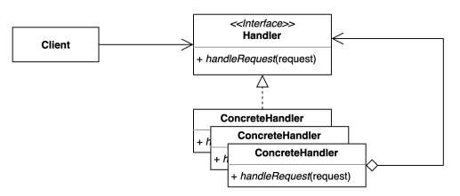
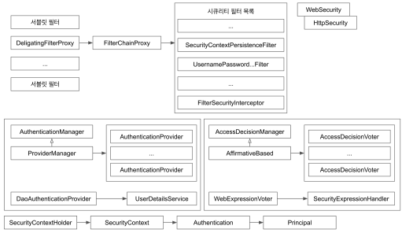
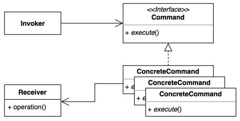

- Behavioral Patterns: 동작과 관련된 패턴
# I. Chain-of-Responsibility
- 책임들의 연쇄적 연결 
  - 책임: 기능, 역할처럼 SRP의 '책임'을 의미
- [ex)](../../src/step05_designPatterns/chain_of_responsibility/before)
- request의 body를 처리하기전에 인증, 인가를 하고싶다면?
  - ReqeustHandler에서 하는 것은 SRP에 위배
  ```java
  public class RequestHandler {
      public void handler(Request request) {
          System.out.println("has Authority? or Role?");
          System.out.println("check Authentication");
  
          System.out.printf("request: %s\n", request.getBody());
      }
  }
  ```
  - 다형성으로 처리하기: SRP를 지킬 수 있으나 client가 각각 선택을 해야한다는 점(확장에 변형이 요구됨, 복수의 기능을 사용하기 위해 client에 알아야할 정보가 늘어나고 복잡해짐)
  ```java
  public class AuthRequestHandler extends RequestHandler{
      @Override
      public void handler(Request request) {
          System.out.println("has Authority? or Role?");
          System.out.println("check Authentication");
  
          super.handler(request);
      }
  }
  ```
- 책임(기능)을 연쇄시켜 클라이언트가 그 구체적 타입을 알 필요가 없음
- 코드간 결합을 최소화
  
## A. 적용
- 가장 단순한 구조
```java
public abstract class RequestHandler {
    private RequestHandler nextHandler;
    public RequestHandler(RequestHandler nextHandler) {
        this.nextHandler = nextHandler;
    }
    void handler(Request request) {
        if (nextHandler != null) {
            nextHandler.handler(request);
        }
        else{
            System.out.println("chain exit");
        }
    };
}
```
- extend
```java
public class AuthRequestHandler extends RequestHandler{
    public AuthRequestHandler(RequestHandler nextHandler) {
        super(nextHandler);
    }
    @Override
    void handler(Request request) {
        if( !(request.getBody() instanceof String) ) {
            System.out.println("request body is not String");
            return;
        }
        System.out.println("has Authority? or Role?");
        System.out.println("check Authentication");

        super.handler(request);
    }
}
```
- client에서 다른 메서드나 인자를 요청하지 않음
  - 필요에 따라 다음 책임(기능) 결정
```java
public class Client {
    public static void main(String[] args) {
        RequestHandler chainingRequestHandler = new AuthRequestHandler(new LoginRequestHandler(new PrintRequestHandler(null)));
        Request request= new Request("술래잡기 고무줄 놀이 말뚝박기");
        chainingRequestHandler.handler(request);
    }
}
```
## B. 장단점
- 장점
  - OCP: 확장에 대해 클라이언트 코드의 변경이 최소화됨
  - SRP: 각각 책임을 처리하도록 함
  - 순서를 지정해서 처리할 수 있음
  - 각 상황에 따라 핸들러를 선택적으로 처리하도록 할 수 있음
- 단점
  - 연쇄적으로 흘러가다보니 디버깅이 번거로워짐(너무 많은 클래스를 거치게 됨)
## C. java and spring
### 1. java
- [Filter interface](../../src/step05_designPatterns/chain_of_responsibility/MyFilter.java): Servlet을 거쳐 들어오는 요청들이 mappingHandler에 닿기 전에 처리할 것을 채이닝하여 처리
- 직접 만든 필터 적용
```java
@ServletComponentScan
@SpringBootApplication
public class App{
    public static void main(String[] args){
        SpringApplication.run(App.class, args);
    }
}
```
- 필터에서 처리할 매핑 요청("/yourgame")을 지정
```java
@WebFilter(urlPatterns = "/yourgame")
public class MyFilter implements Filter {

    //...
  
  @Override
  public void doFilter(ServletRequest servletRequest, ServletResponse servletResponse, FilterChain filterChain) throws IOException, ServletException {
    System.out.println("게임에 참여하신 여러분을 환영합니다");
    filterChain.doFilter(servletRequest, servletResponse);
    System.out.println("게임을 종료합니다");
  }
  
    //...    
}
```
### 2. spring
- Spring Security 적용
```java
@Configuration
public class SecurityConfig extends WebSecurityConfigurerAdapter{
    @Override
    protected void configure(HttpSecurity http)throws Exception{
        http
                .authorizeRequests()//filter chaining
                .anyRequest()
                .permitAll()
                .and()//필터 추가
                .addFilter(new Filter(){
                    
                  })
                .and()
        //...
        ;
    }
}
```
- Spring security 필터 적용 예


# II. Command
- request하는 객체(invoker)와 response하는 객체(receiver) 사이에 Command객체를 위치시켜 둘을 decoupling 시킴
- [ex)](../../src/step05_designPatterns/command/before/Button.java)

- 또 다른 기기가 추가된다면?
  - 모두 on()이지만 다른 기능...
- 코드의 변경이 자주 일어나고 비슷한 코드가 반복됨
## A. [적용하기](../../src/step05_designPatterns/command/after/Button.java)
- Command로 재사용성을 높임
## B. 장단점
- 장점
  - 기존 코드를 변경하지 않고 새로운 커맨드를 추가할 수있다: OCP
  - 수신자의 코드의 변경이 생겨도 요청자의 코드는 변경되지 않는다
  - 각자 자신의 책임을 처리: SRP
  - 반대 기능을 지정해 처리를 단순화 시킬 수 있다
- 단점
  - 코드가 여러단계를 거쳐 복잡하다
## C. java and spring
### 1. java
- [`ExecutorService` interface](../../src/step05_designPatterns/command/CommandInJava.java): thread pool을 생성해 처리하도록 함
- `Runable` interface를 사용한 객체들
  - Runable interface가 팩토리고 구현체가 concretCommand class
    - 내부 익명 클래스
    - lambda식으로 축약한 것도 같은 방식
    - method reference
- SimpleJdbcInsert: JdbcTemplate 내부에서 작용

# III. Interpreter
# IV. Iterator
# V. Mediator
# VI. Memento
# VII. Observer
# IIX. State
# IX. Strategy
# X. Template method/Callback
# XI. Visitor