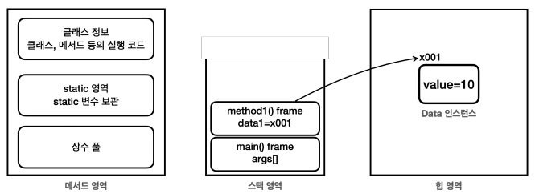
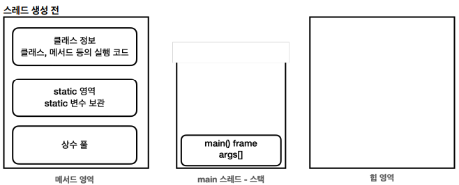
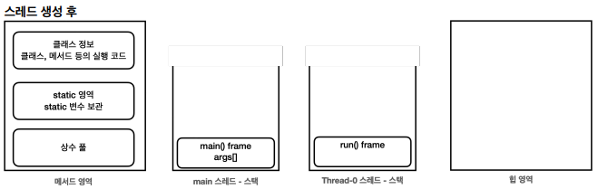
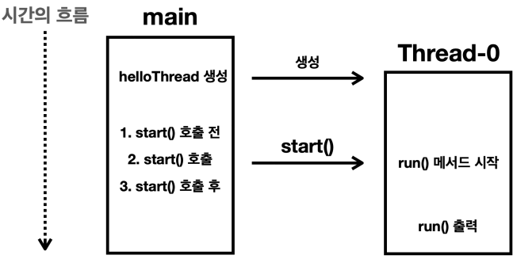
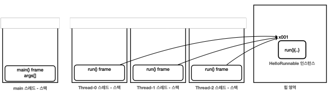

# I. thread
## A. 자바 메모리 구조

- method area : 클래스 정보, static, 상수 풀.
- stack area : 스택 프레임에 지역변수와 중간연사결과 메서드 호출 정보를 포함. 
  - 스택 영역은 각 스레드별로 하나의 실행 스택이 생성되어 스레드 수 만큼 스택이 생성된다. 
  - 기본은 단일 스레드를 사용 = 스택도 하나
- Heap area : 인스턴스와 배열이 생성되는 영역으로 하나 이상의 참조도 없는 경우 GC에 의해 처리된다. 
## B. 스레드 생성
- 스레드를 생성하는 두가지 방법
  - `Thread` class 상속받는 방법
  - `Runnable` interface 구현하는 방법
```java
//Thread class 상속
public class HelloThread extends Thread {
    @Override
    public void run(){
        System.out.println(Thread.currentThread().getName()+": run()");
    }
}
```
- [스레드 생성](../../src/step06_advanced1_multiThread_and_concurrency/chapter01_processAndThread/thread/start/HelloThreadMain.java)
```java
        System.out.println(Thread.currentThread().getName()+": main() start");

        HelloThread helloThread = new HelloThread();
        System.out.println(Thread.currentThread().getName()+": start() 호출 전");
        helloThread.start();
//        helloThread.run(); run을 직접 호출하는 것은 보안상 취약점
        System.out.println(Thread.currentThread().getName()+": start() 호출 후");

        System.out.println(Thread.currentThread().getName()+": main() end");
```
> 콘솔
```
main: main() start
main: start() 호출 전
main: start() 호출 후
main: main() end
Thread-0: run()
```
- run method를 직접 호출하면 main method가 run method를 호출한다. 그러므로 start method를 호출해야한다
- `Thread-0`의 호출 시점은 OS의 스케쥴러에 따라 달라질 수 있다. 
- main method는 main thread의 스택에서 실행된다.


- start method를 호출(`main thread`)하면 자바는 스레드를 위한 별도의 스택 공간(`thread-0 thread`)을 할당한다. 
    - 따로 이름을 지정하지않으면 임의의 이름(thread-0, thread-1,...)을 부여한다.


- 시간 흐름 분석: `main thread`와 `Thread-0 thread`는 별개로 진행됨 == 동시성 확보


- 스레드 간의 실행 순서는 얼마든지 달라질 수 있다. 

## C. start() vs run()
```java
        System.out.println(Thread.currentThread().getName()+": main() start");

        HelloThread helloThread = new HelloThread();
        System.out.println(Thread.currentThread().getName()+": start() 호출 전");
        helloThread.run();//main thread에서 처리
        System.out.println(Thread.currentThread().getName()+": start() 호출 후");

        System.out.println(Thread.currentThread().getName()+": main() end");

```
- `run()`을 호출한 경우 thread를 생성하지 않고 main()의 thread에서 호출하므로 Thread-0 스택을 설정하지 않는다
> 콘솔
```
main: main() start
main: start() 호출 전
main: run()
main: start() 호출 후
main: main() end
```
- Thread-0의 스택은 할당되지만 `start()`를 호출하지 않으면 Main의 스택에서 run()을 수행한다.
- 호출되지 않은 스레드는 그저 객체일뿐 스레드로서 역할을 하지 않는다. 

## D. 데몬 스레드(Daemon thread)
- [데몬](https://en.wikipedia.org/wiki/Daemon_(computing)): 사용자에게 직접적으로 보이지 ㅇ낳으면서 시스템의 백그라운드에서 작업을 수행하는 것을 데몬 프로세스라 한다. 
- 스레드의 종류
  - user thread(none-daemon thread)
    - 프로그램의 주요 작업 수행
    - 작업이 완료될 때까지 실행
    - 모든 user thread가 종료되면 JVM(Java Virtual Machine)도 종료
  - daemon thread
    - 백그라운드에서 보조적인 작업을 수행
    - 모든 user thread가 종료되면 데몬 스레드도 자동으로 종료
- JVM은 데몬 스레드의 실행완료를 기다리지 않는다. 데몬 스레드가 아닌 다른 모든 스레드가 종료되면 자바 프로그램도 종료된다. 
- [데몬 스레드로 설정한 경우](../../src/step06_advanced1_multiThread_and_concurrency/chapter01_processAndThread/thread/start/DaemonThreadMain.java)
```java
    public static void main(String[] args) {
        System.out.println(Thread.currentThread().getName()+": main() start");
        DaemonThread daemonThread = new DaemonThread();
        daemonThread.setDaemon(true);// 데몬 스레드 설정
        daemonThread.start();
        System.out.println(Thread.currentThread().getName()+": main() end");
    }

    static class DaemonThread extends Thread {
        @Override
        public void run() {
            System.out.println(Thread.currentThread().getName()+": run() start");
            try{
                Thread.sleep(10000);
            }catch (InterruptedException e){
                throw new RuntimeException(e);
            }
            System.out.println(Thread.currentThread().getName()+": run() end");
        }
    }
```
> 콘솔
```
main: main() start
main: main() end
Thread-0: run() start
```
- 데몬 스레드로 설정된 경우 다른 스레드들이 종료되면 JVM이 종료되어 결과를 볼수 없다
- `daemonThread.setDaemon(false)`로 데몬 설정을 없애면 자바가 끝까지 대기
- start() 시작 전에 설정해야한다. 
- 참고) run()에서 예외처리를 위로 throws 할 수 없고 내부에서 처리(catch)해야한다. 이유는 나중에...

## E. implements Runnable interface
- 직접 `Thread` 클래스를 상속하기보다 인터페이스의 구현을 주로 사용
- Runnable interface
```java
public interface Runnable{
    void run();//abstract method
}
```
- implement interface
```java
public class HelloRunnable implements Runnable{
    @Override
    public void run(){
        System.out.println(Thread.currentThread().getName() + ":run()");
    }
}
```
- `Thread` 생성자의 인자로 사용해 `start()` 호출
  - 작업과 실행을 분리
```java
    public static void main(String[] args) {
        System.out.println(Thread.currentThread().getName() + ": main() start");

        HelloRunnable helloRunnable = new HelloRunnable();
        Thread thread = new Thread(helloRunnable);
        thread.start();

        System.out.println(Thread.currentThread().getName() + ": main() end");
    }
```
- `extends Thread class` vs `implements Runnable interface` 
  - Thread 상속
    - 장점
      - 간단한 구현
    - 단점
      - 상속의 제한: 단일 상속만 가능하므로 여러 스레드를 사용하기에 한계
      - 유연성 부족: 인터페이스 구현에 비해 유연성이 떨어짐
  - Runnable 구현
    - 장점
      - 상속의 자유로움: 인터페이스 구현은 다중 상속이 가능
      - 코드의 분리: 작업과 실행을 분리해 가독성을 높일수 있음
      - 여러 스레드가 동일한 Runnable 객체를 공유할 수 있어 자원관리의 효율
    - 단점
      - 코드의 복잡성 증가: Runnable 객체 생성과 Thread 인자 전달 과정이 추가됨
  - 그럼 뭘쓸까? 
    - 여러면에서 Runnable interface 구현이 유리하다
## F. 로거 만들기
- 현재 작동하는 스레드를 체크하기 위한 [로거](../../src/step06_advanced1_multiThread_and_concurrency/chapter01_processAndThread/util/MyLogger.java) 만들기
  - 구성: `loger(메세지)`
  - 결과: `시간[스레드명] : 설명`
```java
    public static void log(Object obj) {
        String time = LocalDateTime.now().format(formatter);
        System.out.printf("%s[%9s] %s", time, Thread.currentThread().getName(), obj);
    }
```
- `System.out.println()`을 사용해 콘솔을 조작했으나 로거를 만들어 추가적인 기능을 지정해 사용할때가 많음
- 실무에서는 관련 라이브러리를 사용

## G. 여러 스레드 만들기
- 스레드는 개별적으로 사용하지만 참조하는 주소(레퍼런스)는 하나를 가리킴
```java
    public static void main(String[] args) {
        log("main() start");

        HelloRunnable helloRunnable = new HelloRunnable();
        Thread thread1 = new Thread(helloRunnable);
        thread1.start();
        Thread thread2 = new Thread(helloRunnable);
        thread2.start();
        Thread thread3 = new Thread(helloRunnable);
        thread3.start();

        log("main() end");
```

- 더 많은 경우
```java
    public static void main(String[] args) {
        log("main() start");

        HelloRunnable helloRunnable = new HelloRunnable();
        for (int i = 0; i < 100; i++) {
            Thread thread = new Thread(helloRunnable);
            thread.start();
        }
        
        log("main() end");
    }
```
- 단, 스레드 번호 순서는 보장할 수 없다. 운영체제의 영향에따라 다름
 
## H. Runnable을 만드는 다양한 방법: 결과는 같음


## I. 문제와 풀이

# II. 스레드 다루기


# III. 스레드 생명주기
