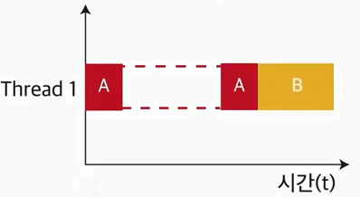
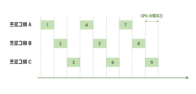
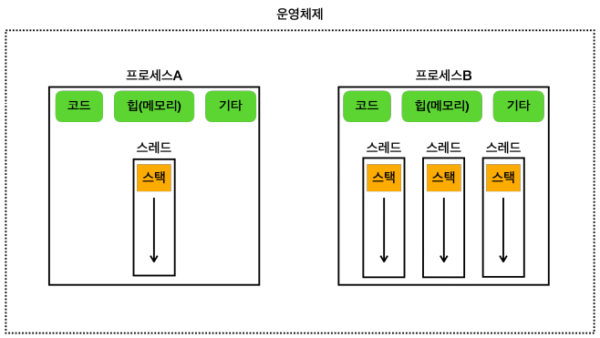
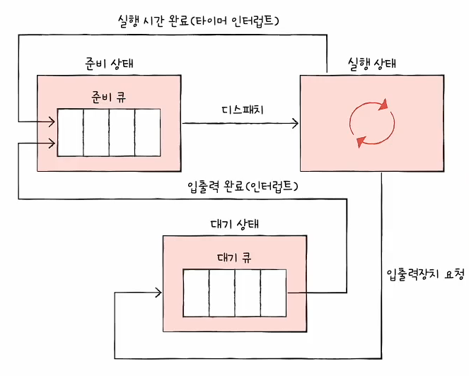

- 프로세스와 스레드 소개
# I. 멀티태스킹과 멀티프로세싱
- 운영체제의 기본 개념
    - 프로세서: 프로그램을 실행하는 기계적 단위. 쓰래드로 구성되며 단일 쓰레드를 사용하는 프로세서는 한 번에 한 프로세스만 진행해 하나의 프로그램만 처리할 수 있다. 
        - ex) CPU코어
    - 프로그램: 코드로 구성된 파일. 실행되기 전까지는 업무를 수행하지 않는다
    - 프로세스: 프로그램을 이루는 순차적 업무 단위. 프로그램의 인스턴스(가상화된 객체)이며 운영체제에게 자원을 할당받아 프로그램을 실행
    - 쓰레드: 프로세스 내부에서 실제로 업무를 수행하는 기계적 단위
## A. 단일 프로그램 실행

- 단일 프로세스를 사용해 프로그램을 실행하는 경우 한번에 하나의 프로그램 코드만 실행할 수 있다.
- 여러프로그램을 실행할때 하나의 프로세스가 완료된 후 다음을 진행할 수 있다면 순차적이어서 정돈되고 안정될 수 있지만 매우 불편하다. 
- 특히 네트워킹, 다운로드, 입출력 등 대기상태가 오래걸릴 경우 대기 기간이 더 길어질 수 있다.  
- 이를 위해 하나의 프로세서에서 여러 프로세스를 동시에 실행하는 멀팅태스킹 기술이 발전된다. 
## B. 멀티태스킹

- 단일 쓰레드를 사용하는 것은 그대로 이지만 작업을 교차시켜 마치 동시에 진행되는 것처럼 보이도록 작업을 진행
- 대기 상태가 오래걸릴 경우 그 term에도 업무를 배치해 시간 소모를 줄일 수 있다. 이러한 방식을 시분할(Time Sharing)이라 한다
- 다만 실제로 동시에 작업하는 것이 아니므로 작업시간이 여전히 길다. 
- 이러한 업무 분배 전략은 각 OS에서 관리(Scheduling)한다.
- 기술이 발전하면서 프로세서 내에 여러 쓰래드가 들어가는 멀티 쓰래드가 보편화 되었고 프로그래밍에서도 이를 사용한 기술이 나타났다.
## C. 멀티프로세싱

- 업무를 처리하는 장치(두뇌, 연산장치)가 여러개인 경우 둘 이상의 장치를 사용하여 여러 작업을 동시에 처리하는 기술
- CPU내부의 여러 코어(쓰레드)가 있어 업무를 동시에 처리할 수 있을때 이에 맞는 병렬처리된 프로그램이 필요하다.
- 멀티프로세싱은 하드웨어 관점(프로세서의 쓰레드)이고 멀티태스킹은 소프트웨어 관점(업무 처리 방식)으로 둘 모두 업무를 효율적으로 처리하기위한 기법
- 멀티프로세싱에서 각각 프로세서의 입장으로 보면 각각 멀티태스킹이 일어나고 있다고 볼 수 있다. 

# II. 프로세스와 스레드

## A. Process
- 프로그램이 실행되면 운영체제는 프로세스에 필요한 메모리(code, static, heap, stack)와 기타 자원을 모은다. 
- 그 자원을 받아 처리할 thread를 부여하는데 이때 병렬처리된 코드인 경우 여러 스레드를 지정한다
- 실행된 프로그램이 종료되면 운영체제에서 자원을 다시 복귀시키고 정리한다. 
- 운영체제는 별도의 작업단위로 분리해서 관리하며 논리적 구조를 분리해 서로의 메모리에 다른 프로세스가 연관되지 않도록 격리해 관리한다. 
- 프로세스의 메모리 구성
  - 코드 섹션: 실행할 프로그램의 코드가 저장되는 부분
  - 데이터 섹션: 전역 변수 및 정적 변수가 저장되는 부분
  - 힙: 동적으로 할당되는 메모리 영역
  - 스택: 메모리 호출시 생성되는 지역변수와 반환주소(메모리 참조주소)가 저장되는 영역
## B. Thread
- 프로세스는 하나 이상의 스레드를 반드시 포함한다. 
- 스레드는  프로세스 내에서 실행되는 작업 단위
- 하나의 프로세스 내에는 여러 스레드가 있을 수 있고 프로세스가 제공하는 자원(메모리 공간 등의 자원)을 공유한다. 
- 단순하기 때문에 생성과 관리가 쉽다
- 스레드의 메모리 구성
  - 공유 메모리: 프로세스 내에서 함께 공유하는 메모리(힙, 코드 등)
  - 개별 스택: 각 스레드에서 처리하는 스택(개별 처리를 위한 스트림)은 각 스레드별로 관리
- 프로그램이 실행된다는 것
  - 프로세스 내에있는 코드가 한줄씩 실행되는데 프로세스 내에서 이 처리가 순차적으로 처리되는 것이다
```java
public class Operator{
    public static void main(String[] args){
        int sum1 = 1;
        int sum2 = sum1 + 1;
        System.out.printf("sum2="+sum2);
        System.out.printf("sum1="+sum1);
    }
}
```
- 멀티스레드가 필요한 이유: 하나의 프로세스도 여러 프로그램이 동시에 처리되는 경우가 많다ㅑ. 
  - 워드프로세서: 문서 편집, 자동 저장, 자료 확인, 맞춤법 검사 등
  - 유튜브: 영상 출력, 소리조절, 댓글 리스트, 댓글 입력, 추천, 공유...

# III. 스레드와 스케쥴링
- 운영체제(OS)가 장치의 자원을 관리하는 것을 스케쥴링이라 한다. 
- 운영체제 내부에는 스케쥴 관리를 위한 스케쥴링 큐(Scheduling queue)를 갖는다. 

- 일정 실행시간에 따라 프로그램이 순차적으로 돌아가면서 멀티태스킹 방식으로 처리된다. 
- 여러 스레드를 사용하는 경우 동시에 업무처리하는 효율을 더 높일 수 있다. 

# IV. 컨텍스트 스위칭
- 대다수 환경에서는 멀티스레드가 효율적이지만 상황에 따라 오히려 방해하는 경우도 있다. 
- 프로그램을 실행할때 사용하던 인스턴스와 여러 자료에 대한 정보(참조값)를 스위칭할때 이에대한 배경 데이터들을 다시 호출해야한다. 
- 이처럼 작업하는 문맥을 변경하는 것을 Context Switching(컨텍스트 스위칭)이라 한다. 
- 컨텍스트 스위칭 과정에도 역시 자원 비용이 발생하는데 이 과정이 항상 효율적이지 않은 경우도 있다
- 1~10,000,000의 합을 단일 스레드로 vs 1~5,000,000과 5,001,000~10,000,000의 합으로 나눠 멀티 스레드로 적용
  - 멀티스레드인 경우 중간중간 컨텍스트 스위칭 비용이 발생해 연산시간이 단일 스레드 처리보다 더 소모

# V. 작업환경 구성시 하드웨어를 고민해보기
- CPU 4개, thread 2개
  - 스레드의 숫자가 CPU에 비해 너무 적으면 모든 CPU를 활용할 수 없지만 스레드 전환이 많이 일어나지 않아 컨텍스트 스위칭 비용이 줄어든다
- CPU 4개, thread 100개
  - 스레드의 숫자가 너무 많으면 CPU 활용도를 최대로 쓸 수 있지만 컨텍스트 스위칭 비용이 늘어난다 
- CPU 4개, thread 4개
  - 스레드의 숫자를 CPU 숫자에 맞춘다면 CPU 활용도를 최대로 맞출 수 있고 컨텍스트 스위칭 비용도 최대한 적절하게 발생시키므로 최적의 상태가 된다. 
  - 이상적으로는 CPU+1의 스레드 숫자를 맞추는 것이 대기 스레드가 발생할때 여분의 스레드 하나정도를 사용할 수 있어 효율적이다
  - 프로세스상 병렬구조에 대한 고민이 필요한 부분이다
- BUT 실무에서는 CPU의 업무 처리 능력보다 입출력을 위한 대기 업무가 더 많다.
  - 스레드의 주된 작업: CPU 바운드 작업 vs I/O 바운드 작업
    - CPU-bound tasks
      - 연산능력을 요구하는 작업
      - 계산, 데이터 처리, 알고리즘 실행 등 CPU의 처리 속도가 작업 완료 시간을 결정
      - ex) 복잡한 수학 연산, 데이터 분석, 비디오 인코딩, 과학적 시뮬레이션 등
    - Input/Output-bound tasks
      - 디스크, 네트워크, 파일 시스템 등 입출력 작업을 많이 요구하는 작업
      - 입출력이 완료될때까지 대기시간이 발생하여 CPU는 거의 사용되지 않고 대기 상태(유휴상태)에 있는 경우가 있다. 
      - 성능보다 절대적 시간이 필요한 작업
      - DB query 처리, 파일 읽기/쓰기, 네트워크 처리, 사용자 입력 등
  - 실무(특히 웹 애플리케이션 서버)에서는 CPU 바운드 작업보다 I/O 바운드 작업이 주를 이룬다
    - 개발의 대다수는 사용자(고객, 실무자 등)의 입력 정보를 처리하거나 기존 정보를 DB에서 가져오는 등의 I/O 바운드 작업을 주로 진행
  - 스레드 하나가 하나의 접속(네트워크 접속)을 처리하지만 그 내부에서 사용하는 연산은 사용자 입력을 기다리거나 DB 데이터를 반환하는 경우 CPU 사용량은 매우 낮을 수 있다. 
    - 4개의 CPU에서 4개의 스레드를 사용할 경우 4개의 접속 == 4명의 사용자만 처리할 수 있다. 
    - 이 상황에서 CPU는 4~8%정도만 사용될 뿐이다. 
    - 기능 향상을 위해 물리적 CPU 코어를 늘리기보다 프로세스의 스레드를 늘리는 것이 더 현명하다
  - 주된 작업이 CPU 바운드 작업인지 I/O작업인지에 따라 물리적 작업 환경에 대한 판단이 필요하다
- 성능 테스트를 통해 이에대한 확인이 필요. 웹앱에도 CPU 바운드 작업이 필요한 경우도 있다.