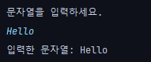

# VI. Scanner(콘솔입력용)
## A. 기본 사용법
- 기본적으로 사용되는 사용자 입력용 class
- 다만 실제 업무에서는 사용하는 경우가 없음
- System.in을 사용해 입력을 받을 쉬있으나 복잡하고 어려움
- Scanner는 콘솔단에서 쉽게 테스트할 수 있다. 
```java
// 콘솔창에서 진행
    System.out.println("문자열을 입력하세요.");//안내용 문자열
    String str = scanner.nextLine();//문자열 입력대기(Enter키를 입력할때까지 대기)
    System.out.println("입력한 문자열: "+str);//입력 받은 값 출력
```


```java
import java.util.Scanner;

Scanner scanner = new Scanner(System.in);
String str = scanner.nextLine();//문자열
int num = scanner.nextInt();//정수
double dnum = scanner.nextDouble();//실수
```
- 그외에도 다양한 입력값을 받을 수 있다. 

- 하지만 입력값이 잘못되면 예외가 터지면서 프로그램이 종료됨을 유의

[실습](../../src/chapter06_scanner/Scanner1.java)
## B. 기본예제
```dockerfile
두 수를 입력받고 그 합을 출력하기
```
[실습](../../src/chapter06_scanner/basic/Scanner1_1.java)
```dockerfile
두 수를 입력받고 둘 중 더 큰 수를 출력하는 프로그램.
같을 경우 같다고 표시
```
[실습](../../src/chapter06_scanner/basic/Scanner1_2.java)
```dockerfile
사용자가 입력한 문자열을 그대로 출력
"exit"를 입력하기 전까지 계속 반복
```
[실습](../../src/chapter06_scanner/basic/Scanner1_3.java)
```dockerfile
첫번째 숫자와 두번째 숫자를 출력하는 프로그램 개발
첫 수자와 두번째 숫자를 모두 0으로 입력하면 프로그램 종료
그전까지 반복 진행
```
[실습](../../src/chapter06_scanner/basic/Scanner1_4.java)
```dockerfile
사용자의 입력을 받아 그 합계를 계산. 한번에 하나씩 입력받으며 사용자가 0을 입력하면 종료
종료될때 최종합을 표시
```
[실습](../../src/chapter06_scanner/basic/Scanner1_5.java)
```dockerfile
사용자로부터 이름과 나이를 입력받아 다음과 같이 출력
"당신의 이름은 [이름]이고, 나이는 [나이]입니다."
```
[실습](../../src/chapter06_scanner/basic/Scanner1_6.java)
```dockerfile
하나의 정수를 입력받아 이 수가 홀수인지 짝수인지 판별
```
[실습](../../src/chapter06_scanner/basic/Scanner1_7.java)

## C. 심화 예제
```dockerfile
사용자로부터 음식의 이름(foodName), 가격(foodPrice), 수량(foodQuantity)을 입력받아 음식의 총 가격을 계산하고 출력하는 프로그램을 작성하세요 
음식의 총 가격을 totalPrice라는 변수에 저장하세요
주문 정보와 총 가격을 출력하세요. 
ex)
    음식 이름을 입력해주세요: 피자
    음식의 가격을 입력해주세요: 20000
    음식의 수량을 입력해주세요: 2
    피자 2개를 주문하셨습니다. 총 가격은 40000원입니다
```
[실습](../../src/chapter06_scanner/ex/Scanner1Question.java)
```dockerfile
사용자로부터 하나의 정수 n을 입력받아 정수 n의 구구단을 출력하는 프로그램
```
[실습](../../src/chapter06_scanner/ex/Scanner2Question.java)
```dockerfile
변수 a는 10, b는 20이 들어있다. 이 두 변수의 값을 서로 바꾸고 출력
```
[실습](../../src/chapter06_scanner/ex/Scanner3Question.java)
```dockerfile
사용자로부터 두 개의 정수를 입력받고, 이 두 정수 사이의 모든 정수를 출력하는 프로그램을 작성하세요.
    사용자에게 첫 번째 숫자를 입력받으세요. 변수의 이름은 num1 이어야 합니다.
    사용자에게 두 번째 숫자를 입력받으세요. 변수의 이름은 num2 이어야 합니다.
    만약 첫 번째 숫자 num1 이 두 번째 숫자 num2 보다 크다면, 두 숫자를 교환하세요.
        참고: 교환을 위해 임시 변수 사용을 고려하세요.
    num1 부터 num2 까지의 각 숫자를 출력하세요.
    출력 결과에 유의하세요. 다음 예시와 같이 2,3,4,5 처럼 , 로 구분해서 출력해야 합니다
```
[실습](../../src/chapter06_scanner/ex/Scanner4Question.java)
```dockerfile
사용자로부터 이름과 나이를 반복해서 입력받고, 
입력받은 이름과 나이를 출력하는 프로그램을 작성하세요. 
사용자가 "종료"를 입력하면 프로그램이 종료되어야 합니다.
다음 실행 결과 예시를 참고해주세요.
    이름을 입력하세요 (종료를 입력하면 종료): 자바
    나이를 입력하세요: 30
    입력한 이름: 자바, 나이: 30
    이름을 입력하세요 (종료를 입력하면 종료): 하니
    나이를 입력하세요: 20
    입력한 이름: 하니, 나이: 20
    이름을 입력하세요 (종료를 입력하면 종료): 종료
    프로그램을 종료합니다
```
[실습](../../src/chapter06_scanner/ex/Scanner5Question.java)
```dockerfile
사용자로부터 상품의 가격( price )과 수량( quantity )을 입력받고, 
총 비용을 출력하는 프로그램을 작성하세요. 
가격과 수량을 입력받은 후에는 이들의 곱을 출력하세요. 
출력 형태는 "총 비용: [곱한 결과]"이어야 합니다.
-1을 입력하여 가격 입력을 종료합니다.
    상품의 가격을 입력하세요 (-1을 입력하면 종료): 1000
    구매하려는 수량을 입력하세요: 3
    총 비용: 3000
    상품의 가격을 입력하세요 (-1을 입력하면 종료): 2000
    구매하려는 수량을 입력하세요: 4
    총 비용: 8000
    상품의 가격을 입력하세요 (-1을 입력하면 종료): -1
    프로그램을 종료합니다
```
[실습](../../src/chapter06_scanner/ex/Scanner6Question.java)
```dockerfile
사용자로부터 여러 개의 숫자를 입력 받고, 그 숫자들의 합계와 평균을 계산하는 프로그램을 작성하세요. 
사용자는 숫자를 입력하고, 마지막에는 -1을 입력하여 숫자 입력을 종료한다고 가정합니다.
모든 숫자의 입력이 끝난 후에는, 숫자들의 합계 sum 과 평균 average 를 출력하세요. 
평균은 소수점 아래까지 계산해야 합니다.
다음 실행 결과 예시를 참고해주세요.

    숫자를 입력하세요. 입력을 중단하려면 -1을 입력하세요:
    1
    2
    3
    4
    -1
    입력한 숫자들의 합계: 10
    입력한 숫자들의 평균: 2.5
```
[실습](../../src/chapter06_scanner/ex/Scanner7Question.java)
```dockerfile
사용자로부터 상품 정보(상품명, 가격, 수량)를 입력받고, 이들의 총 가격을 출력하는 프로그램을 작성하세요. 
사용자는 여러 상품을 추가하고 결제할 수 있으며, 프로그램을 언제든지 종료할 수 있습니다.
사용자에게 다음 세 가지 옵션을 제공해야 합니다: 
    1: 상품 입력, 2: 결제, 3: 프로그램 종료. 
옵션은 정수로 입력받으며, 옵션을 저장하는 변수의 이름은 option 이어야 합니다.
상품 입력 옵션을 선택하면, 사용자에게 상품명과 가격, 수량을 입력받으세요.
결제 옵션을 선택하면, 총 비용을 출력하고 총 비용을 0 으로 초기화하세요. 
(사용자가 총 비용을 확인하고, 결제를 완료했다고 가정합니다. 
따라서 다음 사용자를 위해 총 비용을 다시 0 으로 초기화 해야합니다.)
프로그램 종료 옵션을 선택하면, "프로그램을 종료합니다."라는 메시지를 출력하고 프로그램을 종료하세요.
위의 세 가지 옵션 외에 다른 값을 입력하면, "올바른 옵션을 선택해주세요."라는 메시지를 출력하세요
    1: 상품 입력, 2: 결제, 3: 프로그램 종료
    1
    상품명을 입력하세요: JPA
    상품의 가격을 입력하세요: 40000
    구매 수량을 입력하세요: 2
    상품명:JPA 가격:40000 수량:2 합계:80000
    1: 상품 입력, 2: 결제, 3: 프로그램 종료
    2
    총 비용: 110000
    1: 상품 입력, 2: 결제, 3: 프로그램 종료
    3
    프로그램을 종료합니다.
```
[실습](../../src/chapter06_scanner/ex/Scanner8Question.java)
