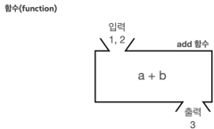

# XI. 메서드
- 유사한 기능이 프로그램의 여러곳에서 반복되는 경우 한번에 묶음으로 만들 수 있다. 하나의 기능을 단위로 묶은 것을 method라 하며 이를 사용하면 유지보수의 장점을 갖는다. 


```java
// int 자료의 합을 여러곳에서 담당하는 경우
int add(int a, int b){
    return a+b;
}
```

- 굳이 method로 만들어 사용하면 좋은 이유
  - 연산의 목표/기능을 method name을 통해 직접적으로 표기해 가독성 증진
  - 유사한 기능의 method를 모아 하나의 기능 단위로 묶으면 관리가 유용하다. 
  - 코드 재사용을 통해 반복을 줄일 수 있다.
  - 모듈화 해서 디버깅의 단위로 사용하거나 기능 관리가 용이하다.
  - 코드의 유지관리
  - 재사용성과 확장성이 좋아 기능의 확장, 다른 프로그램에 이식 등을 하기에도 좋다.
  - 추상화를 통해 메서드의 내부 구조를 보여주지 않아도 된다. 즉, 분업에 용이하다. 
  - 개별 메서드를 독립적으로 테스트할 수 있다(TDD). 
- 단, 무분별하게 메서드를 사용하면 오히려 가독성을 낮추고 혼란을 줄 수 있다.
  - 유사하지만 조금씩 다른 method는 오히려 혼란을 줄 수 있다. 
  - 선언과 사용처럼 내가 만든 method를 다른 사람이 사용하는 경우도 있다. 이를 위해 method의 이름과 설명용 주석을 자세히 쓰는 것이 좋다.
  - 혼자 만드는 프로그램이더라도 지금 당장은 기억할 수 있지만 몇주가 지나면 기억에서 잊혀질 수 있다. 미래의 나를 위해, 극 후반 API 문서까지 고려해 가능한 자세히 설명을 준비하고 개발 완료시점에서 정리한다. 
## A. 메서드의 사용
- static: stack memory에서 main method를 호출할때 미리 선언되어 있음을 표시함
  - static(class) method : 선언 > 메서드 정의(메모리 등록) > 호출 > 인수 입력 및 사용
  - instance method : 선언 > 메서드 정의 > 호출(메모리 등록) > 인수 입력 및 사용
- return type: 반환 타입이 void가 아니면 반드시 return이 있어야한다. void도 return이 있는 경우 반복문의 break와 같은 역할
```java
//조건문과 같이 코드 블럭이 나뉘는 경우 일정 조건에서만 return이 있으면 컴파일러가 멈춘다
public int divided(int a, int b){
    if(b!=0) {
        return a / b;
    }
    //컴파일러 에러 발생
}
//void인 경우에는 break;용도로 사용 가능
private void adultCheck(int age){
    if(age<19){
        return;//method를 빠져나감
    }
    System.out.println("성인");
}
```
- 정의
```java
//  modifier (static) returnType mathodName (parameters...){method body...}
    public  static  int       add      (int a,int b){
//  접근제어 인스턴스 반환자료형 메서드이름(매개변수 목록...){
        return a+b;
//   반환타입이 void일때를 제외하고는 반환 값을 표시
    }
    
//  modifier returnType methodName(parameters...){method body...}
    private void noReturn(char a){
        System.out.println(a);
    }
```
- 호출: 반환타입이 없는(void) 경우 변수에 넣지 않아도 사용 가능
```java
    int         result          =   add       (1,2);
//  returnType  variableName    =   methodName(parameters...);
    
    noReturn('a');
```
[실습](../../src/chapter08_Method/Method1.java)
## B. 메서드 호출과 값 전달
- java의 대원칙 중 하나
```dockerfile
    자바는 항상 변수의 값을 복사해서 대입한다. 
```
- 포인터를 직접 처리하는 C언어와 달리 java는 이 원칙에 따라 포인터가 움직임을 기억
- 각각의 method에서 사용되는 변수의 이름이 같아도 서로 다른 변수
```java
    int num1 = 5;
    int num2 = num1;
    num2 = 10;
    //num1: 5
    //num2: 10
//변수 자체가 아닌 변수가 갖는 값만 복사해간다. 
```
- 참고) 자료형에 따라 참조 주소만 복사하는 얕은 복사와 값 자체 복사하는 깊은 복사가 있음.
  - 얕은 복사의 경우 주소가 복사되어 원 자료에도 영향을 줌
  - 깊은 복사의 경우 참조가 아닌 값을 복사해 원자료에는 영향을 주지 않음.
[실습](../../src/chapter08_Method/Method2.java)
## C. 형변환
- method의 parameter로 입력할때 대입이 발생하므로 형이 다를때 문제가 발생한다. 
- 따라서 이를 위한 형변환이 반드시 필요하다. 
- 특히 명시적 형변환이 필요한 경우에는 컴파일 과정에서 확인됨
```java
    public static void main(String[] args){
        double number = 1.5;
//        printNumber(number);double을 int로 대입하므로 에러 발생
        printNumber((int)number);
    }

    private static void printNumber(int n){
        System.out.println("숫자: "+n);
    }
```
[실습](../../src/chapter08_Method/Method3.java)
## D. overloading
- method의 이름, 반환타입이 같지만 매개변수가 다른 경우 이름이 같은 method를 생성할 수 있다.
```java
    int add(int a, int b){}
    int add(int a, int b, int c){}
    int add(double a, double b){}
//  double add(int a, int b){} >> 불가
```
- method signature: 메서드를 구분할 수 있는 식별자나 서명
  - method name, parameter type과 수, 순서에 따라 method를 구분한다.
  - parameter name은 상관없음
[실습](../../src/chapter08_Method/Method4.java)
## . 연습문제
```dockerfile
문제 1- 평균값 리펙토링
메서드를 잘 이해하고 있는지 확인하기 위해 다음 코드를 메서드를 사용하도록 리펙토링해보자.
MethodEx1  
    package method.ex;
    public class MethodEx1 {
     public static void main(String[] args) {
     int a = 1;
     int b = 2;
     int c = 3;
     int sum = a + b + c;
     double average = sum / 3.0;
     System.out.println("평균값: " + average);
     int x = 15;
     int y = 25;
     int z = 35;
     sum = x + y + z;
     average = sum / 3.0;
     System.out.println("평균값: " + average);
     }
    }
실행 결과 
    평균값: 2.0
    평균값: 25.0
```
[실습](../../src/chapter08_Method/ex/Method1Question.java)
```dockerfile
    문제 2- 반복 출력 리펙토링
    다음은 특정 숫자만큼 같은 메시지를 반복 출력하는 기능이다.
    메서드를 사용해서 리펙토링해보자.
    MethodEx2
        package method.ex;
        public class MethodEx2 {
         public static void main(String[] args) {
         String message = "Hello, world!";
         for (int i = 0; i < 3; i++) {
         System.out.println(message);
         }
         for (int i = 0; i < 5; i++) {
         System.out.println(message);
         }
         for (int i = 0; i < 7; i++) {
         System.out.println(message);
         }
         }
        }
        
    실행 결과 
        Hello, world!
        Hello, world!
        ... //여러번 반복
  ```
[실습](../../src/chapter08_Method/ex/Method2Question.java)
```dockerfile
    문제 3- 입출금 리펙토링
    다음은 입금, 출금을 나타내는 코드이다.
    입금(deposit)과, 출금(withdraw)을 메서드로 만들어서 리펙토링 해보자. 
        package method.ex;
        public class MethodEx3 {
         public static void main(String[] args) {
         int balance = 10000;
         // 입금 1000
         int depositAmount = 1000;
         balance += depositAmount;
         System.out.println(depositAmount + "원을 입금하였습니다. 현재 잔액: " + balance 
        + "원");
         // 출금 2000
         int withdrawAmount = 2000;
         if (balance >= withdrawAmount) {
         balance -= withdrawAmount;
         System.out.println(withdrawAmount + "원을 출금하였습니다. 현재 잔액: " +
        balance + "원");
         } else {
         System.out.println(withdrawAmount + "원을 출금하려 했으나 잔액이 부족합니
        다.");
         }
         
         System.out.println("최종 잔액: " + balance + "원");
         }
        }
    실행 결과 
        1000원을 입금하였습니다. 현재 잔액: 11000원
        2000원을 출금하였습니다. 현재 잔액: 9000원
        최종 잔액: 9000원 
```
[실습](../../src/chapter08_Method/ex/Method3Question.java)
```dockerfile
    문제 4- 은행 계좌 입출금
        다음 실행 예시를 참고해서, 사용자로부터 계속 입력을 받아 입금과 출금을 반복 수행하는 프로그램을 작성하자. 
        또한 간단한 메뉴를 표시하여 어떤 동작을 수행해야 할지 선택할 수 있게 하자
        출금시 잔액이 부족하다면 "x원을 출금하려 했으나 잔액이 부족합니다."라고 출력해야 한다.
        실행 예시 
            ---------------------------------
            1.입금 | 2.출금 | 3.잔액 확인 | 4.종료
            ---------------------------------
            선택: 1
            입금액을 입력하세요: 10000
            10000원을 입금하였습니다. 현재 잔액: 10000원
            ---------------------------------
            1.입금 | 2.출금 | 3.잔액 확인 | 4.종료
            ---------------------------------
            선택: 2
            출금액을 입력하세요: 8000
            8000원을 출금하였습니다. 현재 잔액: 2000원
            ---------------------------------
            1.입금 | 2.출금 | 3.잔액 확인 | 4.종료
            ---------------------------------
            선택: 2
            출금액을 입력하세요: 3000
            3000원을 출금하려 했으나 잔액이 부족합니다.
            ---------------------------------
            1.입금 | 2.출금 | 3.잔액 확인 | 4.종료
            ---------------------------------
            선택: 3
            현재 잔액: 2000원
            ---------------------------------
            1.입금 | 2.출금 | 3.잔액 확인 | 4.종료
            ---------------------------------
            선택: 4
            시스템을 종료합니다.
```
[실습](../../src/chapter08_Method/ex/Method4Question.java)
