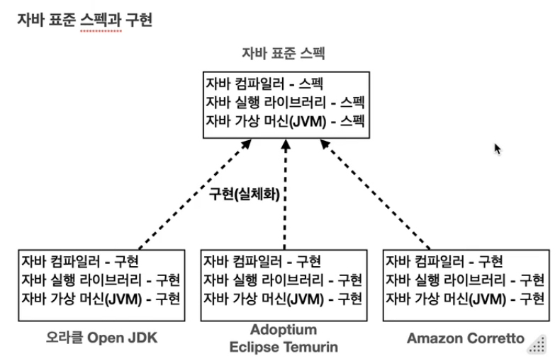
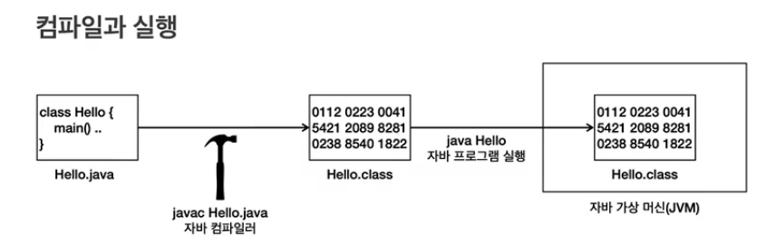
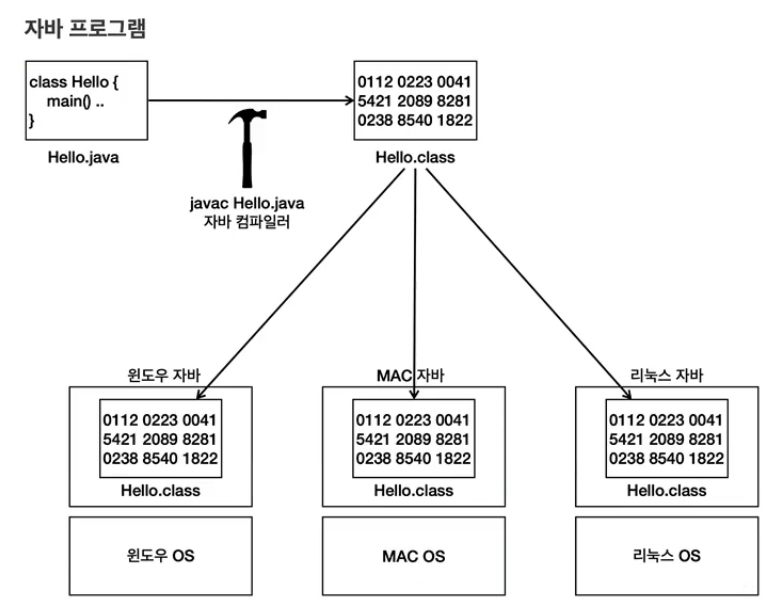

____
# I. 개요
- 복습용 자바 기초 강의
- 자바 복습 후 다른 과정 진행 예정

# II. 맛 보기
## A. Hallo Java - [예제 파일](../src/step01_beginner/HelloJava.java)
## B. 주석(comment) - [예제 파일](../src/step01_beginner/Comment.java)
### 1. 사용처
- 소스 코드가 복잡한경우 이해를 도울 때
- 특정 코드를 지우지 않고 잠시 실행을 막아두고 싶을때
### 2. 처리 
- 주석이 있는 곳을 무시한다. 
### 3. 주석의 종류
- 한 줄 주석(single line comment)
```java
    // 이 기호 이후의 모든 텍스트는 주석으로 처리된다. 
```
- 여러 줄 주석(multi line comment)
```java
    /* 시작 기호
        이 사이의 모든 코드는 주석으로 처리된다. 
     */ //끝 기호 다음은 모두 수행된다. 
```
# III. 자바란?
## A. 자바 표준 스팩


컴파일러, 실행 라이브러리, 가상 머신이라는 표준 스팩을 기반으로 여러 회사에서 자바를 생성한다. 
동작은 같으나 최적화나 작은 차이가 있다. 다만 각 회사들이 자신들의 프로그램에 최적화된 jdk를 사용하면 된다. 

[JDK에 대한 페이지](https://whichjdk.com/)

표준 스팩의 장점: 구현은 다른 버전을 사용해도 표준 스팩을 따르기 때문에 사용에 있어서는 문제가 되지 않는다. 

## B. 컴파일과 실행


- .java 소스 코드는 개발자가 작성.
- javac라는 프로그램을 사용해 .java를 .class파일로 변환하면서 바이트코드로 번역과 함께 문법 오류를 체크한다. 
```dockerfile
    # 원래는 cmd를 통해 명령해야하지만 IDE가 자동으로 처리
    javac step01_beginner.HelloJava.java
```
- 프로그램을 실행(Runtime)하면 자바 가상 머신(JVM)이 동작. 그 위에 소스코드가 동작
```dockerfile
    # 실행도 마찬가지. IDE가 처리
    java step01_beginner.HelloJava
```

## C. 자바의 운영체제 독립성
일반적인 프로그램은 운영체제 위에서 움직이기때문에 다른 운영체제 위에서는 작동하지 않는다.
자바의 경우 가상머신 위에서 작동하기때문에 java만 설치되어있다면 virtual machine 위에서 똑같이 동작한다. 



각 OS에 맞춰 JVM이 명령어가 세팅되어있으므로 운영체제에 얽매이지 않고 Java에만 맞춰 작성하면 됨.

# IV. 입문
[변수 노트](01beginner/01variable.md)로 이동

[연산자 노트](01beginner/02operater.md)로 이동

[조건문 노트](01beginner/03conditional.md)로 이동

[반복문 노트](01beginner/04loop.md)로 이동

[스코프와 형변환 노트](01beginner/05scope&casting.md)로 이동

[Scanner 적용 훈련 노트](01beginner/06scanner.md)

[배열 노트](01beginner/07Array.md)로 이동

[메서드 노트](01beginner/08Method.md)로 이동

# V. 기본
[클래스 노트](02basic/01class.md): C언어의 구조체. 클래스와 데이터만 이해하기

[변수 노트](02basic/02variable.md): 기본형과 참조형에 대한 이해. 특히 참조형

[객체지향 노트](02basic/03oop.md): 객체 지향에 대한 이해. 클래스, 변수 하나로 이해하기

[생성자 노트](02basic/04constructor.md)

[패키지 노트](02basic/05package.md)

[접근제어자 노트](02basic/06modifier.md): 캡슐화의 기본

[메모리 관리와 static 노트](02basic/07virtualMachine.md): 자바 가상 머신의 기초

[final 노트](02basic/08final.md)

[상속 노트](02basic/09extends.md)

[다형성 노트 1: 다형성](02basic/10-1polymorphism.md): 객체지향의 꽃이자 자바 언어의 장점

[다형성 노트 2: 추상클래스와 인터페이스](02basic/10-2Abstract.md): 제약을 통한 안정성, 유지보수 준비

[다형성 노트 3: 다형성과 설계](02basic/10-3polymorphism&architecture.md)

# VI. 중급 - 1
- java의 기본 라이브러리 중 기본으로 알아야하는 지식을 체크하는 시간
  - java.lang package: 자바 언어를 이루는 가장 기본 클래스들 집합
  - 대표 클래스
    - Object: 모든 자바 객체의 부모 클래스
    - String: 문자열
    - (Wrapper): literal(기본형 데이터 타입)을 객체로 만든 것
      - Integer
      - Long
      - Double ...
    - Class: 클래스 메타 정보
    - System: 시스템과 관련된 기본 기능들을 제공
- `import`를 해야하는 외부 라이브러리와 달리 java.lang은 필수/기본 라이브러리이기 때문에 import가 필요없다.
  - `import java.lang.*` 생략

[Object 클래스](03middle-1/01ObjectClass.md): Object는 모든 클래스의 최상위 부모, 다형성을 사용하는 법, 공통 사용 메서드

[불변 객체](03middle-1/02Immuatable.md): java에서 불변 객체의 중요성, 사이드 이펙트, 사용하는 이유와 방법

[String 클래스](03middle-1/03StringClass.md): 가장 많이 사용되는 객체, String runtime 최적화, method는 하면서 익히자

[Wrapper, Class 클래스](03middle-1/04WrapperAndClass_type.md): 필요한 이유와 사용방식, 리플랙션 이해

[열거형-Enum](03middle-1/05Enum.md): 만들어진 이유 -> 사용하는 이유. 타입 안전 열거형 패턴과 이를 위한 열거형

[Date/Time](03middle-1/06DateTime.md): 날짜와 시간에 대한 기본적 라이브러리. 다양한 상황에 대한 적용

[중첩클래스/내부클래스](03middle-1/07InnerClass.md): 중첩 클래스에대한 구분과 메모리 관련 이해, 지역변수 캡쳐, 익명 클래스, 람다 기본

[예외 처리](03middle-1/08ExceptionHandling.md): 예외 객체. checked exception vs unchecked exception, 예외 계층 구성, `try-catch-finally`, try with resources 

- 중급은 기본기를 다지는 시간
  - 자바 기본기가 있어야 오픈소스도 이해할 수 있다. 
  - 프레임워크, 라이브러리도 결국 Java로 만든 프로그램
  - Java도 결국 프로그래밍 언어. 그 흐름과 방향성을 이해하면 다른 언어도 이해할 수 있다. 

# VII. 중급 - 2
- Collection Framework: java에서 제공하는 자료구조 라이브러리 모음
  - 배열 리스트, 링크드 리스트, 노드와 링크 구조
  - Array, List, ArrayList, LinkedList, Set, Hash, HashSet, LinkedHashSet, TreeSet, Map, Stack, Queue, Deque ...
- 성능 관점에서의 이해: 성능 측정, 최적화 진행

[Generic](04middle-2/01Generic.md): 타입 안정성과 코드 재사용성을 모두 만족하는 방식. 와일드카드도 잊지말자

[Collection - ArrayList](04middle-2/CollectionFramework/02ArrayList.md): 배열을 사용한 리스트 구조

[Collection - LinkedList](04middle-2/CollectionFramework/03LinkedList.md): 노드를 사용한 리스트 구조

[Collection - List](04middle-2/CollectionFramework/04List.md): 순서가 있고 중복이 가능한 자료구조. 
- Big O notation
- interface 사용의 장점: 내부 로직은 달라도 사용자는 모르거나 같은 방식으로 사용할 수 있는 캡슐링의 장점

[Collection - Set](04middle-2/CollectionFramework/05Set.md): 순서가 없고 중복이 불가한 자료구조
- 직접 만든 객체에 equals와 hashCode가 필요한 이유

[Collection - Map, Stack, Queue](04middle-2/CollectionFramework/06MapStackQueue.md)
- Map: 키-값 쌍으로 이뤄진 구조, Set은 값이 null인 Map
- 스택과 큐가 있었으나 데크(Deque)로 합쳐짐

[Collection - 순회, 비교, 기타 유틸](04middle-2/CollectionFramework/07Iterator_Comparator_etc.md)
- 순회, 정렬: 
  - Iterator와 Itarable/ Comparator와 Comparable... 
- 컬렉션 관련 유틸리티
# IIX. design pattern 
- GoF의 23개의 디자인 패턴을 코드로 공부할 예정
  - 객체 생성 관련 패턴
  - 구조 관련 패턴
  - 행동 관련 패턴
- 단계
  1. 패턴이 필요한 이유(상황/예제)
  2. 적용 후 좋은점
  3. 장단점
  4. 실무 사용 예시
- 강의는 java와 spring을 중심으로 하지만 중요한 것은 패턴을 익히는 것
 
[객체 생성 관련 패턴](05designPatterns/chapter01objectCreation.md)
  - 싱글톤, 팩토리 메소드, 추상 팩토리, 발더, 프로토타입

[구조 관련 패턴](05designPatterns/chapter02structure.md)
- 어댑터, 브릿지, 컴포짓, 데코레이터, 퍼사드, 플라이웨이트, 프록시

[행동 관련 패턴](05designPatterns/chapter03behavior.md)
- 책임-연쇄, 커맨드, 인터프리터, 이터레이터, 중재자(Mediator), 메멘토, 옵저버, 상태, 전략, 템플릿 메소드/콜백, 방문자

# IX. 고급
## A. 멀티스레드와 동시성

[프로세스와 스레드 소개](06advanced-1/introducing_process_thread.md)

[스레드 생성과 실행](06advanced-1/chapter01_thread_lifecycle.md)

[스레드 제어와 생명주기]

[메모리 가시성]

[동기화 - synchronized/concurrent.Lock]

[생산자 소비자 문제]

[CAS(Compare And Swap) 동기화와 원자적 연산]

[동시성 컬렉션]

[스레드 풀과 Executor 프레임워크]


```
- 확정은 아님
## B. IO, 네트워크, 리플렉션, 애너테이션
## C. 람다, 스트림, 모던자바
```
