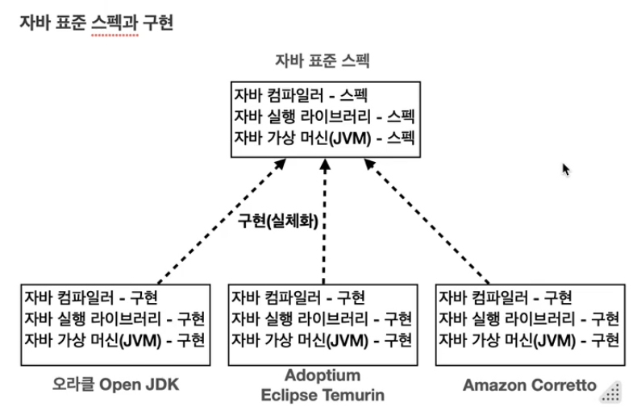
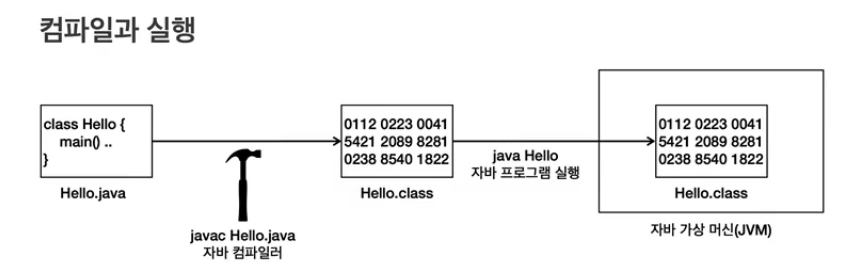
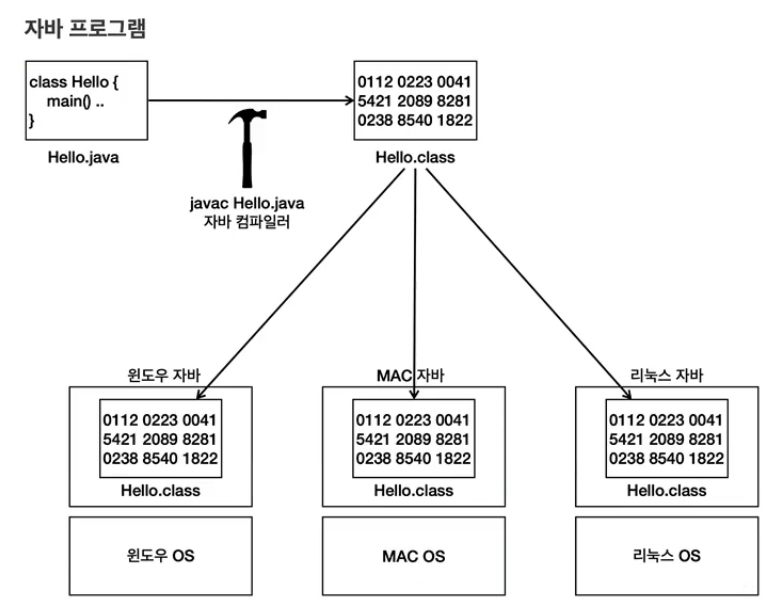

[Java 강의](https://inf.run/2zsZz)
____
# I. 개요
- 복습용 자바 기초 강의
- 자바 복습 후 다른 과정 진행 예정

# II. 맛 보기
## A. Hallo Java - [예제 파일](../src/HelloJava.java)
## B. 주석(comment) - [예제 파일](../src/Comment.java)
### 1. 사용처
- 소스 코드가 복잡한경우 이해를 도울 때
- 특정 코드를 지우지 않고 잠시 실행을 막아두고 싶을때
### 2. 처리 
- 주석이 있는 곳을 무시한다. 
### 3. 주석의 종류
- 한 줄 주석(single line comment)
```java
    // 이 기호 이후의 모든 텍스트는 주석으로 처리된다. 
```
- 여러 줄 주석(multi line comment)
```java
    /* 시작 기호
        이 사이의 모든 코드는 주석으로 처리된다. 
     */ //끝 기호 다음은 모두 수행된다. 
```
# III. 자바란?
## A. 자바 표준 스팩


컴파일러, 실행 라이브러리, 가상 머신이라는 표준 스팩을 기반으로 여러 회사에서 자바를 생성한다. 
동작은 같으나 최적화나 작은 차이가 있다. 다만 각 회사들이 자신들의 프로그램에 최적화된 jdk를 사용하면 된다. 

[JDK에 대한 페이지](https://whichjdk.com/)

표준 스팩의 장점: 구현은 다른 버전을 사용해도 표준 스팩을 따르기 때문에 사용에 있어서는 문제가 되지 않는다. 

## B. 컴파일과 실행


- .java 소스 코드는 개발자가 작성.
- javac라는 프로그램을 사용해 .java를 .class파일로 변환하면서 바이트코드로 번역과 함께 문법 오류를 체크한다. 
```dockerfile
    # 원래는 cmd를 통해 명령해야하지만 IDE가 자동으로 처리
    javac HelloJava.java
```
- 프로그램을 실행(Runtime)하면 자바 가상 머신(JVM)이 동작. 그 위에 소스코드가 동작
```dockerfile
    # 실행도 마찬가지. IDE가 처리
    java HelloJava
```

## C. 자바의 운영체제 독립성
일반적인 프로그램은 운영체제 위에서 움직이기때문에 다른 운영체제 위에서는 작동하지 않는다.
자바의 경우 가상머신 위에서 작동하기때문에 java만 설치되어있다면 virtual machine 위에서 똑같이 동작한다. 



각 OS에 맞춰 JVM이 명령어가 세팅되어있으므로 운영체제에 얽매이지 않고 Java에만 맞춰 작성하면 됨.

# IV. 변수
[노트](basic/01variable)로 이동

# V. 연산자
[노트](basic/02operater)로 이동

# VI. 조건문
[노트](basic/03conditional.md)로 이동

# VII. 반복문
[노트](basic/04loop.md)로 이동

# IIX. 스코프와 형변환
[노트](basic/05scope&casting)로 이동